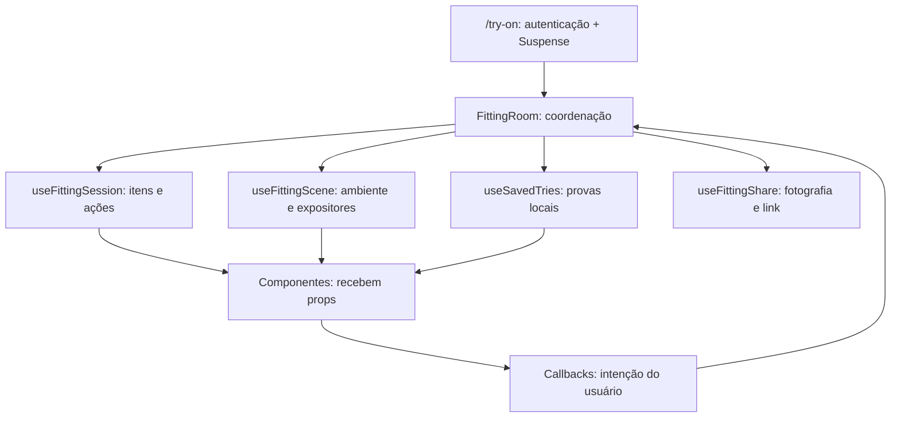

# Refatoração funcional do Provador — RF18/RF47

O arquivo `app/(site)/(app)/try-on/page.tsx` reunia 2.213 linhas de rota, componentes visuais, estado, requisições, persistência no navegador, transformação de dados e compartilhamento. A rota passa a ter 16 linhas; o componente `FittingRoom`, com aproximadamente 170 linhas, coordena componentes e hooks com responsabilidades explícitas.

A finalidade é facilitar a leitura, a manutenção e os testes. A redução do tamanho da rota não constitui uma medição de desempenho da aplicação. O comportamento de vestir peças e os contratos da API são preservados; a apresentação do catálogo ganha uma matriz paginada abaixo da prévia.

## Técnicas e fundamentos

| Técnica/princípio | Aplicação concreta | Razão da extração |
|---|---|---|
| **Extract Function / extração de custom hook** | Estado e ações relacionados à sessão, à cena, às provas salvas e ao compartilhamento formam hooks específicos. | Nomear casos de uso e retirar sua implementação do coordenador da interface. |
| **Move Function** | As transformações já existentes `fromCatalog`, `fromWardrobe`, `toSceneProduct` e `toLook3d` vão para `fitting-room-model.ts`; acesso a storage vai para `fitting-room-storage.ts`. | Colocar operações próximas dos dados e das responsabilidades que representam. |
| **Extract Component** | JSX é dividido em `FittingStage`, `FittingControls`, `FittingItems`, `StoreBrowser`, `WardrobeBrowser` e `SavedTries`. | Aplicar a extração de unidades de código ao modelo de componentes funcionais do React. |
| **Separação de responsabilidades / SRP** | Rota controla autenticação; coordenador organiza o fluxo; hooks executam casos de uso; componentes exibem dados e emitem ações. | Mudanças em armazenamento, catálogo ou palco 3D não exigem editar a mesma unidade. |
| **Coesão e acoplamento explícito** | Props tipadas agrupam os dados de cada visualização; callbacks comunicam intenções como `onRemove` e `onVariantChange`. | Manter juntos os elementos de uma mesma responsabilidade e tornar suas dependências visíveis. |
| **Refatoração apoiada em testes de caracterização** | A mesma rota pública é exercitada antes e depois da extração. | Comparar resultados observáveis, sem fazer os testes dependerem da quantidade ou dos nomes dos componentes internos. |

`Extract Function` e `Move Function` seguem o vocabulário do catálogo de refatorações de Martin Fowler. `Extract Component` é a adaptação desse processo para o React. SRP é o princípio de responsabilidade única discutido por Robert C. Martin. Esses fundamentos orientam a decomposição; não substituem a verificação do comportamento.

## Mapa de arquivos para estudar

Os links abaixo são relativos a este documento e apontam para o código do projeto.

| Arquivo | Responsabilidade | Dados/ações principais |
|---|---|---|
| [try-on/page.tsx](<../app/(site)/(app)/try-on/page.tsx>) | Entrada da rota `/try-on`. | `RequireAuth`, `Suspense` e montagem de `FittingRoom`. |
| [fitting-room.tsx](../components/try-on/fitting-room.tsx) | Coordenador do provador. | Busca estado inicial e lojas; integra seleção, ambiente, vista, luz, abas e confirmação de limpeza. |
| [fitting-stage.tsx](../components/try-on/fitting-stage.tsx) | Prévia 3D e legenda de ambiente. | Avatar, manequim, peças visíveis, ambiente, iluminação e callback do canvas. |
| [fitting-controls.tsx](../components/try-on/fitting-controls.tsx) | Controles da apresentação. | Tipo de apresentação, vista, luz, ambiente, fotografia, link, salvar e limpar. |
| [fitting-items.tsx](../components/try-on/fitting-items.tsx) | Peças da prova atual. | Slots, variante, remoção, origem e inclusão no guarda-roupa. |
| [store-browser.tsx](../components/try-on/store-browser.tsx) | Filtros e busca das lojas. | Marca, categoria, resultados e seleção de produto. |
| [wardrobe-browser.tsx](../components/try-on/wardrobe-browser.tsx) | Seleção do guarda-roupa. | Entradas por slot, peças que precisam de revisão e ações de vestir/remover. |
| [saved-tries.tsx](../components/try-on/saved-tries.tsx) | Visualização das provas salvas. | Restaurar ou apagar uma prova local. |
| [use-fitting-session.ts](../lib/hooks/use-fitting-session.ts) | Casos de uso da sessão. | Restaurar URL/sessão/esquema, vestir, remover, trocar variante e incluir produto no guarda-roupa. |
| [use-fitting-scene.ts](../lib/hooks/use-fitting-scene.ts) | Derivação do ambiente e dos expositores. | Contexto da busca, resultados, produto em destaque e marcas vestidas. |
| [use-fitting-share.ts](../lib/hooks/use-fitting-share.ts) | Compartilhamento pelo navegador. | Captura PNG do canvas e cópia da URL da prova. |
| [use-saved-tries.ts](../lib/hooks/use-saved-tries.ts) | Gestão de provas locais. | Carregar, salvar até oito provas e apagar uma delas. |
| [fitting-room-model.ts](../lib/tryon/fitting-room-model.ts) | Contratos e adaptações de dados. | Tipos da API, item do provador, produto de cena e peça 3D. |
| [fitting-room-storage.ts](../lib/tryon/fitting-room-storage.ts) | Acesso tolerante a storage indisponível. | `sessionStorage`, `localStorage`, chaves e fallback de leitura. |
| [fitting-room.ts](../lib/tryon/fitting-room.ts) | Regras já existentes do provador. | Slots, forma de vestir, peças visíveis, ambiente e codificação da URL. |
| [catalog-search.tsx](../components/catalog/catalog-search.tsx) | Controlador compartilhado da busca catalogada. | Requisição, debounce, filtros, descoberta oficial e entrega dos resultados. |
| [catalog-results-grid.tsx](../components/catalog/catalog-results-grid.tsx) | Matriz responsiva dos resultados. | Paginação local em até duas linhas; recebe a renderização do produto do controlador da busca. |

O módulo de transformações conserva `nextTick()` e `addedAt`: a ordem registrada define qual marca fica em destaque. Portanto, as transformações que criam um item continuam consultando o relógio; não são apresentadas como funções inteiramente puras.

## Fluxo unidirecional de dados



Exemplo: ao clicar em **Provar**, `StoreBrowser` informa o produto e a variante a `FittingRoom`. O coordenador chama `useFittingSession.pickProduct()`. O hook adapta o produto, atualiza os itens e persiste a sessão; a nova seleção volta aos componentes por props. `useFittingScene` deriva o ambiente a partir desses dados. O palco não passa a buscar produtos por conta própria.

Os componentes visuais são controlados para os dados da prova e os filtros compartilhados: recebem valores e callbacks. Isso não exige eliminar todo estado local. O controlador `CatalogSearch` continua sendo o proprietário da requisição e dos detalhes da busca; a paginação de apresentação mantém seu estado próximo da matriz.

## Catálogo em matriz, sem duplicar o controlador

No provador, os filtros permanecem na área de busca e os resultados são montados no contêiner abaixo da prévia por um **portal React**, configurado por `resultsMount`. Estados de erro, carregamento e refinamento acompanham esse painel. Existe uma única instância de `CatalogSearch`; mudar o local físico dos resultados no DOM não cria uma segunda busca ou uma cópia concorrente de filtros e variantes.

A opção `resultsLayout="matrix"` ativa `CatalogResultsGrid`, que apresenta até duas linhas por página. São duas colunas em larguras menores, três a partir de 640 px e quatro a partir de 1.024 px: até quatro, seis ou oito produtos. A seleção de variantes permanece associada ao produto ao navegar entre páginas e é reiniciada quando o contexto ou o conjunto de resultados muda. Alterar filtros, receber novos resultados ou mudar a quantidade de colunas também reinicia a paginação; o índice é limitado ao intervalo válido para evitar páginas vazias.

A paginação ocorre **somente sobre o conjunto já retornado pela busca e filtrado no frontend**. A requisição mantém `limit: 24`; não passa a consultar todo o banco nem acrescenta parâmetros de paginação à API. Resultados da descoberta oficial também pertencem ao conjunto exibido. Um catálogo maior que o lote recebido continua sujeito ao contrato de busca existente.

O callback `onResults` fornece o conjunto filtrado completo ao coordenador, independentemente da página visível. Assim, avançar a matriz não substitui os expositores da cena por apenas quatro, seis ou oito produtos. O modo padrão de `CatalogSearch`, utilizado no cadastro de peças RF4, conserva a apresentação e os contratos existentes; a matriz é ativada pelo provador.

## Invariantes preservadas

- A sessão usa a chave `fai.tryon.fitting`; as provas locais usam `fai.tryon.saved`. Falhas ou indisponibilidade do storage não impedem o uso da tela.
- O link `?provar=` tem prioridade sobre a sessão armazenada e preserva a variante indicada. Referências indisponíveis são ignoradas.
- O parâmetro `?scheme=` reconstrói a prova com as peças disponíveis no guarda-roupa.
- Vestir uma peça substitui apenas o seu slot. Uma peça inteira encobre a parte inferior; removê-la revela a peça inferior guardada.
- A escolha manual da apresentação tem prioridade sobre o valor inicial da API. Vista e luz são enviadas ao palco.
- Trocar a variante de uma peça vestida preserva seu `addedAt`, evitando mudar a marca em destaque por causa de uma alteração de cor.
- A limpeza depende de confirmação e não apaga as provas locais salvas.
- A inclusão no guarda-roupa conserva o JSON `{ productId, variantId, visibility: "PRIVATE" }` e a referência da peça retornada.

**Tipo de apresentação nesta tela:** o seletor de `/try-on` é uma preferência visual. Esta refatoração não implementa uma nova gravação de TipoLook no backend. O requisito de manutenção do **Espelho `/mirror`**, com valores vindos da tabela `TipoLook` e persistência no banco, pertence a outro fluxo.

## Contratos da API mantidos

| Método/rota | Uso no provador |
|---|---|
| `GET /api/try-on` | Estado inicial, manequim, avatar e peças disponíveis. |
| `GET /api/catalog/stores` | Marcas com produtos catalogados. |
| `GET /api/catalog/search` | Lote da busca, mantendo `limit=24`. |
| `GET /api/catalog/suggestions` | Sugestões enquanto se digita. |
| `GET /api/catalog/products/{id}` | Reconstrução de um produto a partir do link compartilhado. |
| `POST /api/catalog/discover` | Busca em fontes oficiais quando disponível. |
| `GET /api/schemes/{id}` | Reconstrução da prova de um esquema. |
| `POST /api/pieces/from-catalog` | Inclusão de uma referência do catálogo no guarda-roupa pessoal. |

A extração não altera controllers Java, DTOs ou migrações do banco. Salvar uma prova do provador continua sendo uma operação no `localStorage`, distinta da inclusão de uma peça no banco pelo endpoint `from-catalog`.

## Como verificar a refatoração

Os testes de caracterização em [fitting-room.test.tsx](../components/catalog/fitting-room.test.tsx) exercitam a rota pública: múltiplas marcas, guarda-roupa vazio, restauração, variantes, apresentação, inclusão com falha e confirmação de limpeza. O palco é substituído por uma observação do contrato recebido; esses testes não validam a rasterização WebGL.

Os testes do [motor do provador](../lib/tryon/fitting-room.test.ts) verificam suas regras e os testes do [fluxo catalogado](../components/catalog/catalog-flow.test.tsx) protegem a busca compartilhada, inclusive o uso no RF4. Os novos cenários da matriz devem demonstrar navegação até o fim do lote, reinício dos filtros e seleção da variante.

```bash
npm test -- components/catalog/fitting-room.test.tsx \
  components/catalog/catalog-results-grid.test.tsx \
  lib/tryon/fitting-room.test.ts components/catalog/catalog-flow.test.tsx
npm run typecheck
npm run build
git diff --check
```

**Validação realizada:** os 1.034 testes do frontend passaram em 111 arquivos, incluindo 11 cenários de integração do provador, dois da matriz e três do fluxo catalogado RF4. Typecheck, build de produção, verificações de internacionalização e `git diff --check` passaram. No Chromium, com API simulada e a cena WebGL real, a conferência em 1.600, 900 e 390 px mostrou respectivamente oito, seis e quatro produtos em duas linhas, sem rolagem horizontal ou cartões na lateral. A seleção de um produto na segunda página também funcionou, sem erros de execução no navegador.

## Referências para aprofundar

- FOWLER, Martin. *Refactoring: Improving the Design of Existing Code*. 2. ed. Addison-Wesley, 2018. Extração e movimentação de funções com preservação do comportamento.
- FEATHERS, Michael. *Working Effectively with Legacy Code*. Prentice Hall, 2004. Testes de caracterização para registrar o comportamento observado antes de modificar código existente.
- MARTIN, Robert C. *Clean Architecture*. Prentice Hall, 2017. Responsabilidade única e separação de dependências.

## Roteiro curto para anotar no caderno

1. Copie a rota de 16 linhas e explique por que ela só monta o provador autenticado.
2. Em `FittingRoom`, identifique os estados de apresentação e os hooks que coordenam os casos de uso.
3. Siga uma ação completa: botão **Provar** → callback → adaptação → atualização da sessão → novas props da cena.
4. Compare `FittingControlsProps` com seus callbacks: a visualização expressa a intenção; o proprietário do estado executa a mudança.
5. Registre a distinção entre persistir uma prova no navegador e cadastrar uma peça pelo backend.
6. Escolha um teste de caracterização e escreva seu estado inicial, ação e resultado esperado. Isso demonstra preservação de comportamento melhor que contar arquivos ou linhas isoladamente.
