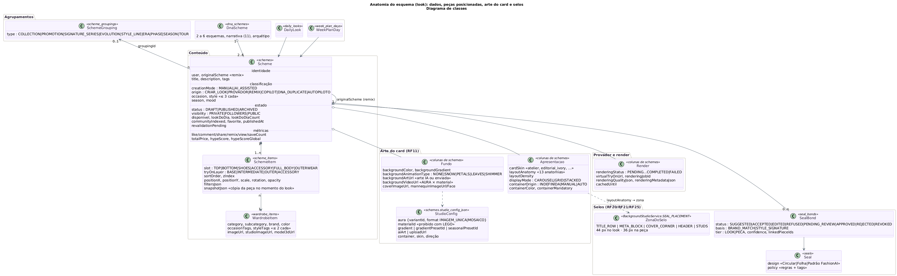
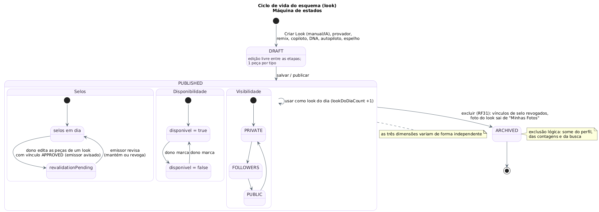

# Anatomia de esquemas (looks) do FashionAI

> Esquema = look: uma composição de peças do guarda-roupa da pessoa, com identidade visual própria (arte do card),
> estado de publicação e, quando atende à política de uma marca ou celebridade, selos. Este documento descreve a
> anatomia completa — dados, peças posicionadas, arte do card, selos, ciclo de vida e agregados — a partir do código
> atual (`Scheme`, `SchemeItem`, `BackgroundStudioService`, `SealService`, `SchemeService`).
> Diagramas: `anatomia-de-esquemas-classes.puml/.png` e `anatomia-de-esquemas-estados.puml/.png`.
> Taxonomia completa das entidades: `docs/taxonomia/taxonomia-de-entidades.md`.

## 1. As cinco partes de um esquema

| Parte | Onde vive | O que define |
|---|---|---|
| **Conteúdo** | `schemes` (identidade, classificação, estado, métricas) | o que o look é, para que serve e em que estado está |
| **Peças posicionadas** | `scheme_items` (1..n por esquema) | quais peças, em que slot, em que camada do provador e em que posição |
| **Arte do card** | colunas de apresentação/fundo de `schemes` + `schemes.studio_config_json` | como o card aparece (skin, anatomia, densidade, AURA, material, container) |
| **Provador e render** | colunas `rendering*` de `schemes` | a prévia vestida (2D/3D) e seu cache |
| **Selos** | `seal_bonds` (0..n) → `seals` | vínculos com marcas/celebridades, da sugestão à aprovação |

## 2. Conteúdo (`schemes`)

| Grupo | Campos | Regras |
|---|---|---|
| Identidade | `user`, `originalScheme` (remix), `title`, `description`, `tags` | o remix aponta para o original (RF19.CA13) |
| Classificação | `creationMode` (MANUAL · AI_ASSISTED), `origin` (CRIAR_LOOK · PROVADOR · REMIX · COPILOT · DNA_DUPLICATE · AUTOPILOTO), `occasion`, `style`, `season` (SPRING · SUMMER · AUTUMN · WINTER), `mood` (ENERGETIC · ELEGANT · COMFORTABLE · SOPHISTICATED) | ocasião e estilo: até **3** valores cada no esquema (`Taxonomy.MAX_SCHEME_TAGS`), contra até 2 na peça |
| Estado | `status` (DRAFT · PUBLISHED · ARCHIVED), `visibility` (PRIVATE · FOLLOWERS · PUBLIC), `disponivel`, `lookDoDia`, `lookDoDiaCount`, `communityIndexed`, `favorite`, `publishedAt`, `revalidationPending` | ver §7 |
| Métricas | `likeCount`, `commentCount`, `shareCount`, `remixCount`, `viewCount`, `saveCount`, `totalPrice`, `hypeScore`, `hypeScoreGlobal`, `hypeGroupId` | contadores no formato de rede social, fora dos botões |
| Agrupamento | `groupingId` → `scheme_groupings` | coleção, promoção, série assinatura, evolução, linha de estilo, era, fase, temporada, turnê |
| Mídia | `coverImageUrl` (foto do look, só filtro de política), `mannequinImageUrl`/`Face` (foto com o manequim) | a foto do look sai de "Minhas Fotos" quando o look é excluído (RF12.CA13) |

## 3. Peças posicionadas (`scheme_items`)

| Campo | Valores | Uso |
|---|---|---|
| `wardrobeItem` | peça do guarda-roupa | a peça real |
| `slot` | TOP · BOTTOM · SHOES · ACCESSORY · FULL_BODY · OUTERWEAR | papel da peça no look; o criador aceita **uma peça por tipo** (manual e IA) |
| `tryOnLayer` | BASE · INTERMEDIATE · OUTER · ACCESSORY | ordem de vestir no provador e no Avatar 3D (de dentro para fora) |
| `sortOrder`, `zIndex` | inteiros | ordem na lista do card e empilhamento na composição |
| `positionX`, `positionY`, `scale`, `rotation`, `opacity` | decimais | transformação da peça na composição livre |
| `filtersJson` | JSON | ajustes de imagem da peça dentro do look |
| `snapshotJson` | JSON | cópia da peça no momento do look: o histórico e o remix não quebram se a peça mudar ou sumir |

## 4. Arte do card (RF11)

### 4.1 Camadas

| Camada | Campo(s) | Observação |
|---|---|---|
| Skin (moldura e tipografia) | `cardSkin` | ex.: `atelier`, `editorial_ivory`, `luxury_glass_warm`, `show_notes` |
| Anatomia (estrutura do card) | `layoutAnatomy` | 13 anatomias (§4.2) |
| Densidade | `layoutDensity` | ampliado (detalhe) ou compacto (feed/grade) |
| Exibição das peças | `displayMode` | CAROUSEL · GRID · STACKED |
| Container (superfície interna) | `containerOrigin` (INDEFINIDA · MANUAL · AUTO), `containerColor`, `containerMandatory` | cor preferida da pessoa (RF23) ou nativa da skin |
| Fundo | `backgroundColor`, `backgroundGradient`, `backgroundAnimationType` (NONE · SNOW · PETALS · LEAVES · SHIMMER) | gradiente livre, preset de gradiente ou preset sazonal |
| Arte | `backgroundArtUrl` (arte por IA ou enviada), `backgroundVideoUrl` (combinação AURA × material) | a arte fica **atrás** do container, nunca sobre a foto |
| Configuração completa | `studio_config_json`: `aura {variantId, format IMAGEM_UNICA · MOSAICO}`, `materialId`, `gradient`/`gradientPresetId`/`seasonalPresetId`, `aiArt`/`uploadUrl`, `container`, `skin` | validada em `BackgroundStudioService`: preset desconhecido → 400 `PRESET_INVALIDO`; formato só com AURA + material; **LEGO não aceita material** (a placa-base já é o material) |

Direções prontas (skin + AURA + material + wearstyles, sugeridas pelos estilos do look):

| Direção | Skin | AURA | Material | Estilos que puxam |
|---|---|---|---|---|
| EDITORIAL_SPREAD | editorial_ivory | aura_editorial_mono__estudio | linho_natural | classic, minimalist, chic, tailored, preppy, modern |
| LUXURY_GLASS | luxury_glass_warm | aura_glam_noite__palco | cetim_liquido | luxury, glam, statement, avant_garde, futuristic |
| ATELIER | atelier_terracotta | aura_boemio_terracota__dunas_douradas | couro_nappa | boho, vintage, romantic, resort, utility, grunge |
| SHOW_NOTES | show_notes | aura_streetwear_neon__circuitos | nylon_ripstop | streetwear, sporty, athleisure, techwear, urban, y2k, edgy, basic |

### 4.2 Anatomias e a zona do selo

Prancha de referência: `docs/anatomias/anatomias_card_v18.html` (card do look) e `anatomias_card_v19.html` (card da
peça). Zonas: **TITLE_ROW** (linha "Título · selos · preço"), **META_BLOCK** (bloco "Selos · descrição · estilo"),
**COVER_CORNER** (canto da capa), **HEADER** (cabeçalho do card-objeto, ao lado do label PREMIUM) e **STUDS** (placas
1×1 do LEGO). O medalhão tem o tamanho do logo FashionAI: **44 px no card do look, 36 px no da peça**. "Por peça" = cada
linha/célula de peça também leva selo.

| Anatomia (look) | Zona | Por peça | Fonte | Posição |
|---|---|---|---|---|
| LISTA_VERTICAL | TITLE_ROW | sim | anatomia | Linha "Título · selos · preço" abaixo da foto; cada peça repete "marca · nome · selos · preço". |
| GRADE_PECAS | TITLE_ROW | sim | anatomia | Linha do título; cada célula mostra "selos · preço" (compacto: "4 peças · selos · preço"). |
| HERO_LISTA | TITLE_ROW | sim | anatomia | Linha do título abaixo do hero; no compacto, cada linha lateral traz "peça · selos · preço". |
| PASSARELA | COVER_CORNER | não | derivada | Canto superior direito da capa, oposto ao rótulo lateral vertical. |
| ETIQUETA | TITLE_ROW | não | anatomia | Linha "Título · selos · preço · descrição" abaixo das mini-etiquetas. |
| RAIO_X | COVER_CORNER | não | derivada | Sobre a foto do scanner, canto superior direito. |
| BENTO | META_BLOCK | não | anatomia | Bloco "Selos · descrição · estilo" abaixo da grade assimétrica. |
| ESPECTRO | TITLE_ROW | não | anatomia | Linha "Título · selos · preço" acima das faixas de cor. |
| CUSTO_POR_USO | HEADER | não | derivada | Cabeçalho "FASHIONAI · VALOR DE USO", ao lado do label PREMIUM (> R$ 600). |
| SILHUETA_PROPORCAO | TITLE_ROW | não | derivada | Linha do nome da silhueta, antes de "Descrição · ocasião · estilo". |
| HYPE_FOCUS | HEADER | não | derivada | Ao lado do medidor "Peça em destaque". |
| CARTELA_SAZONAL | COVER_CORNER | não | derivada | Canto superior direito do hero da estação. |
| LEGO | STUDS | não | anatomia | Placas 1×1 no container (verde = marca, vermelho = celebridade, amarelo = look) + placa "N selos". |

Card da peça (Seção C): PECA_AMPLIADO (META_BLOCK), PASSARELA (COVER_CORNER), ETIQUETA (HEADER), RAIO_X (COVER_CORNER),
BENTO (META_BLOCK), ESPECTRO (TITLE_ROW), CUSTO_POR_USO (HEADER) e LEGO (STUDS).

## 5. Selos no esquema

| Elemento | Valores | Regra |
|---|---|---|
| Selo (`seals`) | tipo de arte **Circular · Folha · Padrão FashionAI**; política padronizada (regras + tags) | ver `docs/diagramas/RF25-criador-de-selos` |
| Vínculo (`seal_bonds.status`) | SUGGESTED → ACCEPTED/EDITED/REFUSED → PENDING_REVIEW → APPROVED/REJECTED → REVOKED | um vínculo por emissor por look; a política detecta o selo nos criadores de peça e de look |
| Base do vínculo | BRAND_MATCH (marca) · STYLE_SIGNATURE (celebridade) | celebridade sempre revisa (RF21.CA19) |
| Nível | LOOK ou PEÇA | no nível PEÇA, `linkedPieceIds` diz qual peça sustenta o selo |
| `sealIdsJson` | até 4 selos exibidos | na zona da anatomia (§4.2) |
| Revalidação | `revalidationPending` | editar as peças de um look com vínculo aprovado avisa o emissor, que mantém ou revoga |

## 6. Provador e render

`renderingStatus` (PENDING · RENDERING · ENHANCING · COMPOSITING · CACHED · COMPLETED · FAILED), `virtualTryOnUrl`,
`renderingJobId`, `renderingQualityJson`, `renderingMetadataJson` e `cachedUntil` guardam a prévia vestida. No Avatar 3D
(RF40) as peças são montadas por `tryOnLayer`, de dentro para fora, e o que faltar vem das peças padrão FAI (o avatar
nunca aparece sem roupa nem descalço) — ver `docs/diagramas/RF40-roupa-no-avatar`.

## 7. Ciclo de vida

- **DRAFT**: criado pelo Criar Look (manual ou IA), provador, remix, copiloto, DNA, autopiloto ou espelho Vista-me; as
  etapas do criador são navegáveis livremente.
- **PUBLISHED**: três dimensões independentes — visibilidade (PRIVATE · FOLLOWERS · PUBLIC), disponibilidade
  (`disponivel`, marcada pelo dono) e selos (em dia ou `revalidationPending`). Usar como look do dia incrementa
  `lookDoDiaCount`.
- **ARCHIVED**: excluir (RF31) é exclusão lógica — o look some do perfil, das contagens e da busca, os vínculos de selo
  são revogados e a foto do look sai de "Minhas Fotos".

## 8. Agregados que reutilizam esquemas

| Agregado | Relação | Uso |
|---|---|---|
| `dna_schemes` / `dna_scheme_items` | 2 a 6 esquemas do próprio usuário | DNA de Estilo (RF13): 11 narrativas (TIMELINE, MOMENTOS_MARCANTES, PRIMEIRA_VEZ, CAPSULA_VERSATILIDADE, POR_OCASIAO, MOOD_BOARD, PALETA_DOMINANTE, HARMONIA_CROMATICA, MARCAS_FAVORITAS, HYPE_FOCUS, CARTELA_SAZONAL) |
| `daily_looks` (+ `hype_score_metrics`) | um esquema por dia | Look do Dia e Hype Score (RF6) |
| `week_plans` / `week_plan_days` | um esquema por dia da semana | Semana Planejada (HU18), sem repetir combinação |
| `scheme_groupings` | n esquemas por agrupamento | coleções, eras e turnês de marcas/celebridades (RF14/RF22) |
| `mirror_states` | peças por slot | espelho Vista-me (RF28) → "Abrir no editor" cria um DRAFT |
