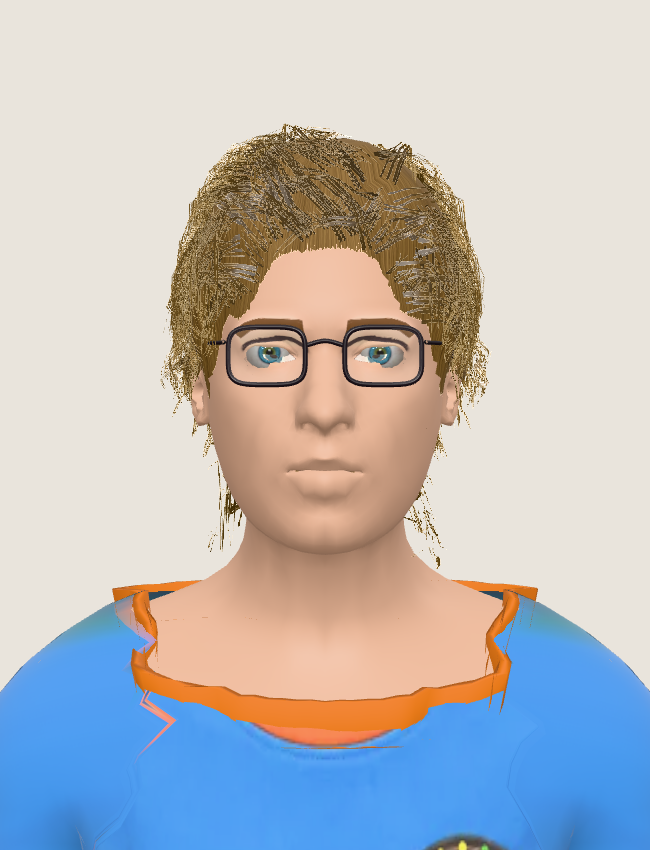
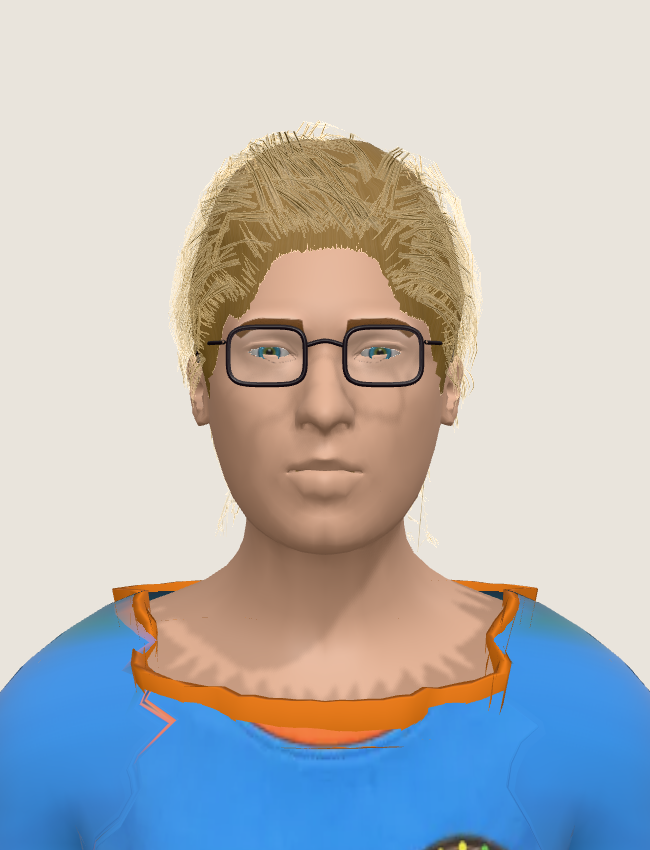
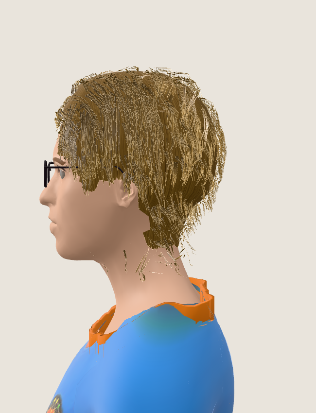
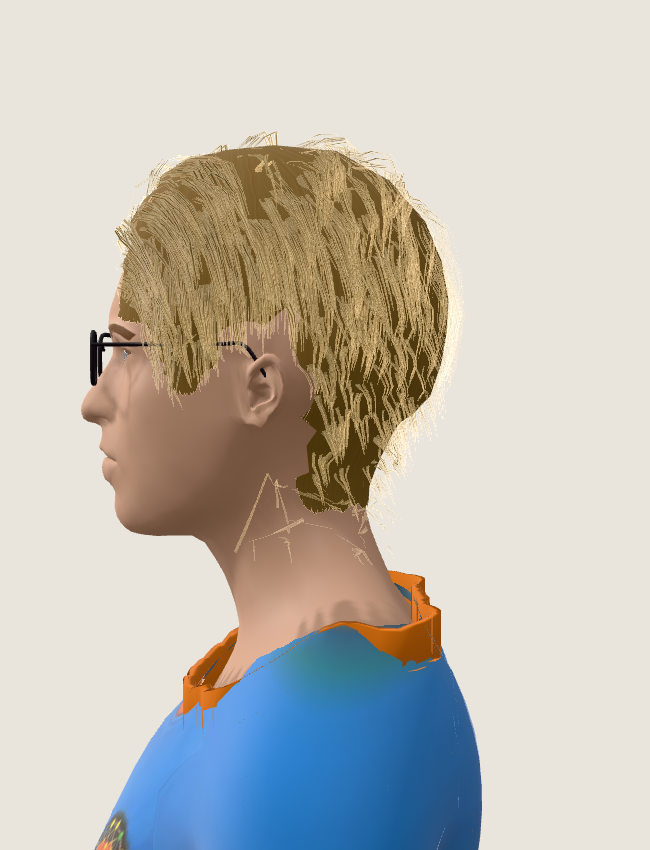

# Acabamento do rosto, cabelo e óculos — 08/10/2026

O avatar apresentava brancos cortados nos olhos, óculos desenhados na pele, mechas opacas e orelhas cobertas pela malha de cabelo. Este refinamento corrige geometria, textura e sombreamento no componente humano usado pelas prévias do produto.

## Diagnóstico e correções

| Problema | Causa | Correção |
| --- | --- | --- |
| Reflexos e brancos atravessando as pálpebras | A malha transparente da córnea incluía a esfera inteira; a abertura genérica não seguia o contorno individual | Córnea limitada à frente da íris; recorte antialias do olho pelo contorno medido, fixo à cabeça mesmo durante o movimento do globo |
| Linha d’água deslocada para a bochecha | Landmarks projetados no rosto não correspondiam à interseção entre globo e pálpebra | Linha fina construída sobre a interseção real entre a pele e o olho |
| Segunda íris ou esclera desenhada sob o olho 3D | O atlas facial preservava o olho fotografado | Limpeza local da textura antes de assar a pele, preservando cílios e contornos naturais |
| Variações de formato ignoradas após atualizar o rosto | A chave da composição incluía somente os oito primeiros landmarks | Chave baseada no conjunto completo; largura, inclinação e assimetria dos olhos entram no recorte |
| Óculos parecendo cicatrizes | A máscara de remoção protegia a faixa da armação superior; o acessório tinha folga calculada com poucos pontos | Remoção da armação fotografada preservando olho e sobrancelha; ajuste do acessório com os vértices reais da pele e folga mínima de 4 mm |
| Sobrancelhas sem relevo | A fotografia fornecia apenas cor sobre a pele | Fibras curtas sobre a superfície, usando cor, espessura, densidade e arco medidos; seguem o osso Head |
| Orelhas com material de cabelo | Raízes e calota incluíam triângulos do pavilhão auricular | Máscara em espaço do template exclui as orelhas; a pele continua visível, enquanto cabelo longo pode passar ao lado |
| Mechas semelhantes a placas de papel | O alpha-to-coverage padrão transformava o alfa filtrado das fibras em cobertura total | Shader preserva a cobertura fracionária com MSAA e usa recorte convencional quando não há amostras |
| Fios brilhantes, quebrados ou projetados sobre o rosto | Brilho forte, tangentes anteriores à colisão, campos de penteado e colisão descontínuos, viés de profundidade dependente da inclinação | Reflexos limitados e filtrados, tangentes da fita final, interpolação de colisão, penteado contínuo e viés de profundidade menor |

A cor da íris continua vindo da análise existente, inclusive diferenças entre os lados. Sobrancelhas com confiança insuficiente não recebem uma forma inventada. A camada de fibras fica mais leve quando a fotografia já contém os pelos.

## Luz e ciclo de vida

`AvatarLighting` aplica ambiente neutro, luz principal, preenchimento e luz de contorno. Usa uma única sombra de 1024 × 1024 com PCF. O laboratório e o visualizador compartilham a configuração. As fitas de cabelo recebem sombras; não projetam a sombra sólida do passe padrão, que não reproduz o alfa por vértice e o movimento do shader.

O ambiente PMREM passa a descartar o render target e a cena auxiliar. A textura de pele assada é descartada quando o efeito troca ou o avatar é desmontado. Geometria e material de sobrancelha também são removidos na troca do rosto.

## Exportação GLB

O recorte de pálpebra em cena usa um shader que o glTF não transporta. Na exportação, os triângulos do olho são recortados pelo mesmo contorno, com interpolação de UV, normais e pesos do esqueleto. A geometria temporária é descartada e o olho original é restaurado no `finally`, inclusive se a exportação falhar. A córnea de reflexo permanece somente na cena, conforme o contrato anterior.

## Validação

- Suite final: 110 arquivos e 1.023 testes passaram. Typecheck e build de produção com as checagens de i18n passaram.
- Next.js atualizado para o patch 16.3.8 após a auditoria bloquear o CI sobre a versão anterior do projeto. Auditoria final de dependências de produção: zero vulnerabilidades.
- Testes com o asset real verificam abertura estreita, assimetria, movimento da cabeça, fechamento pela pele, córnea, linha d’água e atributos da exportação.
- Regressões verificam reconstrução após mudar somente um landmark do olho, limpeza de armação e olho fotografados, orelhas fora da calota, UV e tangentes dos fios, continuidade de colisão e limite de 8.000 triângulos para cards LOD2.
- Chromium/WebGL com SwiftShader: vistas frontal, perfil e olhos; óculos presentes e removidos; abertura estreita; cabelo longo. Nenhum erro JavaScript ou compilação de shader. Capturas aguardam dois quadros completos após cada mudança.
- Cabelo longo LOD1 observado: 84.607 triângulos, contra 82.589 na referência, aumento de 2,4%. O aumento vem de menos mechas interrompidas pela colisão. Não foi medido FPS em GPU física.

As imagens abaixo usam um rosto e uma textura sintéticos, sem fotografia de usuário. A referência é `e173e998`; o enquadramento e o fixture são os mesmos.

| Vista | Antes | Depois |
| --- | --- | --- |
| Frente |  |  |
| Perfil |  |  |

O cabelo continua procedural, e uma única foto não recupera detalhes ocultos ou iluminação original com precisão. A geometria individual disponível limita a reprodução da pálpebra e da orelha. Este trabalho melhora esses defeitos no WebGL atual; não comprova fidelidade fotográfica ou qualidade AAA.

## Arquivos principais

- `components/three/human-avatar.tsx`: composição individual, preparação da pele e integração das sobrancelhas.
- `lib/avatar3d/glasses.ts` e `lib/avatar3d/human/glasses-3d.ts`: remoção da fotografia e encaixe do acessório.
- `lib/avatar3d/human/eyes.ts`, `three-human.ts` e `export-glb.ts`: olhos, abertura, materiais e exportação.
- `lib/avatar3d/human/brows.ts`: fibras de sobrancelha sobre a pele.
- `lib/avatar3d/human/hair-geometry.ts` e `hair-strands.ts`: calota, orelhas, penteado, colisão e shader de fibras.
- `components/three/avatar-lighting.tsx`, `avatar-viewer.tsx` e `common.tsx`: iluminação e descarte do ambiente.
