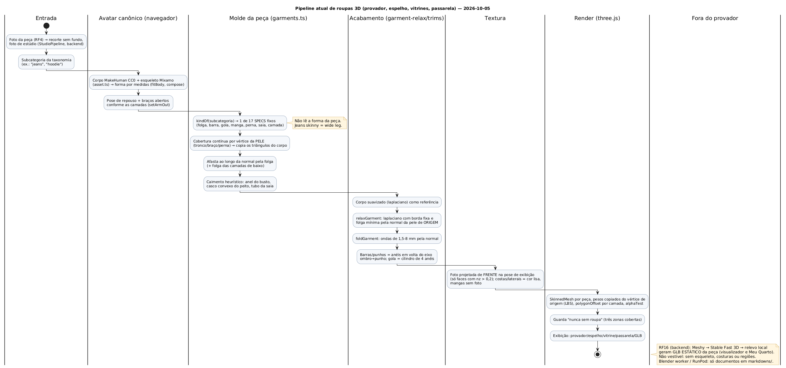
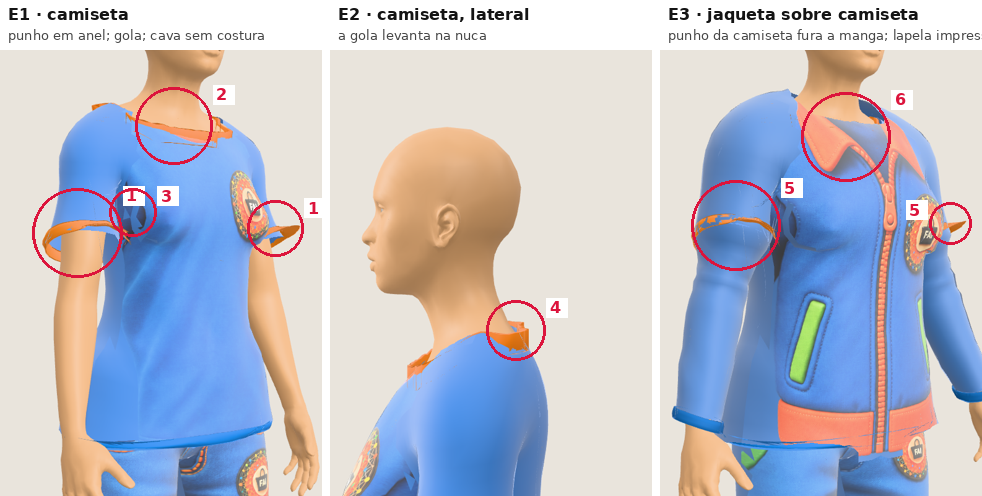
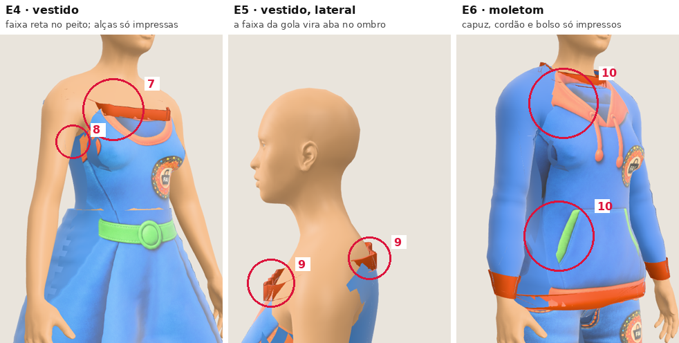
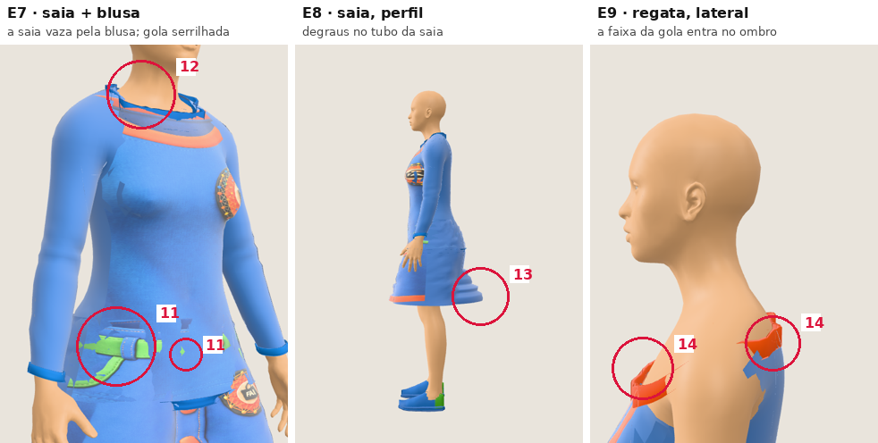
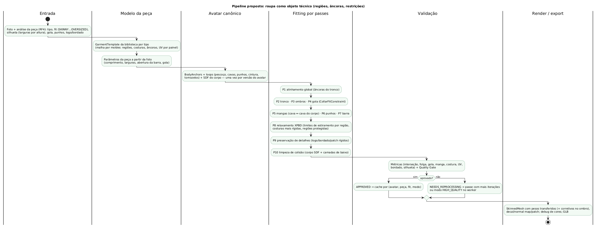

# Auditoria do pipeline 3D de roupas: diagnóstico e proposta

**Data:** 2026-10-05 · **Estado:** diagnóstico para aprovação. Nenhuma linha do pipeline foi alterada; a refatoração só
começa depois do "de acordo" com este documento.

**Como foi medido.** Um harness (em [`reproduzir/`](reproduzir/), fora do build) montou as peças exatamente como o provador monta
(`dress()` em `components/three/human-outfit.tsx`): corpo suavizado, molde, relaxamento, dobras, barras, gola e
projeção da foto. As medidas foram feitas em três conjuntos:

- corpo de referência F e M;
- 10 variações extremas por sexo;
- 9 looks.

As capturas vêm de `/lab/human` com o avatar **sintético** (sem foto de ninguém).

**Arquivos desta pasta:**

- números brutos: [`metricas-linha-de-base-2026-10-05.json`](metricas-linha-de-base-2026-10-05.json) e
  [`metricas-gola-e-pose-2026-10-05.json`](metricas-gola-e-pose-2026-10-05.json);
- diagramas: [`pipeline-atual.puml`](pipeline-atual.puml) e [`pipeline-proposto.puml`](pipeline-proposto.puml), com os
  PNGs ao lado;
- evidências visuais: [`img/`](img/).

---

## Resumo

1. **Não existe uma peça 3D no provador.** Cada roupa é a **pele do avatar afastada pela normal** (um *shrinkwrap*
   inflado), suavizada por laplaciano e texturizada por uma projeção frontal da foto. É exatamente o que a regra 33
   proíbe como solução principal.
2. Por isso a roupa **nunca tem identidade própria**:
   - todo jeans vira o mesmo molde (`kindOf` → `pants`), e o *wide leg* veste igual ao *skinny*;
   - capuz, bolso, cordão, lapela, alças, zíper e botões existem **só como desenho impresso** no peito;
   - não há costura, cava, região, âncora nem UV por painel.
3. O que funciona e deve ficar:
   - interseção **0%** em repouso;
   - decote da camiseta com folga de 6,4–8,5 mm;
   - avatar canônico único, corpo preservado e guarda "nunca sem roupa";
   - custo baixo (6–98 ms por peça).
4. O que falha, medido:
   - a **faixa da gola** é um cilindro que entra 11–18 mm no trapézio (camiseta) e **42–51 mm** no ombro (regata e
     vestido), onde aparece como "aba";
   - na pose de exibição, **8–9% da manga curta e 17–19% do punho** atravessam o braço;
   - a jaqueta atravessa ombro (9%) e peito (5%);
   - entre camadas não há colisão: o punho da camiseta fura a manga da jaqueta e a saia vaza pela blusa;
   - a estampa estica mais de 2× em **7–20%** dos triângulos impressos (shorts e calça, o pior caso).
5. As métricas de qualidade existentes (`lib/avatar3d/garment-metrics.ts`) medem o **manequim antigo de cápsulas**, não
   o corpo humano atual. Não há quality gate, log estruturado nem modo de depuração no provador.
6. **Proposta:**
   - uma biblioteca de **moldes paramétricos por tipo de peça** (painéis costurados em código), com regiões,
     costuras, âncoras e UV por painel, ajustados pela análise da foto;
   - fitting em **10 passes com restrições XPBD** (gola, cava, costuras, regiões protegidas) e colisão por campo de
     distância do corpo e das camadas de baixo;
   - métricas e quality gate.

   O pipeline atual fica como `FAST_PREVIEW` de reserva até a biblioteca cobrir os tipos.

---

## 1. Diagnóstico do pipeline atual

### 1.1 Inventário (o que o pedido lista × o que existe)

| Item | Onde está | Estado | Observação |
|---|---|---|---|
| Geração/importação do avatar | `lib/avatar3d/human/asset.ts`, `compose.ts` (`fitBody`, `compose`), `three-human.ts` | **existe** | Corpo MakeHuman CC0 com esqueleto Mixamo; forma por medidas da foto; rosto por landmarks |
| Geração/importação da roupa 3D | `lib/avatar3d/human/garments.ts` (`garmentGeometry`, l. 279) | **existe, inadequado** | A peça é a pele copiada e afastada; não há malha da peça |
| Rigging | herdado do corpo | parcial | A roupa usa os ossos do corpo; não há osso próprio (capuz, saia) |
| Skinning | `garmentGeometry` copia os pesos do vértice de origem; a saia pesa no quadril/coxas | parcial | LBS do three.js; depois do relaxamento o vértice sai de perto da origem e os pesos deixam de corresponder |
| Fitting | `garments.ts` (cobertura l. 161, molde l. 279, tubo da saia l. 235) | **heurístico** | 17 `SPECS` fixos: folga, barra, gola, manga, perna, saia, `drape`, `flare`, camada |
| Cloth simulation | — | **ausente** | Sem gravidade nem dinâmica; caimento por anel do busto e casco convexo |
| Colisão | `garment-relax.ts` (`minEase`, l. 70) | parcial | Só a distância pela **normal da pele de origem**, sem SDF; entre peças, apenas soma de folgas por vértice do corpo |
| Retargeting | — | n/a | Um esqueleto só (Mixamo). Não importa peça rigada de fora |
| Morph targets | corpo: `compose` (componentes de forma e rosto) | parcial | Roupa sem shape keys; é refeita a cada corpo |
| UV | `texturedGeometry` (l. 433) | **inadequado** | Projeção planar frontal na pose de exibição; costas e laterais com cor lisa; mangas sem foto |
| Materiais | `garmentMaterial` (l. 596) | básico | `MeshPhysicalMaterial` com sheen, `alphaTest` na borda e `polygonOffset` por camada |
| Normal maps / displacement | — | **ausente** | Dobras são deslocamento geométrico de 1,5–8 mm (`foldGarment`) |
| Bordados / logos | backend: caixa do logo (Piece Analyzer, `LogoFinder`) no RF4 | **não chega ao 3D** | O logo é só parte da foto projetada |
| Costuras | — | **ausente** | Barras, punhos e gola são malhas separadas em anel (`garment-trims.ts`, `collarBand` l. 618) |
| Export GLB/glTF | `lib/avatar3d/human/export-glb.ts` | existe | Exporta corpo, cabelo (cards), roupas e animação idle; só com o avatar vestido |
| Blender worker | `markdowns/blender-*.md` | **inexistente** | Documentos de outro projeto; nenhum código neste repositório |
| Meshy | `MeshyModel3dAdapter.java`, `Model3dService.java` (RF16) | existe, **fora do provador** | GLB estático da peça (visualizador e Meu Quarto); sem esqueleto, costuras ou regiões |
| RunPod | `markdowns/runpod-*.md` | **inexistente** | Só documentação |
| Frontend do provador 3D | `components/three/human-outfit.tsx` (`dress()`, l. 39) via `HumanAvatar`/`Mannequin` | existe | Usado por provador, espelho, vitrines, passarela, My Stage e GLB |

### 1.2 Fluxo de ponta a ponta

| Etapa | Hoje | Arquivo |
|---|---|---|
| Entrada | Foto da peça (recorte, estúdio) e subcategoria da taxonomia | RF4 (backend), `Look3dPiece` |
| Pré-processamento | Recorte e estúdio no backend; no 3D só se lê a caixa da parte opaca, a largura por altura e a linha da gola (`photoInfo`, l. 394) | `garments.ts` |
| Reconstrução | Não há. `kindOf` escolhe um molde genérico | `garments.ts` l. 65 |
| Fitting | Cobertura da pele → copia triângulos → afasta pela normal → anel do busto, casco do peito, tubo da saia | `garments.ts` l. 279 |
| Simulação | Relaxamento laplaciano (6–12 iterações) e dobras procedurais | `garment-relax.ts` |
| Validação | Só em teste unitário (interseção < 3%, < 0,5% fora da axila); em produção, só a guarda das três zonas cobertas | `garments.test.ts`, `default-outfit.ts` |
| Export | GLB com tudo preso ao mesmo esqueleto | `export-glb.ts` |
| Renderização | `SkinnedMesh` por peça, LBS, `polygonOffset` por camada | `human-outfit.tsx` |

---

## 2. Diagrama do pipeline atual



Fonte: [`pipeline-atual.puml`](pipeline-atual.puml).

---

## 3. Problemas detectados

### 3.1 Números (corpo de referência, F / M)

| Peça (look) | Interseção em repouso | Interseção na pose de exibição | Decote: folga média / mín. (mm) | collarFitError (mm, alvo 5) | Faixa da gola: ponto mais fundo (mm) | Estampa: p95 \|log2\| / % > 2× | Arestas > +10% | Deslocamento relax + dobras p95 (mm) | Tempo (ms) |
|---|---|---|---|---|---|---|---|---|---|
| calça (camiseta+calça+tênis) | 0% / 0% | 0% / 0% | – | – | – | 1,65 · 17% / 1,8 · 15% | 31% / 31% | 13 / 16 | 46 / 12 |
| camiseta | 0% / 0% | 2,0% / 1,9% | 7,2 · 6,4 / 7,0 · 6,4 | 2,2 / 2,0 | −18,2 / −13,8 | 1,65 · 10% / 1,45 · 8% | 32% / 32% | 11 / 13 | 98 / 39 |
| manga longa | 0% / 0% | 0,6% / 0,7% | 7,2 · 6,4 / 7,0 · 6,4 | 2,2 / 2,0 | −18,2 / −13,8 | 1,38 · 9% / 1,6 · 9% | 29% / 29% | 10 / 11 | 54 / 47 |
| camisa | 0% / 0% | 0,6% / 0,7% | 8,0 · 7,4 / 8,0 · 7,5 | 3,0 / 3,0 | −16,9 / −15,8 | 1,47 · 10% / 1,46 · 8% | 31% / 30% | 12 / 13 | 40 / 30 |
| moletom | 0% / 0% | 1,1% / 1,2% | 13,8 · 13,2 / 14,0 · 12,9 | 8,8 / 9,0 | −8,0 / −4,3 | 1,41 · 9% / 1,42 · 7% | 38% / 37% | 18 / 20 | 36 / 51 |
| jaqueta (sobre camiseta) | 0% / 0% | 3,1% / 1,9% | 18,0 · 17,4 / 17,9 · 17,4 | 13,0 / 12,9 | sem faixa | 1,32 · 10% / 1,43 · 7% | 56% / 54% | 17 / 18 | 28 / 21 |
| vestido | 0% / 0% | 0,1% / 0% | 6,1 · 5,1 / 6,0 · 5,0 | 1,1 / 1,0 | **−48,7 / −41,9** | 1,58 · 13% / 1,85 · 15% | 19% / 19% | 5 / 6 | 32 / 21 |
| saia (sob blusa) | 0% / 0% | 0% / 0% | – | – | – | 1,76 · 14% / 1,99 · 16% | 17% / 21% | 0 / 0 | 12 / 16 |
| shorts | 0% / 0% | 0% / 0% | – | – | – | **2,16 · 20% / 2,08 · 20%** | 21% / 21% | 11 / 11 | 6 / 6 |
| regata | 0% / 0% | 0,3% / 0,1% | 5,0 · 4,1 / 5,0 · 4,0 | 0,3 / 0,5 | **−50,7 / −44,1** | 1,41 · 10% / 1,88 · 12% | 19% / 18% | 6 / 8 | 16 / 16 |

Como ler a tabela:

- **Interseção:** vértices da peça mais de 2 mm dentro da pele (vértice mais próximo + normal), contra o corpo real.
- **Estampa:** distorção de área por triângulo impresso em relação à mediana. p95 de 1,65 = 3,1×.
- **Arestas > +10%:** arestas da peça mais de 10% maiores que as da pele de origem. Mede a deformação do molde
  inflado.

Interseção na pose de exibição, por região:

| Peça | Região | Vértices dentro do corpo (F / M) |
|---|---|---|
| camiseta | manga | 7,6% / 8,8% |
| camiseta | punho | **16,7% / 19,4%** |
| camiseta | ombro | 0,8% / 1,9% |
| camiseta | peito | 2,3% / — |
| jaqueta (F) | ombro | **9,0%** |
| jaqueta (F) | peito | 5,2% |
| jaqueta (F) | costas | 4,1% |
| jaqueta (F) | manga | 3,5% |

Faixa da gola, anéis de baixo nas **laterais**:

| Peça | Vértices dentro do corpo | Ponto mais fundo |
|---|---|---|
| camiseta | 30 de 38 | −18 mm |
| regata e vestido | 30–32 de 38, incluindo o anel de cima | −50 mm |

**Corpos extremos** (ombros ±12%, peito −12%/+15%, compleição ±1, torso curto/longo, braços ±8%), camiseta:

| Métrica | Faixa |
|---|---|
| Interseção na pose | 0,7–2,5% |
| Folga do decote | 6,9–7,3 mm |
| Faixa da gola | −11 a −19 mm |
| Estampa p95 | 1,33–1,70 |

O fitting "nunca quebra" porque a peça **é** o corpo. É também por isso que a peça não tem silhueta própria.

**Não foi possível testar:**

- **pescoço fino/largo:** o modelo de corpo não tem parâmetro de pescoço (`BODY_KEYS`);
- **assimetria:** o corpo é simétrico, então o centramento da gola dá 0 mm por construção.

### 3.2 Evidências visuais





### 3.3 Lista de problemas

| # | Tipo (pedido) | Problema | Evidência | Causa no código | Gravidade |
|---|---|---|---|---|---|
| P1 | deformação errada | A peça não tem forma própria: é a pele afastada pela normal. Silhueta, comprimento real e fit da peça são ignorados; *wide leg* = *skinny*, *oversized* = regular | tabela 3.1; `kindOf` | `garments.ts` l. 44–98 e 279–372 | **crítica** |
| P2 | perda de detalhe | Capuz, cordão, bolso, lapela, alças, zíper e botões só impressos em superfície plana | E3·6, E4·8, E6·10 | sem malha de peça; `texturedGeometry` | **crítica** |
| P3 | gola flutuando / atravessando | Faixa da gola cilíndrica na altura do decote: nas laterais entra 11–18 mm (camiseta) e 42–51 mm (regata, vestido) no corpo e vira **aba** no ombro; no vestido e na regata vira barra reta no peito | E2·4, E4·7, E5·9, E9·14; tabela 3.1 | `collarBand` l. 618: raio por ângulo numa só altura, extrudado ±9/−16 mm | **alta** |
| P4 | gola deformada | Borda do decote serrilhada (alfa por vértice + `alphaTest`); a faixa cobre só parte; moletom e jaqueta com folga de 13–18 mm (sem gola construída) | E1·2, E7·12 | cobertura contínua por vértice (l. 161) | média |
| P5 | manga desconectada | Não existe cava: a manga é o pedaço de pele com pesos do braço (fronteira da pintura de pesos do MakeHuman, não a costura do ombro); vão escuro na axila | E1·3 | `coverage` (grupo 2) | **alta** |
| P6 | manga/punho atravessando | Punho e barra da manga são anéis no eixo **reto** ombro→punho da pose de repouso: na manga curta flutuam como argola; na pose de exibição 17–19% do punho e 8–9% da manga entram no braço | E1·1; tabela 3.1 | `garmentTrims` l. 96; relax tira o vértice de perto da pele cujos pesos ele herdou | **alta** |
| P7 | clipping entre camadas | Sem colisão peça↔peça: punho da camiseta fura a manga da jaqueta; a saia vaza pela blusa; jaqueta com 5–9% dentro do corpo no ombro e peito em pose | E3·5, E7·11 | `underLayer` soma folgas por vértice do corpo; acabamentos não entram na folga | **alta** |
| P8 | deformação excessiva | Relaxamento laplaciano (o *smooth* que a regra 33 proíbe como solução) desloca até 10–20 mm (p95); limite só pela normal da origem | tabela 3.1 | `relaxGarment` l. 86 | média |
| P9 | deformação excessiva | 17–56% das arestas esticam mais de 10% em relação à pele (jaqueta 55%); sem molde de referência, não há limite de estiramento | tabela 3.1 | afastamento pela normal em regiões convexas | média |
| P10 | textura esticada / UV quebrada | Projeção planar frontal: p95 de 2,5–4,5× de distorção de área; 7–20% dos triângulos impressos > 2× (shorts e calça, os piores); costas e laterais lisas; mangas sem estampa; divisa frente/lado em nz = 0,2 com troca brusca | E1, calça (patch na coxa) | `texturedGeometry` l. 433 | **alta** |
| P11 | bordado deformado | Logo e bordado não são regiões: esticam com a projeção; a caixa do logo do RF4 não chega ao 3D | — | backend × frontend desconectados | média |
| P12 | perda de costura | Nenhuma costura (edge/vertex groups, metadados, UV seams); barras e gola são malhas soltas, sem continuidade topológica | todas | — | **alta** |
| P13 | barra atravessando / deformação | Tubo da saia em anéis com restrição monotônica ("não entra de volta"): degraus nas costas | E8·13 | `skirtTube` l. 235 | média |
| P14 | — | Sem simulação de tecido nem resposta à gravidade; sem tipos de fit (SKINNY…OVERSIZED) | — | — | média |
| P15 | validação | `garment-metrics.ts` mede o **manequim antigo** (`body-lab`); o pipeline humano não tem gate, log nem modo de depuração; falha é silenciosa (só a guarda "nunca sem roupa") | — | — | **alta** |
| P16 | cobertura de testes | O corpo não tem parâmetro de pescoço e é simétrico: pescoço fino/largo e gola descentrada não podem ser testados | — | `BODY_KEYS` | média |
| P17 | desperdício | O molde do tênis é calculado e descartado (o cabedal vem de `shoes.ts`) | — | `dress()` | baixa |
| P18 | arquitetura | GLB do RF16 (Meshy/Stable Fast 3D/relevo) não serve para vestir: estático, sem esqueleto, topologia arbitrária | — | `Model3dService` | informativa |

**O que já atende ao pedido e fica:**

- avatar canônico único (req. 24);
- o fitting não altera o corpo (req. 25);
- camada (`layer`) separada do slot funcional (req. 26, parcial);
- interseção zero em repouso;
- guarda "nunca sem roupa";
- custo baixo.

---

## 4. Arquitetura proposta



### 4.1 Decisões

| # | Decisão | Por quê |
|---|---|---|
| D1 | **Biblioteca de moldes paramétricos** (`GarmentTemplate`) por tipo, gerados **em código a partir de painéis de molde costurados**: frente, costas, manga, gola, punho, cós, bolso, capuz, vista | Regiões, costuras, âncoras, loops e UV por painel saem "de graça" e determinísticos; testável em node; licença própria; sem depender de artista para os tipos básicos |
| D2 | Parâmetros da peça vêm da **análise da foto** (RF4): tipo, fit, comprimento relativo às âncoras, larguras por altura (máscara), decote, gola, manga, punho, abertura da barra, logo/bordado | Preserva a identidade da peça (*wide leg* continua largo) |
| D3 | Fitting em **passes com restrições XPBD** sobre o molde. A simulação de tecido é só refinamento (passe 8) | Atende 12, 22 e 33: âncoras e regiões primeiro, relaxamento depois |
| D4 | Lado do corpo: **âncoras, loops e SDF** calculados uma vez por versão do avatar | Reaproveitado por todas as peças; custo amortizado |
| D5 | Skinning por **transferência de pesos do ponto mais próximo da superfície do corpo**, com difusão ao longo da peça e corretivos de ombro/cotovelo | Resolve P6: a peça deixa de herdar pesos de um vértice de que se afastou |
| D6 | **Camada de detalhe**: estampa → decal/textura; bordado → normal/height map; patch espesso → malha secundária | Regra 10: nada de geometria pesada para todo detalhe |
| D7 | **Métricas, quality gate, log estruturado e modo de depuração** fazem parte do pipeline, não do teste | Req. 19–21 e 28–29 |
| D8 | O pipeline atual vira `FAST_PREVIEW` de reserva (`skinOffsetMold`) enquanto um tipo não tiver molde | Migração sem tela quebrada |

### 4.2 Módulos

| Módulo | Responsabilidade | Onde roda |
|---|---|---|
| `body/anchors.ts` | âncoras anatômicas (lista do pedido) a partir das articulações e de pontos da malha | navegador e node |
| `body/loops.ts` | loops do pescoço, cavas, punhos, cintura e tornozelos (circunferência, perfil de raio, plano, altura) | navegador e node |
| `body/sdf.ts` | campo de distância do corpo (grade 6–8 mm + refinamento por triângulo) e das camadas de baixo | Web Worker |
| `garment/patterns/*` | painéis de molde por tipo (camiseta, polo, camisa, moletom com capuz, suéter, jaqueta, casaco, regata, vestido com/sem alça, saia A/lápis, jeans skinny/reto/wide, shorts, legging) | node e navegador |
| `garment/sew.ts` | costura dos painéis em malha 3D, com regiões, grupos de costura, loops e UV por painel | node e navegador |
| `garment/params.ts` | da análise da foto aos parâmetros do molde (`GarmentParams`) | navegador (dados do backend) |
| `fit/passes/*` | os 10 passes | Web Worker |
| `fit/constraints/*` | `CollarFitConstraint`, `ArmholeConstraint`, `SeamConstraint`, `ProtectedRegionConstraint`, `CollisionConstraint`, `StretchConstraint`, `BendConstraint` | Web Worker |
| `fit/skinning.ts` | transferência de pesos e corretivos | Web Worker |
| `detail/*` | decal, normal/height map e patch | navegador |
| `qa/metrics.ts`, `qa/gate.ts`, `qa/debug.ts` | métricas, gate, cores de depuração e log | Web Worker e navegador |

---

## 5. Novas estruturas e classes

```ts
// ---- corpo
export type BodyAnchorId =
  | "NECK_CENTER" | "NECK_FRONT" | "NECK_BACK" | "LEFT_CLAVICLE" | "RIGHT_CLAVICLE"
  | "LEFT_SHOULDER" | "RIGHT_SHOULDER" | "LEFT_ARMPIT" | "RIGHT_ARMPIT" | "CHEST_CENTER" | "WAIST_CENTER"
  | "LEFT_ELBOW" | "RIGHT_ELBOW" | "LEFT_WRIST" | "RIGHT_WRIST" | "LEFT_HIP" | "RIGHT_HIP" | "CROTCH"
  | "LEFT_KNEE" | "RIGHT_KNEE" | "LEFT_ANKLE" | "RIGHT_ANKLE";
export interface Anchor { id: string; position: V3; frame: { t: V3; b: V3; n: V3 }; bone: number }
export interface BodyLoop {
  id: "NECK" | "ARMHOLE_L" | "ARMHOLE_R" | "WRIST_L" | "WRIST_R" | "WAIST" | "HIP" | "ANKLE_L" | "ANKLE_R";
  points: Float32Array;            // N pontos ordenados por ângulo em volta do eixo do loop
  center: V3; normal: V3;          // plano do loop (PCA)
  circumference: number; radiusProfile: Float32Array; height: number;
}
export interface BodyFitData {
  avatarVersion: string; anchors: Record<BodyAnchorId, Anchor>; loops: Record<BodyLoop["id"], BodyLoop>;
  sdf: SignedDistanceField; weights: SurfaceWeights;   // pesos de pele amostráveis por ponto da superfície
}

// ---- peça
export type GarmentRegion =
  | "COLLAR" | "NECKLINE" | "LEFT_SHOULDER" | "RIGHT_SHOULDER" | "CHEST" | "BACK" | "LEFT_SLEEVE" | "RIGHT_SLEEVE"
  | "LEFT_CUFF" | "RIGHT_CUFF" | "HEM" | "SIDE_SEAM_LEFT" | "SIDE_SEAM_RIGHT" | "HOOD" | "PLACKET" | "POCKET"
  | "WAISTBAND" | "HIP" | "CROTCH" | "LEFT_THIGH" | "RIGHT_THIGH" | "LEFT_KNEE" | "RIGHT_KNEE"
  | "LEFT_LEG" | "RIGHT_LEG" | "LEFT_HEM" | "RIGHT_HEM" | "SKIRT" | "BODICE"
  | "LOGO_REGION" | "EMBROIDERY_REGION" | "PATCH_REGION";
export type SeamGroup = "SEAM_COLLAR" | "SEAM_SHOULDER" | "SEAM_ARMHOLE" | "SEAM_SIDE" | "SEAM_CUFF" | "SEAM_HEM"
  | "SEAM_WAISTBAND" | "SEAM_INSEAM" | "SEAM_OUTSEAM" | "SEAM_HOOD" | "SEAM_PLACKET";
export interface SeamEdge { a: number; b: number; group: SeamGroup; pair?: number }   // pair: aresta do outro painel
export interface GarmentTemplate {
  kind: GarmentKind2; version: number;
  position: Float32Array; index: Uint32Array; uv: Float32Array; panel: Uint8Array;   // painel de cada vértice
  region: Uint8Array;                                   // GarmentRegion por vértice
  seams: SeamEdge[];
  anchors: Partial<Record<string, number>>;            // GARMENT_COLLAR_CENTER, GARMENT_LEFT_SHOULDER… → vértice
  loops: { collarInner?: Uint32Array; sleeveSeam?: [Uint32Array, Uint32Array]; cuff?: [Uint32Array, Uint32Array]; hem?: Uint32Array; waistband?: Uint32Array };
  thickness: number;                                    // m
}
export type FitClass = "SKINNY" | "SLIM" | "REGULAR" | "RELAXED" | "LOOSE" | "OVERSIZED";
export interface FitProfile { clearanceMm: [number, number]; stiffness: number; maxStretch: number; maxCompression: number; gravity: number }
export interface GarmentParams {            // vindo da análise da foto (RF4)
  kind: GarmentKind2; fit: FitClass; lengthTo: string; sleeveLengthTo?: string;
  widthProfile?: Float32Array;              // larguras por altura da máscara, normalizadas pelo corpo da foto
  neckline: "CREW" | "V" | "SCOOP" | "BOAT" | "COLLAR" | "HOOD" | "MOCK" | "STRAPLESS"; collarClearanceMm: number;
  cuffs: boolean; hemFlare: number; details: DetailSpec[];
}
export interface DetailSpec { kind: "PRINT" | "EMBROIDERY" | "PATCH"; region: GarmentRegion; uvBox: [number, number, number, number]; heightMm?: number }
export type ProtectedGarmentRegions = Partial<Record<"collar" | "cuff" | "hem" | "waistband" | "embroidery" | "logo" | "patch" | "seam",
  { maxStretch: number; maxCompression?: number; rigid?: boolean }>>;

// ---- fitting e qualidade
export type FittingMode = "FAST_PREVIEW" | "STANDARD" | "HIGH_QUALITY";
export interface FittingContext { body: BodyFitData; garment: GarmentTemplate; params: GarmentParams; under: FittedGarment[]; mode: FittingMode; protect: ProtectedGarmentRegions }
export interface FittingPass { name: string; run(ctx: FittingContext, state: FitState): PassReport }
export interface QualityReport {
  pieceId: string; avatarId: string; mode: FittingMode;
  intersectionPercentage: number; clearanceMean: number; clearanceVariance: number;
  stretchPercentage: number; compressionPercentage: number; uvDistortion: number;
  collarFitError: number | null; sleeveAlignmentError: number | null; seamDistortion: number;
  embroideryDistortion: number | null; silhouettePreservation: number;
  status: "APPROVED" | "NEEDS_REPROCESSING" | "REJECTED"; failed: string[];
}
export type GarmentLayer = "BASE_LAYER" | "MID_LAYER" | "OUTER_LAYER" | "ACCESSORY";   // ≠ SchemeSlot (UPPER/LOWER/SHOES/ACCESSORY)
```

---

## 6. Algoritmo de fitting

Notação: o estado é **x** (posições do molde). **SDF_c(p)** é a distância com sinal ao corpo mais as camadas de baixo.
Cada passe parte do resultado do anterior e grava um `PassReport`. As regiões já fixadas entram como restrições
duras nos passes seguintes, o que preserva o resultado anterior (req. 22).

1. **P1, alinhamento global.** Procrustes com escala por eixo entre as âncoras do tronco da peça e as do corpo, pesando
   ombros e pescoço:
   - pares: GARMENT_COLLAR_CENTER↔NECK_CENTER, GARMENT_L/R_SHOULDER↔L/R_SHOULDER, GARMENT_HEM_CENTER↔ponto do
     comprimento pedido;
   - nunca uma escala global uniforme.
2. **P2, tronco.** Deformação RBF (thin-plate) dirigida pelas âncoras do tronco e pelo perfil de larguras da peça:
   - largura alvo por altura = max(corpo + folga do fit, largura da peça);
   - a peça larga continua larga (silhueta).
3. **P3, ombros.** O ponto da costura do ombro vai para LEFT/RIGHT_SHOULDER (acrômio) e a linha do ombro segue a
   clavícula, com folga mínima do fit.
4. **P4, gola.** `CollarFitConstraint` (seção 7).
5. **P5, mangas.**
   - `ArmholeConstraint` cava↔cava (seção 8);
   - a manga é reposicionada no referencial braço→antebraço por transporte paralelo, com o comprimento dos
     parâmetros.
6. **P6, punhos.** O loop do punho vai para o loop do pulso (manga longa) ou para a altura pedida no braço (curta),
   com folga do fit e circularidade preservada.
7. **P7, barra.** O loop da barra fica na altura pedida (relativa à âncora de quadril ou cintura), com abertura dos
   parâmetros; na calça, a barra do tornozelo.
8. **P8, relaxamento.** XPBD, de 10 a 40 iterações conforme o modo:
   - distância por aresta com limite por região (`maxStretch`/`maxCompression` do fit; costuras e regiões protegidas
     mais rígidas, req. 8 e 17);
   - flexão entre triângulos vizinhos;
   - gravidade proporcional a `FitProfile.gravity`;
   - colisão por SDF;
   - loops da gola, cava, punho e barra presos.
9. **P9, detalhes.** Regiões de logo, bordado e patch voltam à forma do molde por ajuste rígido local (ARAP por
   região): proporção, orientação e UV preservadas.
10. **P10, colisão.**
    - projeção de todo vértice com SDF_c < espessura + folga mínima para fora pelo gradiente do SDF;
    - auto-colisão por hash espacial nas regiões dobradas (axila, gancho, cotovelo);
    - depois, a transferência de pesos (D5).

Validação: métricas → gate (seção 12). Reprova → reprocessamento (mais iterações no P8/P10 ou o modo seguinte) até
duas vezes; depois disso `REJECTED`, mostrando o `FAST_PREVIEW` com um aviso só no modo de depuração.

---

## 7. Tratamento da gola

**Lado do corpo (`BodyLoop` NECK).**

1. Corte da pele no **plano da base do pescoço**: plano por NECK_FRONT (incisura jugular), NECK_BACK (C7) e os pontos
   laterais da base do trapézio, achados na malha pela curvatura mínima entre o pescoço e o ombro.
2. Saídas:
   - circunferência;
   - perfil de raio por ângulo (72 amostras);
   - orientação (normal do plano: o pescoço inclina para a frente);
   - altura;
   - um segundo loop 25 mm acima (gola alta e colarinho).

**Lado da peça.** `collarInnerLoop` do molde (decote costurado à gola), parametrizado por comprimento de arco, com
marcas em GARMENT_COLLAR_CENTER (frente) e na costura das costas.

**`CollarFitConstraint` (XPBD).**

- **Correspondência:** arco-a-arco com a fase fixada pelas marcas frente/costas (sem deslocamento lateral).
- **Alvo:** cada ponto do loop vai para o ponto do loop do pescoço no mesmo ângulo, afastado pelo raio local +
  `collarClearance`. Valores por tipo:

  | Peça | collarClearance |
  |---|---|
  | camiseta | 4 mm |
  | polo | 5 mm |
  | camisa abotoada | 6 mm |
  | moletom e suéter | 6 mm |
  | gola alta | 2 mm |
  | jaqueta | 8 mm |

  Decote em V, canoa ou *scoop* usa o loop do decote da peça, não o do pescoço: alvo no tronco, com SDF.
- **Forma:** comprimento de cada segmento do loop dentro de ±3% (`collar.maxStretch` = 0,03); curvatura do loop
  preservada (sem achatar).
- **Espessura:** a gola é uma faixa com 2 faces e espessura real, costurada ao decote (`SEAM_COLLAR`), em vez de um
  cilindro solto. A faixa segue a **superfície** (SDF), não um raio constante: isso resolve P3.
- **Proibido:** escala uniforme da gola (verificado pelo desvio de forma).

**Métricas e aprovação:**

| Critério | Medida |
|---|---|
| `collarFitError` | média de \|d(garmentCollarLoop, bodyNeckLoop) − collarClearance\| |
| `collar centered` | deslocamento do centro do loop da peça no plano do loop do corpo < 3 mm |
| `collar intersection` | nenhum ponto da faixa com SDF < 0 |
| `collar clearance acceptable` | folga em [clearance − 2 mm, clearance + 4 mm] em 95% dos pontos |
| `collar deformation acceptable` | estiramento por segmento ≤ 3% e desvio de circularidade em relação ao molde ≤ 5% |
| `neck coverage consistent` | altura da gola nas costas ≥ altura na frente para gola redonda, com diferença dentro de ±3 mm |

Qualquer falha → `NEEDS_REPROCESSING` (req. 19).

---

## 8. Tratamento da manga

**Lado do corpo (`BodyLoop` ARMHOLE_L/R).** Loop em volta da articulação do ombro, no plano que passa pelo acrômio
(LEFT/RIGHT_SHOULDER) e pela axila (LEFT/RIGHT_ARMPIT), inclinado como a cava real (≈ 15–25° da vertical). Não é a
fronteira da pintura de pesos (P5).

**Lado da peça.** `sleeveSeamLoop` (costura da cava na manga) e `bodyArmholeLoop` (costura da cava no tronco) são o
**mesmo loop** costurado (`SEAM_ARMHOLE`, arestas pareadas). A relação topológica fica garantida por construção, e
nenhum passe pode separá-los.

**`ArmholeConstraint`:**

- o loop vai para o loop da cava do corpo + folga do fit, com o ponto do ombro preso ao acrômio e o ponto de baixo
  abaixo da axila (folga mínima de 15–25 mm conforme o fit: a manga nunca atravessa a axila);
- a manga segue o **referencial do braço** (transporte paralelo ombro→cotovelo→punho) e não gira: a costura de baixo
  da manga (`SEAM_INSEAM` da manga) fica alinhada à face interna do braço;
- comprimento: a manga curta termina na fração pedida do braço, a longa no loop do pulso (P6).

**Skinning da manga (resolve P6):**

- pesos do ponto mais próximo da superfície do braço, suavizados ao longo da manga;
- na cava, mistura com os pesos do tronco numa faixa de 4–6 cm;
- corretivos de ombro e cotovelo: blendshapes por ângulo da articulação, gerados no passe 10 para os ângulos da pose
  de exibição e do idle.

**`sleeveAlignmentError`** = média de três medidas:

- distância do ponto do ombro da costura ao acrômio;
- ângulo entre a costura de baixo da manga e a face interna do braço;
- diferença entre o comprimento pedido e o obtido.

---

## 9. Preservação de costuras

- **Fonte:** os grupos de costura vêm do molde (D1). Para GLB externo no futuro (worker), as fontes são edge groups
  ou vertex groups exportados do Blender, *UV seams* e máscaras de material, nessa ordem.
- **Armazenamento:**
  - `SeamEdge[]` em memória;
  - no GLB, atributo de vértice `_SEAM` (bitmask de `SeamGroup`) e `extras.seams` com os pares.
- **Rigidez:** no XPBD, a distância das arestas de costura usa `seamStretchLimit` (1–2%), menor que o
  `fabricStretchLimit` do tecido (3–8% conforme o fit). As arestas pareadas de dois painéis compartilham vértices
  (soldadas) e não se separam.
- **Suavização:** nenhum passe aplica laplaciano livre. O relaxamento é XPBD com as costuras como restrição, e
  vértices de costura nunca entram em média de vizinhos (regra 7: "nunca permitir que uma etapa de smoothing destrua
  a costura").
- **Visual:** costura como geometria (vinco de 0,6–1 mm pela normal ao longo da aresta) mais normal map de pesponto.
  Não é só textura (req. 18).
- **Métricas:**
  - `seamDistortion` = p95 de |ℓ/ℓ₀ − 1| nas arestas de costura;
  - `seamContinuity` = maior distância entre arestas pareadas (deve ser 0 com solda).

---

## 10. Preservação de bordados e logos

1. **Detecção (RF4, backend):** a caixa do logo (Piece Analyzer / `LogoFinder`) e a classificação já existem no
   estúdio. Passam a ir para a peça como `DetailSpec`:
   - `PRINT` (estampado);
   - `EMBROIDERY` (relevo baixo: textura de pontos, bordas com sombra);
   - `PATCH` (aplicação espessa: borda costurada, relevo > 1,5 mm).
2. **Mapeamento:** a caixa em coordenadas da foto vai para o UV do painel da frente (ou de trás). Os vértices cobertos
   recebem a região `LOGO_REGION` / `EMBROIDERY_REGION` / `PATCH_REGION`.
3. **Estratégia automática (regra 10):**

   | Tipo | Representação |
   |---|---|
   | PRINT | decal/textura no UV do painel |
   | EMBROIDERY | normal map + height map gerados da máscara do logo (bisel pela distância à borda, 0,3–0,8 mm), sem deslocar a malha |
   | PATCH | malha secundária: a máscara extrudada em 1,5–3 mm, com borda arredondada, presa aos vértices da região (mesmos pesos) |

4. **Preservação:** `ProtectedGarmentRegions.embroidery/logo` com `maxStretch` 0,01 e ajuste rígido local no passe 9.
   O bordado não atravessa costura: se a caixa cruzar uma costura, o detalhe é recortado no painel dominante, com aviso
   no relatório.
5. **Métrica:** `embroideryDistortion` = máx(|1 − σ₁|, |1 − σ₂|) do jacobiano UV→3D na região (escala normalizada pela
   do painel), mais o erro de orientação do eixo principal em graus.

---

## 11. Métricas de qualidade

| Métrica | Definição | Linha de base hoje (camiseta F) |
|---|---|---|
| `intersectionPercentage` | % de vértices com SDF_corpo < −1 mm, na pose de exibição e em 3 instantes do idle | 0% em repouso; 2,0% em pose (punho 17%) |
| `clearanceMean`, `clearanceVariance` | SDF dos vértices por região, comparado à faixa do fit | gola 7,2 mm (DP 0,6); jaqueta 18 mm |
| `stretchPercentage` / `compressionPercentage` | % de arestas com ℓ/ℓ₀ > 1 + maxStretch / < 1 − maxCompression (ℓ₀ = **molde**) | sem molde: 32% / 17% em relação à pele |
| `uvDistortion` | p95 de máx(\|log₂ σ₁\|, \|log₂ σ₂\|) do jacobiano UV→3D, por painel | p95 \|log₂ área\| = 1,65 (≈ 3,1×) |
| `collarFitError` | seção 7 | 2,2 mm (alvo 5), faixa −18 mm dentro |
| `sleeveAlignmentError` | seção 8 | não mensurável (sem costura de ombro) |
| `seamDistortion` | seção 9 | não mensurável (sem costuras) |
| `embroideryDistortion` | seção 10 | não mensurável (sem região) |
| `silhouettePreservation` | IoU entre a silhueta ortográfica de frente da peça vestida e a máscara da foto, escaladas pela largura do corpo da foto × largura do avatar | não mensurável (a peça não tem silhueta) |

Todas saem no `QualityReport` e no log estruturado, sem imagens e sem medidas completas do corpo (só ids e números
agregados da peça).

---

## 12. Quality gate

| Métrica | FAST_PREVIEW | STANDARD | HIGH_QUALITY |
|---|---|---|---|
| intersectionPercentage | < 3% | **< 0,5%** | < 0,2% |
| collarFitError | < 6 mm | < 3 mm | < 2 mm |
| gola: centrada / sem interseção | — / — | sim / sim | sim / sim |
| sleeveAlignmentError | — | < 10 mm, < 10° | < 6 mm, < 6° |
| stretch/compression (tecido) | — | < 5% das arestas fora do limite | < 2% |
| seamDistortion (p95) | — | < 3% | < 2% |
| uvDistortion (p95) | < 1,5 | < 0,6 | < 0,4 |
| embroideryDistortion | — | < 3% e < 3° | < 1% e < 2° |
| silhouettePreservation | — | IoU ≥ 0,85 | IoU ≥ 0,90 |

Resultados:

- **APPROVED:** a peça vai ao cache.
- **NEEDS_REPROCESSING:** repete o P8/P10 com o dobro das iterações; se falhar de novo, sobe de modo.
- **REJECTED:** depois de duas tentativas. A tela mostra o `FAST_PREVIEW`, e o relatório aponta as métricas
  reprovadas.

Log:

```json
{ "pieceId": "…", "avatarId": "…", "mode": "STANDARD", "collarFitError": 1.8, "intersectionPercentage": 0.2,
  "seamDistortion": 0.011, "uvDistortion": 0.41, "status": "APPROVED", "ms": 410 }
```

---

## 13. Testes automatizados

| Grupo | Conteúdo | Onde |
|---|---|---|
| Unidade (corpo) | âncoras dentro de 10 mm das articulações; loops fechados, com circunferência coerente (pescoço F 30–36 cm, M 35–42 cm); SDF com sinal correto | vitest |
| Unidade (molde) | painéis costurados sem bordas abertas fora das bordas reais; cada costura com par; regiões cobrem a malha; UV sem sobreposição por painel | vitest |
| Restrições | `CollarFitConstraint`, `ArmholeConstraint` e `SeamConstraint` convergem num corpo sintético e respeitam os limites | vitest |
| Casos obrigatórios (req. 30) | camiseta (gola, ombros, manga, barra); camisa social (colarinho, punhos, botões, mangas); moletom (capuz, punhos, barra); polo (gola, abertura, manga); jaqueta (gola, zíper, mangas); jeans (cós, quadril, joelho, barra); vestido (busto, cintura, saia) — cada um passa no gate STANDARD | vitest (o harness desta auditoria vira teste) |
| Corpos extremos (req. 31) | pescoço fino/largo (**requer parâmetro de pescoço no corpo**: coordenar com AVATAR-ID-AUDIT), ombros estreitos/largos, braços finos/musculosos, peito menor/maior, torso curto/longo — nenhum caso reprovado no STANDARD | vitest |
| Silhueta | *wide leg* × *skinny* no mesmo corpo: IoU entre as duas < 0,8 (não podem ficar iguais); *oversized* × *slim* idem | vitest |
| Regressão visual | Playwright em `/lab/human` com o modo de depuração (cores e loops), 4 vistas por caso, comparação perceptual com o *golden* | Playwright (CI noturno) |
| Desempenho | orçamento por modo (seção 14) com falha acima de 1,5× | vitest bench |

---

## 14. Estratégia de performance

| Modo | O que roda | Orçamento (desktop médio) | Onde |
|---|---|---|---|
| FAST_PREVIEW | molde atual (pele afastada) ou molde paramétrico só com P1–P3 e P10 simplificado | ≤ 100 ms por peça (hoje: 6–98 ms) | thread principal |
| STANDARD | P1–P10 com 20 iterações XPBD, SDF em grade de 8 mm | ≤ 600 ms por peça | Web Worker |
| HIGH_QUALITY | P8 com 60–100 iterações, auto-colisão completa, corretivos para mais poses | 2–5 s por peça | Web Worker (ou worker no servidor numa fase futura) |

- **Cache:** o resultado (posições, pesos, relatório) fica guardado por `(avatarVersion, pieceId, pieceImageHash,
  fit, mode)`, em IndexedDB no navegador e opcionalmente no storage do backend. Trocar de tela não refaz o fitting.
- **Progressivo:** o `FAST_PREVIEW` aparece na hora e é trocado pelo STANDARD quando o worker termina (no mesmo
  commit visual, sem frame sem roupa: guarda "nunca sem roupa" mantida).
- **Malha:** o molde tem 3–6 mil vértices por peça (hoje 0,8–3,7 mil), e o detalhe vai para textura e normal map.
- **Corpo:** âncoras, loops e SDF são calculados uma vez por versão do avatar (~50–150 ms) e compartilhados.
- **Já feito no HAIR-F2:** mudar o nível de detalhe do cabelo não refaz mais as roupas.

---

## 15. Plano de migração e refatoração

| Fase | Entrega | Critério de saída | Esforço |
|---|---|---|---|
| F0 | Métricas e gate sobre o pipeline **atual** (o harness desta auditoria vira `qa/metrics.ts` + testes); log estruturado; modo de depuração com cores e loops em `/lab/human` | linha de base reproduzida no CI | 3–4 dias |
| F1 | Lado do corpo: âncoras, loops, SDF e pesos por superfície; **parâmetro de pescoço** no corpo (com AVATAR-ID-AUDIT) | testes de unidade do corpo | 1 semana |
| F2 | Moldes paramétricos: camiseta, regata, manga longa, moletom (com capuz), jeans (skinny/reto/wide), shorts; costuras, regiões e UV por painel | testes de molde | 2 semanas |
| F3 | Passes P1–P7 + `CollarFitConstraint` + `ArmholeConstraint`; transferência de pesos | camiseta e jeans no gate STANDARD nos corpos de referência e extremos | 2 semanas |
| F4 | P8 XPBD (costuras, regiões protegidas, fit), P10 colisão com camadas, Web Worker, cache | jaqueta sobre camiseta e saia sob blusa sem clipping entre camadas | 2 semanas |
| F5 | Detalhes: decal, normal/height de bordado, patch; `DetailSpec` vindo do RF4; P9 | logo e bordado dentro do gate | 1–1,5 semana |
| F6 | Demais moldes: camisa social (colarinho, punhos, botões), polo, jaqueta (lapela, zíper), casaco, vestido (com/sem alça), saia A/lápis, legging; HIGH_QUALITY | todos os casos obrigatórios aprovados | 2–3 semanas |

**Regras da migração:**

- **Bandeira:** cada tipo ganha `fitting: "template"` quando o seu molde passa no gate; os outros continuam no molde
  atual (`FAST_PREVIEW`).
- **Desligar:** `NEXT_PUBLIC_GARMENT_TEMPLATES=off` volta tudo ao pipeline atual.
- **Telas:** provador da loja (RF18), espelho/Vista-me (RF28, o PROV-2D), vitrines, passarela, My Stage e GLB recebem
  o novo fitting pelo `HumanOutfit`, sem mudar de API. `layer` (BASE/MID/OUTER) continua separado dos slots
  UPPER/LOWER/SHOES/ACCESSORY.
- **Relação com outras tarefas:** fecha o PROV-3D (#177) e o AV-POLISH (gola, punhos). O PROV-2D (#178) usa o mesmo
  avatar e o mesmo fitting.

**Decisões pedidas:**

1. Aprovar a arquitetura (moldes paramétricos em código + passes com restrições) e a ordem das fases.
2. Moldes em código (recomendado para os tipos básicos) ou autorados em Blender por alguém da equipe.
3. HIGH_QUALITY só no navegador (recomendado agora) ou também num worker no servidor. Este último tem custo de
   GPU/RunPod e não existe hoje.
4. Incluir o parâmetro de pescoço no modelo do corpo (impacta a auditoria do avatar, #183).
5. Os limiares do gate (seção 12) como ponto de partida.
