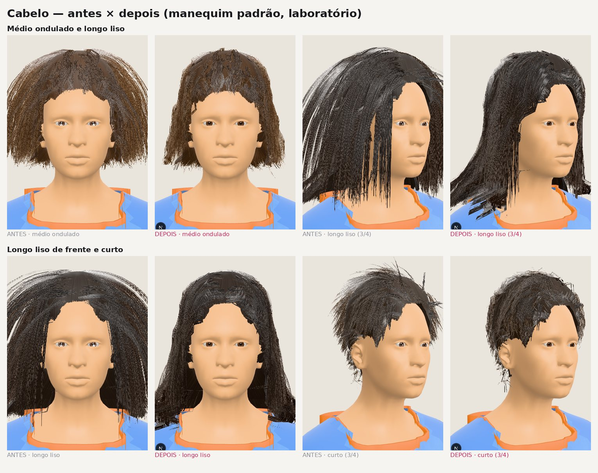
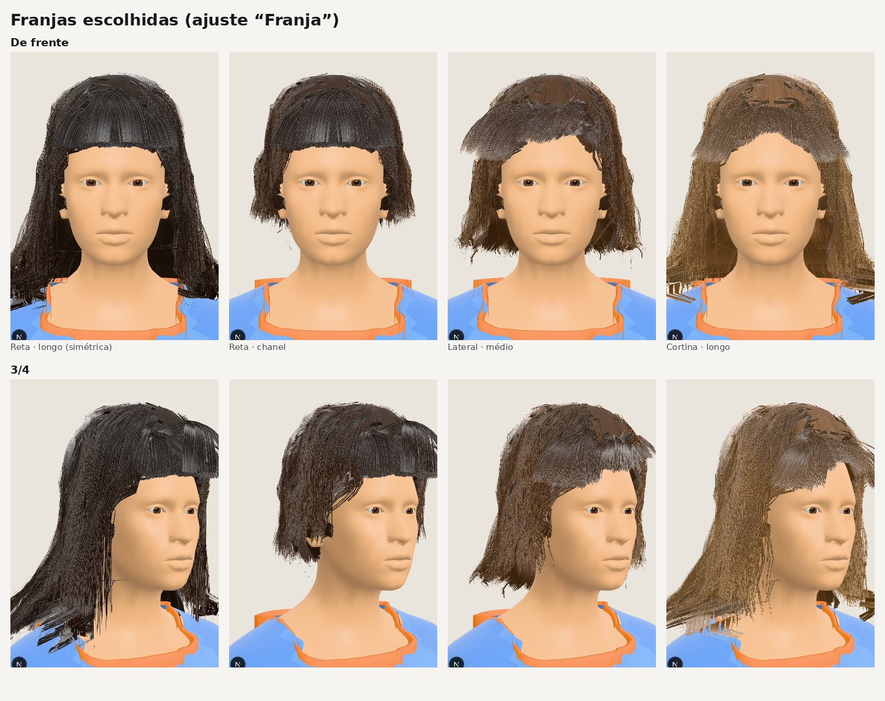
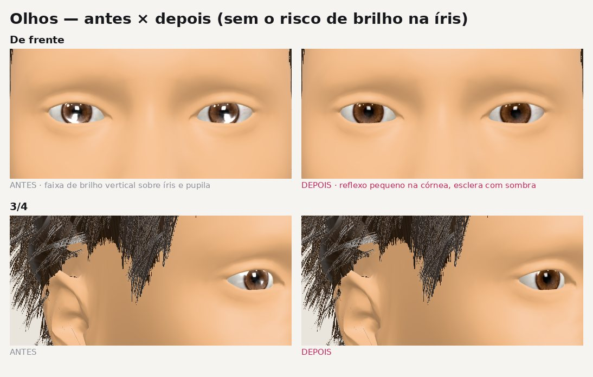
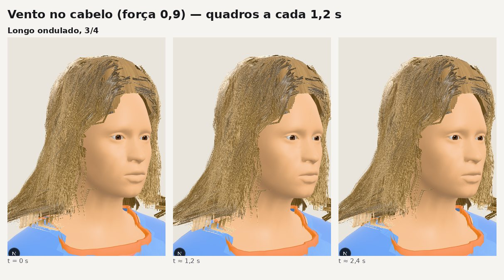

# Cabelo, olhos e movimento do avatar 3D (HAIR-MOTION, 06/10/2026)

Pedido: o cabelo parecia superfície sólida ou fios sólidos e não se mexia, e os olhos pareciam riscados. A franja
feminina tinha de ter estilos, entre eles a franja reta, simétrica e cobrindo a testa. O cabelo devia mexer com o vento
e com os gestos, e o corpo devia ter movimento natural.

Este documento registra o diagnóstico de cada problema, as correções e os testes que as provam. As imagens usam
o manequim padrão (sem rosto de ninguém) e foram geradas no laboratório `/lab/human` (só em desenvolvimento).

## Resumo

| Problema | Causa encontrada | Correção | Prova |
|---|---|---|---|
| Olhos "riscados" | O verniz (clearcoat) estava no **globo** do olho, uma malha de poucos polígonos. O reflexo esticava numa faixa vertical sobre íris e pupila. A esclera era um branco chapado até a borda (olho "colado") | Globo fosco; o brilho fica só na córnea, com um lóbulo pequeno e nítido. A esclera ganha sombra das pálpebras e um tom levemente rosado na borda (`shadeSclera`). No GLB exportado, sem córnea, o globo leva o verniz | `eyes.test.ts`: a íris não muda, a borda escurece de 10 a 40 % e fica mais quente |
| Fios "sólidos" | A textura de fibra tinha 9 traços largos por mecha sobre um fundo de 28 %: cada fita lia como uma tira | 40 fios finos (0,4–1,2 px) por mecha, mais densos no meio e ralos na borda, alguns interrompidos; corte de alfa de 0,32 para 0,2 com alpha-to-coverage | imagens abaixo |
| Cabelo em "sino" / palha | Da risca, a guia seguia reta para o lado e só depois a gravidade a dobrava, já fora do contorno da cabeça | Regra "acompanha a cabeça" (`Shell.hug`): no crânio a guia fica junto da base, com a folga do volume medido. Abaixo da orelha, a gravidade manda | imagens; teste "longo" |
| Base como "capacete" | Base brilhante e borda da testa recortada em alfa 0,5 nos triângulos do corpo (serrilhado) | Base fosca e mais escura (profundidade entre mechas), linha do cabelo com alpha-to-coverage e **fios curtos de linha do cabelo** penteados por cima da borda | teste "linha do cabelo" |
| Franja medida não aparecia | A etapa de fitas cortava todo fio que tocava a testa, inclusive os da própria franja | A franja pode deitar na testa e nunca desce para a frente dos olhos; a franja escolhida tem a própria linha de corte | teste "rosto livre" |
| Fio de cabelo longo atravessando o ombro | A colisão do cabelo tirava todos os vértices de braço, e o alto do ombro (deltoide) é osso de braço | A colisão inclui o alto do ombro perto do pescoço, onde o cabelo apoia. O ombro inteiro empurrava o cabelo para fora numa "prateleira" | teste "longo": menos de 1 % de pontos dentro da pele |
| Pés patinando | Novo: dobrar só o joelho da perna livre arrastava o pé cerca de 4 cm para trás | Coxa à frente pela metade do ângulo e canela de volta: o pé fica, só o calcanhar sobe | teste "pés no chão": deslize < 1,5 cm |

## 1. Franjas (ajuste "Franja" no Meu Avatar 3D)

A pessoa escolhe entre **Da foto, Sem franja, Reta, Lateral, Cortina e Desfiada** (ajuste `hairFringe`, 0–5). O valor
é salvo e validado no backend (`Avatar3dService`) junto com o corte e o tom.

- **Reta.** Cerca de 380 guias nascem numa faixa do alto da frente (até ~6 cm atrás da linha do cabelo). São
  penteadas para a frente e caem sobre a testa, por fora da pele. Todas param exatamente na mesma altura, 4 mm acima
  da sobrancelha (interpolação no último passo). Cada guia é gerada de um lado e **espelhada** no eixo do rosto, então
  a simetria é exata (teste: x + x' = 2·centro, com y e z iguais, até 10⁻⁶ m). As pontas não afinam nem desfiam e a
  franja tem fitas duplas e mais largas para cobrir a testa.
- **Lateral.** Varrida para um lado, com corte em diagonal: curta do lado da risca e longa na têmpora do outro.
  Abaixo da sobrancelha só passa por fora do rosto.
- **Cortina.** Aberta ao meio, cada metade abre para o seu lado em arco. Fica curta no centro (~1,5 cm acima da
  sobrancelha), na altura da sobrancelha no meio do caminho e chega à maçã do rosto nas laterais, sempre por fora da
  frente dos olhos.
- **Desfiada.** É a franja leve de antes, agora visível.

Com franja escolhida, a base continua com a linha do cabelo no lugar e a franja é feita de fios. Antes, a franja
medida descia a própria base até a sobrancelha, o que deixava uma superfície lisa na testa.

## 2. Movimento do cabelo (vento e gestos)

`lib/avatar3d/human/hair-motion.ts` faz tudo na GPU, sem física por fio:

- **Distância da raiz por vértice (`hairS`).** Nos fios é o comprimento do arco; na base, a altura abaixo da orelha.
  O deslocamento cresce com (s/32 cm)^1,5: a raiz fica presa e a ponta solta.
- **Vento.** Direção e força (até 3 cm na ponta), com rajadas lentas e uma tremulação rápida que corre pelo cabelo
  (fase pela posição, então as mechas não andam juntas). O padrão é uma brisa leve (0,15); palco e passarela podem
  pedir mais (`wind` no `HumanAvatar`).
- **Atraso dos gestos.** Uma mola amortecida segue um ponto da massa do cabelo, abaixo e atrás do centro da cabeça.
  Quando a cabeça vira ou o corpo troca o apoio, as pontas ficam para trás e voltam com um leve balanço, sem oscilar
  (teste: volta em 3 s, passa menos de 35 %).
- **Nunca para dentro da cabeça.** A componente do deslocamento contra a normal é retirada.
- **"Reduzir movimento"** zera o vento e o atraso.

## 3. Movimento natural do corpo

`pose.ts`, o movimento parado ("idle"):

- **Troca de apoio com pausa.** O peso fica numa perna e passa para a outra (tanh de uma senoide), em vez do
  balanço contínuo de metrônomo. O quadril desliza, cai do lado livre e gira um pouco; o tronco faz o contraposto;
  o joelho da perna livre relaxa sem o pé sair do lugar.
- **Olhada para o lado.** A cada ~10,5 s a cabeça vira devagar de 5° a 10° para um lado, fica cerca de 2,5 s e volta,
  com um leve inclinar. O cabelo atrasa e volta junto.
- **Respiração mais visível.** O tórax e os ombros acompanham; o antebraço tem um balanço mínimo.
- **Pés no chão.** Teste: deslize < 1,5 cm e sem afundar em 27 s de movimento.

## 4. Imagens

Todas as imagens usam o manequim padrão, no laboratório e com o mesmo código de produção.

## 5. Limites e próximos passos

- O renderizador de teste (SwiftShader, sem MSAA) não faz alpha-to-coverage. As bordas dos fios e da linha do cabelo
  ficam mais suaves numa GPU de verdade do que nas imagens.
- Ainda não há penteados presos (rabo de cavalo, coque, trança). Eles entram no item AVATAR-ID I5 (cabelo e barba),
  com a mesma estrutura de guias e o mesmo movimento.
- O vento não colide com a roupa. Com força alta (> 0,6), pontas longas podem cruzar a gola por alguns quadros. Por
  isso o padrão é 0,15.
- O GLB exportado leva o idle novo como animação, mas sem o movimento do cabelo (ele depende do shader).

## 6. O que mudou no código

| Arquivo | Mudança |
|---|---|
| `lib/avatar3d/human/three-human.ts` | Globo do olho fosco; córnea com um lóbulo |
| `lib/avatar3d/human/eyes.ts` | `shadeSclera` (esclera com volume) |
| `lib/avatar3d/human/hair-strands.ts` | Textura de fibras fina, `Shell.hug`/`skinAt`, franjas escolhidas (`growStyledFringe`), fios de linha do cabelo, colisão com o alto do ombro, franja visível |
| `lib/avatar3d/human/hair-geometry.ts` | Base fosca, linha do cabelo suave; com franja escolhida, a base não desce na testa |
| `lib/avatar3d/human/hair-motion.ts` | Novo: vento, mola do atraso, trecho do shader |
| `lib/avatar3d/human/pose.ts` | Troca de apoio com pausa, joelho livre sem patinar, olhada para o lado |
| `lib/avatar3d/model.ts`, `hair-cut.ts` | `FringeStyle`, `HAIR_FRINGES`, `hairWithFringe`, ajuste `hairFringe` |
| `components/three/human-avatar.tsx` | Franja escolhida, `hairS`, uniforms, mola e vento por quadro, prop `wind` |
| `components/avatar3d/my-avatar.tsx` | Seletor "Franja" |
| `fai-application/.../Avatar3dService.java` | Validação do `hairFringe` (0–5, inteiro) |
| `lib/avatar3d/human/export-glb.ts` | O arquivo não leva o atributo do movimento; o globo leva o verniz |
