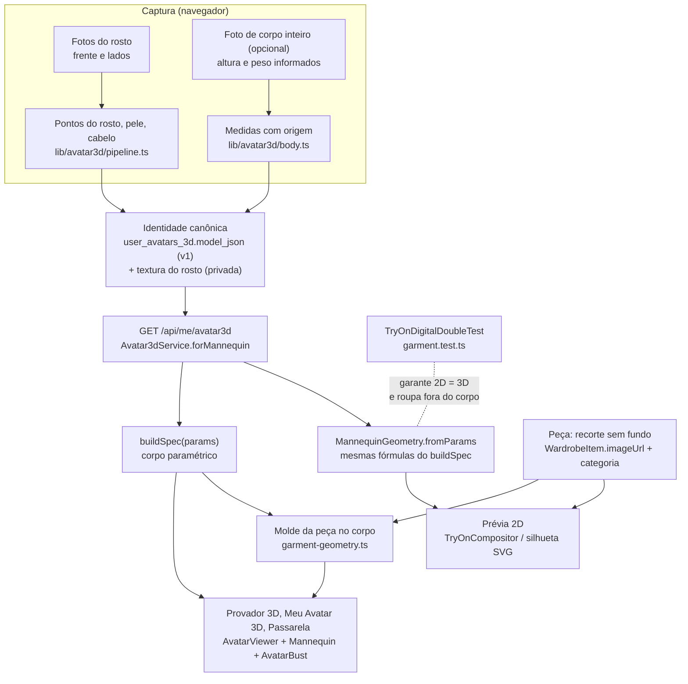

# Digital double — uma identidade para o provador 2D e o 3D

Este documento responde ao pedido de tratar o avatar como *digital double* do usuário. Ele cobre a auditoria de onde a
fidelidade se perde, a arquitetura compartilhada, o modelo de dados, a especificação das etapas, a matriz de testes,
os critérios de aprovação e o plano. O Provador refeito está em `docs/provador/provador-2026-09-27.md`.

**Estado: não está pronto.** O provador 2D e o 3D já usam a mesma identidade: corpo medido ou informado, pele medida,
rosto do Avatar 3D. A roupa ainda é a foto da peça projetada num molde do corpo. Não há esqueleto, pesos de skinning,
malha de roupa vestível, simulação de tecido nem GLB exportado. As telas chamam o resultado de **prévia** e dizem isso.

---

## 1. Onde o pipeline perde fidelidade

**Artefatos disponíveis.**

- **Fotos originais:** as fotos de teste T1–T7 da investigação anterior (`investigacao-pipeline-avatar.md`, seção 1).
  Nenhuma foto do usuário do caso chegou ao ambiente.
- **Intermediários:** composição do que ia para a cabeça (`img/02-o-que-ia-para-a-cabeca.jpg`), medidas antes e
  depois (`img/03-T1-medidas-antes-depois.jpg`), renders do corpo vestido (`img/dd/antes/`, `img/dd/depois/`) e
  renders do provador 2D (`img/dd/2d-*.png`).
- **GLB final:** não existe. O corpo é montado no navegador a cada exibição a partir de `buildSpec(params)`, e nada é
  exportado.
- **Logs:** o provador 3D não gera job nem log. O compositor 2D devolve as etapas e o tempo de cada uma
  (`stages`, `totalMs`). A criação do avatar grava os avisos de qualidade no próprio modelo (`warnings`).

| # | Etapa | O que se perdia | Evidência | Estado |
|---|---|---|---|---|
| L1 | Identidade do provador 2D | O manequim 2D era genérico, com sexo e porte escolhidos na tela, sem relação com o avatar | `img/dd/provador-antes.png` | Corrigido: o 2D deriva do corpo do avatar e o sexo vem do avatar ou do cadastro |
| L2 | Proporções 2D × 3D | A cintura do 2D ficava a 0,43 da altura do canvas, e a do corpo 3D equivalente a 0,366; ombro 0,32 × 0,333 | `TryOnDigitalDoubleTest` (saída `BASELINE_2D`) | Corrigido: mesmas fórmulas do `buildSpec`, com teste de larguras e caixas iguais |
| L3 | Pele no 2D | Tom escolhido numa paleta, não o medido | Código anterior de `TryOnService` | Corrigido: pele medida do avatar, com a origem na tela |
| L4 | Personagem no provador | O provador não mostrava o rosto nem o corpo do avatar | `docs/provador/img/2026-09-27/` | Corrigido: palco 3D com o avatar do perfil |
| L5 | Superfície do tronco 3D | Faces do tronco para dentro, normais invertidas; a frente das peças saía 20% mais escura | `garment.test.ts` (orientação das faces) | Corrigido |
| L6 | Roupa × corpo | O molde atravessava a pele: 5,7–10,8% dos vértices, até 65% nos braços | `garment-baseline-2026-09-27.json` | Corrigido: 0% (colisões pela distância com sinal) |
| L7 | Estampa | Projeção planar: a frente aparecia espelhada nas costas, e a estampa esticava até 12–14× nas laterais | `img/dd/antes/*-back.png` | Corrigido: foto só nas faces frontais, p95 de 2,6–2,8×; costas com a cor do tecido |
| L8 | Comprimento da peça | O encaixe usa a proporção da foto: moletom acima da cintura, calça na canela; cobertura do tronco de 33–49% | `img/dd/*/M-ref-hoodie-front.png` | Aberto |
| L9 | 2D, largura da camisa | Encaixe "contain" na caixa: num corpo mais largo, a camisa saía mais estreita (0,477 × 0,484) | `TryOnDigitalDoubleTest` (saída `D2D-3`) | Aberto |
| L10 | Pose e movimento | Sem esqueleto, sem pesos, sem pose além da "A" | Código | Aberto (fase 3) |
| L11 | Pele sob luz da foto | Mediana das bochechas e da testa, descartando brilho e sombra fortes, mas sem balanço de branco | `image-stats.ts: sampleSkin` | Parcial |
| L12 | Roupa da foto do corpo | Largura medida com roupa larga vira "estimada", não entra como medida | `body.ts` (CLOTHING, ARMS_ON_TORSO) | Tratado |
| L13 | Laterais no perfil | Onde a foto frontal tem vão entre manga e tronco, a lateral do molde some | `img/dd/depois/*-profile.png` | Aberto |

---

## 2. Arquitetura compartilhada

As duas apresentações têm renderizadores diferentes, mas a mesma fonte: os mesmos parâmetros do corpo, a mesma pele e
as mesmas caixas de peça. As fórmulas existem em TypeScript e em Java. O teste compara os resultados numéricos, e um
arquivo único de fórmulas testado pelos dois lados está no plano (seção 7).

---

## 3. Modelo de dados

### 3.1 Identidade canônica do avatar

| Campo | Existe hoje (v1) | Proposto (v2) |
|---|---|---|
| Versão | `v`, `updatedAt` | `identityVersion` crescente a cada confirmação da pessoa |
| Rosto | `shape` (468 × 3 em cm, pose neutra), `metrics`, `views` (yaw, pitch, roll) | Profundidade observada com foto de 3/4, com confiança por região |
| Pele | `skin` (hex), ajuste `skinLight` | Albedo em luz linear e balanço de branco registrado |
| Cabelo | `hair` (presença, cor, volume, franja, corte) | Malha de cabelo por tipo, com confiança |
| Corpo | `body.params` (9 proporções), `body.sources` (observed, user, estimated, default), `heightCm`, `weightKg`, `photo`, `warnings` | Circunferências confirmadas (tórax, cintura, quadril, entreperna) com unidade, origem e confiança |
| Textura | Atlas do rosto em chave privada | Mais LODs (512, 1024, 2048) |
| Rig | — | `skeleton: "fai-humanoid-v1"`, pose de ligação "A", juntas de `buildSpec().joints` |
| Malha | — (montada em tempo real) | `glbKey`, `glbSha256`, `glbBytes`, relatório do glTF-Validator |
| Consentimento | `consentAt`, `publicOnRunway` | Igual |

### 3.2 Peça vestível

| Campo | Existe hoje | Proposto |
|---|---|---|
| Tipo | `category` (lugar no corpo), `subcategory`, `SchemeSlot` derivado | Igual |
| Imagem | `imageUrl` (recorte), `originalImageUrl`, `studioImageUrl` | Foto das costas opcional, com o estado "observada" ou "ausente" |
| Referências da peça | — | Gola, ombros, fim das mangas, barra, cós, em coordenadas da foto (os mesmos pontos do enquadramento por categoria) |
| Medidas | `size` (etiqueta) | Largura de peito e comprimento, se a pessoa informar |
| 3D | `model3dUrl`, `model3dStatus` (objeto rígido do RF16) | Malha vestível com os mesmos ossos do corpo; `fit: "preview" \| "size-simulation"` |
| Avisos | — | "costas não observadas", "comprimento estimado" |

---

## 4. Especificação das etapas

**Reconstrução (requisitos 1–6).**

- O rosto vem dos 468 pontos em pose neutra, mais o atlas do próprio rosto. Com uma foto só, a profundidade é
  estimada, e a tela avisa.
- O corpo vem de proporções com origem declarada. Roupa larga, braço no tronco e perspectiva tornam a medida
  "estimada", nunca "medida".
- Peso e idade não são deduzidos. O peso informado só orienta a compleição quando nenhuma largura foi medida.
- A roupa da foto não entra na geometria do corpo.
- Falta um balanço de branco explícito antes de amostrar a pele.

**Rig (requisito 8, a fazer).**

- Esqueleto humanoide nas juntas do `buildSpec` (Hips → Spine → Chest → Neck → Head; braços e pernas), com pose de
  ligação "A".
- No máximo 4 influências por vértice, com pesos somando 1.
- Exportação em GLB: metros, +Y para cima, frente em +Z, validada no glTF-Validator.

**Adaptação da roupa (requisitos 11, 12 e 15).**

- Hoje a roupa é um molde por categoria: as partes do corpo que a peça cobre, infladas.
- A foto é projetada de frente e aparece só nas faces que encaram a câmera. Costas e laterais recebem a cor do tecido.
- O comprimento vem da proporção da foto. O próximo passo é tirá-lo dos pontos de referência da peça (gola, barra),
  medidos em relação ao pescoço e aos ombros do corpo.

**Colisões e oclusão (requisitos 13 e 14).**

- Implementado: nenhum vértice da roupa fica dentro do corpo, com folga mínima de 3 mm.
- No tronco o deslocamento é só horizontal, para a barra não subir.
- As camadas se separam pela folga do molde: camiseta a 0,8% da estatura, casaco a 1,8%.
- Falta resolver colisão entre camadas e colisão em movimento.

**Renderização.**

- Luz neutra e suave, a mesma em todas as vistas; câmera por vista (frente, perfil, costas) e giro livre.
- Pele do avatar em todo o corpo.
- A prévia 2D usa os mesmos níveis e larguras do 3D.

---

## 5. Matriz de testes

| Teste | Onde | Antes | Depois |
|---|---|---|---|
| 2D e 3D com as mesmas larguras, alturas e caixas | `TryOnDigitalDoubleTest` | Cintura 0,43 × 0,366 | Iguais (tolerância numérica) |
| Nenhum vértice da roupa dentro do corpo (5 peças × 3 corpos) | `garment.test.ts` | 5,7–10,8% | 0 |
| Faces do tronco para fora | `garment.test.ts` | Para dentro | Para fora |
| Foto só nas faces frontais; estiramento limitado | `garment.test.ts` | p95 12–14× | ≤ 3,3× por construção; medido 2,6–2,8× |
| Renders frente, perfil e costas (4 corpos × 3 peças) | `scripts/avatar3d/eval-garment.mjs` | `img/dd/antes/` | `img/dd/depois/` |
| Provador mostra o avatar e 4 lugares | `scripts/tryon/verify-provador.mjs` | Manequim genérico, camadas de vestir | ✅ 14 de 14 verificações |
| Poses: braços erguidos, braços à frente, rotação do tronco | — | Não executável (sem rig) | Não executável (sem rig) |
| Semelhança facial com revisão humana | — | Não feito | Não feito (precisa de fotos consentidas e avaliadores) |
| Conjunto variado (proporções, tons de pele, camisas, fotos incompletas) | Parcial: 4 corpos, 3 peças | — | Falta tom de pele, cabelo e fotos incompletas |

---

## 6. Critérios objetivos de aprovação

Os valores abaixo vêm da linha de base medida (seção 5) ou são invariantes geométricas. Não há percentual de
"fidelidade" inventado.

| Critério | Tipo | Limite |
|---|---|---|
| Vértices da roupa dentro do corpo | Invariante | 0 (d < −2 mm), em todos os corpos e peças do conjunto |
| 2D × 3D: larguras de cintura e quadril e caixa da parte de cima | Invariante | Iguais até 1e-9 da largura do canvas |
| Estiramento da estampa, p95, onde a foto aparece | Provisório | ≤ 3,3× (limite da projeção); revisar após avaliar amostras reais |
| Cobertura do tronco por camiseta | Provisório | Não pode cair abaixo da linha de base (33%); meta a definir depois da correção de comprimento |
| Folga máxima de camiseta ou camisa | Provisório | ≤ 4 cm (linha de base depois: 1,6–3,9 cm) |
| Pose e animação | Bloqueante | Sem rig, nenhuma peça é marcada como "vestida corretamente" |
| Semelhança | Revisão humana | Comparação pareada cega contra a foto, por estrato; nenhum estrato pior |

Enquanto um critério bloqueante não for atendido, o provador mostra **prévia** e explica o que falta (requisitos 16
e 22). Nenhuma tela usa o rótulo "provador 3D" para a projeção.

---

## 7. Plano priorizado

| Fase | Entregas | Critério para fechar |
|---|---|---|
| 1 — feita | Identidade única 2D/3D, sem escolha de sexo, pele medida, colisões, estampa só na frente, normais, provador com 4 lugares | Testes das seções 5 e 6 verdes |
| 2 | Pontos de referência da peça (gola, ombros, mangas, barra, cós), comprimento e largura pela peça e não pela foto, lateral sem vazar; o mesmo detector serve ao enquadramento por categoria | Cobertura do tronco acima da linha de base; laterais sem buracos no perfil; D2D-3 resolvido |
| 3 | Rig humanoide, pesos, pose de ligação, GLB validado; poses de teste (braços erguidos, à frente, torção) | glTF-Validator com 0 erros; Humanoid mapeado; sem colapso de cotovelo e ombro nas poses |
| 4 | Malha de roupa por categoria com os mesmos ossos; skinning da roupa; colisão em movimento; foto das costas opcional | 0 interseções nas poses; estampa estável em movimento |
| 5 | Semelhança: foto de 3/4, balanço de branco, revisão humana por estrato | Vence a comparação pareada cega; nenhum estrato pior |
| 6 | Simulação de tamanho, só com medidas da peça e do corpo confirmadas | "Simulação de tamanho" só aparece com os dados completos |

---

## 8. Requisitos 1–22

| Requisitos | Estado | Onde |
|---|---|---|
| 1–6 fidelidade do avatar | Rosto e corpo com origem declarada; profundidade de uma foto é estimada; comparação multivista com revisão humana ainda não feita | Seções 1, 4; `investigacao-pipeline-avatar.md` |
| 7 modelo canônico versionado | v1 existe (sem rig nem malha exportada); v2 proposto | Seção 3 |
| 8 esqueleto válido | Não feito | Fase 3 |
| 9 aparência consistente | Mesma identidade em todas as telas e vistas | Seções 2, 5 |
| 10 separar corpo, roupa, material, ajuste | Corpo, roupa e material separados; sem morph targets | Seções 3, 4 |
| 11 posicionar pela anatomia | Pelas juntas e níveis do corpo; comprimento ainda pela foto | L8 |
| 12 da foto à peça vestível | Documentado; costas e caimento não reconstruídos, e a tela diz isso | Seção 4 |
| 13 rig, skinning e tecido | Colisão estática feita; rig e tecido não | Fases 3 e 4 |
| 14 oclusão | Corpo não atravessa a roupa; camadas por folga | Seção 4 |
| 15 preservar a peça | Cor e estampa da foto na frente; costas com a cor do tecido | L7 |
| 16 prévia × simulação | Só prévia, identificada | Provador |
| 17–21 testes e linha de base | Linha de base medida e critérios derivados; poses e revisão humana faltam | Seções 5, 6 |
| 22 não publicar como concluído | Cumprido nas telas | Provador |

---

## 9. Arquivos

| Arquivo | Papel |
|---|---|
| `lib/avatar3d/body-spec.ts` | Corpo paramétrico e origem de cada medida |
| `fai-application/.../imaging/MannequinGeometry.java` | Mesmo corpo em 2D (`fromParams`, `identity`) |
| `lib/avatar3d/garment-geometry.ts` | Molde da peça, projeção, colisões, separação frente × costas |
| `lib/avatar3d/garment-metrics.ts` | Distância com sinal, colisões, métricas de vestir |
| `lib/avatar3d/garment.test.ts`, `TryOnDigitalDoubleTest.java` | Invariantes |
| `scripts/avatar3d/eval-garment.mjs` | Linha de base e renders antes/depois |
| `docs/avatar3d/garment-baseline-2026-09-27.json`, `garment-depois-2026-09-27.json` | Medições |
| `docs/provador/provador-2026-09-27.md` | Provador com 4 lugares e testes de aceitação |
