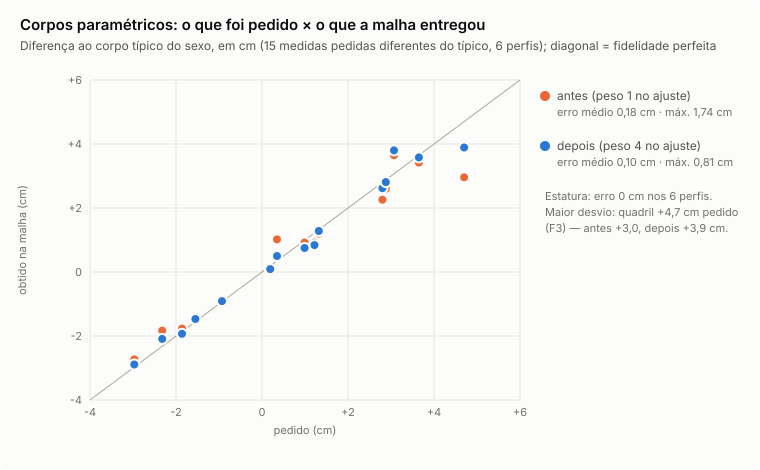

# Fidelidade do digital twin com vários avatares (TWIN-FID)

**Data:** 2026-10-06. **Pedido:** "Faça testes com vários avatares diferentes, a fim de mostrar a fidelidade do digital
twin".

**Estado:** bateria rodada e duas correções aplicadas.

- **Tom de pele:** o balanço de branco do I3 deixava a pele cinza, esverdeada ou azulada em 7 de 16 retratos.
- **Corpo:** as medidas que a pessoa ajusta ficavam até 1,7 cm aquém do pedido.

Os números abaixo já são do código corrigido; a rodada anterior aparece como "antes".

> **Em preenchimento:** as seções 2 (pessoas diferentes) e 3 (capturas diferentes) entram quando a segunda rodada da
> bateria, já com as correções, terminar. As seções 4 e 5 estão fechadas.

<!-- TWIN-FID:RESUMO -->

---

## 1. O que foi testado

| Bloco | Casos | O que mede |
|---|---|---|
| A. Pessoas diferentes | 16 retratos autorizados (`docs/testes/dados/`); 1 recusado pelo filtro de qualidade | gate de identidade, semelhança por dois reconhecedores, identificação entre 16 fotos, se os gêmeos se distinguem entre si, atributos (olhos, sobrancelhas, cabelo, corpo) |
| B. A mesma pessoa em capturas diferentes | 6 retratos × 6 condições: luz quente, luz fria, exposição −38%, meia resolução, cabeça inclinada 5° e armação de grau sintética | o gêmeo continua o mesmo? semelhança com a foto original, forma do rosto e tom da pele contra o gêmeo original, atributos estáveis |
| C. Corpos | 6 perfis paramétricos (3 femininos, 3 masculinos, de 1,55 a 1,92 m), cada um com o rosto de uma pessoa do bloco A | medida pedida × medida na malha, com as mesmas definições do exportador do corpo |

**Como foi medido:**

- **Código:** o mesmo da produção, no laboratório `/lab/human`, local, sem IA remota.
- **Reconhecedores faciais independentes** (os mesmos de `eval-likeness.py`):
  - SFace (OpenCV Zoo): limiar publicado de "mesma pessoa" 0,363;
  - ArcFace ResNet100 (ONNX Model Zoo), como segunda opinião.
- **Renders:** frente, 3/4, perfil e corpo inteiro com a roupa casual padrão e o cabelo no nível de detalhe 2.

**Privacidade:**

- **Fica no ambiente local, nunca no repositório:** as fotos, os renders com rosto, a forma do rosto e as cores de cada
  pessoa.
- **Vai para o repositório:** só agregados e distribuições sem nome, em
  [`fidelidade-digital-twin-2026-10-06.json`](fidelidade-digital-twin-2026-10-06.json).
- **Gráficos:** feitos só do agregado; não têm rosto nem nome.

---

<!-- TWIN-FID:A -->

---

<!-- TWIN-FID:B -->

---

## 4. Tom de pele: o erro que a bateria achou e a correção

**O erro.** No primeiro render de corpo inteiro, a pessoa de pele morena-dourada saiu com rosto, pescoço e braços
cinza-esverdeados (`#9a9f91`). O gate não percebeu: o "erro de cor 0,2" do I3 compara a textura com o tom que o próprio
pipeline mediu. Ele mede coerência interna, não fidelidade à foto.

**A causa.** O I3 estima a cor da luz pela esclera, o branco do olho.

- Em olho pequeno ou semicerrado (sorriso, rosto pequeno na foto), a região "esclera" dentro do contorno do olho pegava
  pálpebra, sombra e a borda da própria pele.
- Em 7 de 16 retratos a "esclera" ficou mais escura que a pele (luminosidade 20–47 contra 51–79).
- Os ganhos calculados nela (até 0,75 no vermelho) tiravam o calor da pele.

**A correção** (`lib/avatar3d/skin-tone.ts`, com testes em `skin-tone.test.ts`):

1. **Amostra da esclera filtrada pela pele medida.** Ficam só pixels com pelo menos 85% do brilho da pele e com razão
   R/G abaixo de 0,9 × a da pele.
   - Essa razão não muda com a cor da luz, porque cada canal recebe o mesmo ganho: esclera ≈ 1,03; pele 1,3–1,5 em todas
     as tonalidades.
   - Primeiro tentei filtrar pela saturação, mas ela não é invariante: sob luz fria a pele perde saturação e a esclera
     ganha.
   - Com menos de 12 pixels de esclera, vale a reserva (gray-world fraco).
2. **A pele nunca sai da faixa humana.** A faixa é matiz entre 22° e 82° e croma ≥ 7, em CIELAB.
   - Aplica-se a maior fração dos ganhos (1; 0,9; …; 0) que mantém a pele dentro dela.
   - A correção que ajuda (pele esverdeada pela luz fluorescente) continua inteira.
   - Quando a fração é menor que 1, o modelo ganha o aviso `WB_LIMITED`, em pt-BR, en e es: "confira a cor da pele na
     revisão".

**Resultado** (16 retratos; 30 variações de captura; `scripts/avatar3d/twin-fid/skin-wb.mjs`):

| Medida | Antes | Depois |
|---|---|---|
| Pele do gêmeo fora da faixa humana | 7 de 16 | **1 de 16** (esse já está fora na própria foto: foto superexposta sem esclera visível; fica como a foto e recebe o aviso) |
| Distância entre o tom da foto e o do gêmeo (ΔE2000), mediana / máx. | 10,1 / 25,5 | **4,2 / 11,0** |
| Luz quente: ΔE do gêmeo ao gêmeo da foto original, mediana | 4,1 (sem correção: 7,6) | **1,3** |
| Luz fria: idem | 2,3 (sem correção: 8,9) | 2,7 |
| Meia resolução: idem | 1,8 | 1,9 |
| Cabeça inclinada 5°: idem | 0,8 | 0,7 |
| Fonte do balanço de branco | esclera 16 (7 delas erradas) | esclera 10, gray-world 6 |

**Como ler a luz fria.** O "antes" era consistente, mas errado. Dois dos seis retratos dessa medida saíam
cinza nas duas fotos, e cinza igual dá ΔE pequeno. O "depois" acerta a cor e varia um pouco mais.

**Exposição −38% não é corrigida, de propósito.** O balanço de branco mexe só na cor da luz, não no brilho. Uma foto
escura dá um gêmeo de pele mais escura (ΔE ≈ 24, quase todo de luminosidade). Esse caso fica com o filtro de qualidade:
o aviso `TOO_DARK` pede outra foto.

---

## 5. Corpos paramétricos: o que a pessoa pede é o que a malha entrega

**Como foi medido:**

- seis perfis de corpo com as medidas definidas como ajustadas pela pessoa (origem "user");
- `fitBody` e `compose` de produção;
- a malha é medida com as mesmas definições do exportador (`export_body.py`, função `measures`): estatura, distância
  entre ombros, cortes horizontais do tronco no peito, na cintura e no quadril, altura do quadril, braço e cabeça;
- a comparação é sempre da diferença ao corpo típico do sexo, a mesma convenção do `fitBody`.

**O erro.** Com o peso 1 nas medidas ajustadas pela pessoa, igual ao das medidas observadas na foto, a forma típica
segurava as medidas extremas:

- o quadril de +4,7 cm do perfil curvilíneo chegava a +3,0 cm (63%);
- a cintura subia +1,0 cm sem ninguém pedir.

**A correção** (`lib/avatar3d/human/compose.ts`, `TRUST.user` de 1 para 4, com teste em `human.test.ts`):

- o que a pessoa ajusta tem metade da incerteza;
- a foto continua com a incerteza da medida;
- o teste novo falha com o peso antigo e passa com o novo.

| Perfil | Estatura (erro) | Medidas pedidas ≠ típico: pedido → obtido (cm), antes · depois |
|---|---|---|
| F1 · 1,55 m · esguia | 0 cm | ombros −0,93 → −0,89 · **−0,91**; peito −1,55 → −1,48 · **−1,47**; cintura −1,86 → −1,77 · **−1,93**; quadril −2,32 → −1,83 · **−2,09** |
| F2 · 1,68 m · média | 0 cm | (proporções típicas: só a estatura muda) |
| F3 · 1,74 m · curvilínea | 0 cm | peito +1,22 → +0,92 · **+0,84**; cintura +0,35 → +1,02 · **+0,50**; quadril +4,70 → +2,96 · **+3,89** |
| M1 · 1,65 m · compacto | 0 cm | peito +1,32 → +1,20 · **+1,28**; cintura +2,80 → +2,26 · **+2,62**; quadril +0,99 → +0,92 · **+0,75**; pernas −2,97 → −2,73 · **−2,89** |
| M2 · 1,80 m · médio | 0 cm | (proporções típicas: só a estatura muda) |
| M3 · 1,92 m · ombros largos | 0 cm | ombros +3,65 → +3,42 · **+3,58**; peito +3,07 → +3,65 · **+3,80**; cintura +0,19 → +0,03 · **+0,09**; pernas +2,88 → +2,60 · **+2,81** |

| Resumo (42 medidas) | Antes | Depois |
|---|---|---|
| Erro médio | 0,18 cm | **0,10 cm** |
| Maior erro | 1,74 cm (quadril F3) | **0,81 cm** (o mesmo quadril) |
| Estatura | 0 cm nos 6 | 0 cm nos 6 |



**O que ainda limita:**

- quadril largo com cintura fina, num extremo do espaço de corpos, chega a 83% do pedido;
- ombros muito largos puxam o peito junto (+0,7 cm a mais).

O espaço do MakeHuman tem 24 componentes, e medidas vizinhas andam juntas. Ir além disso pede deformação local (fora do
espaço), prevista para o GARMENT F2.

<!-- TWIN-FID:C-LAB -->

---

<!-- TWIN-FID:LIMITES -->

---

## 8. Como reproduzir

Os scripts ficam em `scripts/avatar3d/twin-fid/`. Pedem o Next em desenvolvimento na porta 3100 (o `/lab` é 404 em
produção) e o Playwright com Chromium. Os modelos SFace, ArcFace e YuNet ficam numa pasta local, como no
`eval-likeness.py`.

```bash
python3 scripts/avatar3d/twin-fid/make-jobs.py <fotos> <variações> jobs.json            # variações + 58 casos
node scripts/avatar3d/twin-fid/eval-twin.mjs jobs.json <saída>                           # renders + métricas (local)
python3 scripts/avatar3d/twin-fid/faces.py <fotos> <variações> <saída> <modelos> faces.json
node scripts/avatar3d/twin-fid/body.mjs body.json; ANTES=1 node scripts/avatar3d/twin-fid/body.mjs body-antes.json
node scripts/avatar3d/twin-fid/skin-wb.mjs <análises> <análises das variações> skin-wb.json
node scripts/avatar3d/twin-fid/aggregate.mjs <saída> faces.json body.json agregado.json
python3 scripts/avatar3d/twin-fid/charts.py agregado.json body-antes.json body.json docs/avatar3d/img/twin-fid
```

**O que fica fora do repositório:** a pasta de saída, `faces.json` e `twin-private.json` (forma do rosto e cores por
pessoa).
