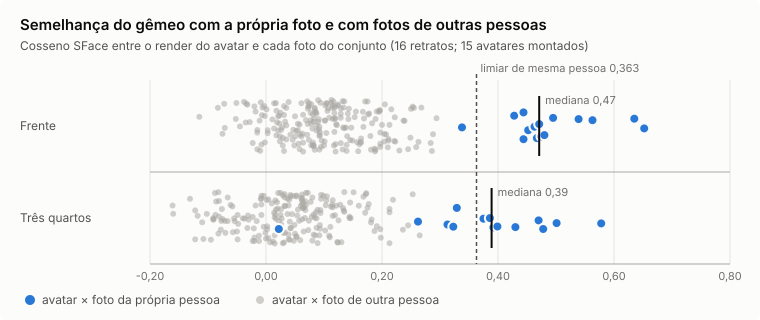
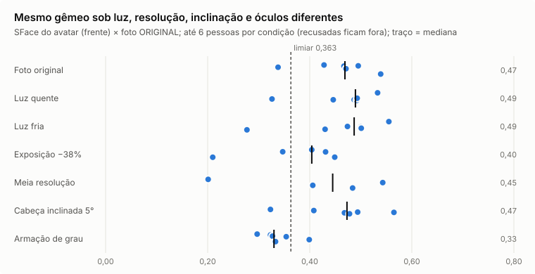

# Fidelidade do digital twin com vários avatares (TWIN-FID)

**Data:** 2026-10-06. **Pedido:** "Faça testes com vários avatares diferentes, a fim de mostrar a fidelidade do digital
twin".

**Estado:** bateria rodada e duas correções aplicadas.

- **Tom de pele:** o balanço de branco do I3 deixava a pele cinza, esverdeada ou azulada em 7 de 16 retratos.
- **Corpo:** as medidas que a pessoa ajusta ficavam até 1,7 cm aquém do pedido.

Os números abaixo já são do código corrigido; a rodada anterior aparece como "antes".

## Resumo

1. **O gêmeo é reconhecível como a própria pessoa.** De frente, os dois reconhecedores apontam a foto da própria pessoa
   como a mais parecida em **15 de 15** gêmeos, entre 16 fotos.
   - SFace mediana: 0,471 (I4: 0,448).
   - Acima do limiar "mesma pessoa": 14 de 15.
   - As notas "própria foto" e "foto de outra pessoa" não se misturam (AUC 1,00).
   - De 3/4: SFace 0,389 (I4: 0,363) e top-1 em 13 de 14.
2. **O gêmeo é estável quando a captura muda.** Com luz quente, luz fria, meia resolução ou cabeça inclinada:
   - a forma do rosto muda 0,35–0,57 mm (mediana), cerca de 10 vezes menos que a diferença entre duas pessoas (4,6 mm);
   - o gêmeo novo e o original têm SFace 0,95–0,96 entre si.
3. **O tom de pele ficou fiel à foto** depois da correção (seção 4): pele fora da faixa humana caiu de 7 para 1 de 16.
4. **O corpo entrega o que foi pedido:**
   - estatura exata nos 6 perfis, na malha e no navegador;
   - erro médio de 0,10 cm nas outras medidas, depois da correção (seção 5).
5. **Onde ainda falha** (seção 6):
   - foto subexposta escurece a pele do gêmeo (ΔE ≈ 24), e o filtro de qualidade só avisa em 1 de 5 casos;
   - duas íris claras com centro âmbar recebem o rótulo "castanho";
   - esclera amarelada pela idade é lida como luz quente, e a correção esfria demais um dos 15;
   - um retrato perde a identificação no 3/4 (mechas do cabelo cruzam o rosto).

| Bloco | Medida principal | Resultado |
|---|---|---|
| A. 16 pessoas | Gêmeo identificado entre 16 fotos, de frente (SFace / ArcFace) | **15/15 · 15/15** |
| A. 16 pessoas | Gate de identidade (reprojeção, assimetria, cor, costuras) | **14 de 15** |
| B. Capturas variadas | Forma do rosto, mudança mediana (luz, resolução, inclinação) | **0,35–0,57 mm** (entre pessoas: 4,6 mm) |
| B. Capturas variadas | Ainda identificado (top-1) com luz quente / fria / inclinação / óculos | **6/6 · 6/6 · 6/6 · 6/6** |
| Pele | Gêmeo fora da faixa de pele humana | **7 → 1 de 16** |
| C. 6 corpos | Estatura · erro médio das medidas | **0 cm · 0,10 cm** |

---

## 1. O que foi testado

| Bloco | Casos | O que mede |
|---|---|---|
| A. Pessoas diferentes | 16 retratos autorizados (`docs/testes/dados/`); 1 recusado pelo filtro de qualidade | gate de identidade, semelhança por dois reconhecedores, identificação entre 16 fotos, se os gêmeos se distinguem entre si, atributos (olhos, sobrancelhas, cabelo, corpo) |
| B. A mesma pessoa em capturas diferentes | 6 retratos × 6 condições: luz quente, luz fria, exposição −38%, meia resolução, cabeça inclinada 5° e armação de grau sintética | o gêmeo continua o mesmo? semelhança com a foto original, forma do rosto e tom da pele contra o gêmeo original, atributos estáveis |
| C. Corpos | 6 perfis paramétricos (3 femininos, 3 masculinos, de 1,55 a 1,92 m), cada um com o rosto de uma pessoa do bloco A | medida pedida × medida na malha, com as mesmas definições do exportador do corpo |

**Como foi medido:**

- **Código:** o mesmo da produção, no laboratório `/lab/human`, local, sem IA remota.
- **Reconhecedores faciais independentes** (os mesmos de `eval-likeness.py`):
  - SFace (OpenCV Zoo): limiar publicado de "mesma pessoa" 0,363;
  - ArcFace ResNet100 (ONNX Model Zoo), como segunda opinião.
- **Renders:** frente, 3/4, perfil e corpo inteiro com a roupa casual padrão e o cabelo no nível de detalhe 2.

**Privacidade:**

- **Fica no ambiente local, nunca no repositório:** as fotos, os renders com rosto, a forma do rosto e as cores de cada
  pessoa.
- **Vai para o repositório:** só agregados e distribuições sem nome, em
  [`fidelidade-digital-twin-2026-10-06.json`](fidelidade-digital-twin-2026-10-06.json).
- **Gráficos:** feitos só do agregado; não têm rosto nem nome.

---

## 2. Pessoas diferentes (bloco A)

**Montagem:**

- 15 de 16 retratos viram gêmeo; o filtro de qualidade recusa 1, como em todas as fases.
- O corpo base sai do sexo estimado pelo rosto e confere com o rótulo do conjunto em 15 de 15.

| Gate de identidade (métricas do aparelho) | Valor |
|---|---|
| Aprovados | **14 de 15** (o reprovado é o mesmo das fases anteriores: boca a 1,3 mm, limite 1,2 mm; foto escura de luz lateral) |
| Reprojeção dos pontos do rosto, mediana / máx. | 0,6 / 0,7 mm |
| Assimetria preservada, mediana | 0,90 |
| Erro de cor da pele (textura × tom medido), mediana | 0,1 |
| Costuras rosto ↔ pescoço | 0 |

| Semelhança (reconhecedores independentes) | Frente | 3/4 |
|---|---|---|
| SFace, mediana (I4 → agora) | 0,448 → **0,471** | 0,363 → **0,389** |
| ArcFace, mediana | 0,491 | 0,392 |
| Acima do limiar "mesma pessoa" (SFace ≥ 0,363) | **14 de 15** | **9 de 14** (I4: 7) |
| A própria foto é a mais parecida entre 16 (top-1), SFace / ArcFace | **15/15 · 15/15** | 13/14 · 12/14 |
| Gêmeo × própria foto / × foto de outra pessoa, medianas | 0,471 / 0,092 | 0,389 / 0,042 |
| Separação entre "própria foto" e "outra pessoa" (AUC) | **1,00** | 0,96 |
| Gêmeo × outro gêmeo, mediana | 0,313 | 0,253 |



**Como ler:**

- **A melhora sobre o I4 vem da pele.** O tom correto aproxima o render da foto para os reconhecedores; a forma do
  rosto não mudou nesta fase.
- **Gêmeo × outro gêmeo (0,31) fica acima de foto × foto de pessoas diferentes (0,10).** Os gêmeos dividem o corpo
  base, a luz do estúdio e a roupa. Mesmo assim, cada um fica bem mais perto da própria foto (0,47) que dos outros
  gêmeos.
- **Os dois casos de 3/4 que falham:** em ambos, mechas do cabelo em fios cruzam o rosto no render de lado.
  - num deles a própria foto fica em 7º lugar;
  - no outro o detector nem acha o rosto.
  O 3/4 é a vista que mais depende do cabelo (I5).

**Os gêmeos se distinguem entre si:**

- **Forma do rosto entre duas pessoas:** RMS mediana de 4,6 mm (mínimo de 1,9 mm entre os dois rostos mais parecidos).
- **Tom de pele entre duas pessoas:** ΔE2000 mediana de 18,5.
- **Atributos medidos nos 15:**
  - olhos: 9 castanho-escuro, 3 castanho, 2 castanho-claro, 1 azul;
  - sobrancelhas: 7 arco suave, 4 retas, 4 arco alto;
  - cabelo: 7 curto, 2 médio, 2 longo, 2 raspado rente, 2 careca.

**Conferidos no próprio retrato** (no ambiente local, sem sair dele):

- **Cabelo:** branco e ruivo agora saem certos; antes, o balanço de branco frio dava "dourado" e "natural".
- **Íris:** duas íris claras com centro âmbar (uma verde-oliva, outra cinza) saem "castanho" (seção 6).


---

## 3. A mesma pessoa em capturas diferentes (bloco B)

**Como foi feito:**

- 6 retratos (3 masculinos, 3 femininos, peles de clara a escura), cada um em 6 capturas;
- cada variação vira um gêmeo novo, comparado com a foto original e com o gêmeo original;
- a armação de grau é desenhada pelo laboratório, e o gêmeo passa a usar os óculos 3D.

| Condição | Montados | Gate | SFace gêmeo × foto original, mediana | Ainda identificado (top-1) | SFace gêmeo × gêmeo original | Forma do rosto, mudança mediana / máx. | Pele, ΔE2000 mediana / máx. | Mesma cor de olho | Mesma família de cabelo |
|---|---|---|---|---|---|---|---|---|---|
| Foto original | 6/6 | — | 0,47 | 6/6 | — | — | — | — | — |
| Luz quente | 6/6 | 5 | 0,49 | 6/6 | 0,96 | 0,35 / 0,68 mm | 1,4 / 8,7 | 5/6 | 5/6 |
| Luz fria | 6/6 | 5 | 0,49 | 6/6 | 0,95 | 0,46 / 1,28 mm | 2,6 / 11,7 | 5/6 | 5/6 |
| Exposição −38% | 5/6 (1 recusada: muito escura) | 5 | 0,40 | 4/5 | 0,82 | 0,41 / 0,64 mm | **23,8** / 27,3 | **2/5** | 4/5 |
| Meia resolução | 4/6 (2 recusadas: rosto pequeno) | 4 | 0,45 | 3/4 | 0,96 | 0,44 / 0,89 mm | 3,7 / 7,0 | 4/4 | 4/4 |
| Cabeça inclinada 5° | 6/6 | 6 | 0,47 | 6/6 | 0,95 | 0,57 / 1,26 mm | 0,8 / 4,1 | 6/6 | 5/6 |
| Armação de grau | 6/6 (óculos detectados 6/6) | 5 | 0,33 | 6/6 | 0,71 | 0,87 / 1,58 mm | 0,7 / 5,8 | 6/6 | 5/6 |

Referência entre pessoas diferentes: forma do rosto 4,6 mm e pele ΔE 18,5.



**Como ler:**

- **Luz, resolução e inclinação quase não mexem no gêmeo:**
  - a forma do rosto muda menos de 0,6 mm (mediana), contra 4,6 mm entre duas pessoas;
  - o gêmeo continua sendo identificado em todos os casos montados, menos um em meia resolução.
- **As recusas são o comportamento esperado.** O filtro de qualidade barrou a foto escura demais e as fotos com rosto
  pequeno demais, em vez de montar um gêmeo ruim.
- **Armação de grau:** o gêmeo aparece de óculos 3D, como na foto. Por isso a nota contra a foto **sem** óculos cai
  (0,33), mas a pessoa continua identificada em 6 de 6 e a cor dos olhos não muda. A forma do rosto muda 0,9 mm
  (mediana), ainda bem abaixo dos 4,6 mm entre pessoas.
- **Exposição é o ponto fraco** (seção 6): a pele acompanha o brilho da foto, e a íris escurece com ela.


---

## 4. Tom de pele: o erro que a bateria achou e a correção

**O erro.** No primeiro render de corpo inteiro, a pessoa de pele morena-dourada saiu com rosto, pescoço e braços
cinza-esverdeados (`#9a9f91`). O gate não percebeu: o "erro de cor 0,2" do I3 compara a textura com o tom que o próprio
pipeline mediu. Ele mede coerência interna, não fidelidade à foto.

**A causa.** O I3 estima a cor da luz pela esclera, o branco do olho.

- Em olho pequeno ou semicerrado (sorriso, rosto pequeno na foto), a região "esclera" dentro do contorno do olho pegava
  pálpebra, sombra e a borda da própria pele.
- Em 7 de 16 retratos a "esclera" ficou mais escura que a pele (luminosidade 20–47 contra 51–79).
- Os ganhos calculados nela (até 0,75 no vermelho) tiravam o calor da pele.

**A correção** (`lib/avatar3d/skin-tone.ts`, com testes em `skin-tone.test.ts`):

1. **Amostra da esclera filtrada pela pele medida.** Ficam só pixels com pelo menos 85% do brilho da pele e com razão
   R/G abaixo de 0,9 × a da pele.
   - Essa razão não muda com a cor da luz, porque cada canal recebe o mesmo ganho: esclera ≈ 1,03; pele 1,3–1,5 em todas
     as tonalidades.
   - Primeiro tentei filtrar pela saturação, mas ela não é invariante: sob luz fria a pele perde saturação e a esclera
     ganha.
   - Com menos de 12 pixels de esclera, vale a reserva (gray-world fraco).
2. **A pele nunca sai da faixa humana.** A faixa é matiz entre 22° e 82° e croma ≥ 7, em CIELAB.
   - Aplica-se a maior fração dos ganhos (1; 0,9; …; 0) que mantém a pele dentro dela.
   - A correção que ajuda (pele esverdeada pela luz fluorescente) continua inteira.
   - Quando a fração é menor que 1, o modelo ganha o aviso `WB_LIMITED`, em pt-BR, en e es: "confira a cor da pele na
     revisão".

**Resultado** (16 retratos; 30 variações de captura; `scripts/avatar3d/twin-fid/skin-wb.mjs`):

| Medida | Antes | Depois |
|---|---|---|
| Pele do gêmeo fora da faixa humana | 7 de 16 | **1 de 16** (esse já está fora na própria foto: foto superexposta sem esclera visível; fica como a foto e recebe o aviso) |
| Distância entre o tom da foto e o do gêmeo (ΔE2000), mediana / máx. | 10,1 / 25,5 | **4,2 / 11,0** |
| Luz quente: ΔE do gêmeo ao gêmeo da foto original, mediana | 4,1 (sem correção: 7,6) | **1,3** |
| Luz fria: idem | 2,3 (sem correção: 8,9) | 2,7 |
| Meia resolução: idem | 1,8 | 1,9 |
| Cabeça inclinada 5°: idem | 0,8 | 0,7 |
| Fonte do balanço de branco | esclera 16 (7 delas erradas) | esclera 10, gray-world 6 |

**Como ler a luz fria.** O "antes" era consistente, mas errado. Dois dos seis retratos dessa medida saíam
cinza nas duas fotos, e cinza igual dá ΔE pequeno. O "depois" acerta a cor e varia um pouco mais.

**Exposição −38% não é corrigida, de propósito.** O balanço de branco mexe só na cor da luz, não no brilho. Uma foto
escura dá um gêmeo de pele mais escura (ΔE ≈ 24, quase todo de luminosidade). Esse caso fica com o filtro de qualidade:
o aviso `TOO_DARK` pede outra foto.

---

## 5. Corpos paramétricos: o que a pessoa pede é o que a malha entrega

**Como foi medido:**

- seis perfis de corpo com as medidas definidas como ajustadas pela pessoa (origem "user");
- `fitBody` e `compose` de produção;
- a malha é medida com as mesmas definições do exportador (`export_body.py`, função `measures`): estatura, distância
  entre ombros, cortes horizontais do tronco no peito, na cintura e no quadril, altura do quadril, braço e cabeça;
- a comparação é sempre da diferença ao corpo típico do sexo, a mesma convenção do `fitBody`.

**O erro.** Com o peso 1 nas medidas ajustadas pela pessoa, igual ao das medidas observadas na foto, a forma típica
segurava as medidas extremas:

- o quadril de +4,7 cm do perfil curvilíneo chegava a +3,0 cm (63%);
- a cintura subia +1,0 cm sem ninguém pedir.

**A correção** (`lib/avatar3d/human/compose.ts`, `TRUST.user` de 1 para 4, com teste em `human.test.ts`):

- o que a pessoa ajusta tem metade da incerteza;
- a foto continua com a incerteza da medida;
- o teste novo falha com o peso antigo e passa com o novo.

| Perfil | Estatura (erro) | Medidas pedidas ≠ típico: pedido → obtido (cm), antes · depois |
|---|---|---|
| F1 · 1,55 m · esguia | 0 cm | ombros −0,93 → −0,89 · **−0,91**; peito −1,55 → −1,48 · **−1,47**; cintura −1,86 → −1,77 · **−1,93**; quadril −2,32 → −1,83 · **−2,09** |
| F2 · 1,68 m · média | 0 cm | (proporções típicas: só a estatura muda) |
| F3 · 1,74 m · curvilínea | 0 cm | peito +1,22 → +0,92 · **+0,84**; cintura +0,35 → +1,02 · **+0,50**; quadril +4,70 → +2,96 · **+3,89** |
| M1 · 1,65 m · compacto | 0 cm | peito +1,32 → +1,20 · **+1,28**; cintura +2,80 → +2,26 · **+2,62**; quadril +0,99 → +0,92 · **+0,75**; pernas −2,97 → −2,73 · **−2,89** |
| M2 · 1,80 m · médio | 0 cm | (proporções típicas: só a estatura muda) |
| M3 · 1,92 m · ombros largos | 0 cm | ombros +3,65 → +3,42 · **+3,58**; peito +3,07 → +3,65 · **+3,80**; cintura +0,19 → +0,03 · **+0,09**; pernas +2,88 → +2,60 · **+2,81** |

| Resumo (42 medidas) | Antes | Depois |
|---|---|---|
| Erro médio | 0,18 cm | **0,10 cm** |
| Maior erro | 1,74 cm (quadril F3) | **0,81 cm** (o mesmo quadril) |
| Estatura | 0 cm nos 6 | 0 cm nos 6 |


**O que ainda limita:**

- quadril largo com cintura fina, num extremo do espaço de corpos, chega a 83% do pedido;
- ombros muito largos puxam o peito junto (+0,7 cm a mais).

O espaço do MakeHuman tem 24 componentes, e medidas vizinhas andam juntas. Ir além disso pede deformação local (fora do
espaço), prevista para o GARMENT F2.

**No navegador.** Os seis corpos também foram montados no `/lab/human`, cada um com o rosto de uma pessoa do bloco A,
roupa casual e cabelo:

- a estatura medida na cena bate com a pedida nos 6 (erro 0 cm);
- o gate do rosto é o da própria pessoa: 5 de 6 passam (o reprovado usa o rosto que reprova no bloco A);
- os renders de frente, 3/4 e perfil ficam só no ambiente local.


---

## 6. Limites encontrados e próximos passos

| Achado | Medida | Próximo passo (no plano) |
|---|---|---|
| Foto subexposta escurece a pele do gêmeo e a íris | exposição −38%: pele ΔE 23,8; cor do olho igual em só 2 de 5; aviso `TOO_DARK` em 1 de 5 | **EXPO:** brilho de referência pela esclera do mesmo olho (a esclera é branca em todo mundo; a razão pele/esclera não muda com a exposição) e aviso de foto escura calibrado com isso |
| Íris clara com centro âmbar (heterocromia central) recebe "castanho" | 2 de 15 (uma verde-oliva, outra cinza); os limiares do I4 foram calibrados nas imagens com o balanço de branco frio de antes | **IRIS-RECAL:** classificar pela zona externa quando há anel, medir a íris relativa à esclera do mesmo olho e recalibrar as classes no balanço corrigido. A cor usada no render já é a cor contínua medida, não o rótulo |
| Esclera amarelada (comum com a idade) é lida como luz quente | 1 de 15: a correção esfria demais; a pele do gêmeo fica mais acinzentada que a foto (ΔE 11) e a touca branca sai azul-clara (o canal azul estoura em 255) | **WB-2:** limitar a correção quando a esclera é muito saturada e a pele já está dentro da faixa; recortar os realces sem mudar a matiz |
| Mechas do cabelo em fios cruzando o rosto no 3/4 | 1 retrato em 7º lugar, 1 sem rosto detectado no 3/4 | I5 (cabelo e barba): mechas da frente afastadas do rosto, guiadas pela máscara de cabelo da foto |
| Medidas de corpo extremas | quadril +4,7 cm chega a +3,9 cm; ombros largos puxam o peito (+0,7 cm) | GARMENT F2: deformação local fora do espaço de corpos |
| Recusas por rosto pequeno em foto de meia resolução | 2 de 6 | comportamento esperado; a tela já pede uma foto mais próxima |

**Limites do próprio teste:**

- as variações de luz são globais (o mesmo ganho na foto toda); luz mista real, como janela de um lado e lâmpada do
  outro, não foi testada;
- os óculos são sintéticos e todos do mesmo estilo;
- 16 retratos são poucos para afirmar taxas: os números mostram tendência e regressão, não garantia.

---

## 7. O que mudou no código

| Arquivo | Mudança |
|---|---|
| `lib/avatar3d/skin-tone.ts` | Amostra da esclera filtrada pela pele (brilho ≥ 85% e R/G ≤ 0,9 × a da pele; 12 pixels bastam); `SKIN_LOCUS`, `skinLocusDistance`, `limitToSkin`; `Illuminant.limited` |
| `lib/avatar3d/pipeline.ts` | O balanço de branco recebe a pele medida; aviso `WB_LIMITED` |
| `lib/avatar3d/human/compose.ts` | Peso do ajuste da pessoa ("user") 1 → 4 |
| `lib/i18n/messages/*.json` | `avatar3d.issue.WB_LIMITED` em pt-BR, en e es |
| `components/avatar3d/human-lab.tsx` | Laboratório: `setBodyParams`, `twin()` (só local), `bodyMeasures()` |
| `lib/avatar3d/skin-tone.test.ts`, `human/human.test.ts` | 4 testes novos: os cartões continuam dentro de ΔE 3; esclera falsa (pálpebra) não vale; a pele nunca sai da faixa; o ajuste da pessoa chega a 80% do pedido. O último falha com o peso antigo |
| `scripts/avatar3d/twin-fid/` | Bateria reproduzível (seção 8) |

Suíte inteira: 759 testes passando; tipos e catálogos de tradução sem erro.


---

## 8. Como reproduzir

Os scripts ficam em `scripts/avatar3d/twin-fid/`. Pedem o Next em desenvolvimento na porta 3100 (o `/lab` é 404 em
produção) e o Playwright com Chromium. Os modelos SFace, ArcFace e YuNet ficam numa pasta local, como no
`eval-likeness.py`.

```bash
python3 scripts/avatar3d/twin-fid/make-jobs.py <fotos> <variações> jobs.json            # variações + 58 casos
node scripts/avatar3d/twin-fid/eval-twin.mjs jobs.json <saída>                           # renders + métricas (local)
python3 scripts/avatar3d/twin-fid/faces.py <fotos> <variações> <saída> <modelos> faces.json
node scripts/avatar3d/twin-fid/body.mjs body.json; ANTES=1 node scripts/avatar3d/twin-fid/body.mjs body-antes.json
node scripts/avatar3d/twin-fid/skin-wb.mjs <análises> <análises das variações> skin-wb.json
node scripts/avatar3d/twin-fid/aggregate.mjs <saída> faces.json body.json agregado.json
python3 scripts/avatar3d/twin-fid/charts.py agregado.json body-antes.json body.json docs/avatar3d/img/twin-fid
```

**O que fica fora do repositório:** a pasta de saída, `faces.json` e `twin-private.json` (forma do rosto e cores por
pessoa).
