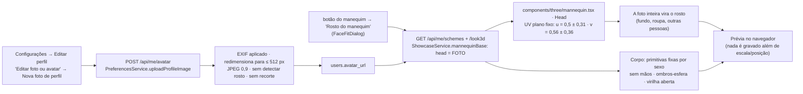
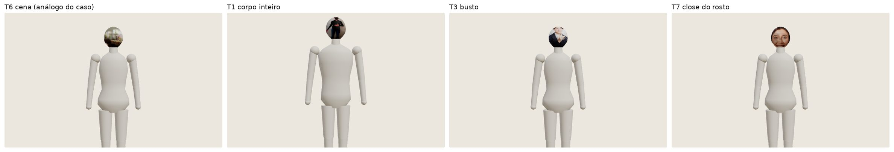
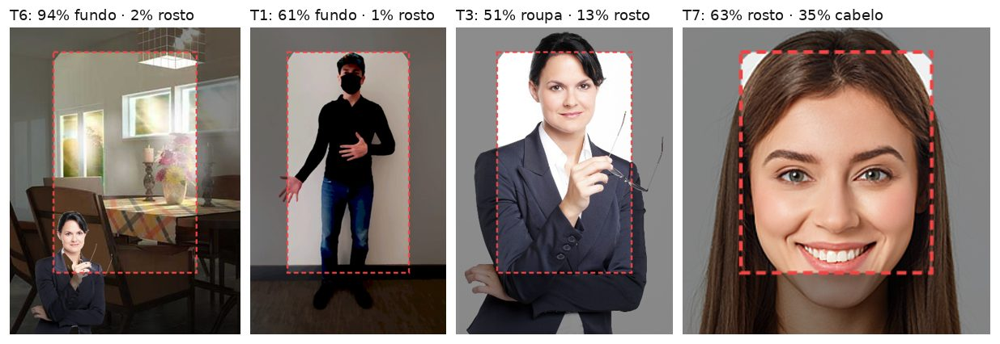
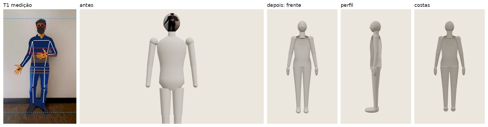
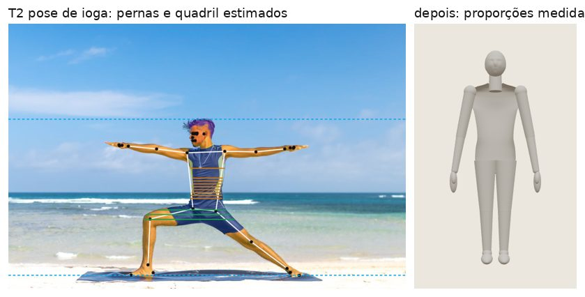
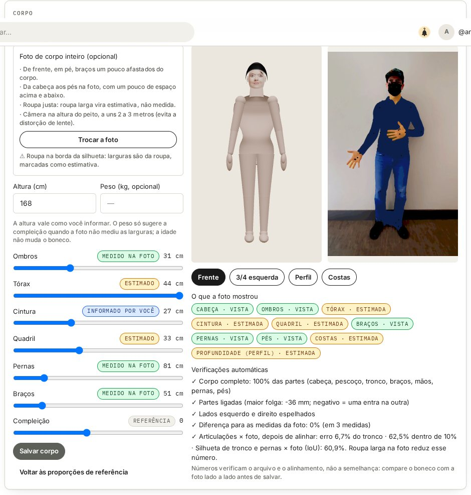

# Investigação do pipeline de avatar 3D — botão de Configurações

Auditoria técnica do "boneco" gerado a partir da foto em **Configurações → Editar perfil**, com as correções já
aplicadas, as métricas que passam a medir o resultado, a pesquisa de referências e o plano. Responde às duas listas de
perguntas enviadas (50 perguntas da auditoria e 31 da investigação); o índice da seção 16 aponta onde está cada resposta.

> **Resposta curta.** O boneco não era "ruim por causa de um modelo de IA": no fluxo das Configurações **não havia
> reconstrução nenhuma**. A foto de perfil inteira (reduzida a 512 px, sem detectar o rosto) era colada de frente numa
> cabeça genérica, e o corpo era sempre o mesmo manequim de primitivas, com mãos ausentes e ombros soltos. A semelhança
> se perdia no **mapeamento da textura** (primeira etapa depois do upload), porque as etapas de detecção, segmentação e
> reconstrução simplesmente não existiam nesse fluxo. A correção aplicada troca essa projeção pelo rosto do Avatar 3D
> (pontos do rosto + textura só do rosto, com filtro de qualidade e consentimento) e dá ao corpo proporções com origem
> declarada (medida na foto, informada pela pessoa ou estimada). O avatar novo é **anatomicamente plausível e completo**,
> mas **não é declarado "fiel"**: é um manequim estilizado, estático (sem rig), e várias medidas continuam estimativas.

---

## 1. Escopo, método e limites desta investigação

**Método.** (1) Ler o código do fluxo de ponta a ponta; (2) reproduzir o resultado com a **mesma versão que está em
produção** (commit `8d68ef0`, a do domínio público) e fotos de teste; (3) medir cada etapa com o código de produção
(página de laboratório `/lab/body`, só em desenvolvimento, e o script `scripts/avatar3d/eval-body.mjs`); (4) corrigir a
primeira etapa em que a semelhança se perde; (5) medir de novo com as mesmas fotos.

**Conjunto de teste (T1–T7).** Imagens de teste do próprio MediaPipe (repositório `mediapipe-assets`, Apache-2.0), mais
uma composição sintética:

| ID | Foto | O que ela testa |
|---|---|---|
| T1 | `male_full_height_hands.jpg` | corpo inteiro de frente, em pé; boné e máscara; uma mão sobre o abdômen |
| T2 | `pose.jpg` | corpo inteiro em pose de ioga (passada larga, braços abertos), cabeça de perfil, praia |
| T3 | `business-person.png` | só busto, fundo branco, braço cruzado na frente |
| T4 | `portrait.jpg` | retrato oficial (cabeça e ombros), pele escura, domínio público — fora das figuras |
| T5 | `man-woman-okay.jpg` | duas pessoas, meio corpo |
| T6 | cena sintética | pessoa pequena num ambiente, embaixo à esquerda — **análogo da foto do caso** |
| T7 | `face_stylizer_raw_face_demo.png` | close do rosto, baixa resolução |

**O que não foi possível verificar.**
- **A foto real do caso não foi usada** (não foi anexada e não deve circular no chat). A captura enviada mostra a cabeça
  coberta pelo interior de um restaurante, com o rosto pequeno embaixo à esquerda; a composição sintética T6 reproduz
  essa condição. A mesma medição pode ser rodada com a foto real, localmente (seção 13.4).
- **Não existe GLB, job nem log** deste fluxo para comparar: o boneco é montado no navegador a cada exibição (seção 2).
- Este ambiente bloqueia o acesso direto a `metahuman.com`, `dev.epicgames.com`, `reallusion.com`,
  `montreal.ubisoft.com` e ao ANSUR II. As referências dessas fontes foram confirmadas por busca (trecho + link
  oficial) e estão marcadas **[trecho]** na bibliografia; o que não foi confirmado está marcado **[não confirmado]**.
- Nenhuma meta numérica de qualidade foi inventada: os números abaixo são **linha de base** medida em 7 fotos, não
  metas. As únicas regras numéricas fixas são invariantes estruturais (ex.: "nenhuma parte obrigatória ausente").

---

## 2. Diagnóstico ilustrado do caso

### 2.1 O pipeline real (antes da correção)

Não há serviço de IA, fila, job, arquivo 3D nem log neste caminho. O "ajuste" gravado era só `mannequinFace`
(escala e deslocamento da foto). O mesmo `head = FOTO` valia para quem via o manequim na Passarela 3D e na Foto com
meu manequim: o rosto com o fundo aparecia para outras pessoas.

### 2.2 Evidências

**Figura 1 — o boneco da versão em produção, reproduzido com as fotos de teste** (mesmo diálogo, mesmo código).

**Figura 2 — o que o código antigo aplicava na cabeça**: o recorte fixo da foto (moldura vermelha), com a composição
medida por segmentação multiclasse (MediaPipe Selfie Multiclass).

| Foto | Rosto | Cabelo | Pele do corpo | Roupa | Fundo |
|---|---|---|---|---|---|
| T1 corpo inteiro | 1% | 0% | 3% | 32% | **61%** |
| T2 ioga na praia | 1% | 0% | 4% | 7% | **88%** |
| T3 busto | 13% | 3% | 10% | **51%** | 23% |
| T4 retrato | 13% | 1% | 5% | **56%** | 25% |
| T5 duas pessoas | 12% | 4% | 24% | 36% | 25% |
| **T6 análogo do caso** | **2%** | 1% | 1% | 2% | **94%** |
| T7 close do rosto | **63%** | 35% | 0% | 0% | 2% |

Só o close do rosto (T7) punha majoritariamente rosto na cabeça. Em uma foto como a do caso (T6), 94% da "pele do
rosto" era o ambiente.

**Inspeção da geometria antiga** (o manequim descrito no mesmo formato do novo, `lib/avatar3d/eval/legacy-spec.ts`):

| Verificação | Manequim antigo | Evidência |
|---|---|---|
| Partes obrigatórias | 13 de 15 (87%) — **faltam as duas mãos** | só uma esfera de 3 cm no punho |
| Maior folga numa junção | **+20,1 mm** (feminino +14,9 mm) no ombro | braço preso por uma esfera encostada no tronco |
| Virilha | borda aberta do torno sobre as coxas | anel visível na Figura 1 |
| Proporções | 2 presets fixos (feminino/masculino) × 5 compleições | nada vem da foto |
| Esqueleto / pesos | nenhum (malhas estáticas) | não há `Bone` nem `SkinnedMesh` |
| Exportação | nenhuma (montado a cada render) | não existe arquivo 3D |

### 2.3 Respostas do diagnóstico (auditoria 1–7; investigação 8, 9, 11)

1. **Arquivo e versão.** `components/edit-profile.tsx` (`FaceFitDialog`) + `components/three/mannequin.tsx` (`Head`,
   `faceGeometry`), idênticos no `main` em produção (`8d68ef0`, merge do PR #22; `mannequin.tsx` sem mudança desde
   `f5271c8`). No servidor, `ShowcaseService.mannequinBase` marcava `head = FOTO` e `PreferencesService.uploadProfileImage`
   gravava a foto a 512 px.
2. **A foto serve para a tarefa?** Pelo que a captura mostra, não para o rosto: o rosto ocupa uma fração pequena de
   uma cena e a foto foi reduzida a 512 px — cerca de 100 px de rosto. Serve como foto de perfil, não como fonte de
   avatar. Isso é recusado agora pelo filtro de qualidade (`FACE_SMALL`, `NO_FACE`) em vez de virar textura.
3. **Primeira etapa em que a semelhança se perde:** o **mapeamento de textura**. Upload e orientação estão corretos
   (EXIF aplicado desde `dc5c97e`); detecção de pessoa, segmentação, pose e reconstrução **não existiam** no fluxo.
4. **Malha completa?** Não: faltam as mãos; pés são caixas; ombros e pernas não se ligam ao tronco.
5. **Membros duplicados/soltos/impossíveis?** Nenhum duplicado; mãos ausentes; ombros "soltos" (folga de 15–20 mm);
   sem articulações, logo sem poses impossíveis — e sem pose nenhuma.
6. **Geometria, textura, luz ou câmera?** Textura (principal, no rosto) + geometria genérica (corpo e cabeça). Luz e
   câmera da prévia estavam adequadas.
7. **Evidência de cada conclusão:** Figuras 1 e 2, tabela de composição, métricas de `legacy-spec.ts`, código citado.
8. **(Investigação 8) Onde se perde, comparando foto, intermediários e GLB?** Não há intermediários nem GLB: o único
   intermediário é o JPEG de 512 px; a perda acontece ao projetar essa imagem inteira na cabeça.
9. **(Investigação 9) O rosto preservava traços?** Não: era só a foto aplicada como textura sobre uma cabeça genérica
   (nariz, sobrancelhas e queixo esculpidos iguais para todos).
10. **(Investigação 11) O corpo refletia proporções observáveis?** Não: herdava inteiramente um corpo padrão.

---

## 3. Tabela de defeitos

| # | Defeito | Causa provável (verificada) | Evidência | Impacto | Correção | Estado |
|---|---|---|---|---|---|---|
| D1 | Fundo, roupa e outras pessoas no rosto | UV plano fixo da foto inteira, sem detecção de rosto | Fig. 2; T6 94% fundo | avatar irreconhecível, exposto na Passarela | rosto só do Avatar 3D (pontos + atlas do rosto); sem avatar, cabeça neutra; `head` nunca mais `FOTO` | **corrigido** |
| D2 | Textura de baixa resolução | foto de perfil reduzida a 512 px | `uploadProfileImage` | rosto borrado | o Avatar 3D usa a foto original no aparelho (até 1600 px) e exige rosto ≥ tamanho mínimo | **corrigido** (no fluxo novo) |
| D3 | Sem mãos | manequim de primitivas | completude 87% | provador sem luvas/relógio/bolsas plausíveis | mãos com polegar, proporcionais (0,108 H) | **corrigido** |
| D4 | Ombros soltos | esfera encostada num tronco de torno | folga +20 mm | "bonecos articulados" visíveis | tronco em cortes elípticos que incluem o deltoide; braço nasce dentro | **corrigido** (folga −38 mm) |
| D5 | Borda aberta na virilha / pernas separadas | torno aberto + coxas começando na virilha | Fig. 1 | aspecto de fralda; calças mal apoiadas | tronco fechado; coxas nascem dentro da pelve | **corrigido** |
| D6 | Proporções não vêm da pessoa | só sexo e compleição | tabela 2.2 | roupa cai igual para todos | proporções com origem (foto/informado/estimado) e ajuste | **corrigido (parcial)**: sem profundidade, sem costas |
| D7 | Nenhuma medida de qualidade, nenhum registro | fluxo sem job | — | erro irreprodutível | métricas automáticas na tela e no laboratório; relatório do job proposto (seção 7.4) | **parcial** |
| D8 | Sem esqueleto/pesos | malhas estáticas | — | sem pose, sem animação, sem Unity | rig humanóide sobre as articulações da especificação | **pendente** (fase 3) |
| D9 | Sem arquivo exportável | montado em tempo real | — | nada para validar no glTF-Validator/Unity | exportar GLB (glTF 2.0) | **pendente** (fase 3) |
| D10 | Roupa projetada em plano | molde inflado + foto de frente | — | costas repetem a frente | GLB da peça (RF16) quando existe; simulação fica fora do escopo atual | **conhecido** |
| D11 | Corpo exige rosto | o corpo foi guardado junto do Avatar 3D | T1 (máscara) não cria avatar | quem não quer rosto 3D não tem corpo | permitir corpo sem rosto (entidade própria) | **pendente** (fase 2) |
| D12 | Cache de CSS do servidor local | cache do Next em desenvolvimento | só local | nenhum em produção | — | ambiente |

---

## 4. O que é possível inferir de uma foto

### 4.1 Observado × estimado × impossível

| Característica | Foto de rosto de frente | + 3/4 do rosto | Corpo inteiro de frente, em pé | + perfil | Nunca pela foto |
|---|---|---|---|---|---|
| Forma do rosto (contorno, olhos, nariz, boca, mandíbula) em 2D | **observado** (478 pontos) | observado | — | — | — |
| Profundidade do rosto (nariz, queixo de perfil) | estimado (modelo canônico) | **observado** | — | — | — |
| Tom de pele | **observado** (bochechas/testa, sem clarear) | observado | observado | — | — |
| Cabelo (cor, volume, franja) | observado de frente | observado dos lados | — | — | nuca e costas: estimado |
| Largura entre os ombros | — | — | **observado** (se de frente) | — | — |
| Larguras de tórax, cintura, quadril | — | — | **observado** só com pele/roupa justa na borda; com roupa larga, **limite superior** | — | — |
| Comprimento de pernas e braços (relativo) | — | — | **observado** (em pé, pés e cabeça na foto) | — | — |
| Profundidade do tronco (barriga, glúteos, busto) | — | — | estimado | **observado** | — |
| Costas | — | — | estimado | estimado | — |
| Altura em cm | — | — | **não** (a foto não tem escala) | não | informada pela pessoa |
| Peso | — | — | **não** | não | informado (opcional) |
| Idade | — | — | **não** | não | não usada na geometria |

### 4.2 Respostas (auditoria 8–15)

8. **Traços faciais reproduzíveis:** contorno, posição relativa de olhos, sobrancelhas, nariz, boca e mandíbula (malha
   de 468 pontos, Kartynnik et al., 2019), tom de pele e cor/volume do cabelo, desde que o rosto tenha tamanho e
   nitidez mínimos. A profundidade só é observada com uma segunda vista (3/4).
9. **Expressão:** o avatar parte de rosto **neutro** (a pose é "desgirada" e piscadas são recusadas); a expressão da
   foto não é preservada. Expressões editáveis exigem blendshapes/rig facial (fase 4).
10. **Proporções observáveis:** ombros, comprimento de pernas e braços, e larguras onde a borda é pele ou roupa justa.
    Ficam ocultas por roupa larga (larguras), pose (braço encostado no tronco, passada), perspectiva (câmera perto) e
    corte (pés ou cabeça fora da foto).
11. **Perspectiva não vira deformação:** medidas só são "observadas" com a pessoa de frente, em pé, com pés e cabeça na
    foto; pessoa ocupando quase toda a altura (câmera perto) ou cabeça grande demais em relação ao corpo passa a
    "estimado" com aviso (`TIGHT_FRAMING`, `PERSPECTIVE`). Nenhuma medida da foto vira estatura em cm.
12. **Peso, idade, medidas numéricas:** não é justificável inferir peso nem idade de uma foto para este fim: o erro não
    é controlável e a inferência expõe dados sensíveis. A altura (cm) e o peso (opcional) vêm da pessoa e aparecem como
    "informado por você"; o peso só sugere a compleição quando nenhuma largura foi medida e fica "estimado". A idade não
    altera o boneco.
13. **Uma foto basta?** Para um manequim de provador com proporções relativas, uma foto de corpo inteiro de frente
    fornece as larguras e comprimentos (6 das 10 regiões "vistas" em T1); para profundidade (barriga, glúteos, busto de
    perfil) e rosto em 3D, não. Melhoria esperada ao pedir perfil e 3/4 do rosto (hipótese a medir): profundidade do
    tronco e do rosto passam de "estimado" a "observado", e a silhueta de perfil (IoU lateral) passa a ser mensurável.
14. **Só busto, precisa de corpo inteiro:** o corpo abaixo da cintura fica nas proporções de referência, marcado como
    "referência"; nada é "completado" como se fosse medido (T3: `FEET_HIDDEN`, nenhuma medida gravada).
15. **Mostrar o que foi observado/estimado:** selo por medida ("medido na foto", "informado por você", "estimado",
    "referência") e mapa de regiões (vista/estimada/não visível) na tela do corpo (Figura 5).

### 4.3 Distinguir corpo de roupa (auditoria 18; investigação 12)

A segmentação multiclasse separa **pele do corpo** de **roupa** por pixel. Em cada linha de medida, a classe da borda
da silhueta decide a origem: pele → "observado"; roupa → "estimado" com 95% da largura e o motivo "roupa na borda:
limite superior". Em T1 (jeans e camisa), cintura e quadril saíram estimados; o tórax saiu **oculto** porque o braço
estava encostado nessa altura (`ARMS_ON_TORSO`). A roupa da foto nunca vira forma do corpo sem aviso.

**Figura 3 — T1: medição e o boneco antes/depois.** Linhas de medida: verde = pele na borda (observado), âmbar = roupa
na borda (estimado), vermelho = braço junto do tronco (oculto); tracejado azul = topo da cabeça e chão.

**Figura 4 — T2: pose não neutra.** Ombros e braços observados; pernas e quadril viram estimativa (passada larga).

---

## 5. Rosto, corpo e anatomia (auditoria 16–22; investigação 10, 13–17)

**16/10. Comparar o rosto sem uma nota única.** Em vista equivalente (pose alinhada pela semelhança de Horn, já feita
no RF40), medir separadamente: (a) resíduo do alinhamento dos 468 pontos (cm canônicos; aviso > 0,9 cm); (b) razões
geométricas — distância entre os olhos / largura do rosto, altura do nariz / altura do rosto, largura da boca /
distância entre os olhos, ângulo da mandíbula; (c) tom de pele em ΔE (CIELAB) entre a foto e a textura; (d) contorno
do cabelo (IoU da máscara de cabelo na vista frontal). Nada disso prova identidade; por isso a revisão humana lado a
lado continua obrigatória (seção 6.3). **Não** usar reconhecimento facial (embeddings de identidade) como métrica: é
dado biométrico de identificação e cria incentivo a otimizar para o classificador, não para a pessoa.

**17. Silhueta e proporções.** Implementado em `lib/avatar3d/metrics.ts`: erro relativo por proporção (só nas
observadas), erro das articulações depois de alinhar escala e posição (normalizado pelo tronco da foto; PCK 10%/20%) e
IoU da silhueta de tronco e pernas (braços excluídos, porque raramente estão na mesma pose).

**18.** Seção 4.3.

**19/17. Proporções ao mudar de pose e vestir peças.** Hoje o corpo não muda de pose (sem rig); as peças são moldes
inflados sobre o mesmo corpo, então as proporções não se alteram. Com rig (fase 3), o teste obrigatório é repetir as
métricas em poses de amplitude (seção 9).

**20/16. Articulações e deformação.** Não se aplica ao estado atual (malha estática, articulações arredondadas por
esferas internas). É o principal critério da fase 3.

**21/15. Interseções.** Corpo: as partes se sobrepõem por construção (conexões negativas = uma dentro da outra) e não
há faces soltas. Roupa: o molde é inflado 0,6–1,8% da estatura; a interseção roupa × corpo deve ser medida por
profundidade de penetração quando houver rig (fase 3).

**22. Nível de realismo viável:** **estilizado (manequim de vitrine) com rosto semirrealista** do RF40. Critérios
verificáveis: corpo contínuo (sem costuras visíveis), mãos e pés presentes, proporções segundo a especificação,
sombreamento suave (normais por parte), rosto com textura apenas do rosto, pele do corpo = pele medida no rosto.
Realismo de corpo (dobras, músculos, pele) exige modelo estatístico de corpo (SMPL-X/MakeHuman) e não é prometido.

**13 (investigação). Regiões estimadas sem evidência:** costas, profundidade do tronco, nuca/cabelo de trás, partes
cobertas por roupa larga, e tudo abaixo do corte em fotos de busto.

**14 (investigação). Cabelo:** no RF40, volume e implantação medidos de frente (topo, laterais, franja); lateral e
traseira são estimativas coerentes com a frente. Não há cabelo por fios.

---

## 6. Especificação de qualidade

### 6.1 Métricas automáticas (implementadas)

| Métrica | O que verifica | Onde | Tipo |
|---|---|---|---|
| Completude | 15 partes obrigatórias presentes | `metrics.completeness` | invariante (100%) |
| Conexões | maior folga numa junção ≤ 5 mm | `metrics.connectivity` | invariante |
| Simetria | articulações esquerda/direita espelhadas | `metrics.symmetry` | invariante |
| Proporções × foto | erro relativo médio nas medidas observadas | `metrics.proportionError` | linha de base |
| Pontos 2D | erro médio / tronco após alinhar; PCK@10%, @20% | `metrics.keypointError` | linha de base |
| Silhueta | IoU tronco + pernas | `metrics.rasterSpec` + `iou` | linha de base (depende da roupa) |
| Rosto na textura | fração da imagem aplicada no rosto que é rosto/cabelo | `metrics.legacyHeadSample` | diagnóstico |
| Qualidade da foto do rosto | tamanho, nitidez, luz, pose, oclusão, olhos, mais de um rosto | `lib/avatar3d/quality.ts` (RF40) | bloqueia/avisa |

### 6.2 Linha de base medida (mesmas fotos)

| Foto | Modelo | Completude | Maior folga | Erro de proporção (n) | Erro de pontos | PCK@10% | IoU |
|---|---|---|---|---|---|---|---|
| T1 | antigo | 87% | +20,1 mm | 10,3% (3) | 9,2% | 0,50 | 0,581 |
| T1 | referência nova | 100% | −38 mm | 10,3% (3) | 10,3% | 0,38 | 0,586 |
| T1 | **medido** | 100% | −38 mm | 0% (3)* | **6,7%** | **0,62** | **0,618** |
| T2 | antigo | 87% | +20,1 mm | 13,7% (2) | 52,2% | 0,25 | 0,370 |
| T2 | **medido** | 100% | −38 mm | 0% (2)* | 52,3% | 0,25 | 0,381 |

\* Zero por construção: o modelo medido adota as medidas observadas. Esse erro passa a informar quando a pessoa ajusta
à mão ou quando uma medida é limitada pela faixa plausível. Em T2 o erro de pontos continua alto porque a pessoa está
em pose de ioga e o manequim não tem rig — é a evidência de que a comparação de pontos exige alinhar a **pose**
(fase 3), não só escala e posição.

Tempo (Chromium sem GPU, SwiftShader): detecção de pose + segmentação + queixo ≈ 0,45–0,56 s por foto depois de
carregar os modelos (primeira foto ≈ 2,8 s). Modelos baixados só quando a pessoa envia a foto de corpo: pose 9,4 MB,
segmentação 16,4 MB (além do rosto 3,8 MB e do WASM ≈ 9,5 MB já usados no RF40).

### 6.3 Revisão humana (auditoria 25–26; investigação 27)

- **Lado a lado** em vistas equivalentes (frente com a foto de frente; perfil com a foto de perfil), com a sobreposição
  dos pontos: disponível na tela do corpo (Figura 5).
- **Comparação pareada cega** entre versões (A/B) para cada foto: "qual se parece mais com a pessoa da foto?", 3 ou
  mais avaliadores, concordância medida (alfa de Krippendorff); desempate não é resolvido por métrica automática.
- **Autorreconhecimento**: a própria pessoa avalia "me reconheço" / "reconheço com ressalvas" / "não me reconheço" antes
  de salvar; a resposta entra no registro do job (sem a foto).
- **O que exige olho humano:** semblante, naturalidade do cabelo, tom de pele percebido sob a luz da cena, costuras da
  textura, se a roupa "cai" de modo crível.

### 6.4 Rubrica (auditoria 30)

Cada dimensão é avaliada separadamente, com a evidência exigida; nenhuma meta numérica além dos invariantes até existir
um conjunto de teste maior (seção 11).

| Dimensão | 0 — rejeitar | 1 — revisão | 2 — aprovado | Evidência |
|---|---|---|---|---|
| Anatomia | parte ausente, solta ou duplicada | proporção fora da faixa plausível | completo, conectado, simétrico, proporções na faixa | completude, conexões, simetria |
| Semelhança observável | fundo/roupa no rosto; pele trocada | aviso de foto (pequena, luz, 1 vista) | pontos coerentes, pele e cabelo medidos | resíduo, ΔE de pele, revisão lado a lado |
| Honestidade da origem | medida estimada apresentada como medida | origem ausente em alguma proporção | toda proporção com origem e motivo | selos, mapa de regiões |
| Qualidade visual | faixas/facetas, textura borrada | costura visível no pescoço/rosto | contínuo, sombreamento suave | capturas frente/perfil/costas |
| Rig (fase 3) | Unity não mapeia o Humanoid | deformação ruim em ≥ 1 articulação | ROM sem colapsos | seção 9 |
| Roupa | peça atravessa o corpo | peça flutua ou costas incoerentes | camiseta/calça/vestido sem interseção | seção 9.4 |
| Desempenho | trava o dispositivo de referência | acima do orçamento definido após linha de base | dentro do orçamento | tempo, tamanho, draw calls |

---

## 7. Padrões de produção 3D e integração

### 7.1 Estado atual (auditoria 31–37; investigação 22, 25)

- **31.** Não há arquivo exportado. Em tempo de execução o corpo é **uma malha** (um material, cor de pele) + busto do
  RF40 (malha do rosto com textura, crânio, cabelo) — sem juntas nem pesos.
- **32.** Não pode ser configurado como Humanoid no Unity porque não há ossos. O Humanoid exige no mínimo 15 ossos
  (quadril, coluna, cabeça, braços, antebraços, mãos, coxas, pernas, pés…) numa hierarquia coerente (documentação da
  Unity). As articulações da especificação (`buildSpec().joints`) já estão nos lugares certos para gerar esse
  esqueleto.
- **33.** Para GLB/glTF 2.0 (especificação Khronos): metros; +Y para cima; a frente do modelo para +Z; `skin.joints` e
  `inverseBindMatrices` na mesma ordem; `JOINTS_0`/`WEIGHTS_0` com até 4 influências e pesos somando 1; texturas sRGB;
  validar com o glTF-Validator (0 erros). O corpo novo já segue metros, +Y e frente em +Z.
- **34.** Densidade atual: tronco com 46 cortes × 41 vértices; membros 20 segmentos. Para multidões (Passarela) cabe
  um LOD com metade dos segmentos, sem mudar as proporções.
- **35.** Variantes celular/desktop: LOD de geometria e textura do rosto 512/1024/2048 px, mesma especificação de corpo
  (a aparência essencial vem das proporções e da textura do rosto, preservadas nas duas).
- **36.** Animação revela: colapso de cotovelo/joelho, "embrulho de bala" no punho, ombro afundando ao levantar o braço,
  pescoço torcendo a textura do rosto, roupa atravessando no agachamento (seção 9.3).
- **37.** Visualizador: o boneco é desenhado da mesma especificação que as métricas medem; para GLB externo, carregar
  com o `GLTFLoader` do three.js e conferir altura da caixa = estatura, pés em y = 0, frente em +Z.

### 7.2 Formato e rig recomendados (investigação 22)

GLB (glTF 2.0) com um esqueleto humanoide compatível com o Unity (nomes e hierarquia padrão: Hips → Spine → Chest →
Neck → Head; Shoulder → UpperArm → LowerArm → Hand; UpperLeg → LowerLeg → Foot → Toes), ≤ 4 influências por vértice,
pose de ligação em "A" (a mesma do manequim), blendshapes faciais opcionais. O three.js exporta `SkinnedMesh` para GLB
(`GLTFExporter`); no Unity, `glTFast` importa em tempo de execução.

### 7.3 O que roda em cada upload e o que é só de produção (investigação 23)

| Em cada upload (automático) | Só na produção (uma vez) |
|---|---|
| detecção do rosto e do corpo, filtro de qualidade, medidas com origem, textura do rosto, métricas, relatório do job | malha base e rig (Blender/MakeHuman/MPFB ou licença SMPL-X), pesos, LODs, testes de ROM, calibração das proporções de referência com ANSUR II |

### 7.4 Registro por job sem expor fotos (auditoria 46)

Gravar: versão do código e dos modelos (hash dos arquivos `.task/.tflite`), dimensões da foto e EXIF de orientação (não
a foto), SHA-256 da foto (para reproduzir com a própria pessoa, se ela reenviar), códigos de aviso, medidas com
origem, métricas, tempo por etapa, dispositivo (classe), resposta de autorreconhecimento e consentimento. **Nunca**
gravar a foto, a textura do corpo ou os pontos do rosto no log; a textura do rosto fica só na chave privada do avatar.

---

## 8. Bibliografia comentada

Classificação: **P** = pesquisa (artigo), **F** = ferramenta disponível, **E** = demonstração/prática de estúdio,
**I** = pode ser integrado ao FashionAI. **[trecho]** = confirmado por busca, sem abrir a página inteira (bloqueio de
rede); **[não confirmado]** = não verificado nesta sessão.

### 8.1 Pesquisa original

| Referência | Autores / org., ano | Link | O que efetivamente demonstra | Limitações | Classe |
|---|---|---|---|---|---|
| A Morphable Model for the Synthesis of 3D Faces | Blanz & Vetter, SIGGRAPH 1999 (revisão: Egger et al., "3D Morphable Face Models — Past, Present, and Future", ACM TOG 2020) | [revisão na ACM](https://dl.acm.org/doi/fullHtml/10.1145/3395208) | modelo estatístico de forma e textura do rosto ajustável a uma foto | depende da base de rostos escaneados; foto única não fixa profundidade | P |
| SMPL: A Skinned Multi-Person Linear Model | Loper, Mahmood, Romero, Pons-Moll, Black; ACM TOG (SIGGRAPH Asia) 2015 | [ACM](https://dl.acm.org/doi/10.1145/2816795.2818013) · [licença](https://smpl.is.tue.mpg.de/modellicense.html) | corpo paramétrico com forma e pose, pesos de skinning aprendidos de escaneamentos | licença de pesquisa; uso comercial via Meshcapade; modelo patenteado | P · I (com licença) |
| End-to-end Recovery of Human Shape and Pose (HMR) | Kanazawa, Black, Jacobs, Malik; CVPR 2018 | [CVF](https://openaccess.thecvf.com/content_cvpr_2018/papers/Kanazawa_End-to-End_Recovery_of_CVPR_2018_paper.pdf) | regressão de forma e pose SMPL a partir de uma imagem | treino com pontos 2D: forma do corpo sob roupa é pouco confiável | P |
| Expressive Body Capture (SMPL-X / SMPLify-X) | Pavlakos et al.; CVPR 2019 | [CVF](https://openaccess.thecvf.com/content_CVPR_2019/html/Pavlakos_Expressive_Body_Capture_3D_Hands_Face_and_Body_From_a_CVPR_2019_paper.html) | corpo + mãos + rosto num modelo; ajuste por otimização a pontos 2D | lento; ambiguidade de profundidade com uma foto | P · I (licença) |
| PIFu / PIFuHD | Saito et al.; ICCV 2019 / CVPR 2020 | [PIFuHD](https://shunsukesaito.github.io/PIFuHD/) | superfície vestida de alta resolução a partir de uma imagem | **costas inferidas** (lisas, sem detalhe), ambiguidade de profundidade; sem rig | P |
| ICON / ECON | Xiu et al.; CVPR 2022 / CVPR 2023 | [ICON](https://openaccess.thecvf.com/content/CVPR2022/html/Xiu_ICON_Implicit_Clothed_Humans_Obtained_From_Normals_CVPR_2022_paper.html) · [ECON](https://econ.is.tue.mpg.de/) | humano vestido guiado por SMPL-X + normais | costas continuam inferidas; licença de pesquisa | P |
| FLAME | Li, Bolkart, Black, Li, Romero; ACM TOG 2017 | [DECA (usa FLAME)](https://github.com/yfeng95/DECA) | modelo de cabeça com forma, expressão e mandíbula aprendido de 4D | licença de pesquisa | P |
| DECA | Feng, Feng, Black, Bolkart; ACM TOG (SIGGRAPH) 2021 | [arXiv 2012.04012](https://arxiv.org/abs/2012.04012) | rosto animável com detalhes a partir de uma foto, sem supervisão 3D | textura e forma aproximadas; licença de pesquisa | P |
| Real-time Facial Surface Geometry from Monocular Video on Mobile GPUs | Kartynnik, Ablavatski, Grishchenko, Grundmann; 2019 | [arXiv 1907.06724](https://arxiv.org/abs/1907.06724) | malha de 468 pontos do rosto em tempo real (base do Face Landmarker) | profundidade relativa, não métrica | P · **usado no RF40** |
| BlazePose | Bazarevsky et al.; 2020 | [arXiv 2006.10204](https://arxiv.org/pdf/2006.10204) | 33 pontos do corpo em tempo real no celular (base do Pose Landmarker) | pontos são articulações aproximadas, não medidas antropométricas | P · **usado agora** |
| Body Segment Parameters: A Survey of Measurement Techniques | Drillis, Contini, Bluestein; Artificial Limbs 8, 1964 | [PDF O&P Library](http://www.oandplibrary.org/al/pdf/1964_01_044.pdf) | proporções dos segmentos corporais | população de 1964; as frações usadas vêm da reprodução em Winter (livro) — **[não confirmado]** o número exato de cada fração nesta sessão | P · referência das proporções |
| 2012 Anthropometric Survey of U.S. Army Personnel (ANSUR II) | Gordon et al.; 2014/2015 | [DTIC](https://apps.dtic.mil/sti/citations/ADA611869) · [OPEN Design Lab](https://www.openlab.psu.edu/datasets/ansur-ii/) | 93 medidas de 1 986 mulheres e 4 082 homens | população militar dos EUA; **não baixado** aqui (rede) | P · calibrar referência |
| Gender Shades | Buolamwini & Gebru; FAT* 2018 | [PMLR](https://proceedings.mlr.press/v81/buolamwini18a.html) | avaliação desagregada revela erros muito maiores em subgrupos | trata de classificação de gênero; o método de desagregação é o que se aplica | P |
| Monk Skin Tone Scale | Monk / Google; 2023 | [Google Research](http://blog.research.google/2023/05/consensus-and-subjectivity-of-skin-tone_15.html) · [NeurIPS](https://proceedings.neurips.cc/paper_files/paper/2023/file/60d25b3210c92f5ba2002a8e1f1adf1c-Paper-Datasets_and_Benchmarks.pdf) | escala de 10 tons para anotar e estratificar avaliações | anotação subjetiva (o próprio artigo mede o consenso) | P · estratificação |

### 8.2 Documentação oficial e ferramentas

| Referência | Organização, ano | Link | O que demonstra / serve para | Classe |
|---|---|---|---|---|
| glTF 2.0 Specification | Khronos Group | [registry](https://registry.khronos.org/glTF/specs/2.0/glTF-2.0.html) · [tutorial de skins](https://github.khronos.org/glTF-Tutorials/gltfTutorial/gltfTutorial_020_Skins.html) | skins, juntas, inverse bind matrices, até 4 influências por conjunto `JOINTS_n`/`WEIGHTS_n` | F · I |
| glTF-Validator | Khronos Group | [GitHub](https://github.com/KhronosGroup/glTF-Validator) | relatório JSON de erros e estatísticas do arquivo; roda no navegador e via npm | F · I (CI) |
| Humanoid Avatar / Configuring the Avatar | Unity | [manual](https://docs.unity3d.com/Manual/ConfiguringtheAvatar.html) · [Humanoid](https://docs.unity3d.com/6000.4/Documentation/Manual/AvatarCreationandSetup.html) | mínimo de 15 ossos, mapeamento para o esqueleto humanoide, retarget | F · critério |
| Unity glTFast | Unity | [docs](https://docs.unity3d.com/Packages/com.unity.cloud.gltfast@6.17/manual/index.html) | importar/exportar glTF em tempo de execução | F · I |
| glTF 2.0 add-on | Blender | [manual](https://docs.blender.org/manual/en/2.90/addons/import_export/scene_gltf2.html) | exportar armature/skin; por padrão 4 influências por vértice | F · produção |
| Pose Landmarker (Web) | Google AI Edge / MediaPipe | [guia](https://ai.google.dev/edge/mediapipe/solutions/vision/pose_landmarker/web_js) | 33 pontos normalizados + pontos de mundo em metros (origem entre os quadris) + máscara | F · **integrado** |
| Selfie Multiclass Segmentation (model card) | Google / MediaPipe | [model card](https://storage.googleapis.com/mediapipe-assets/Model%20Card%20Multiclass%20Segmentation.pdf) | fundo, cabelo, corpo, rosto, roupa, outros; selfies e corpo inteiro | F · **integrado** |
| MetaHuman (Creator, Mesh to MetaHuman, Animator) | Epic Games, 2025 (UE 5.6) | [licença](https://www.metahuman.com/license) · [From Mesh](https://dev.epicgames.com/documentation/metahuman/from-mesh) · [CG Channel](https://www.cgchannel.com/2025/06/you-can-now-sell-metahumans-or-use-them-in-unity-or-godot/) | de uma malha (ou captura) de cabeça a um MetaHuman com rig facial; desde 2025 pode ser usado em outros motores; gratuito abaixo de US$ 1 mi de receita **[trecho]** | F · E |
| Character Creator + Headshot 3 | Reallusion, 2026 | [Headshot](https://www.reallusion.com/character-creator/headshot/) · [preços](https://www.reallusion.com/plan-and-pricing/individual/perpetual/headshot-3-plugin-3098) · [CG Channel](https://www.cgchannel.com/2026/04/reallusion-releases-headshot-3-0/) | cabeça 3D a partir de foto do rosto (ou malha), sobre corpo do Character Creator; licença perpétua US$ 199 (plugin) + CC US$ 299; Windows **[trecho]** | F |
| Mixamo | Adobe | [FAQ](https://helpx.adobe.com/creative-cloud/faq/mixamo-faq.html) | auto-rig de bípedes (FBX) e animações; uso comercial sem royalties; ferramenta sem atualização recente **[trecho]** | F · produção |
| Meshcapade (SMPL, SMPL-X; "Me" API) | Meshcapade | [SMPL](https://meshcapade.com/smpl/) · [FAQ](https://meshcapade.com/faq) | avatares a partir de fotos (frente, lado, costas), medidas, vídeo; licença comercial do SMPL; preço não publicado **[trecho]** | F · I (API) |
| Ready Player Me | Wolf3D → Netflix | [Variety](https://variety.com/2025/digital/news/netflix-acquires-ready-player-me-games-avatar-creation-1236612915/) · [Wikipedia](https://en.wikipedia.org/wiki/Ready_Player_Me) | serviço encerrado em 31/01/2026 após aquisição; GLBs exportados continuam válidos, API não **[trecho]** | lição de risco |

### 8.3 Estúdios (práticas, não ferramentas disponíveis)

| Referência | Estúdio, ano | Link | O que demonstra | Classe |
|---|---|---|---|---|
| Faceshifter / Facebuilder | Ubisoft La Forge (Montréal) | [Ubisoft Montréal](https://montreal.ubisoft.com/en/using-ml-and-complex-math-to-deconstruct-and-reconstruct-human-faces/) · [publicações](https://www.ubisoft.com/en-us/studio/laforge/publications) | modelo aprendido de ~1 000 escaneamentos de cabeça em alta resolução, reduzido a pontos de controle editáveis por artistas **[trecho]** | E |
| LaFAN1 / Robust Motion In-betweening | Ubisoft La Forge, SIGGRAPH 2020 | [GitHub](https://github.com/ubisoft/ubisoft-laforge-animation-dataset) | base de captura de movimento pública para testar animação | E · teste de rig |
| Rigging de Final Fantasy XVI (CEDEC 2023) | Square Enix | [Siliconera](https://www.siliconera.com/cedec-2023-final-fantasy-xvi-presentation-detailed-rigging-process/) · [biblioteca técnica](https://www.jp.square-enix.com/tech/publications.html) | camadas de textura de rugas misturadas conforme a expressão; rig facial por camadas **[trecho]** | E |
| Lip-sync por ML (CEDEC 2022) | Square Enix | [biblioteca técnica](https://www.jp.square-enix.com/tech/publications.html) | animação labial gerada por aprendizado a partir de dados de Final Fantasy VII Remake **[trecho]** | E |

**Investigação 7 — o que dos estúdios serve de critério sem o equipamento deles:** (1) partir de uma **base
estatística** e deixar ao artista/à pessoa só **pontos de controle** (Faceshifter → Facebuilder); (2) rig e expressões
avaliados em **amplitude de movimento**, não em pose parada; (3) detalhe que muda com a expressão (rugas) como camada
separada da identidade; (4) testar com **dados de movimento públicos** (LaFAN1) antes de publicar; (5) aprovação visual
por especialistas em vistas padronizadas. Nenhuma dessas demonstrações prova que **uma foto** reconstrói um corpo
inteiro: todas partem de escaneamentos, captura multicâmera ou trabalho de artista.

---

## 9. Tabela comparativa (investigação: tabela de empresas e ferramentas)

| Ferramenta | Capacidade comprovada | Entrada | Saída | Intervenção manual | Licença/custo | Aplicável ao FashionAI |
|---|---|---|---|---|---|---|
| Pipeline FashionAI (novo) | rosto de 468 pontos + textura só do rosto; proporções do corpo com origem; métricas | 1–3 fotos do rosto; 1 foto de corpo opcional; altura/peso informados | manequim estilizado no navegador | ajustes finos e de proporção | sem custo por avatar | **em uso** |
| MediaPipe (Face/Pose/Segmenter) | pontos e máscaras em tempo real, no aparelho | imagem | pontos, máscaras | nenhuma | Apache-2.0 | **integrado** |
| MetaHuman | cabeça/rosto realista com rig facial completo | malha de cabeça, captura (vídeo/profundidade) ou editor | personagem completo do Unreal (corpo de biblioteca, não medido) | alta (Unreal) | grátis < US$ 1 mi/ano [trecho] | produção offline; não por upload |
| Character Creator + Headshot 3 | cabeça a partir de foto do rosto sobre corpo paramétrico | foto do rosto ou malha | personagem com rig (FBX) | média (desktop Windows) | US$ 199 + 299 [trecho] | produção offline; não por upload na web |
| Meshcapade Me | corpo SMPL(-X) a partir de fotos, medidas, vídeo | frente, lado, costas, roupa justa | avatar rigged (OBJ/FBX) | baixa | comercial, preço sob consulta [trecho] | candidato da Arquitetura C |
| SMPL-X / ICON / ECON (código de pesquisa) | forma + pose; humano vestido | 1 imagem | malha (sem rig no caso ICON/ECON) | média | pesquisa (comercial via licença) | protótipo, não produção |
| Mixamo | auto-rig humanoide | malha FBX limpa | FBX rigged + animações | baixa | grátis, sem redistribuir arquivos crus [trecho] | produção da malha base |
| Ready Player Me | avatares estilizados interoperáveis | selfie | GLB | baixa | **encerrado em 01/2026** [trecho] | não (risco de dependência) |

---

## 10. Três arquiteturas (custos e complexidade são hipóteses até serem medidos)

| | A — Evoluir o pipeline atual (no aparelho) | B — Cabeça do RF40 + corpo estatístico com rig (servidor) | C — Provedor externo de avatar |
|---|---|---|---|
| Rosto | RF40 (468 pontos + atlas) | RF40, ou FLAME/DECA com licença | do provedor |
| Corpo | especificação paramétrica própria (implementada) + rig nas articulações da especificação | malha base com rig (MakeHuman/MPFB, CC0 — **[não confirmado]** nesta sessão) ou SMPL-X licenciado, ajustada às medidas | SMPL-X do provedor |
| Entrada | fotos no aparelho; nada sai sem consentimento | medidas + textura do rosto (fotos não precisam sair) | fotos enviadas ao provedor (biometria fora do FashionAI) |
| Saída | cena three.js; GLB exportado (fase 3) | GLB rigged, Unity Humanoid | GLB/FBX do provedor |
| Custo por avatar (hipótese) | ~0 (processamento no aparelho) | CPU de servidor por job (segundos) + licença se SMPL-X | taxa por avatar (não publicada) |
| Complexidade (hipótese) | baixa–média | alta (rig, pesos, LOD, validação) | média (integração, contratos, LGPD) |
| Risco principal | realismo limitado (estilizado) | licença e esforço de rigging | dependência (caso Ready Player Me), fotos fora do aparelho |
| Semelhança do corpo | proporções observadas; sem profundidade | forma estatística plausível; profundidade ainda estimada com 1 foto | igual a B, depende de 3 fotos |

**Investigação 18 — corrigir, combinar ou trocar?** Corrigir (A) primeiro: resolveu o defeito que motivou o caso sem
custo e sem enviar fotos. Combinar cabeça + corpo estatístico (B) é o passo para rig e provador sério. Testar um
provedor (C) só com o protótipo comparativo abaixo e contrato de saída de dados (GLB próprio).

## 11. Protótipo comparativo recomendado

1. **Conjunto:** T1–T7 (regressão) + **30 ou mais pessoas voluntárias com consentimento**, estratificadas por tom de
   pele (Monk 1–10), faixa de idade aparente, compleição, roupa (justa × larga), pose, penteado, luz e câmera
   (celular básico × topo). Cada pessoa: rosto de frente, 3/4, corpo de frente, corpo de perfil, altura real e, se
   quiser, medidas de fita (cintura, quadril) como verdade de campo.
2. **Rodar A, B e C** nas mesmas fotos com o `scripts/avatar3d/eval-body.mjs` estendido (B e C como adaptadores).
3. **Medir:** as métricas da seção 6.1 + erro de medidas contra a fita (cm) + tempo, falhas, custo, tamanho do arquivo;
   **revisão humana** pareada cega (6.3) e autorreconhecimento.
4. **Relatar por estrato** (não só a média); uma mudança só é aceita se melhorar a média **e** nenhum estrato piorar
   além da variação medida entre execuções (auditoria 49).

---

## 12. Novo fluxo em Configurações (auditoria 38–44; investigação 19–21)

**Implementado.**
- **Foto de perfil:** o "+" no círculo envia a foto (Figura 6). A foto de perfil **não** vira mais o rosto 3D.
- **Avatar 3D:** a caixa isométrica abre "Meu Avatar 3D": dicas de foto, 1 foto de frente obrigatória e até 2 de 3/4
  para o rosto, filtro de qualidade que recusa e explica (rosto pequeno, mais de um rosto, desfoque, luz, óculos
  escuros, mão no rosto), prévia girável, ajustes finos, **consentimento** antes de salvar.
- **Corpo** (Figura 5): foto de corpo inteiro opcional com as quatro dicas (de frente, em pé; cabeça aos pés; roupa
  justa; câmera na altura do peito a 2–3 m), altura (cm) e peso opcional **informados**, uma régua por proporção com o
  selo da origem, mapa "o que a foto mostrou", comparação lado a lado com a foto e as verificações automáticas.
  "Voltar às proporções de referência" desfaz o corpo; o rosto pode ser refeito ou excluído.

*Figura 5 — tela Corpo com API simulada: o rosto (B, busto de teste) e o corpo (T1) são de pessoas diferentes do
conjunto de teste, só para mostrar a tela. Selos: verde medido, azul informado, âmbar estimado, cinza referência.*

*Figura 6 — Editar perfil: "+" no círculo para a foto e a caixa isométrica para o avatar 3D.*

**Mínimo por nível prometido (39):** manequim de referência — nada; rosto 3D — 1 foto de rosto de frente; proporções
de largura e comprimento — + 1 foto de corpo inteiro de frente; profundidade do corpo — + perfil (fase 2); medidas em
cm — altura informada.

**Se o resultado for ruim (43):** refazer com outras fotos; ajustar à mão; voltar à referência; excluir. Pendente:
histórico de versões para escolher uma anterior.

**Controle da pessoa (44):** a análise roda no aparelho; só o modelo (números) e a textura do rosto (privada, entregue
só pela API, dono ou público por escolha) são guardados; a foto de corpo **nunca** sai do aparelho — só as proporções;
excluir o avatar ou a conta apaga modelo e textura.

**Automatizável com confiança hoje (investigação 20):** detecção de rosto/corpo, recusa de fotos inadequadas, pontos do
rosto, tom de pele, proporções de frente com pele/roupa justa. **Manual:** altura, compleição com roupa larga, ajustes
finos, aprovação final ("me reconheço").

---

## 13. Testes de exportação, rig, animação e visualização

### 13.1 Já automatizados

| Teste | Onde | Resultado |
|---|---|---|
| Corpo completo, conectado, simétrico (F e M, e extremos da faixa) | `lib/avatar3d/body.test.ts` | ok |
| Manequim antigo reprovado (sem mãos, folga) | idem | ok |
| Medidas: foto frontal ok; roupa → estimado; sem pés → nada medido; braço no tronco → oculto; de lado → estimado | idem | ok |
| Métricas: pontos do próprio modelo → erro 0 e PCK 100%; IoU igual → 1 | idem | ok |
| Mesma foto: modelo medido melhor que o antigo (pontos e IoU) | idem | ok |
| Projeção antiga com rosto pequeno → > 90% fundo | idem | ok |
| Servidor: corpo validado, sem texto livre, faixas, origem conhecida, remoção | `Avatar3dServiceTest` | ok (7 testes) |
| Ponta a ponta: rosto → salvar → corpo (busto e corpo inteiro) → PATCH com origens | Playwright (API simulada) | ok |

Total do frontend: 56 testes; servidor: 118 testes.

### 13.2 A implementar com o GLB (fase 3)

1. **Arquivo:** glTF-Validator com 0 erros; unidades em metros; caixa com altura = estatura (± 1%); pés em y = 0; frente
   em +Z; pesos somando 1; ≤ 4 influências; nenhuma junta sem vértices; texturas sRGB e potência de 2.
2. **Rig no Unity:** importar com glTFast/FBX → Humanoid → "Configure" sem ossos obrigatórios faltando; T-pose
   reconhecida; retarget de uma animação de caminhada.
3. **Blender:** importar/exportar ida e volta sem perder juntas/pesos.
4. **Visualizador:** carregar o GLB no three.js e comparar a silhueta frontal com a da especificação (IoU ≥ 0,99 —
   invariante de exportação, não de semelhança).

### 13.3 Animação e roupa

- **Amplitude de movimento:** braços acima da cabeça, abdução 90°, flexão de cotovelo 140°, agachamento, torção de
  tronco 45°, virar a cabeça 60°, caminhada (LaFAN1): medir perda de volume no cotovelo/joelho, afundamento do ombro,
  torção do punho, penetração de malha.
- **Vestir (investigação 28):** camiseta, calça e vestido do guarda-roupa em pé, sentado e caminhando: nenhuma
  interseção roupa × corpo acima de 2 mm; barra da calça no tornozelo; vestido cobre o quadril sem atravessar as
  coxas no passo.

### 13.4 Reproduzir com a foto real do caso

Com o projeto rodando em desenvolvimento: `/lab/body` (ou o script) mede a foto localmente e gera as mesmas imagens e o
JSON — a foto não precisa ser enviada a ninguém.

---

## 14. Critérios de aceitação (investigação: rosto, corpo, rig, roupa, desempenho; 30)

| Componente | Aprovar | Pedir revisão / aviso | Rejeitar e pedir nova foto |
|---|---|---|---|
| Rosto | 1 rosto, tamanho/nitidez/luz ok, resíduo ≤ 0,9 cm, sem oclusão | 1 foto só (profundidade estimada), rosto pequeno mas utilizável, óculos de grau | nenhum rosto, mais de um, olhos fechados, mão/óculos escuros no rosto, desfoque, luz extrema |
| Corpo | pessoa inteira, de frente, em pé: medidas "observadas" | roupa larga, braço no tronco, perspectiva: medidas "estimadas" | sem pessoa, duas pessoas, sem pés e cabeça → fica a referência |
| Rig (fase 3) | Humanoid mapeado, ROM sem colapsos | uma articulação com deformação visível | ossos obrigatórios ausentes, pesos inválidos |
| Roupa | 3 peças-teste sem interseção | peça flutuando | peça atravessando o corpo |
| Desempenho | dentro do orçamento definido após a linha de base em aparelhos de referência | acima do orçamento no celular | trava a página |

**Nunca aprovar como "fiel"** só por ter corpo completo: a aprovação exige plausibilidade anatômica, preservação do que a
foto mostra, declaração do que foi estimado e possibilidade de correção pela pessoa.

---

## 15. Plano priorizado

| Fase | Entregas | Critério objetivo de aprovação | Estado |
|---|---|---|---|
| 1 — Falhas graves | tirar a foto de perfil da cabeça; rosto só pelo RF40; corpo completo e conectado; métricas | 0% de fundo aplicado no rosto; completude 100%; folga ≤ 5 mm; testes | **concluída** |
| 2 — Anatomia confiável | foto de perfil do corpo (profundidade); corpo sem rosto; calibrar referência com ANSUR II por sexo; LOD | profundidade "observada" com perfil; erro de medida vs. fita medido por estrato | a fazer |
| 3 — Rig e exportação | esqueleto humanoide nas articulações da especificação; pesos; GLB; Unity Humanoid; ROM | glTF-Validator 0 erros; Humanoid ok; ROM sem colapsos; testes de roupa | a fazer |
| 4 — Semelhança | protótipo A/B/C; rosto com profundidade de 3/4 obrigatória para "alta semelhança"; expressões | vence em comparação pareada cega; nenhum estrato pior | a fazer |
| 5 — Edição e versões | histórico, desfazer, escolher versão; ajustes de rosto por pontos de controle | tarefas de edição concluídas por usuários em teste | a fazer |
| 6 — Desempenho | orçamento por dispositivo; texturas KTX2; LOD na Passarela | dentro do orçamento em aparelhos de referência | a fazer |

**Auditoria 47 — o que corrigir primeiro e como provar:** o mapeamento da textura do rosto (defeito D1). Prova com a
mesma foto: antes, a cabeça recebe 94% de fundo (T6) e 61% de fundo + 32% de roupa (T1); depois, a cabeça não recebe
nenhum pixel da foto de perfil, e o rosto só entra pelo Avatar 3D — que recusa T6 e T1 (`NO_FACE`) em vez de montar um
rosto errado. No corpo: completude 87% → 100%, folga +20 mm → −38 mm, erro de pontos 9,2% → 6,7%, IoU 0,58 → 0,62 (T1).

**Auditoria 48–49:** conjunto e regra da seção 11.

---

## 16. Índice das respostas

| Pergunta | Onde |
|---|---|
| Auditoria 1–7 | 2.3 |
| Auditoria 8–15 | 4.2 |
| Auditoria 16–22 | 5 |
| Auditoria 23–30 | 6 |
| Auditoria 31–37 | 7.1 |
| Auditoria 38–44 | 12 |
| Auditoria 45 | 2.1 (atual) e 7.3/12 (novo) |
| Auditoria 46 | 7.4 |
| Auditoria 47–50 | 15 e 11 |
| Investigação 1–6 | 8 e 9 (colunas entrada, saída, intervenção, licença) |
| Investigação 7 | 8.3 |
| Investigação 8–9 | 2.3 |
| Investigação 10 | 5 |
| Investigação 11–13 | 2.3, 4.3, 5 |
| Investigação 14–17 | 5 |
| Investigação 18 | 10 |
| Investigação 19–21 | 12, 4.2 |
| Investigação 22–23 | 7.2, 7.3 |
| Investigação 24 | 6.2 (A medido); B e C são hipóteses (10) |
| Investigação 25–29 | 6, 13, 11 |
| Investigação 30 | 14 |
| Investigação 31 | 15 (auditoria 47) |

### 16.1 Observado, inferido, ajustado e impossível — no caso

- **Observado** (com as fotos de teste): composição do que ia para a cabeça; ausência de mãos; folgas; medidas de T1 e
  T2; recusas do filtro do rosto; tempos.
- **Inferido**: a composição da foto real do caso (a partir da captura, pela analogia com T6).
- **Ajustado pela pessoa** (no fluxo novo): altura, peso, qualquer proporção, ajustes finos do rosto.
- **Impossível de verificar com as imagens fornecidas**: a semelhança do rosto da pessoa do caso (sem a foto), costas,
  profundidade do corpo, peso e idade.

### 16.2 Sobre "teoria dos jogos"

Não justifica fidelidade anatômica. Só é útil para ler **incentivos do produto**: a pessoa tende a preferir um avatar
lisonjeiro; marcas preferem prova precisa (menos devoluções); a plataforma ganha com engajamento. As escolhas feitas
alinham esses incentivos com transparência: o padrão é o medido, qualquer mudança aparece como "informado por você", e
nenhuma métrica do corpo é exibida a terceiros ou transformada em ranking.

---

## 17. Arquivos desta entrega

| Arquivo | Papel |
|---|---|
| `lib/avatar3d/body-spec.ts` | corpo paramétrico, origens, faixas, geometria (articulações, cortes do tronco, mãos, pés) |
| `lib/avatar3d/body.ts` | o que a foto de corpo inteiro mede, com regras de observado/estimado/oculto |
| `lib/avatar3d/body-detect.ts` | Pose Landmarker + Selfie Multiclass no navegador |
| `lib/avatar3d/metrics.ts` | métricas automáticas |
| `lib/avatar3d/eval/legacy-spec.ts` | linha de base: o manequim antigo no mesmo formato |
| `lib/avatar3d/body.test.ts` | 17 testes |
| `components/three/mannequin.tsx` | manequim desenhado da especificação; cabeça neutra sem avatar |
| `components/avatar3d/body-editor.tsx` | seção Corpo da tela Meu Avatar 3D |
| `components/avatar3d/body-lab.tsx`, `app/lab/body/page.tsx` | laboratório (só desenvolvimento) |
| `scripts/avatar3d/eval-body.mjs` | avaliação em lote com as mesmas fotos |
| `fai-application/.../Avatar3dService.java` | validação e gravação do corpo (PATCH `/api/me/avatar3d`) |
| `fai-application/.../ShowcaseService.java` | manequim sem foto de perfil na cabeça |
| `public/mediapipe/pose_landmarker_full.task`, `selfie_multiclass_256x256.tflite` | modelos Apache-2.0, servidos pelo próprio site |

Imagens de teste: MediaPipe (`mediapipe-assets`), Apache License 2.0; T6 é uma composição feita a partir de
`living_room.jpg` e `business-person.png` do mesmo conjunto.
