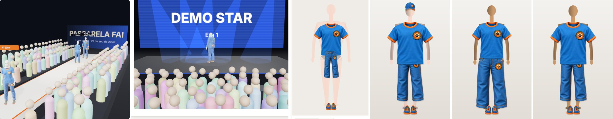

# Nunca sem roupa: certificação de que nenhuma imagem de pessoa sai despida (27/09/2026)

**Regra.** Nenhuma tela ou imagem do FashionAI mostra uma pessoa, um avatar ou um manequim sem roupa. Isso vale em
qualquer aba, inclusive no Try-On, na Passarela e no Meu Quarto, e também durante o carregamento. Quando o look não cobre
o tronco, as pernas ou os pés, a parte que falta recebe uma peça padrão dos assets do FashionAI: a camiseta de
referência, o jeans ou o tênis casual de `public/assets_pecas`. As peças do look nunca são trocadas.

**Resultado.**
- A auditoria de ponta a ponta percorreu 12 cenas. Em cada uma, conferiu todos os quadros desde a navegação: **0 quadros
  com pessoa sem roupa**.
- O compositor 2D do backend foi testado com a chamada real: um pedido só com boné sai com camiseta, jeans e tênis.
- Os testes unitários de frontend (113) e backend (175) passam.



*Da esquerda para a direita:*
1. Passarela com três looks: vazio, só camisa e só óculos.
2. My Stage com um look só de jaqueta.
3. Prévia 2D do Try-On sem peça nenhuma.
4. Compositor do backend com um pedido só de boné.
5. Compositor do backend sem peças, manequim feminino.
6. Compositor do backend sem peças, manequim masculino.

---

## 1. Onde o app desenha uma pessoa (inventário completo)

Levantamento feito no código: todo `Canvas` 3D, todo SVG de corpo e todo gerador de imagem do backend.

| Superfície | Telas | Caminho no código | Como fica sempre vestida |
|---|---|---|---|
| Corpo humano 3D | Meu Avatar 3D (busto e corpo inteiro), Try-On 3D, Passarela, My Stage, Foto com meu manequim, Gerar 3D, editor de corpo | `Mannequin` → `HumanAvatar` (única entrada) | Garantia por construção (§2.1) |
| Manequim de reserva 3D | As mesmas, enquanto o corpo carrega ou se o arquivo do corpo falhar | `CapsuleMannequin` | Recebe as peças já completadas e as desenha desde o 1º quadro na cor do tecido (§2.2) |
| Arquivo GLB | Botão "Baixar avatar 3D" | `exportAvatarGlb` | Recusa exportar sem as três zonas cobertas (§2.3) |
| Prévia 2D do Try-On | Try-On, modo "Prévia 2D" | `app/(app)/try-on/page.tsx` | Zonas vazias desenhadas com as peças padrão (§2.4) |
| Imagem do provador no servidor | `POST /api/try-on/renders` | `TryOnCompositor` + `DefaultOutfit` | Zonas vazias recebem a peça padrão antes de compor; ela nunca vai ao FASHN (§2.5) |
| Meu Quarto | Quarto 3D, espelho, Vista-me | `room-scene.tsx`, `room-props.tsx` | **Não desenha pessoa.** O espelho mostra fotos das peças; o "manequim de costura" do Copilot é um busto de alfaiate sem rosto, forrado de tecido (`DressForm`) |
| Público da rua de lojas e da Passarela | Coleções de marca, Passarela | `store-street-scene.tsx`, `runway-scene.tsx` | Figuras abstratas (cápsula colorida + esfera), sem anatomia nem pele no corpo |
| Laboratórios | `/lab/human`, `/lab/avatar`, `/lab/body` | Usam o mesmo `HumanAvatar` / `AvatarViewer` | Mesma garantia. As rotas `/lab/*` dão 404 em produção |

## 2. Garantias

### 2.1 Corpo humano 3D (`components/three/human-avatar.tsx`, `human-outfit.tsx`)

1. **Não existe corpo sem peças.** `pieces` é obrigatório no `HumanAvatar`, e o próprio componente veste o corpo. Nenhuma
   tela consegue montar o corpo sem roupa.
2. **As peças que faltam são completadas.** `withDefaultOutfit` (`lib/avatar3d/human/default-outfit.ts`) acrescenta a
   camiseta, o jeans ou o tênis padrão em cada zona sem peça. Jaqueta e casaco são abertos, então não contam como tronco
   coberto. O casaco longo não substitui a calça. Acessório não conta como roupa.
3. **O corpo nasce invisível.** A roupa é montada no mesmo commit do React em que o corpo entra na cena
   (`useLayoutEffect`), já na cor do tecido. A foto da peça entra quando termina de carregar, e a malha é refeita no
   mesmo commit. O corpo só fica visível com tronco, pernas e pés cobertos (`root.userData.dressed`).
4. **Se um molde falhar, a zona recebe a peça padrão.** Se ainda assim faltar alguma zona, o corpo continua escondido e
   o erro vai para o console.
5. **Guarda a cada quadro.** No `useFrame`, `root.visible = root.userData.dressed === true`. Se alguém retirar as
   peças, o corpo some.
6. **Categoria desconhecida.** `kindOf` passou a entender as categorias gravadas no app (`upper_piece`, `lower_piece`,
   `shoes_piece`, `full_body_piece`) e os lugares do look (`outer_layer`, `dress`…). Uma peça com subcategoria nova
   ainda veste a zona certa em vez de sumir.

### 2.2 Manequim de reserva (`components/three/mannequin.tsx`)

- Recebe as mesmas peças completadas pelo look padrão.
- O molde de cada peça é desenhado desde o primeiro quadro, na cor do tecido medida na foto (ou na cor cadastrada).
- A auditoria encontrou um defeito antigo nesse caminho: a projeção da foto no molde saía preta. Foi removida, e a
  reserva usa sempre a cor do tecido.

### 2.3 Exportação GLB (`lib/avatar3d/human/export-glb.ts`)

`exportAvatarGlb` lança `AVATAR_NOT_DRESSED` se o corpo não estiver vestido e visível. A tela Meu Avatar 3D mostra
"O avatar ainda está vestindo as peças" e não baixa o arquivo.

### 2.4 Prévia 2D do Try-On

Cada zona vazia é desenhada com a imagem da peça padrão, na ordem de camadas: parte de cima, depois jaqueta, depois
calça, calçado e acessório. Uma nota sob o palco explica isso, em pt-BR, en e es.

### 2.5 Compositor do servidor (`fai-application/.../imaging/DefaultOutfit.java`)

- Antes de compor, o `TryOnCompositor` completa as zonas sem peça legível com a peça padrão. Uma peça cuja imagem não
  pôde ser lida conta como vazia.
- As peças padrão são sobrepostas localmente, com o motor `padrao-fashionai`, e **nunca são enviadas ao FASHN**
  (nenhum custo extra).
- Se o arquivo do asset não existir no servidor, a peça é desenhada: uma silhueta lisa na cor do tecido.
- Cada zona completada gera um aviso na resposta, por exemplo: "TOP: sem peça neste lugar, o manequim veste a peça
  padrão do FashionAI."

---

## 3. Testes

### 3.1 Unitários

| Arquivo | O que prova |
|---|---|
| `lib/avatar3d/human/default-outfit.test.ts` | Qualquer look, até vazio ou só de acessórios, sai com tronco, pernas e pés; as peças do look não são trocadas |
| `lib/avatar3d/human/garments.test.ts` | `kindOf` reconhece categorias gravadas e lugares do look; acessório não vira roupa |
| `fai-application/.../TryOnDefaultOutfitTest.java` | Completa só as zonas descobertas. Usa os assets ou desenha a peça. **Pixel a pixel**: no miolo do tronco e das coxas, menos de 15% da área tem cor de pele, nos dois sexos. A peça padrão nunca chama o provedor externo |

### 3.2 Ponta a ponta: `scripts/avatar3d/nunca-sem-roupa-e2e.mjs`

O script abre cada tela no navegador e, a cada quadro desde a navegação, lê `window.__faiAudit()`. Esse é um registro de
cada corpo humano em cena, com a informação de se está visível, se está vestido e quais peças usa. O script falha se
algum quadro tiver um corpo visível sem as três zonas cobertas.

Rodado em 27/09/2026 com o frontend local e o backend local isolado (IA remota desligada), com uma conta de teste com
Avatar 3D. Resultado completo em `docs/testes/dados/nunca-sem-roupa-2026-09-27.json`.

| Cena | Pessoas em cena | Quadros com pessoa | Quadros sem roupa | Peças vestidas (último quadro) |
|---|---|---|---|---|
| Meu Avatar 3D — busto | 1 | 2 | **0** | camiseta, jeans e tênis padrão |
| Meu Avatar 3D — corpo inteiro | 2 | 22 | **0** | camiseta, jeans e tênis padrão |
| Try-On 3D — nada vestido | 1 | 1 | **0** | camiseta, jeans e tênis padrão |
| Try-On 3D — só acessório (boné) | 1 | 33 | **0** | camiseta, jeans e tênis padrão (o boné é acessório) |
| Try-On 3D — só parte de cima | 1 | 1 | **0** | camisa da pessoa + jeans e tênis padrão |
| Try-On — Prévia 2D, nada vestido | 1 | 8 | **0** | silhueta com as peças padrão |
| Try-On 3D — arquivo do corpo bloqueado (reserva) | 0 corpos humanos | — | **0** | reserva vestida (conferida na captura) |
| Passarela — look vazio, só camisa, só óculos | 3 | 12 | **0** | todos com as três zonas |
| My Stage — só jaqueta | 1 | 11 | **0** | jaqueta + camiseta, jeans e tênis padrão |
| Meu Quarto | 0 | — | **0** | não há pessoa na cena |
| Meu Quarto — espelho | 0 | — | **0** | não há pessoa na cena |
| Foto com meu manequim | 1 | 9 | **0** | camisa da pessoa + jeans e tênis padrão |

Em "Quadros com pessoa", poucos quadros significam que o 3D por software do navegador de teste é lento, não que o corpo
tenha ficado escondido. O que importa é a coluna "Quadros sem roupa".

### 3.3 Chamada real ao compositor do servidor

`POST /api/try-on/renders` só com o boné da conta de teste. Resposta: camadas `TOP`, `BOTTOM` e `SHOES` com o motor
`padrao-fashionai`, mais o boné (`compositor-landmark`), e três avisos de lugar vazio. A imagem gerada é a 4ª da figura
acima.

## 4. Limites (honestos)

- **Fotos do próprio usuário não são geradas pelo app.** O FashionAI não gera nem altera nudez em fotos enviadas pela
  pessoa (por exemplo, Minhas Fotos). A moderação de fotos enviadas é outro requisito.
- **O FASHN recebe o manequim estilizado com roupa íntima neutra, e só com as peças do usuário.** Se o FASHN falhar, a
  composição local assume.
- **O jeans da prévia 2D sai mais curto que a perna.** A imagem é encaixada na caixa da parte de baixo sem esticar, então
  a canela aparece. O tronco, o quadril e os pés continuam cobertos.
- **O compositor 2D do backend não é chamado por nenhuma tela hoje.** A Prévia 2D do Try-On desenha no navegador. Mesmo
  assim, a regra foi aplicada no endpoint e testada, porque ele é público na API.

## 5. Como rodar de novo

```bash
npm test                                                         # unitários do frontend
mvn -pl fai-application -am test -Dtest='TryOnDefaultOutfitTest'  # compositor do servidor
OUT=/tmp/nunca-sem-roupa FAI_E2E_IDENTIFIER=<conta de teste> FAI_E2E_PASSWORD=<senha> PIECE_ID=<peça de cima> \
  node scripts/avatar3d/nunca-sem-roupa-e2e.mjs                    # ponta a ponta (frontend e backend locais)
```

A senha da conta de teste vai em variável de ambiente, nunca no código. O script recusa uma API que não seja local.
