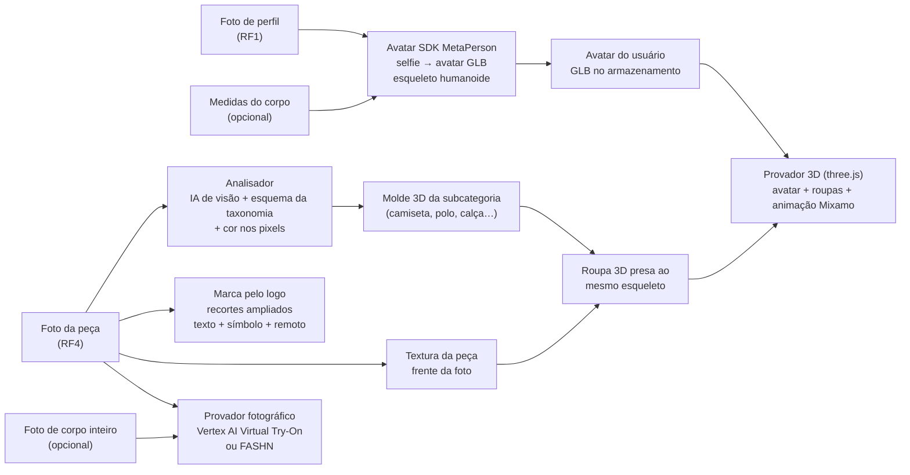

# Proposta profissional: avatar de uma foto, roupa que veste, analisador que sempre preenche e marca pelo logo (27/09/2026)

## 1. Resposta curta

**Pare de evoluir o manequim procedural com a foto da roupa projetada.** Ele chegou ao teto. As capturas enviadas
mostram o problema e os testes de hoje medem: nenhum dos 16 avatares foi julgado parecido com a pessoa, e a roupa é uma
foto sobre uma casca, sem caimento, costas nem movimento. Mais ajuste fino nesse caminho não chega a "veste
perfeitamente".

A troca recomendada tem quatro peças:

| Problema | O que usar | Por quê |
|---|---|---|
| Avatar parecido, feito de uma foto | **Avatar SDK — MetaPerson** (serviço comercial) | Gera avatar de corpo inteiro a partir de **uma selfie de frente**, exporta GLB com esqueleto humanoide compatível com animações Mixamo e integra na web |
| Roupa que veste e se mexe | **Moldes 3D de roupa por subcategoria**, com o mesmo esqueleto do avatar, e a foto da peça como textura; **animações Mixamo** | É assim que jogos e provadores 3D fazem: a roupa é uma malha própria presa aos ossos, então acompanha o corpo e o movimento |
| Foto "vestida de verdade" | **FASHN API**, que já está integrada ao provador 2D (`TryOnService`); alternativa: **Vertex AI Virtual Try-On** (Google, GA como `virtual-try-on-001`) | Gera a imagem fotográfica da pessoa com a peça. Exige foto de corpo inteiro, então fica como opção |
| Analisador que sempre preenche | A IA de visão que o projeto já usa, com **saída estruturada restrita à taxonomia**, cor medida nos pixels e confirmação da pessoa | Com a lista de valores dentro do esquema, a IA não consegue responder um valor fora da lista |
| Marca pelo logo | O **pipeline de recortes** deste repositório (texto + símbolo, local) e um reconhecedor remoto: **IA de visão com os recortes** ou **Google Cloud Vision (detecção de logo)** | O logo pequeno some quando a foto inteira é reduzida; olhar recortes ampliados resolve a maior parte, e o estado "confirmar" cobre o resto |

**Não usar Ready Player Me.** Foi comprado pela Netflix e encerrou a plataforma pública e as APIs em 31/01/2026.

**Relação com o levantamento `servicos-externos-avatar-provador.md`** (outra sessão, já na main). Ele recomenda o
"Plano A": nenhum serviço novo, corpo aberto com esqueleto (Anny, da NAVER LABS, ou SAM 3D Body + MHR, da Meta, ambos
Apache-2.0) no worker que já existe, e o rosto como está hoje. Esta proposta concorda com o corpo e a roupa desse plano.
A diferença está no rosto: a planilha de semelhança de hoje mostra que o rosto atual não chega a "parecido" (0 de 16).
Para esse requisito, o caminho é o "Plano B" daquele documento, com um serviço de rosto. A dúvida que ele deixou
aberta foi respondida: no MetaPerson, a **API REST é só do Enterprise**, mas o **editor embutido na página (JS API)**
exporta o GLB no plano Pro. Não é preciso REST para integrar.

---

## 2. Sobre "pegar dois avatares humanoides .glb na internet e moldar em cima"

A ideia está certa na essência: um corpo masculino e um feminino, com o **mesmo esqueleto**, sobre os quais tudo é
ajustado. É exatamente o que MetaPerson e MakeHuman fazem. O que não funciona é pegar **qualquer** GLB. O corpo base
precisa de quatro coisas, e GLBs soltos da internet costumam falhar em pelo menos uma:

1. **Licença que permita uso no produto.** Muitos modelos gratuitos são CC BY-NC (proíbe uso comercial) ou proíbem alteração.
2. **Esqueleto padrão** (humanoide compatível com Mixamo), com pesos de pele bem feitos. Sem isso, não há animação nem roupa que acompanhe.
3. **Formas de corpo ajustáveis** (blend shapes para altura, peso, peito, cintura, quadril). Sem elas, o corpo não segue as medidas da pessoa.
4. **Roupas feitas para aquele corpo.** A roupa é modelada uma vez sobre o corpo base e herda os pesos dos ossos.

**Alternativa aberta e legítima para esse caminho:** **MPFB 2 (MakeHuman para Blender)**. O código é GPL, os recursos
são CC0 e o que se exporta dele é CC0, com uso comercial livre. Tem esqueleto para motores de jogo, formas de corpo por
medida e roupas de exemplo. Exporta GLB pelo Blender. O que ele **não** faz é o rosto parecido a partir da foto: isso
continuaria sendo nosso (a projeção atual) ou de outro serviço. Por isso ele é a opção de custo zero, não a de qualidade.

---

## 3. Por que o caminho atual não chega lá

| O que se vê nas capturas | Causa no código | Pode ser corrigido com ajuste? |
|---|---|---|
| Roupa com aparência de recorte colado, lateral vazada, bermuda "de papel" | A peça é a **foto** projetada numa casca que imita o corpo (`garment-geometry.ts`); não existe malha de roupa com espessura, costura, costas nem caimento | Não. Precisa de malha de roupa |
| Manequim "sólido e travado" | O corpo é procedural e **não tem esqueleto nem pesos** (`buildSpec`, `mannequin.tsx`); não existe pose além da pose A | Não. Precisa de corpo com esqueleto |
| Rosto de foto colado numa cabeça genérica, cabelo em calota | A cabeça é a do manequim; o rosto é a foto aplicada como textura; o cabelo é uma calota paramétrica | Só parcialmente. O teste de hoje mostra o limite |

O teste de semelhança (seção 6) confirma: o reconhecedor facial reconhece a pessoa **no miolo do rosto**, porque é a
própria foto, mas cabelo, cabeça, orelhas e o que está sobre a cabeça saem errados em 16 de 16 casos.

---

## 4. Arquitetura recomendada

**Provador em duas saídas.** "Ver em 3D" mostra o avatar vestido, que gira e se mexe (aparência de avatar de jogo
realista). "Foto vestida" gera uma imagem fotográfica com a peça no corpo da pessoa, quando ela enviar uma foto de corpo
inteiro. Nenhum produto atual entrega as duas coisas numa só.

---

## 5. Detalhes por problema

### 5.1 Avatar parecido, de uma foto

| Opção | O que entrega | Custo e licença | Risco |
|---|---|---|---|
| **Avatar SDK — MetaPerson** (recomendado) | Uma selfie de frente vira avatar de corpo inteiro realista em cerca de um minuto; GLB/glTF/FBX com esqueleto humanoide e compatível com Mixamo; editor com cabelo, roupas e corpo; SDK web e API | Primeiro avatar grátis; integração no produto no plano Pro; API REST e roupas próprias só no Enterprise. Preço não publicado: pedir cotação | Depender de fornecedor; dado biométrico sai para terceiro (precisa de contrato de tratamento de dados e do consentimento que o app já coleta) |
| **Anny ou SAM 3D Body + MHR, com o rosto atual** (Plano A do outro levantamento) | Corpo aberto com esqueleto, ajustado pela foto e pelas medidas | Grátis (Apache-2.0), roda no worker existente | Rosto continua com a qualidade medida hoje: não resolve "parecido" |
| **MPFB 2 + rosto atual** | Corpo base aberto (CC0) com esqueleto e medidas | Grátis | Mesma limitação de rosto |
| Meshcapade (SMPL) | Corpo de foto ou medidas, com esqueleto | Sob consulta | O outro levantamento achou indício de descontinuação do Meshcapade Me; não recomendar sem confirmar |

Critério para aceitar qualquer opção: nos mesmos 16 retratos da planilha, pelo menos 12 julgados "parecido" por três
pessoas diferentes, e o reconhecedor facial confirmando a pessoa de frente e de 3/4.

### 5.2 Roupa que veste e se mexe

1. **Um molde 3D por subcategoria** (camiseta, polo, camisa, regata, moletom, jaqueta, calça, bermuda, saia, vestido,
   tênis, sandália, boné). Modelado uma vez no CLO 3D ou Marvelous Designer, ou a partir das roupas CC0 do MakeHuman,
   sobre o corpo base.
2. **Pesos dos ossos copiados do corpo** para a roupa. Assim ela acompanha braço, perna e tronco.
3. **Ajuste ao corpo da pessoa** pelas mesmas formas de corpo (blend shapes) do avatar.
4. **A foto da peça vira textura** no mapa UV da frente do molde; costas e laterais com a cor e o padrão do tecido, ou
   com uma segunda foto quando houver.
5. **Animações Mixamo** (respirar, trocar o apoio, virar, andar). Grátis e com uso comercial num produto final; não se
   pode redistribuir os arquivos crus.
6. **Caimento pré-calculado** por tamanho; simulação de tecido em tempo real só para saia e vestido, se for preciso.

Critério: 0% de roupa atravessando o corpo em 10 poses, braços erguidos incluídos; animação parada de pelo menos 3
segundos sem a roupa descolar; teste com as 3 peças e 4 corpos do `eval-garment.mjs`.

### 5.3 Analisador de peça que sempre preenche

| Camada | O que faz |
|---|---|
| Saída estruturada | A resposta da IA segue um esquema JSON em que categoria, subcategoria, cor, material, sexo, tamanho, estilo e ocasião são **listas fechadas** da taxonomia. No Claude, isso é `output_config.format` com esquema JSON; no Gemini, `responseSchema` com `enum` |
| Cor medida | A cor principal sai dos pixels da peça recortada (agrupamento em Lab e a cor mais próxima da paleta). A IA só desempata |
| Nunca vazio | Tempo máximo, uma nova tentativa, outro provedor e, no fim, valores padrão por subcategoria. Cada campo tem confiança; os incertos aparecem para a pessoa conferir |
| Foto em alta | A IA recebe a peça inteira **e** recortes ampliados, não só a imagem reduzida a 768 px |
| Medição | A planilha de hoje vira o conjunto de avaliação: nenhuma troca de modelo ou prompt entra sem melhorar os números dela |

Modelo: manter o Gemini já integrado ou usar o Claude. Para o Claude, o padrão é o `claude-opus-5` (US$ 5 por milhão de
tokens de entrada e US$ 25 de saída); o `claude-haiku-4-5` (US$ 1 e US$ 5) é mais barato, mas só deve ser adotado se
passar no mesmo conjunto de avaliação. Essa escolha de custo é sua.

Critério, em fotos de produto: categoria certa em pelo menos 95%, subcategoria em 90%, cor em 90%, e 100% dos campos
com valor válido da taxonomia.

### 5.4 Marca pelo logo

O pipeline proposto está em `scripts/logo-eval/pipeline.py` e foi medido hoje (seção 6):

1. Olhar a foto inteira e 13 recortes ampliados.
2. **Texto** (OCR local): o nome escrito confirma a marca. O nome precisa começar no início de uma palavra, e nomes que
   também são palavra comum ou de pessoa (JORDAN, CHAMPION, BOSS) só sugerem.
3. **Símbolo** (CLIP local): só sugere, nunca confirma, e precisa vencer com folga.
4. **Reconhecedor remoto**, só para o que sobrar: IA de visão com os recortes, ou Google Cloud Vision (detecção de logo
   com 1.000 imagens grátis por mês e US$ 1,50 por mil depois).
5. **Sempre um estado na tela**: "Marca confirmada", "Possível marca: X — confirmar", "Logo sem marca conhecida —
   informe a marca" ou "Sem logo".

"Não falhar" aqui quer dizer: nenhuma foto termina sem estado, e marca confirmada é marca certa. Nenhum reconhecedor
acerta 100% das marcas; a confirmação da pessoa cobre a diferença.

---

## 6. O que foi medido hoje

### 6.1 Marca, tipo e cor no RF4 — `docs/testes/rf4-logo-marca-2026-09-27.xlsx`

89 fotos reais do Open Images (Flickr, CC BY 2.0), rotuladas à mão: 47 com marca de moda visível e 42 sem.

| Medida | RF4 atual (local, sem IA remota) | Pipeline proposto (local) |
|---|---|---|
| Marca certa nas 47 fotos com marca | 0 | 34 (18 confirmadas pelo texto, 16 sugeridas para confirmar) |
| Marca confirmada errada | — | 0 de 18 |
| Marca sugerida em foto sem marca de moda | — | 6 de 42, todas como "confirmar" |
| Fotos sem nenhum estado | — | 0 |
| Categoria certa | 40 de 89 | — |
| Cor certa | 24 de 89 | — |

Cuidados na leitura:
- O RF4 foi rodado **sem a IA remota** de produção, para não usar as chaves sem autorização. Em produção, tipo e cor
  devem ser bem melhores; a marca continua exposta ao problema da imagem reduzida a 768 px.
- Muitas fotos são de cena (tênis no pé, camisa no corpo), mais difíceis que foto de produto.
- Os limiares do símbolo foram escolhidos nessas mesmas fotos. O número é otimista até ser repetido num conjunto novo.
- O conjunto tem muitos Nike (26 de 47). Polo com símbolo pequeno no peito, o caso da Lacoste, ainda falha localmente.

### 6.2 Semelhança do avatar — `docs/testes/avatar-semelhanca-2026-09-27.xlsx`

16 adultos de frente (Open Images, CC BY 2.0), uma foto por pessoa, pelo pipeline real do app.

| Medida | Resultado |
|---|---|
| Avatares gerados antes do ajuste de hoje | 8 de 16 |
| Avatares gerados depois do ajuste | 15 de 16 |
| Julgados "parecido" | **0 de 16** |
| Reconhecedor facial confirma a pessoa no rosto de frente | 14 de 15 |
| Avatar mais parecido com a própria foto do que com as outras 15 | 15 de 15 |

O rosto é a própria foto, então o reconhecedor confirma a identidade. O resto não acompanha: cabelo em calota, crânio e
orelhas do manequim, turbante, lenço e barba longa ausentes, manchas onde a foto tinha sombra.

---

## 7. Plano

| Fase | Entrega | Aceite |
|---|---|---|
| 0 · Decisão (você) | Escolher MetaPerson ou MPFB 2; abrir contas; pedir cotação; pôr as chaves nas variáveis de ambiente do Railway e da Vercel (nunca no chat) | Contas e chaves configuradas |
| 1 · Avatar | Trocar a reconstrução pelo serviço escolhido, a partir da foto de perfil; guardar o GLB; atualizar o consentimento (dado biométrico enviado a terceiro, LGPD art. 11) | 12 de 16 "parecido" na planilha, por três avaliadores |
| 2 · Roupa 3D | Moldes das 6 subcategorias mais comuns; pesos dos ossos; textura da foto; 3 animações Mixamo | 0% de interseção em 10 poses; animação sem descolar |
| 3 · Analisador | Esquema da taxonomia na IA, cor por pixels, recortes, novas tentativas, confiança por campo | Metas da seção 5.3 no conjunto de avaliação |
| 4 · Marca | Pipeline de recortes no backend (serviço de visão em Python) e reconhecedor remoto | 100% das fotos com estado; marca confirmada ≥ 98% certa num conjunto novo |
| 5 · Foto vestida (opcional) | FASHN, já integrado, com foto de corpo inteiro; Vertex AI como alternativa | Comparação lado a lado aprovada por você |

---

## 8. O que mudou no código hoje

- **Avatar de uma foto só.** A tela Meu Avatar 3D usa a foto de perfil sozinha, sem os campos de 3/4. Se a foto de
  perfil não servir, a pessoa escolhe outra ali mesmo. O sistema não pede mais foto de lado.
- **Controle de qualidade menos agressivo.** "Rosto encoberto" passou a só avisar (barba e sombra eram tratadas como
  obstrução), e luz lateral só recusa em casos extremos. Resultado: de 8 para 15 avatares gerados em 16 fotos.
- **Pipeline de marca e roteiros de teste** em `scripts/logo-eval/` e `scripts/avatar3d/`, com as duas planilhas em
  `docs/testes/`.

## 9. Fontes

- Ready Player Me encerrado em 31/01/2026: <https://avatarsdk.com/blog/2026/01/15/switch-from-ready-player-me-to-avatar-sdk-fast-familiar-production-ready/>, <https://variety.com/2025/digital/news/netflix-acquires-ready-player-me-games-avatar-creation-1236612915/>
- MetaPerson (uma selfie, GLB, esqueleto humanoide, Mixamo): <https://avatarsdk.com/metaperson-creator/>, <https://avatarsdk.com/ready-player-me-alternative/>, planos: <https://avatarsdk.com/pricing-cloud/>, API: <https://docs.metaperson.avatarsdk.com/rest_api/>
- Meshcapade: <https://meshcapade.com/>
- MPFB 2 e licença CC0 das exportações: <https://static.makehumancommunity.org/about/license.html>, <https://github.com/makehumancommunity/mpfb2/blob/master/LICENSE.md>
- Mixamo, uso comercial: <https://helpx.adobe.com/creative-cloud/faq/mixamo-faq.html>
- Vertex AI Virtual Try-On: <https://docs.cloud.google.com/vertex-ai/generative-ai/docs/release-notes>, <https://docs.cloud.google.com/vertex-ai/generative-ai/docs/models/imagen/virtual-try-on-preview-08-04>
- FASHN API e preços: <https://fashn.ai/products/api>, <https://help.fashn.ai/plans-and-pricing/api-pricing>
- Google Cloud Vision, preços: <https://cloud.google.com/vision/pricing>
- Imagens de teste: Open Images V7 (Google), cada foto com autor e licença nas planilhas
