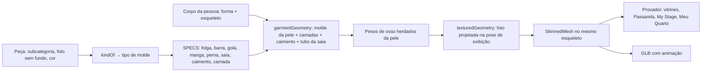
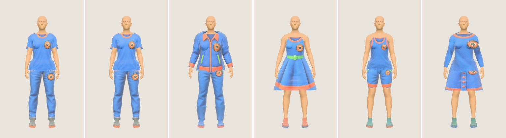
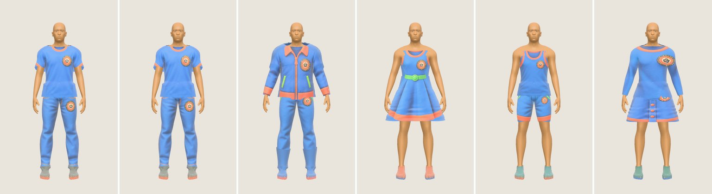
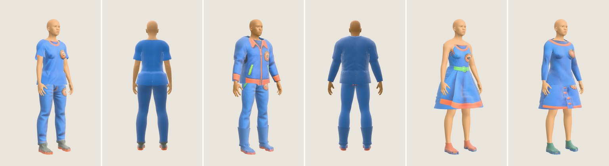
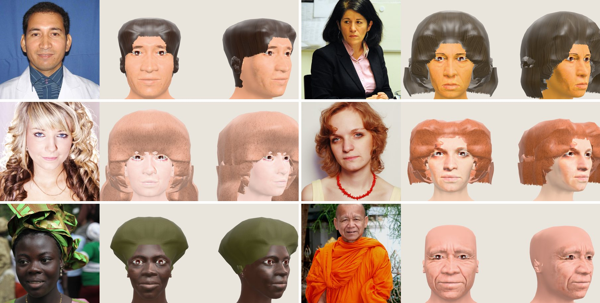

# Provador 3D — plano profissional para vestir o avatar, e o que foi aplicado (27/09/2026)

Este documento responde a um pedido: reestruturar de forma profissional o processo de vestir o corpo do avatar 3D no
provador e aplicar a melhor solução. A solução já está no código, na branch `claude/fashion-ai-interfaces-config-id7naj`.
As medições e imagens estão em `docs/avatar3d/`.

Documentos relacionados: `plano-a-rig-e-rosto.md` (esqueleto, exportação e rosto), `proposta-profissional-2026-09-27.md`
(§5.2 "Roupa que veste e se mexe") e `digital-double.md` (o mesmo avatar no provador 2D e no 3D).

> **Atualização 2026-10-05:** a auditoria [`auditoria-roupas-3d/`](auditoria-roupas-3d/README.md) mede este pipeline
> (gola, mangas, camadas, estampa) e propõe a substituição do molde "pele afastada" por moldes paramétricos com
> regiões, costuras e restrições.

---

## 1. Resposta curta

**Antes**, a peça era uma foto projetada de frente sobre um "molde" inflado em volta de um manequim procedural sem
esqueleto. Não havia costas, a roupa não se mexia e o molde atravessava a pele em 5,7–10,8% dos vértices.

**Agora**, cada peça é uma **malha própria presa ao mesmo esqueleto do corpo**, como fazem jogos e provadores 3D. O
molde nasce da pele do próprio avatar, então já vem com a forma e os pesos de osso do corpo da pessoa. As peças ficam
em camadas, a parte de cima cai do busto, a saia é um tubo por fora das pernas e a foto da peça vira textura na frente.

| | Antes | Agora |
|---|---|---|
| Corpo | Manequim procedural, sem ossos | Corpo MakeHuman (CC0) na forma da pessoa, com 52 ossos no padrão Mixamo |
| Roupa | Foto projetada sobre uma casca, sem vínculo com o corpo | Malha por peça, com os pesos de osso da pele, em camadas |
| Movimento | Nenhum | Pose natural e movimento parado. A roupa acompanha, porque usa os mesmos ossos |
| Roupa dentro do corpo | 5,7–10,8% dos vértices (até 65% nos braços) | **0–0,15% fora da axila**, em 38 peças, 7 looks e 2 corpos, parado e em movimento |
| Costas | Vazias ou com a estampa da frente repetida | Cor do tecido medida na foto (sem estampa inventada) |
| Exportação | Não existia | GLB com corpo, rosto, cabelo, roupa e animação. O validador oficial do glTF acusa 0 erros |
| Custo por peça | — | Nenhum modelo 3D por peça. Montagem em 1–30 ms no navegador |
| Look sem peça (ou incompleto) | Corpo sem roupa ou com roupa íntima neutra | Tronco, pernas e pés sempre vestidos, com peças dos assets do FashionAI (camiseta, jeans e tênis) |

---

## 2. Diagnóstico do processo antigo

Código antigo: `lib/avatar3d/garment-geometry.ts` e `components/three/mannequin.tsx`. Continua no repositório como
reserva, mas as vitrines não o usam mais.

1. **O molde não conhecia o corpo.** Era um sólido "inflado" (elipses e lofts) em volta do manequim. Onde o manequim
   tinha curva, como ombro, axila e cotovelo, a casca entrava na pele.
2. **Sem esqueleto não há roupa que acompanhe.** O manequim era uma malha estática. Qualquer pose ou movimento
   exigiria recalcular tudo, e por isso o avatar ficava parado em pose de vitrine.
3. **A foto era a peça inteira.** A frente recebia a foto projetada e as costas repetiam a mesma imagem espelhada ou
   ficavam vazias. De lado, a estampa esticava (estiramento no percentil 95 entre 12 e 13,7 vezes, em
   `garment-baseline-2026-09-27.json`).
4. **Sem camadas.** Camiseta e jaqueta disputavam a mesma superfície, e a de baixo aparecia por cima em listras.
5. **O GLB da peça (RF16) não é roupa.** É um objeto fechado, sem avesso e sem ossos. No provador, ele era escalado para
   caber numa caixa na frente do corpo, ou seja, uma peça *não vestida*.

---

## 3. Como a indústria veste um corpo 3D (opções avaliadas)

| Opção | Como funciona | Quem usa | Serve aqui? |
|---|---|---|---|
| **A. Molde de costura + simulação de tecido** | Peça desenhada em moldes 2D, costurada e simulada sobre o corpo (CLO 3D, Marvelous Designer, Browzwear) | Indústria de moda, e-commerce de marca | Não para peças do usuário. Exige o molde de cada peça e simulação demorada. Serve para marcas parceiras no futuro |
| **B. Roupa-modelo por categoria, presa ao esqueleto** | Uma malha pronta por tipo (camiseta, calça…), com os pesos do corpo e textura trocável | Jogos, avatares (MetaPerson, antigo Ready Player Me) | Sim, é o princípio escolhido |
| **C. Proxy ajustado ao corpo (MHCLO do MakeHuman)** | A roupa guarda, para cada vértice, um triângulo de referência do corpo e acompanha qualquer forma de corpo | MakeHuman, MPFB 2 | Sim, é a forma de ajustar a roupa a qualquer corpo |
| **D. Provador por imagem** | IA gera a foto da pessoa vestida (FASHN, Vertex AI Virtual Try-On) | E-commerce | Complementa, no provador 2D (`TryOnService`). Não é 3D e não se mexe |
| **E. Reconstrução 3D da peça** | Foto → malha 3D (Meshy, Stable Fast 3D) | RF16 | Não para vestir. O resultado é um objeto fechado, sem avesso e sem ossos |

**Escolha: B + C, com o molde derivado da própria pele.** O caminho B pediria modelar à mão um molde por subcategoria
e o C pediria amarrá-lo ao corpo. Aqui o corpo é gerado pelo próprio sistema, então o molde pode *nascer* da pele do
avatar: mesmos vértices, mesmos pesos, mesma forma de corpo. Isso elimina a etapa de amarração e o risco de a roupa não
servir num corpo fora da média. A opção A fica para quando houver moldes de marcas. A opção D continua no provador 2D.

---

## 4. A solução aplicada

Código: `lib/avatar3d/human/garments.ts` (geometria pura, testável em node) e `components/three/human-outfit.tsx`
(textura e montagem no navegador).

### 4.1 Molde a partir da pele

Para cada tipo de peça, uma tabela (`SPECS`) diz o que ela cobre: barra no tronco, gola, decote, comprimento da manga
e da perna, comprimento da saia, folga, caimento e camada. A cobertura é **contínua** (de 0 a 1 por vértice), com
transição de 1,5–2 cm, e vira o alfa do vértice com `alphaTest`. Assim barra, gola e punho saem em curva lisa, não em
"escada" de triângulos. Os vértices cobertos são afastados da pele pela folga, ao longo da normal.

| Tipo | Folga | Barra / cós | Manga | Perna | Saia | Caimento | Camada |
|---|---|---|---|---|---|---|---|
| Roupa de base (top, short) | 1,5 mm | busto / quadril | — | 7% | — | — | 0 |
| Legging | 2 mm | cós alto | — | 97% | — | — | 1 |
| Calça / short / saia | 7–9 mm | cós | — | 98% / 36% | 42 cm | — | 2 |
| Regata / camiseta / camisa | 5–8 mm | quadril | 0 / 33% / 96% | — | — | 0,35–0,7 | 3 |
| Suéter / moletom | 11–14 mm | quadril | 97% | — | — | 0,75–0,8 | 4 |
| Jaqueta | 18 mm | quadril | 98% | — | — | 0,85 | 5 |
| Casaco | 22 mm | quadril | 99% | — | 50 cm | 0,9 | 6 |
| Vestido | 6 mm | cintura | — | — | 50 cm | 0,2 | 3 |
| Tênis / bota | 6–7 mm | pé / cano | — | — | — | — | 2 |

### 4.2 Pesos de osso herdados

Cada vértice da peça copia os 4 ossos e pesos do vértice da pele de onde nasceu. Os vértices do tubo da saia pesam no
quadril e nas coxas. Como peça e pele usam os mesmos pesos, **a peça só pode encostar no corpo onde duas partes do
próprio corpo se tocam**, como a axila e o vão entre as coxas. Em qualquer outra pose ela acompanha a pele exatamente.
Com os braços erguidos a 60°, 90° e 150°, a interseção medida foi de 0–0,08%.

### 4.3 Caimento

- **Parte de cima:** abaixo do busto, camisa, moletom e jaqueta caem retos do anel do busto em vez de colar na
  cintura. O efeito é total na frente e nas costas. Dos lados é menor, porque o braço encosta.
- **Calça:** abre para a barra, na proporção de `flare`.
- **Saia, vestido e casaco longo:** abaixo da cintura, um **tubo** desce por fora do "casco" do corpo, com um anel por
  altura, sem reentrância entre as pernas e sem voltar para dentro. Os pesos passam do quadril para as coxas.

### 4.4 Camadas

Cada peça ganha uma folga extra (`underLayer`) igual à maior folga das peças já vestidas por baixo, em cada ponto do
corpo. Sobre saia, vestido ou casaco longo, a regra é outra: a peça de cima passa por fora do **tubo** da saia **na
altura em que está**. O tubo abre para baixo, então a blusa fica justa no cós e se afasta só onde a saia se afasta.
Antes, a folga era a da barra da saia na cintura inteira, e a blusa formava uma "aba" de 5 cm na cintura. Um casaco
longo sobre um vestido também desce por fora do tubo do vestido. A parte de cima fica sempre por fora da de baixo na cintura: em mais de 97% dos pontos comuns, a camiseta
fica mais longe da pele que a calça. Ordem: roupa íntima < legging < calça < camiseta < moletom < jaqueta < casaco.

### 4.5 Pose de exibição que respeita a roupa

`armOutFor` decide quanto os braços se afastam do tronco na pose de exibição:

- 10° por padrão;
- 15° com saia rodada, para as mãos ficarem por fora dela;
- até 18° com camadas grossas no tronco, como jaqueta sobre camiseta ou casaco sobre suéter. É o que uma pessoa de
  casaco faz: o braço não entra na lateral do tronco.

Essa regra foi acrescentada hoje, depois que a medição mostrou a jaqueta sobre camiseta atravessando o corpo na axila
em até 0,98% dos vértices (feminino, braços a 10°). Com a regra, esse número caiu para 0%.

### 4.6 Foto da peça

A foto sem fundo é projetada **de frente, na pose em que o avatar é mostrado**. A projeção alinha a gola ao alto da
foto, a barra ao pé da foto e a largura do tronco à largura da peça na foto, linha a linha (`photoInfo.widthAt`). As
costas e as laterais recebem a **cor do tecido** medida nos pixels da foto (`fabricColor`), porque a foto não mostra as
costas e o sistema não inventa estampa. Calçados recebem cabedal e sola nas cores da foto (`shoeColors`).

### 4.7 Sem roupa, nunca: look padrão do FashionAI

Nenhuma imagem 3D mostra uma pessoa sem roupa. Quando o look não tem peça numa das três zonas do corpo, a zona recebe
uma peça dos assets de peças do FashionAI (`public/assets_pecas`), em `lib/avatar3d/human/default-outfit.ts`:

| Zona | Conta como coberta | Peça padrão |
|---|---|---|
| Tronco | camiseta, regata, cropped, manga longa, camisa, suéter, moletom, vestido, macacão | camiseta de referência (`01_camiseta_referencia`) |
| Pernas | calça, bermuda, saia, legging, vestido, macacão | jeans (`01_jeans`) |
| Pés | tênis, sapato, sandália, bota | tênis casual (`01_tenis_casual`) |

- As peças do look têm prioridade. O padrão só completa o que falta: só uma camiseta leva jeans e tênis; só um vestido
  leva tênis.
- Jaqueta e casaco não contam como tronco coberto, porque são abertos na frente. Por baixo deles entra a camiseta.
  O casaco longo também não substitui a calça.
- Acessório (óculos, bolsa, chapéu) não é roupa: um look só de acessórios recebe camiseta, jeans e tênis.
- As imagens são as versões WebP de 640 px dos assets, com transparência: cerca de 116 KB no total, em vez dos ~6 MB
  dos PNG originais.
- A certificação completa (todas as telas, o manequim de reserva, a prévia 2D, o compositor do servidor, o GLB e a
  auditoria quadro a quadro) está em `nunca-sem-roupa.md`.
- Vale para todas as telas 3D, porque todas passam pelo mesmo `Mannequin`: Meu Avatar 3D (inclusive o enquadramento
  do rosto), provador, vitrines, Passarela, My Stage, Meu Quarto e Foto com meu manequim. Vale também para o manequim
  de reserva, que aparece enquanto o corpo carrega, e para o GLB exportado.

---

## 5. Testes

`npm test` roda `lib/avatar3d/human/garments.test.ts`, `default-outfit.test.ts` e `human.test.ts`, 18 testes ao todo. Os
principais:

| Teste | Critério |
|---|---|
| Camiseta, calça, tênis e vestido, nos dois corpos, em pose A e em dois instantes do movimento parado | < 3% dos vértices dentro do corpo no total e < 0,5% fora das zonas escondidas (axila, vão entre os dedos dentro do calçado) |
| Jaqueta sobre camiseta e casaco sobre suéter, nos dois corpos, em movimento | < 5% no total (só axila) e < 0,5% fora dela |
| Braços abertos pela roupa | 10° para o look básico, 15° com vestido e 16–18° com jaqueta ou casaco |
| Camadas | A camiseta passa por fora da calça em > 97% dos pontos comuns |
| Blusa sobre saia | Mais de 99% da blusa abaixo do cós fica por fora do tubo da saia, e no cós ela fica a menos de 3,5 cm do corpo (sem "aba") |
| Pesos | 4 ossos por vértice, com soma 1 |
| Tipo de molde | A subcategoria da taxonomia leva ao molde certo, e acessório não vira roupa |
| Nunca sem roupa (`default-outfit.test.ts`) | Qualquer look, até vazio ou só de acessórios, sai com tronco, pernas e pés cobertos; as peças do look não são trocadas |

### 5.1 Medições (`vestir-metricas-2026-09-27.json`)

38 peças em 7 looks e 2 corpos (feminino e masculino de referência), cada uma medida na pose A e em dois instantes do
movimento parado. Os valores são o **pior dos três**.

| Look | Braços | Peça de fora | Dentro do corpo (total) | Fora das zonas escondidas | Folga mediana | Montagem por peça |
|---|---|---|---|---|---|---|
| camiseta + calça + tênis | 10° | camiseta | 2,1–2,4% | **0%** | 0,9 cm | 1–23 ms |
| vestido | 15° | vestido | 0,03% | **0–0,03%** | 0,6 cm | 7–23 ms |
| regata + short + tênis | 10° | regata | 0,16% | **0%** (short: 0,15%) | 0,6 cm | 1–4 ms |
| blusa + saia | 15° | blusa | 0,6–1,3% | **0%** | 1,0 cm | 5–11 ms |
| moletom + legging + bota | 10,7° | moletom | 1,8–2,1% | **0%** | 1,6 cm | 1–7 ms |
| camiseta + jaqueta + calça + bota | 18° | jaqueta | 2,5–3,7% | **0%** | 3,5 cm | 1–5 ms |
| suéter + casaco + calça | 18° | casaco | 1,2–1,9% | **0%** | 4,0 cm | 1–13 ms |

O pior caso fora das zonas escondidas, em todas as 38 peças, foi 0,15% (short feminino, no alto da coxa). O "total"
é quase todo axila, que o braço cobre na tela.

### 5.2 Exportação

O avatar vestido exportado em GLB (`lib/avatar3d/human/export-glb.ts`, botão "Baixar GLB" em Meu Avatar 3D) passou no
validador oficial do Khronos (`gltf-validator`) com **0 erros**:

- 26 121 vértices, 48 316 triângulos, 7 materiais, 1 animação ("idle"), até 4 ossos por vértice, 5,5 MB;
- 7 avisos: malha com esqueleto que não está na raiz, algo comum em exportações do three.js e sem efeito, porque os
  ossos herdam a raiz;
- 2 informações: texturas com lados que não são potência de 2.

Abre no Blender, Unity, Unreal e em qualquer visualizador glTF. Animações do Mixamo podem ser reaproveitadas pelo nome
dos ossos.

---

## 6. Imagens

Peças de referência de `public/assets_pecas/`. Da esquerda para a direita: look sem peça nenhuma (recebe o look padrão:
camiseta, jeans e tênis); camiseta, calça e tênis;
jaqueta sobre camiseta, calça e bota; vestido e sapatilha; regata, short e tênis; blusa, saia e salto.

De 3/4 e de costas: camiseta e calça (feminino), jaqueta (masculino), vestido e blusa com saia. As costas levam a cor do
tecido e não repetem a estampa.

---

## 7. Cabelo detectado na foto

Parte do mesmo pedido: o avatar precisava de cor e tipo de cabelo, além do rosto. O pipeline agora segmenta cabelo,
rosto, corpo e roupa (MediaPipe, no aparelho) e mede cinco coisas: comprimento (careca, raspado, curto, médio, longo),
textura (liso, ondulado, cacheado, crespo), cor, cobertura de cabeça (gorro, turbante, boné) e contorno. Com isso,
o cabelo é gerado sobre a cabeça do avatar e preso ao osso da cabeça.

Teste com 16 fotos do Open Images (CC BY 2.0; autores e links em
`docs/testes/dados/avatar-fotos-2026-09-27.json`). Resultado em `docs/testes/dados/avatar-cabelo-2026-09-27.json`.

| Resultado | Fotos |
|---|---|
| Comprimento certo | 9 de 10 com cabelo visível. p20 (curto bem baixo) saiu "raspado" |
| Careca certo | 2 de 2 (p16, p48) |
| Cobertura de cabeça detectada | 3 de 3 (gorro branco, turbante e gorro preto). A cor da cobertura é aproximada |
| Textura certa | 8 de 9 (p64, raspado, não tem textura a avaliar). **Erro:** p54, com dreads, saiu "liso" |
| Rejeitada pelo controle de qualidade | 1 de 16 (p03) |
| Cor | Próxima para castanho, preto e ruivo. **Erro:** o loiro cacheado (p28) saiu castanho-rosado, provavelmente pelas pontas mais escuras e pela luz rosada da foto |

Foto, avatar de frente e avatar de 3/4 (p21, p26, p28, p30, p37 com turbante e p16 careca):

---

## 8. Limitações (honestas) e próximos passos

| Limitação | Efeito | Próximo passo |
|---|---|---|
| Sem simulação física de tecido | Sem dobras nem vincos, e a saia não balança | Caimento pré-calculado por simulação no worker (Blender Cloth), guardado como forma corretiva |
| Molde derivado da pele | Gola, capuz, bolsos e lapelas não têm volume próprio. O que aparece é a foto | Moldes modelados por subcategoria (CC0 do MakeHuman ou modelados no Blender) amarrados pelo método MHCLO, para as 6 subcategorias mais usadas |
| Foto só de frente | Laterais e costas com cor lisa | Aceitar uma segunda foto (costas) quando o usuário tiver |
| Calçado só com cores | Tênis sem logo nem detalhes | Projetar a foto lateral do calçado no cabedal |
| Acessórios fora | Chapéu, óculos, bolsa e joia não aparecem no corpo (`kindOf` devolve `null`) | Prender ao osso certo: cabeça para chapéu e óculos, mão ou ombro para bolsa |
| Cabelo "em bloco" | Cortes com franja e chanel têm abas laterais retas | Cabelo por mechas (cards) com textura de fios |
| Semelhança do rosto | Moderada: a forma e a textura vêm da foto, mas o avatar não é um retrato | Plano B de `servicos-externos-avatar-provador.md` (serviço de rosto), se for requisito |

---

## 9. Onde está no código

| Arquivo | Papel |
|---|---|
| `lib/avatar3d/human/garments.ts` | Tipos de molde, cobertura, molde da pele, camadas, caimento, tubo da saia, pose, foto |
| `lib/avatar3d/human/garments.test.ts` | Testes de interseção, camadas, pesos e tipos |
| `lib/avatar3d/human/default-outfit.ts` | Look padrão com os assets do FashionAI nas zonas sem roupa |
| `components/three/human-outfit.tsx` | Monta as peças do look no corpo (texturas, materiais e malhas no esqueleto) |
| `components/three/human-avatar.tsx` | Corpo, rosto, olhos e cabelo da pessoa, com pose e movimento |
| `lib/avatar3d/human/pose.ts` | Pose de exibição, braços pela roupa e movimento parado |
| `lib/avatar3d/human/export-glb.ts` | Exportação GLB com animação |
| `components/avatar3d/human-lab.tsx` (`/lab/human`) | Bancada de teste: sexo, foto, looks e ângulos |
| `docs/avatar3d/vestir-metricas-2026-09-27.json` | Medições da seção 5.1 |
