# Card de peça e detalhe da peça — leitura de rede social (27/09/2026)

Branch `claude/fashionai-cards-detail-modal-ysdpjw`. O card e o modal passam a seguir a lógica de um post de rede
social de imagens: a peça é o foco; autor, interações e informações complementares vêm em ordem de importância.
As ferramentas de imagem e de processamento saíram da leitura social e foram para "Editar imagem" (só o dono).

> As duas capturas citadas no pedido não chegaram a este ambiente. O "antes" abaixo foi reconstruído rodando o
> código do commit de base (`84d9da0`) com os mesmos dados; ele reproduz o que o pedido descreve (abas
> Estúdio / Detalhe do logo / Recorte 2D / Antes e depois no topo do modal, linha "1 curtida", bloco "Modelo 3D").
> A camiseta vermelha "The Best Plan" foi simulada (ver §6.4).

Capturas: `img/cards-detalhe-2026-09-27/` (`antes-*` e `depois-*`). Resultado das conferências automáticas:
`cards-detalhe-2026-09-27.json` (depois) e `cards-detalhe-2026-09-27-antes.json` (antes).

## 1. Card no feed e nas grades

Ordem: **cabeçalho compacto → foto 4:5 → ações sociais → nome e marca**.

| Antes | Depois |
|---|---|
| 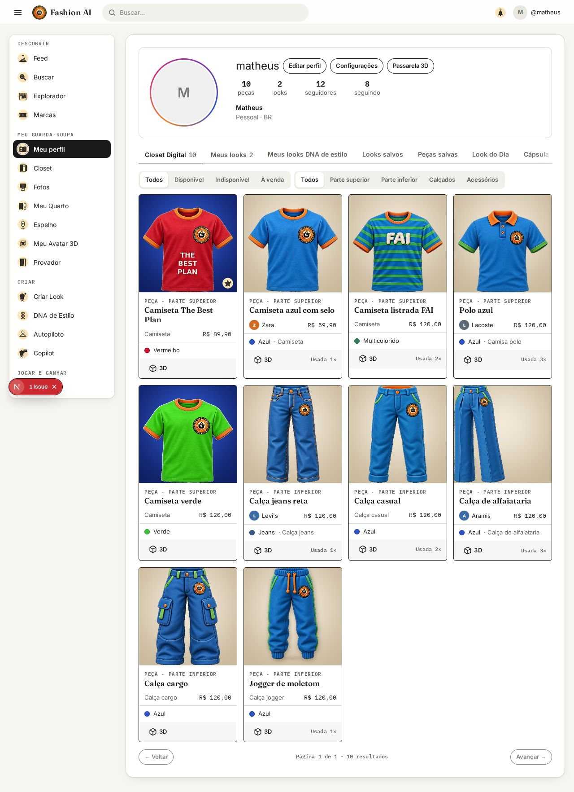 | 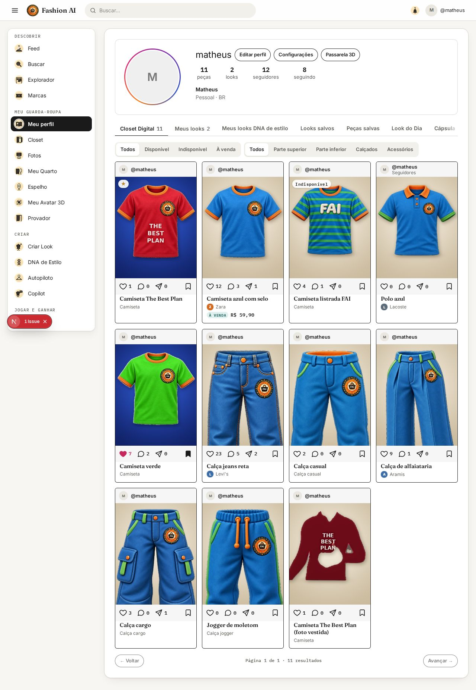 |

* Cabeçalho: `@autor` (nome do perfil, se for marca), link para o perfil. Visibilidade aparece só quando é informação
  útil: peça privada ou só para seguidores, vista pelo dono ("Seguidores" na polo).
* Foto: a variante **de feed** (4:5, enquadrada pelo template da categoria — §4). Sem estúdio, o recorte inteiro, contido.
* Ações: curtir, comentar, compartilhar e salvar numa linha — ícone de 22 px com a contagem ao lado (♡ 1 · 💬 0 ·
  ➤ 0 … 🔖). Curtido e salvo ficam **preenchidos** (forma, não só cor) e usam `aria-pressed`; o nome acessível leva a
  contagem ("Curtir · 1 curtida"). Não existe mais a linha "1 curtida": cada número aparece uma vez.
* Nome (2 linhas, fonte editorial) + marca (ou subcategoria). Preço **só quando a peça está à venda** ("À VENDA R$ 59,90").
* Selos das anatomias continuam nas mesmas zonas. Indicadores discretos na foto: "Indisponível" e ★ (favorita, só para o dono).
* Celular (2 colunas, card de 165 px): a linha continua única — alvos de 44 px de altura e ≥ 26 px de largura; nesse
  tamanho o compartilhar fica só com o ícone (o número segue no nome acessível e no detalhe) e números grandes viram
  "1 mil" (medido com 1.234 / 56 / 78: cabe sem rolagem).

## 2. Detalhe da peça (modal, `/pieces/[id]` e janela de sucesso)

Ordem: **imagem → nome + ação principal → ações sociais → Detalhes → Looks com esta peça → opções contextuais**.
No desktop (≥ 760 px de card) a foto fica à esquerda e as informações à direita, com rolagem própria; no celular, uma coluna.

| Antes (dono, desktop) | Depois (dono, desktop) |
|---|---|
| 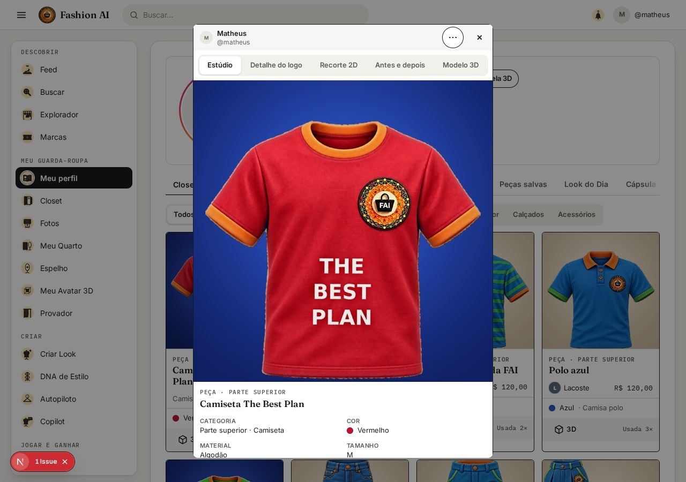 | 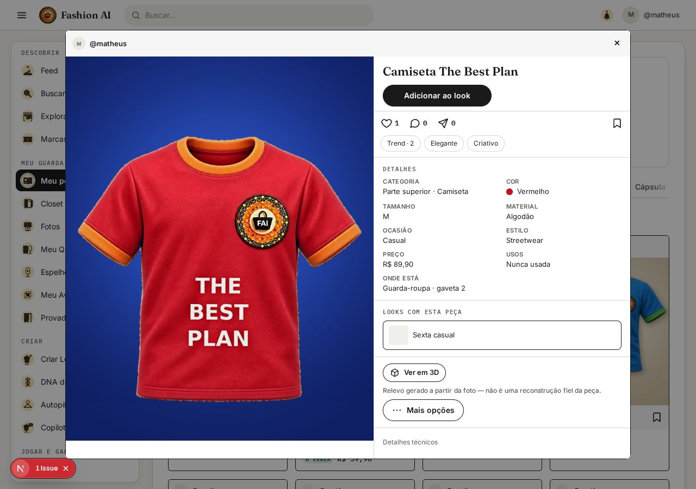 |

| Depois — visitante, desktop | Depois — celular (dono): topo e fim |
|---|---|
| 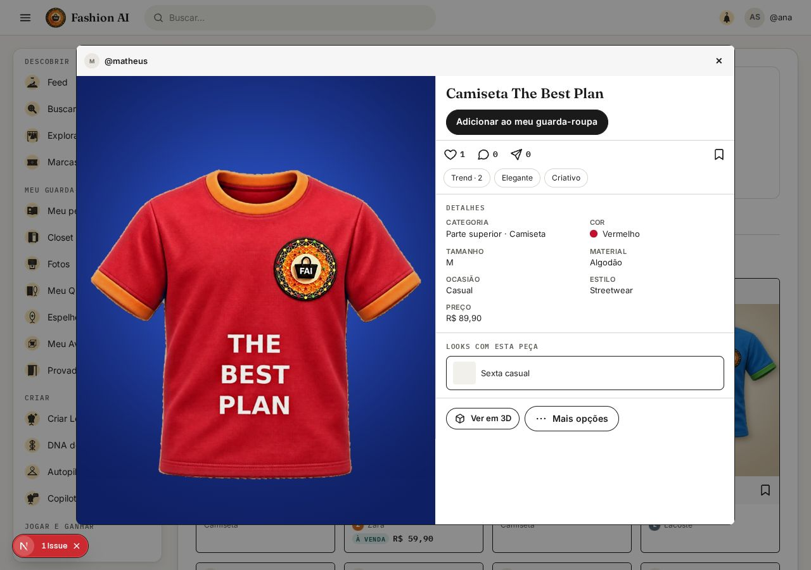 | 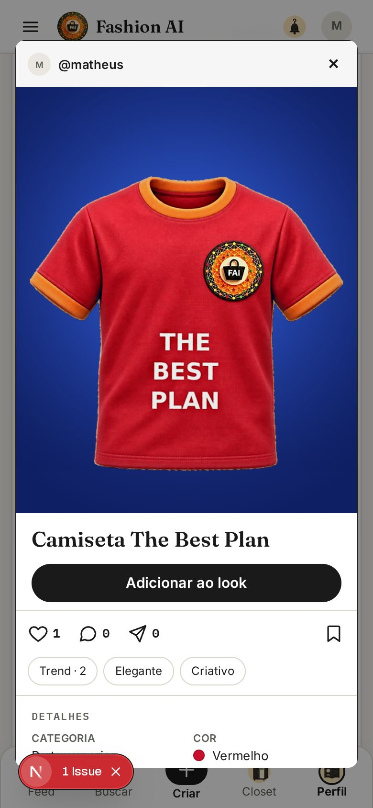 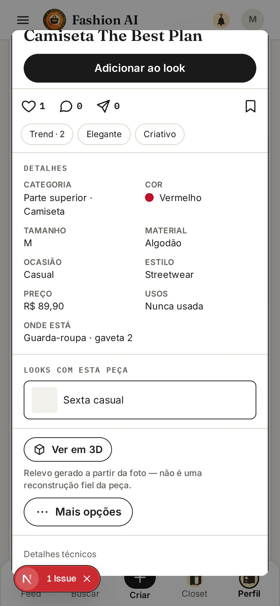 |

* Imagem: a foto de produto aprovada, **inteira** (a variante enquadrada é só do feed), com o degradê do estúdio
  continuando além dela. Com foto no manequim, vira carrossel (Produto · No manequim) com setas e pontos nomeados.
  Toque abre a tela cheia; o detalhe do logo entra nela **só quando há logo real** (§3).
* Uma ação principal por contexto: dono → **Adicionar ao look** (monta o look com a peça no Espelho); visitante →
  **Adicionar ao meu guarda-roupa**. "Mostrar no espelho", "Remixar" e a cópia deixaram de aparecer juntos.
* Detalhes: categoria, cor, tamanho, material, ocasião, estilo, preço (quando não está à venda — à venda ele sobe
  para a identificação), usos e onde está (só o dono), situação (só se indisponível). Nome e marca não se repetem.
* Reações (Trend, Elegante, Criativo) viraram etiquetas com texto, no detalhe; remixes do look aparecem ali como número.
* "Mais opções" (menu com texto visível, abre para cima): dono → Editar dados, Editar imagem, Trocar foto,
  Marcar como indisponível/disponível, Favoritar/Tirar dos favoritos, Foto com meu manequim, Ver no manequim 3D,
  Mostrar no quarto, Excluir. **Visitante → só "Ver no manequim 3D"** (conferido automaticamente).
* Dono com foto incompleta (região que falta no template, §4) vê um aviso curto com "Revisar a imagem".
* "Detalhes técnicos" (fechado, só o dono): etapas do estúdio, motor/provedor/diagnóstico do 3D.

## 3. Abas técnicas → "Editar imagem"

As abas do topo saíram. A foto de produto aprovada é o padrão. O fluxo "Editar imagem" (só dono) tem:
**Enquadramento** (foto do feed, template usado, regiões que faltam, fundo do estúdio, Trocar foto, Ajustar
manualmente), **Recorte** (máscara sobre xadrez + "Corrigir recorte" no editor Canvas), **Original × processado**
(comparação deslizante) e **Logo** — esta última só existe quando há logo de marca.

| Enquadramento | Recorte | Original × processado | Logo |
|---|---|---|---|
| 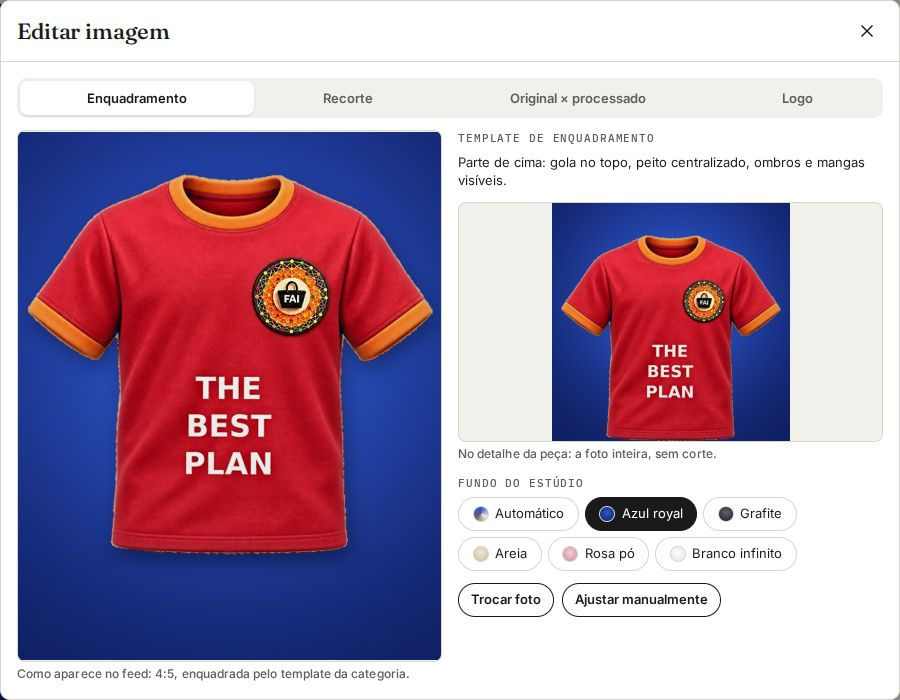 | 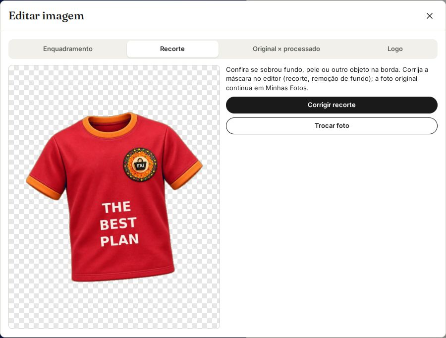 | 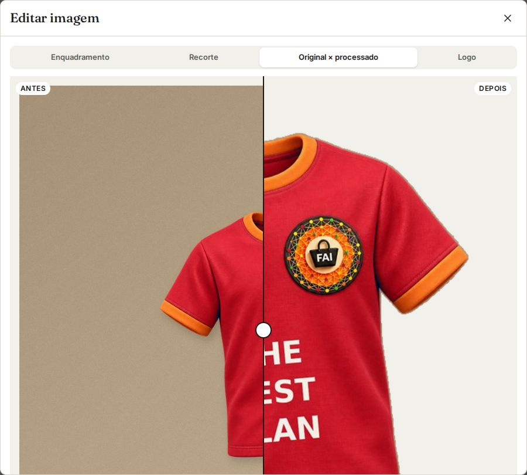 | 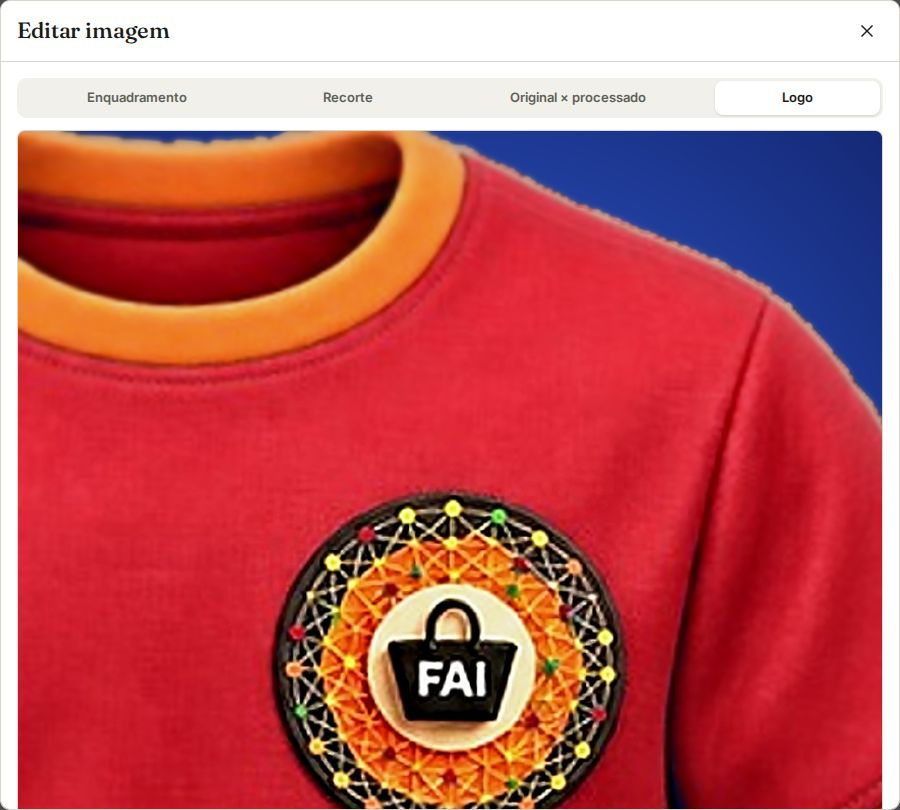 |

**Estampa × logo** (`LogoFinder.isPrint`): bloco largo no eixo do peito (≥ 18% da largura), texto em 2+ linhas ou
vários blocos próximos que somam mais de 30% da peça são **estampa** — ficam intactos, sem foco extra e sem foto de
detalhe. O detector escolhe o melhor candidato que não é estampa (na camiseta vermelha, o selo FAI do peito é logo e
"THE BEST PLAN" é estampa); palpites locais abaixo de 0,5 de confiança também não geram detalhe. O prompt da IA de
visão passou a dizer que frases e estampas gráficas não são logo.

## 4. Fotografia de produto padronizada

Fluxo: **upload → validação → identificação → remoção de pessoa e cenário → revisão do recorte → enquadramento por
categoria → variantes → aprovação**.

* **Remoção de pessoa e cenário** (`lib/pieces/person-filter.ts`, no navegador): pele, cabelo e rosto viram
  **transparência** (antes eram pintados de branco e viravam manchas na foto de produto); o cenário (classe "fundo")
  sai quando há pessoa; com o esqueleto, a foto é dividida em peça de cima × de baixo — a outra roupa e os acessórios
  saem. Se a foto tem as duas, o cadastro pergunta "Qual você está cadastrando?" (Parte de cima / de baixo / Corpo inteiro).
* **Templates** (`FeedFraming`, 4:5, 800×1000), por pontos de referência medidos na máscara (com buracos preenchidos):

| Template | Subcategorias | Âncoras |
|---|---|---|
| TOP | camiseta, camisa, blusa, regata, cropped, polo, body, suéter, moletom, colete | gola a 8% do topo; peito (logo abaixo das cavas) = 56% da largura; centro no tronco; mangas cabem (até 85% da âncora) |
| OUTERWEAR | jaqueta, casaco, parka, blazer, corta-vento, cardigã, quimono | como TOP, com a barra dentro do quadro |
| PANTS | jeans, alfaiataria, casual, chino, cargo, jogger, moletom, legging, pantacourt | cós a 6%; base = metade dos joelhos (gancho + 47% da entreperna); largura ≤ 96% |
| SHORTS / SKIRT | shorts, bermuda, short jeans / saia, short-saia | cós a 8%, peça inteira |
| FULL_BODY | vestido, macacão, macaquinho, conjunto, jardineira | decote a 5%, peça inteira |
| SHOES | calçados | sola na linha de chão (72%), peça inteira |
| BAG / ACCESSORY | bolsas / demais acessórios | peça inteira centralizada |

* Variantes: foto de estúdio inteira (detalhe), miniatura, **feed** (`studio-x.feed.jpg`, exposta em
  `PieceView.studioFeedUrl` quando o metadado `studio.feed` existe) e detalhe do logo. Só escala uniforme e translação:
  nada é distorcido nem inventado. O estúdio não aplica mais "vibração" (cor e estampa como na foto; teste de cor).
* Região exigida ausente → `feed.missing` (`collar`, `sleeves`, `chest`, `waist`, `knees`, `hem`, `full`,
  `occluded`): o cadastro e o detalhe pedem outra foto ou ajuste manual.

## 5. Modelo 3D compacto

| Estado | O que aparece |
|---|---|
| não gerado (dono) | botão "Gerar modelo 3D" |
| processando | "Gerando o modelo 3D…" + barra de progresso (`role=progressbar`) |
| concluído | "Ver em 3D" (abre o visualizador); relevo local traz "Relevo gerado a partir da foto — não é uma reconstrução fiel da peça." |
| falhou | "Não deu para gerar o 3D." + "Tentar de novo (grátis)" |

Motor, provedor, etapas, dimensões e motivo da falha ficam em "Detalhes técnicos". Capturas: `depois-estado-3d-*.jpg`.

## 6. Verificação

### 6.1 Inventário antes × depois (nenhuma função removida em silêncio)

**Card de peça**

| Controle antes | Onde ficou |
|---|---|
| Foto 1:1 (miniatura quadrada) | Foto 4:5 do feed (template da categoria) |
| Kicker "Peça · Parte superior" | Detalhe › Categoria |
| Nome | Card (nome) |
| Marca + preço (sempre) | Card: marca; preço só se à venda. Detalhe › Preço |
| Cor com amostra · subcategoria | Detalhe › Cor; subcategoria no card quando não há marca |
| ★ favorita na foto | ★ na foto (só o dono) |
| Botão Favoritar (closet) | Detalhe › Mais opções › Favoritar/Tirar dos favoritos |
| Botão Disponível/Indisponível (closet) | Detalhe › Mais opções; etiqueta "Indisponível" na foto |
| Botão "3D" (manequim 3D) | Detalhe › Mais opções › Ver no manequim 3D; modelo 3D compacto no detalhe |
| "Usada N×" | Detalhe › Usos (dono) |
| — | Novo: cabeçalho com autor, linha de ações com contagens |

**Detalhe da peça**

| Controle antes | Onde ficou |
|---|---|
| ⋯ › Salvar / Tirar dos salvos | Linha de ações (🔖, uma vez) |
| ⋯ › Editar | Mais opções › Editar dados |
| ⋯ › Excluir | Mais opções › Excluir |
| Aba Estúdio | Imagem padrão do detalhe |
| Aba Detalhe do logo | Tela cheia (só logo real) + Editar imagem › Logo |
| Aba No manequim | 2º quadro do carrossel |
| Aba Recorte 2D | Editar imagem › Recorte |
| Aba Antes e depois | Editar imagem › Original × processado |
| Aba Modelo 3D | "Ver em 3D" (visualizador em janela) |
| Curtir / Comentar / Compartilhar | Linha de ações, com contagem ao lado |
| Remixar (peça) | Substituído pela ação principal (Adicionar ao look / ao meu guarda-roupa): na tela antiga o remix de peça só contava e não levava a lugar nenhum |
| Remixar (look) | Menu ⋯ do post do look |
| Trend / Elegante / Criativo (ícones) | Etiquetas com texto no detalhe (peça e look) |
| Gerar 3D (ícone, manequim) | Mais opções › Ver no manequim 3D (peça) · menu ⋯ (look) |
| Linha "1 curtida" + "Ver N comentários · N compartilhamentos · N remixes" | Números ao lado de cada ícone; remixes no bloco de reações |
| Painel "Modelo 3D" (linha do tempo, motores, etapas) | Controle 3D compacto + Detalhes técnicos |
| Favorito / Disponível | Mais opções |
| Mostrar no espelho | Ação principal "Adicionar ao look" (dono) |
| Mostrar no quarto | Mais opções |
| Trocar foto | Mais opções + Editar imagem |
| Levar ao estúdio / Refazer estúdio (fundos) | Editar imagem › Enquadramento › Fundo do estúdio |
| Editar foto (Canvas 2D) | Editar imagem › Ajustar manualmente / Corrigir recorte |
| Foto com meu manequim | Mais opções |
| Adicionar ao meu guarda-roupa (visitante) | Ação principal |
| Looks com esta peça | Igual, só quando existem |
| Voltar / fechar | Cabeçalho |

**Outros cards que usam a mesma linha de ações** (componente compartilhado `CardActions`): no card de look, salvar
saiu do menu ⋯ para a linha, e o menu ⋯ ganhou "Remixar: criar a minha versão" (quem não é o autor) e "Ver no
manequim 3D"; as reações e os remixes aparecem no look ampliado. No DNA de estilo, a linha é a mesma, o botão 3D do
DNA continua ao lado das ações e as reações ficam no DNA ampliado.

### 6.2 Capturas (dono e visitante, desktop e celular)

`depois-feed-{dono,visitante}-{desktop,celular}`, `depois-modal-{dono,visitante}-{desktop,celular}[-fim]`,
`depois-mais-opcoes-{dono,visitante}-desktop`, `depois-feed-looks-visitante-desktop` e os mesmos `antes-*`.

### 6.3 Cinco camisetas e cinco calças

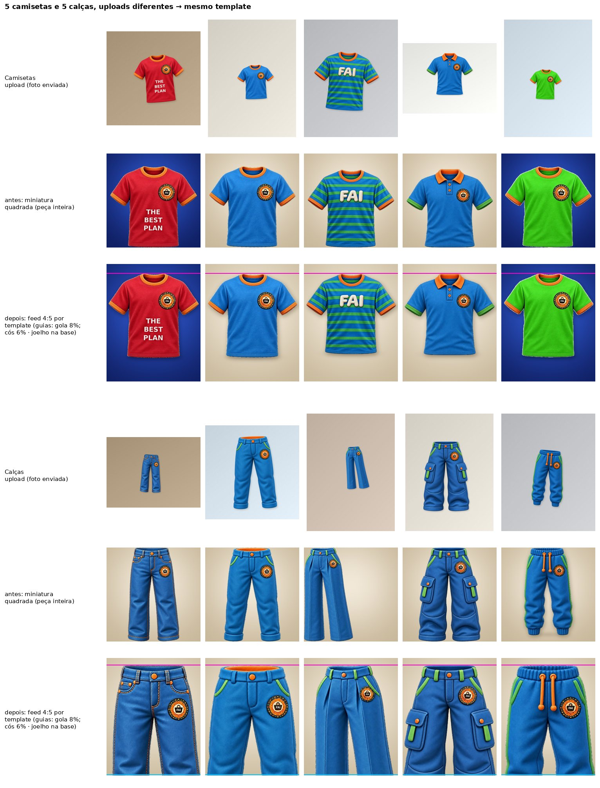

Caixa da peça no quadro do feed (frações; pode passar de 0–1 onde a peça sangra):

| Peça | Template | esquerda | topo | direita | base |
|---|---|---|---|---|---|
| Camiseta The Best Plan | TOP | 0,024 | **0,080** | 0,980 | 0,799 |
| Camiseta azul com selo | TOP | 0,027 | **0,080** | 0,980 | 0,799 |
| Camiseta listrada FAI | TOP | 0,026 | **0,080** | 0,980 | 0,768 |
| Polo azul | TOP | 0,022 | **0,080** | 0,980 | 0,776 |
| Camiseta verde | TOP | 0,029 | **0,080** | 0,982 | 0,795 |
| Calça jeans | PANTS | 0,029 | **0,060** | 1,048 | 1,546 |
| Calça casual | PANTS | −0,018 | **0,060** | 1,028 | 1,448 |
| Calça de alfaiataria | PANTS | 0,108 | **0,058** | 1,056 | 1,507 |
| Calça cargo | PANTS | −0,001 | **0,060** | 1,018 | 1,292 |
| Jogger | PANTS | 0,034 | **0,058** | 1,008 | 1,450 |

Gola a 8,0% nas cinco camisetas, mangas de 2% a 98% (nenhuma cortada), barra entre 77% e 80%. Cós entre 5,8% e 6,0%
nas cinco calças e joelho na base; o que passa de 1,0 é a perna abaixo do joelho, fora do quadro de propósito. Os
uploads variavam de 48% a 86% de ocupação, ±5° de rotação, 5 tamanhos de foto e 6 fundos (`pipeline-upload-estudio-feed.jpg`).

### 6.4 Camiseta vermelha: pessoa fora, gola, mangas e "The Best Plan" preservadas

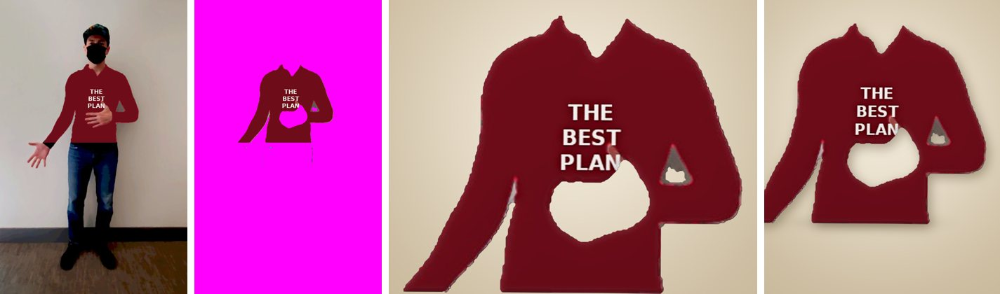

Foto de teste do MediaPipe (pessoa de corpo inteiro) com a blusa recolorida de vermelho e a estampa "THE BEST PLAN".
Remoção de pessoa **real** (MediaPipe no Chromium): rosto, boné/máscara, mãos, jeans, tênis, parede e piso saem;
ficam a camiseta, a gola, as mangas e a estampa. A mão que cobria o peito vira buraco (nada inventado) e o template
marca `occluded` — o dono vê "A foto do feed não mostra a peça inteira · Revisar a imagem"
(`depois-estado-foto-vestida-encoberta.jpg`). No estúdio, a frase é classificada como **estampa** (sem foto de
detalhe). Com a camiseta fotografada aberta (`tee_camiseta_vermelha_the_best_plan`), o selo do peito é o logo e a frase
fica intacta. Modos de remoção: `camiseta-vermelha-remocao-pessoa-modos.jpg` (magenta = transparente).

### 6.5 Estados

| Estado | Captura | Resultado |
|---|---|---|
| sem logo (estampa "FAI" grande) + indisponível | `depois-estado-sem-logo-indisponivel` | sem aba/tela de logo; "Situação: Indisponível" |
| sem looks relacionados | `depois-estado-calca-sem-looks` | seção "Looks com esta peça" não aparece |
| sem modelo 3D | `depois-estado-3d-nao-gerado-a-venda` | "Gerar modelo 3D"; preço sobe para "À VENDA" |
| 3D processando | `depois-estado-3d-processando` | "Gerando o modelo 3D…" + progresso |
| 3D com falha | `depois-estado-3d-falhou` | mensagem curta + "Tentar de novo (grátis)" |
| 3D concluído (relevo) | `depois-modal-dono-desktop` | "Ver em 3D" + aviso de relevo |

### 6.6 Acessibilidade, responsividade, duplicidade e contagens (automático, `verify-cards.mjs`)

| Conferência | Antes (modal do dono, desktop) | Depois (todas as telas) |
|---|---|---|
| botões sem nome acessível | 0 | 0 |
| botões sociais no modal | 8 (inclui reações e 3D) | 4 |
| alvos sociais abaixo de 40 px de altura | 8 | 0 (44 px em tela de toque) |
| linha "N curtidas" | sim | não |
| abas técnicas no topo | Estúdio, Detalhe do logo, Recorte 2D, Antes e depois | nenhuma |
| bloco "Modelo 3D" extenso | sim | não |
| "Salvar" duplicado | — | 1 por card/modal |
| alternâncias (curtir/salvar) sem `aria-pressed` | — | 0 |
| erros de runtime | 0 | 0 |

## 7. Testes executados

* `mvn test` (todos os módulos): verde — inclui `FeedFramingTest` (10 casos: 5 camisetas e 5 calças com gola/cós
  e peito/joelho na mesma posição, gola e joelhos faltando, região encoberta, estampa × logo, cor preservada,
  escala uniforme, templates por subcategoria) e os testes de estúdio/logo já existentes.
* `tsc --noEmit`: sem erros · `vitest`: 74 testes verdes · i18n: 0 erros de paridade (pt-BR/en/es).
* `scripts/e2e/verify-cards.mjs` (API simulada + imagens do pipeline real): 0 problemas, 0 erros (seção 6.6).
* O aviso "1 Issue" do Next nas capturas é um aviso de hidratação que já existe no commit de base.

## 8. Limitações (dependem de fotos melhores ou revisão humana)

* A foto real da camiseta vermelha não estava disponível: o teste usa uma foto simulada.
* Peça **vestida** vira foto de produto com o que a pessoa cobria faltando (mãos, braços) e com a forma do corpo (sem
  mangas "abertas"); o template marca a região encoberta, mas para a vitrine a foto aberta (flat lay ou cabide)
  continua sendo a recomendada. Pequenos restos de fundo entre braço e tronco podem sobrar e se corrigem em "Corrigir recorte".
* A divisão parte de cima × de baixo usa o esqueleto e a cor; com peças da mesma cor (conjunto) a faixa da cintura
  pode ficar misturada — o cadastro deixa escolher "Corpo inteiro" e o recorte pode ser corrigido à mão.
* Os pontos do template são medidos na silhueta: peça muito dobrada, torta ou com as mangas coladas ao corpo cai na
  estimativa (`estimated`), que o dono confere em "Editar imagem".
* Fotos de estúdio feitas antes desta mudança não têm a variante de feed: o card usa a miniatura quadrada até o dono
  refazer o estúdio (um fundo em Editar imagem › Enquadramento).
* Logos pequenos em fotos de baixa resolução podem ficar abaixo do limiar de confiança e não gerar foto de detalhe (preferimos não inventar logo).
* A validação ponta a ponta usou API simulada; a lógica de servidor está coberta pelos testes automatizados.
