# Evidências do teste real de ponta a ponta (2026-10-05)

Teste manual e automatizado do HypeScore v2 ([RF53](../novos-rf/RF53_HypeScore_v2.md)) e do FashionAI Lens
([RF54](../novos-rf/RF54_FashionAI_Lens.md)) com banco real, backend e frontend rodando localmente. Ele complementa os
testes de unidade e de componente: aqui os dados passam por Flyway, JPA, job de snapshots, API e telas de verdade.

## 1. Ambiente

| Peça | Como rodou |
|---|---|
| Banco | MySQL 8.4 em contêiner (`fai-mysql`), banco `fashionai` **novo** |
| Migrações | Flyway aplicou **V1 a V40** (40 migrações, incluindo V39 `hype_regiao_e_subcategorias` e V40 `fashionai_lens`). A V41 (`hype_milestones`) entrou depois e não fez parte desta rodada |
| Backend | `fai-bootstrap-0.1.0-SNAPSHOT.jar` na porta 8080, com chave de criptografia fixa, armazenamento local e e-mail em log; sem provedor de IA externa |
| Frontend | Next em modo `dev` na porta 3000 |
| Navegador | Playwright (`playwright-core`) com Chromium sem interface, 1366 × 1000, escala 1,5, `pt-BR` |

## 2. Dados de teste

Script de seed (API de cadastro + SQL direto para peças, looks e sinais):

| Item | Quantidade |
|---|---|
| Pessoas | 6: `ana.hype` e `bia.hype` (BR), `caio.hype` (US, admin), `dani.hype` (FR), `eiji.hype` (JP), `fran.hype` (AR) |
| Peças | 18, com imagens reais do acervo (`/assets_pecas`), marcas, cores, materiais, estilos e ocasiões variados; 17 públicas e 1 privada ("Blazer privado") |
| Looks | 5 publicados (um por pessoa, exceto `bia.hype`), de 2 a 3 peças |
| Sinais | 2.140 linhas em `hype_signal_daily` nos últimos 28 dias (curtidas, salvos, visualizações, compartilhamentos, usos e remixes), com crescimento nos últimos 7 dias para as peças mais fortes |
| Job | `POST /api/admin/hype/snapshots` como admin |

Estado do Hype depois do job (consulta ao banco no fim da rodada, já com os 3 looks criados pelo teste de selos):

| Tipo | AVAILABLE | INSUFFICIENT_DATA |
|---|---|---|
| Peças | 17 | 1 (a peça privada sem sinais) |
| Looks | 5 | 3 (looks recém-criados no teste) |

Hype médio das peças públicas por região (o mesmo número aparece na barra "Hype por região" do Ranking):

| Região | País | Peças | Hype médio |
|---|---|---|---|
| América do Norte | US | 3 | 75,9 |
| Europa | FR | 3 | 59,7 |
| Ásia | JP | 3 | 58,4 |
| América do Sul | BR | 6 | 54,1 |
| América do Sul | AR | 2 | 41,2 |

## 3. Selos promovidos por política aceita (24/24 verificações de API)

Um segundo script cria a marca **Maison E2E** e a celebridade **Estrela E2E** (perfis aprovados), selos com política
padronizada e looks da `ana.hype`, e percorre o caminho sugestão → aceite → revisão → perfil. Cada verificação imprime
OK ou FALHA, e o script sai com erro se alguma falhar. Resultado: **24 de 24 OK** — saída completa da rodada de
confirmação em [`evidencias-e2e/e2e_seals.log`](evidencias-e2e/e2e_seals.log). Nessa rodada o banco já tinha looks
promovidos antes, então as verificações comparam com o estado medido no início (o look novo entra e sai sem mexer nos
outros); os dois `429 MUITAS_TENTATIVAS` no topo do log são o limite de cadastro por IP recusando contas que já existiam.
Os scripts estão em [`evidencias-e2e/scripts/`](evidencias-e2e/scripts/): `seed_e2e.py` (semente), `e2e_seals.py`
(selos) e `e2e_ui.mjs` (telas com Playwright).

| # | Verificação |
|---|---|
| 1–2 | marca cria selo de LOOK com política "≥ 1 peça Nike" (201); celebridade cria selo de PEÇA "≥ 1 peça preta" (201) |
| 3–7 | look com Nike + peça preta é criado; sugestões respondem 200; a política da marca é atendida (sugestão Maison); a da celebridade também, como selo de PEÇA; look sem Nike não recebe sugestão da Maison |
| 8 | antes do aceite, o look não aparece em "Looks em destaque" da marca |
| 9–10 | aceite da sugestão da marca → APPROVED com código rastreável `BRD…` |
| 11–14 | o look aparece em destaque para visitante anônimo, com `promotion` vigente; aparece em "Looks consagrados" para outra pessoa; "Peças em destaque" incluem as peças do look (selo de LOOK) |
| 15–16 | aceite da celebridade sem consentimento de imagem → 400; com consentimento → PENDING_REVIEW |
| 17–19 | pendente não aparece no perfil da celebridade; a celebridade aprova → APPROVED com código `PRM…`; o look aparece no perfil dela |
| 20 | selo de PEÇA destaca só a peça preta (Nike Dunk Low), nunca o jeans do mesmo look |
| 21–24 | o look vira privado (200); some dos destaques e dos consagrados da marca; os vínculos dele ficam REVOKED |

Estado final em `seal_bonds`: o look tornado privado ficou com os dois vínculos `REVOKED`; dois looks criados depois
para as telas ("Clube Nike preto" e "Street domingo") ficaram com os dois selos `APPROVED` cada.

**Defeito achado e corrigido nesta rodada:** `GET /api/schemes/{id}/seal-suggestions` respondia **500** com MySQL real.
`AiInferenceLog` e `ProcessingJobLog` recebiam id à mão apesar do `@GeneratedValue`; no Hibernate 6.6 o `save()` virava
merge e falhava, e a transação de quem chamou a IA ficava rollback-only. Corrigido no commit `94c48f3a` (e no
`MetricSnapshot`, em `e51690a1`); depois disso as sugestões responderam 200.

## 4. Telas

As capturas abaixo saíram do mesmo roteiro do Playwright, logado como `ana.hype` (ou `bia.hype` nas telas de marca),
contra os dados da seção 2.

### 4.1 Ranking de HypeScore

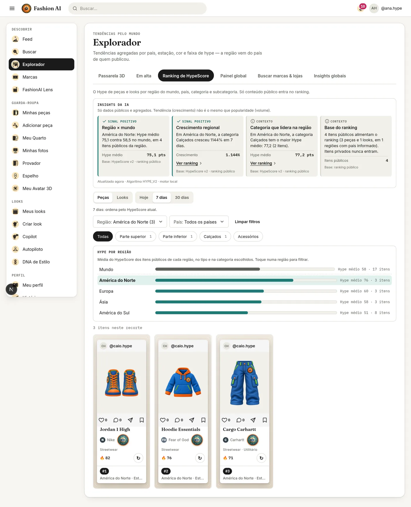

*Explorador › Ranking, peças, 7 dias, região América do Norte: Insights da aba (região líder, crescimento regional,
categoria líder, base do ranking), barra "Hype por região" com o Hype médio de cada região e os 3 itens do recorte com a
posição e a região.*

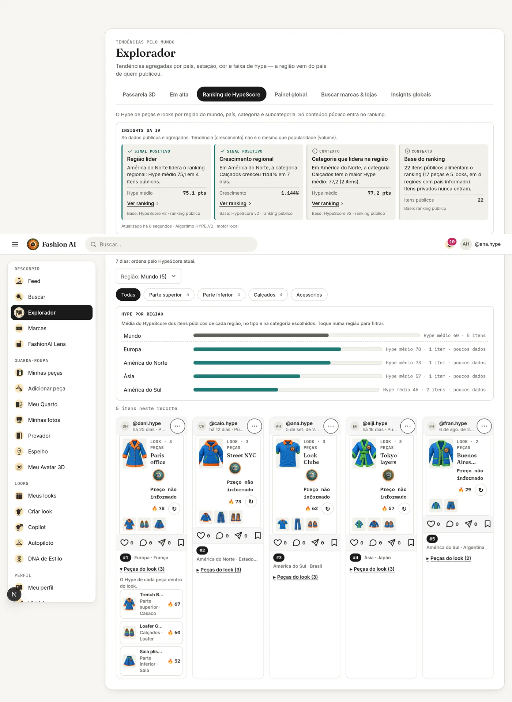

*Ranking de looks: regiões com 1 item aparecem com "poucos dados"; "Peças do look" mostra o Hype de cada peça (o look
entra no ranking pelas peças). O cabeçalho repetido no meio da imagem é o menu fixo capturado na rolagem da página
inteira.*

### 4.2 Globo do Painel global

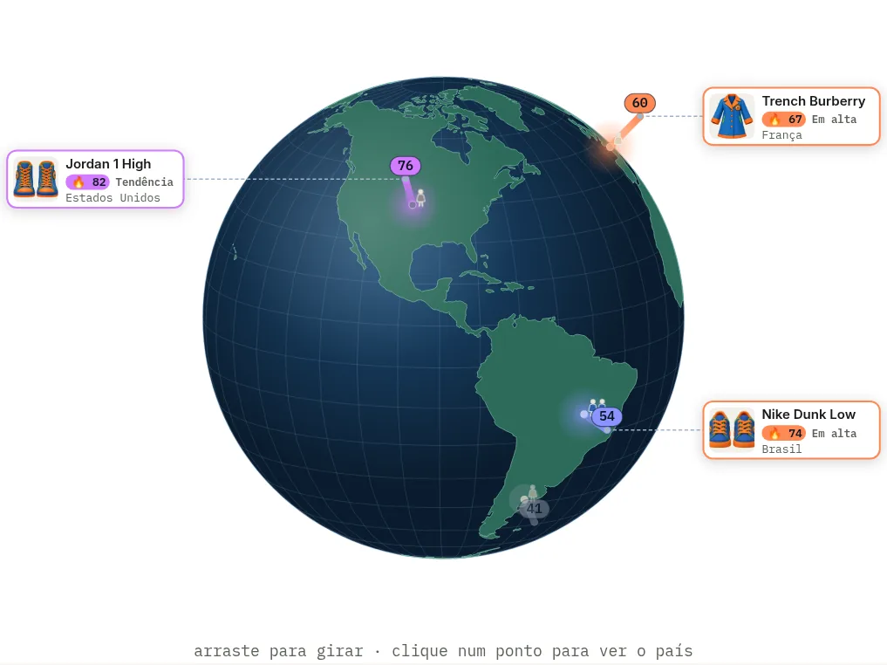

*Camadas ligadas: números (Hype médio do país), colunas, bonecos, cards de destaque com a faixa (Jordan 1 High,
Tendência; Trench Burberry, Em alta; Nike Dunk Low, Em alta) e calor. Argentina, com menos de 3 itens, aparece apagada
e sem card.*

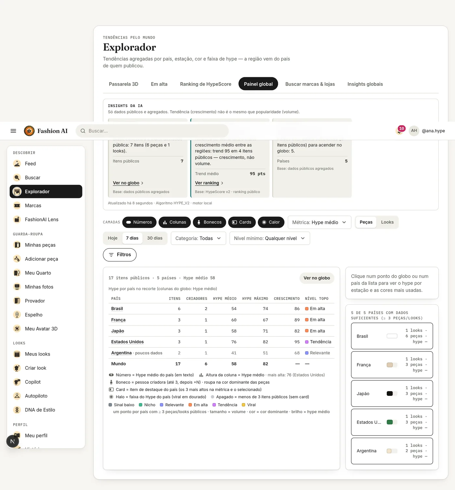

*"Ver como tabela": itens, criadores, Hype médio e máximo, crescimento e nível do topo por país, mais a linha do mundo
(17 itens, 6 criadores, Hype médio 58, máximo 82).*

### 4.3 Verso do card e análise completa

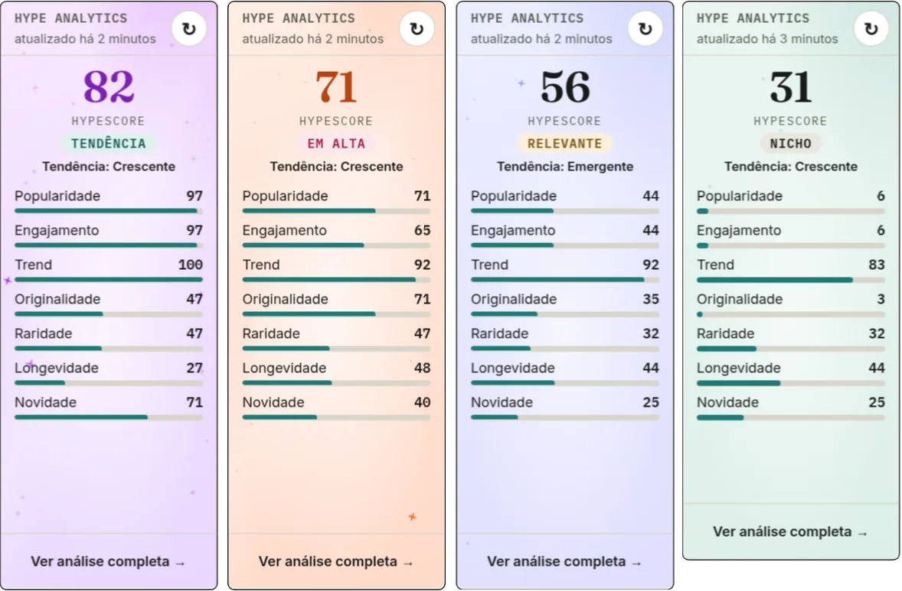

*Verso "Hype analytics" de quatro peças, uma por faixa (Tendência 82, Em alta 71, Relevante 56, Nicho 31): o fundo e a
quantidade de estrelas mudam com a faixa.*

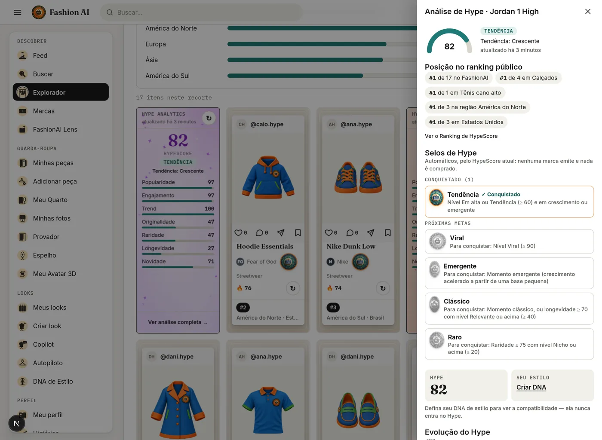

*"Ver análise completa": posição no ranking público (#1 de 17 no FashionAI, #1 de 4 em Calçados, #1 em Tênis cano alto,
na região e no país), Selos de Hype (Tendência conquistado; Viral, Emergente, Clássico e Raro como metas, com o
critério) e "Hype × seu estilo" separados (sem DNA, convite para criar).*

### 4.4 Selos

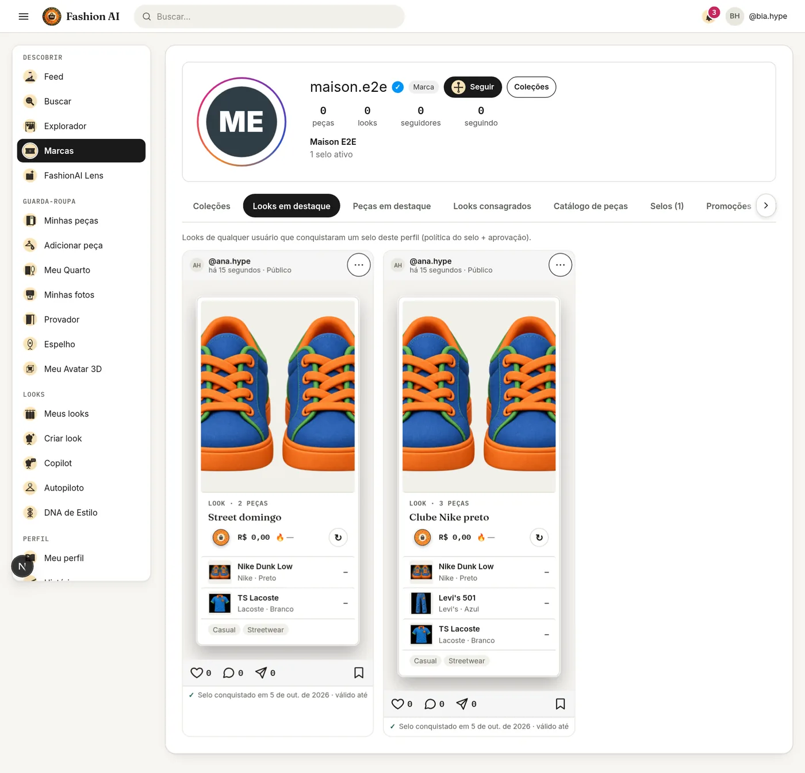

*Perfil da Maison E2E visto por `bia.hype`: só os looks com vínculo APPROVED vigente, cada um com "Selo conquistado
em …".*

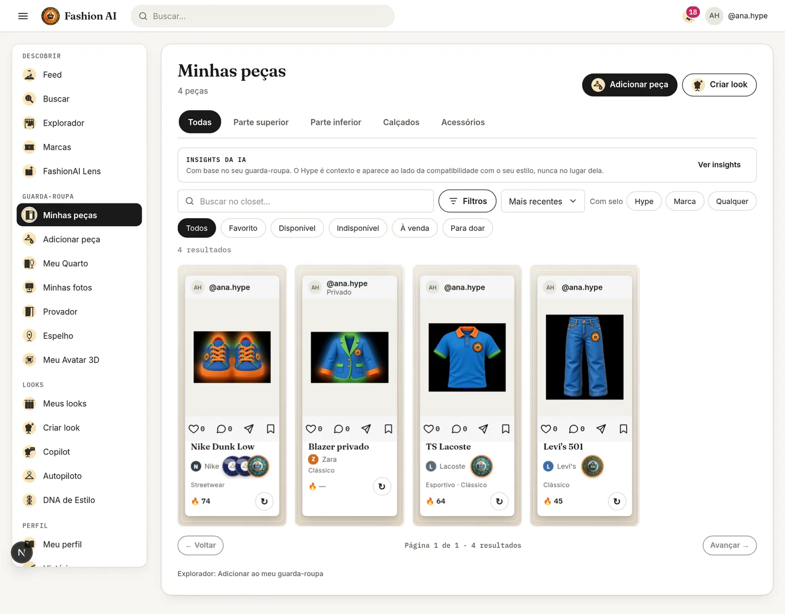

*Minhas peças com o filtro "Com selo" (Hype · Marca · Qualquer): o Nike Dunk Low leva o selo de PEÇA da Estrela E2E
(um por look aprovado, via `GET /api/pieces/seals`) e um Selo de Hype (medalhão Padrão FashionAI); TS Lacoste e Levi's
501 têm Selo de Hype; a peça privada, sem sinais, aparece com "—" (dados insuficientes, nunca 0) e sem Selo de Hype.*

### 4.5 Insights dinâmicos, Cápsula e Autopiloto

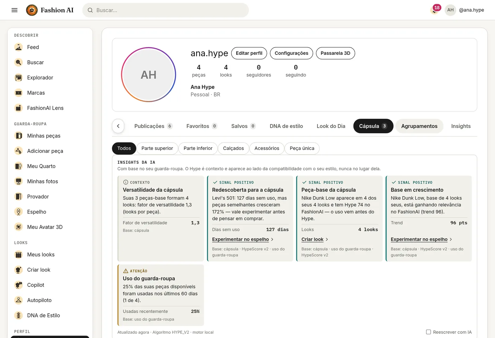

*Lookbook › Cápsula: insights pessoais (versatilidade, redescoberta antes de comprar, peça-base com Hype ao lado do uso,
base em crescimento, uso do guarda-roupa), cada um com a base de dados citada.*

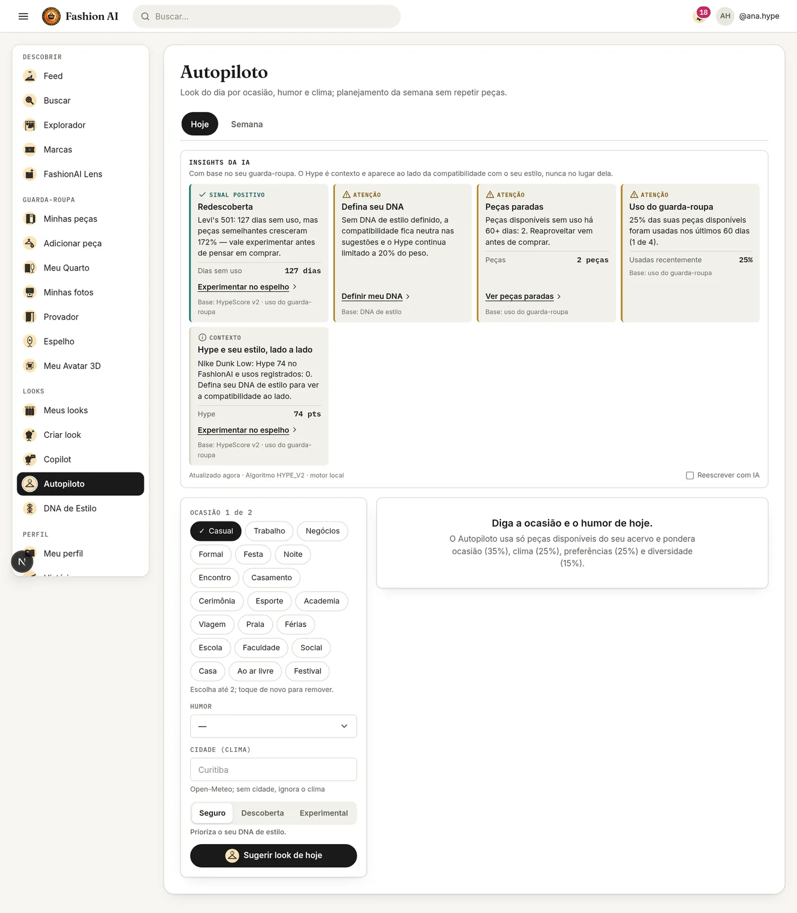

*Autopiloto › Hoje: insights (redescoberta, "Defina seu DNA" explicando que o Hype fica limitado a 20% do peso, peças
paradas, uso do guarda-roupa, Hype e estilo lado a lado) e os modos Seguro, Descoberta e Experimental.*

### 4.6 FashionAI Lens

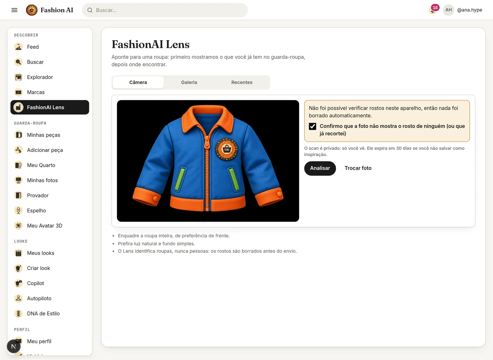

*Aba Câmera com uma foto de jaqueta. O Chromium sem interface não carrega o detector de rostos, então a tela avisa que
nada foi borrado automaticamente e exige a confirmação "a foto não mostra o rosto de ninguém" antes de analisar.*

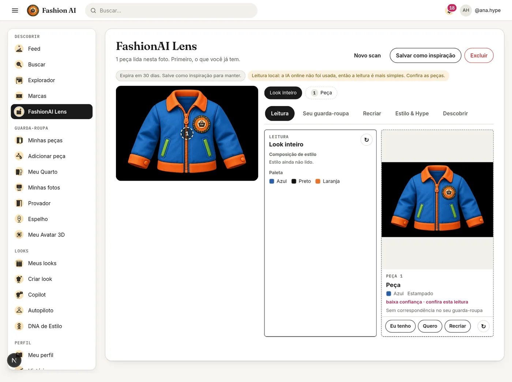

*Resultado: 1 peça lida, paleta Azul, Preto e Laranja, padrão Estampado, "baixa confiança · confira esta leitura" e o
aviso de leitura local (sem IA externa no ambiente). O scan expira em 30 dias se não for salvo. No banco:
`status = READY`, `ai_source = local`, `faces_redacted = 0`, `redaction_confirmed = 1`, imagem de 1532 × 1027.*

Nas outras abas do mesmo scan: "Seu guarda-roupa" mostrou "Sem correspondência" com a lacuna (nunca 0%); "Estilo &
Hype" mostrou o convite para criar o DNA e o Hype do grupo como "Dados insuficientes"; "Recriar" não montou plano (a peça
da leitura local não tem categoria); "Descobrir" não achou peça pública parecida.

## 5. O que este teste não cobriu

- Notificação `HYPE_MILESTONE` e a V41 (entraram depois; cobertas por `HypeMilestoneTest`).
- Recálculo ao vivo medido no relógio (o job foi disparado à mão; o `HypeLiveRecalc` tem `HypeLiveRecalcTest`).
- Detecção do Lens por IA externa (sem chave no ambiente) e borrão de rosto com o MediaPipe carregado.
- Telas dos lotes 1–9 da auditoria de abas fora das listadas acima (feed, busca, Passarela 3D, painéis, FLAIR): cobertas
  pelos testes de componente e de serviço listados no RF53 §4.
