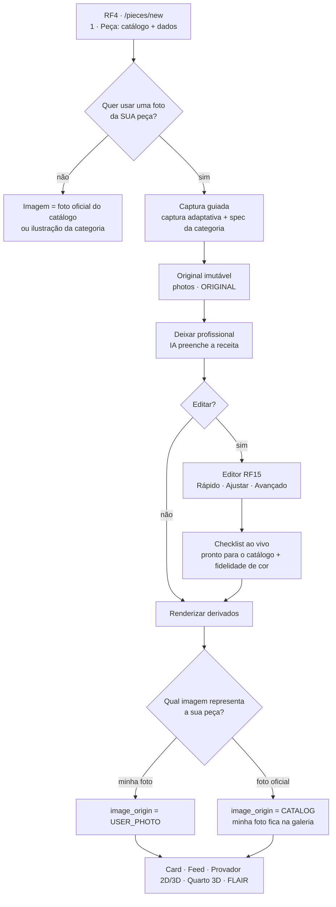
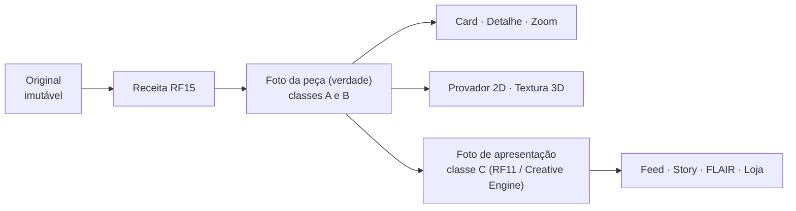

# RF15 · Editor de Fotografia da Peça (Editor Canvas Interativo 2D) — estudo e plano

> **Status:** Tema Futuro no Trello ("Requisitos Funcionais - TEMAS FUTUROS"); HU-RF15 no Product Backlog.
> **Origem:** RF4 passou a ser *busca catalogada, formulário & fotografia*, com a **fotografia opcional**, para quem quer
> um item mais personalizado. Quando a pessoa envia a própria foto — no cadastro (RF4) ou depois, ao editar a peça ou o
> esquema (RF9) —, nasce o RF15: editar essa foto.
> **Este documento** reúne o estudo (fotografia de produto e de moda, ciência da cor, retoque e ética, IHC, marketing,
> visão computacional, legislação) e o plano para estruturar o editor. Não altera o Trello: os critérios de aceite
> abaixo são **propostas** para o time decidir.

---

## Sumário

1. [Resumo executivo](#1-resumo-executivo)
2. [Onde o RF15 entra no sistema](#2-onde-o-rf15-entra-no-sistema)
3. [O princípio central: verdade do produto × apresentação](#3-o-princípio-central-verdade-do-produto--apresentação)
4. [Estudo por disciplina](#4-estudo-por-disciplina)
5. [Arquitetura proposta](#5-arquitetura-proposta)
6. [Experiência do editor](#6-experiência-do-editor)
7. [Ferramentas, limites e classes](#7-ferramentas-limites-e-classes)
8. [Regras de negócio propostas](#8-regras-de-negócio-propostas)
9. [Critérios de aceite propostos](#9-critérios-de-aceite-propostos)
10. [Qualidade, métricas e testes](#10-qualidade-métricas-e-testes)
11. [Segurança, privacidade e conformidade](#11-segurança-privacidade-e-conformidade)
12. [Riscos e mitigação](#12-riscos-e-mitigação)
13. [Fases de entrega](#13-fases-de-entrega)
14. [Referências](#14-referências)

---

## 1. Resumo executivo

**O que é.** Um editor de fotografia **de produto** (não um editor de fotos genérico) para a foto que a própria pessoa
tira da sua peça. O objetivo é que a foto fique **fiel, limpa e consistente** com o resto do guarda-roupa — e, quando a
pessoa quiser, **bonita para mostrar** — sem nunca transformar a peça em outra.

**Cinco decisões que estruturam o plano:**

| # | Decisão | Por quê |
|---|---|---|
| D1 | **Edição não destrutiva por receita** (`EditRecipe` JSON versionado): o original nunca muda; a imagem final é sempre recalculada a partir do original + receita. | Padrão profissional (edição paramétrica do Lightroom/Camera Raw); permite desfazer tudo, reprocessar quando o pipeline melhora e auditar o que foi feito (RN45.01 já exige o original preservado). |
| D2 | **Duas camadas de saída**: a *foto da peça* (verdade do produto: cor, logo, estampa, forma intactos) e a *foto de apresentação* (fundo artístico, moldura, texto — RF11/Creative Engine). | Separa o que informa (e pode enganar, CDC art. 37) do que embeleza. Mesma divisão já decidida em RF45 × RF46. |
| D3 | **Três modos com revelação progressiva**: *Rápido* (um toque, "Deixar profissional"), *Ajustar* (5 abas) e *Avançado*. | A maioria quer resultado em segundos; quem quer controle o encontra sem poluir a tela de quem não quer (Nielsen; Shneiderman). |
| D4 | **A IA propõe parâmetros, não pixels.** "Deixar profissional" preenche a receita (giro, recorte, balanço de branco, exposição, fundo) e a pessoa vê e ajusta cada valor. | Edição "caixa-branca" (Hu et al., 2018) é explicável, reversível e não inventa conteúdo. |
| D5 | **Enquadramento pela especificação fotográfica da categoria** (`PhotographySpecs`, já existentes) e **checklist "pronto para o catálogo" ao vivo**. | Consistência visual entre peças é o que faz um acervo parecer profissional; as regras já existem no backend e passam a guiar a pessoa durante a edição. |

**O que já existe e será reaproveitado:** o editor v0 (`components/photo-editor.tsx`: recorte, giro de 90°, brilho e
contraste, remoção de fundo, desfazer/refazer, salvar preservando a original em Minhas Fotos), a remoção de fundo com
fallback (`POST /api/photos/background-removal`), a captura adaptativa e as especificações fotográficas versionadas
(`docs/visao-computacional/RF04_ADAPTIVE_GARMENT_CAPTURE.md`, `vision/spec/PhotographySpecs`), o fotógrafo canônico sem
pixel inventado, a detecção de logo (`LogoFinder`, `BrandRegions`), as métricas de qualidade (`QualityMetrics`,
`PhotoAcceptance`) e o Background Studio (RF11).

**O que falta (e este plano cobre):** a edição é hoje *destrutiva* (salva um PNG achatado), os ajustes de luz são
filtros CSS em sRGB com gama (não em luz linear), não há balanço de branco, endireitar livre, perspectiva, recorte por
proporção do destino, seleção por clique, limpeza, conjunto de fotos, verificação de fidelidade de cor, registro de
procedência nem prévia nos lugares onde a peça aparece.

---

## 2. Onde o RF15 entra no sistema

### 2.1 Gatilhos

| Gatilho | Tela | O que abre |
|---|---|---|
| G1 — foto opcional no cadastro | `/pieces/new` (RF4), etapa **"Sua foto (opcional)"** | upload/câmera com a orientação da captura adaptativa → "Deixar profissional" automático → botão "Editar" |
| G2 — trocar/editar foto depois | detalhe da peça (RF7/RF9) · "Editar foto" / "Trocar foto" | editor com a foto atual (original + receita) |
| G3 — peça dentro de um esquema | edição do esquema (RF5/RF9), cartão da peça | editor da foto daquela peça (a edição vale para a peça, não só para o esquema) |
| G4 — Minhas Fotos | `/photos` (RF12) | editor da foto escolhida (já existe: `PhotoController /edits`) |

### 2.2 Fluxo de ponta a ponta



O enum `ImageOrigin {CATALOG, USER_PHOTO, DEFAULT}` (RF47) já representa a escolha; o RF15 só acrescenta a galeria de
fotos próprias da peça e a receita de cada uma.

### 2.3 O que o editor v0 já cumpre e o que muda

| Hoje (v0) | Plano |
|---|---|
| Passos de histórico com `src`, giro 90°, recorte, brilho, contraste | Receita com operações tipadas e ordem fixa de render (§5.2); histórico = lista de receitas (padrão *Command*) |
| Filtro CSS `brightness/contrast` no canvas 2D (gama sRGB) | Pipeline WebGL2 em luz linear, com fallback Canvas 2D (§5.3) |
| Salvar = enviar PNG achatado | Salvar = enviar receita (+ derivado renderizado no cliente para resposta imediata); o servidor valida e guarda os dois |
| Remoção de fundo sob demanda | Remoção de fundo + refino por clique/pincel + fundo canônico (branco, cinza claro ou transparente) + sombra de contato |
| Um formato de saída | Derivados por destino: card 4:5, quadrado, zoom, PNG transparente para provador e textura 3D |

---

## 3. O princípio central: verdade do produto × apresentação

A foto da peça **informa**: ela é a forma como a própria pessoa, quem segue o perfil e — se a peça estiver à venda —
quem vai comprar avaliam cor, estampa, logo, textura e estado. A apresentação **encanta**: fundo, luz dramática,
moldura, texto. O editor separa as duas.



| Classe | O que é | Onde vale | Exemplos |
|---|---|---|---|
| **A — Correção técnica** | aproxima a foto da realidade | foto da peça | endireitar, perspectiva moderada, recortar e enquadrar, exposição, balanço de branco, contraste moderado, remover fundo, sombra de contato neutra, nitidez de saída |
| **B — Limpeza** | remove o que **não é** da peça ou não é permanente | foto da peça, com limites | fiapo, poeira, pelo, cabide, prendedor, etiqueta de loja, objetos do fundo, rosto de terceiros (privacidade) |
| **C — Criativa** | estiliza a imagem | **só** na foto de apresentação | fundo artístico (Aura, material, cenário), moldura, texto, filtros estilizados, sombra dramática, colagem |
| **Proibido** | altera a peça | nunca | mudar cor/matiz da peça, apagar ou criar logo, estampa, costura, bolso; gerar partes que faltam; espelhar (inverte logos e textos); "afinar" corpo em foto vestindo; esconder defeito de peça à venda |

> Esta tabela é a tradução, para o editor, das regras já escritas no RF45 ("não é permitida geração generativa que
> altere ou invente logos, estampas, texturas, costuras, bolsos, cadarços, etiquetas, cores, proporções…") e no RF46
> ("Creative Assets nunca substituem silenciosamente os canônicos").

---

## 4. Estudo por disciplina

### 4.1 Fotografia de produto e de moda

**Tipos de imagem do setor** (e o que cada um comunica):

| Tipo | Uso | No FashionAI |
|---|---|---|
| *Packshot* frontal ("hero") | identificar a peça de relance | capa do card; obrigatório para a foto da peça |
| Costas | caimento, bolsos, estampa traseira | `*_BACK_V1` |
| Lateral / ¾ | volume; padrão em calçados | `SNEAKER_SIDE_V1`, `SNEAKER_THREE_QUARTER_V1` |
| Detalhe / macro | textura, trama, costura, bordado, patch | `TEXTURE_DETAIL_V1`, `LOGO_DETAIL_V1` |
| Etiqueta | marca, composição, tamanho | `LABEL_DETAIL_V1` |
| *Flat lay* (peça deitada) | rápido de fazer em casa | aceito como captura; o enquadramento corrige |
| *Ghost mannequin* (manequim invisível) | volume de peça vestida sem o corpo | o pipeline já remove o manequim (`GhostMannequin`); o editor não "inventa" o interior |
| Vestindo (*on-model*) | caimento e escala no corpo | foto de apresentação; sem retoque de corpo |
| *Lifestyle* | contexto e desejo | foto de apresentação |

**Padrões de mercado** (para calibrar as specs e o checklist):

- **Amazon (imagem principal):** fundo branco puro RGB 255/255/255; produto ocupando ≥ 85% do quadro; ≥ 1000 px no lado
  maior para habilitar o zoom (recomendado ≥ 2000 px); sem texto, logo extra ou marca d'água.
- **Zalando (packshot):** peça em ~80% do quadro, fundo branco (com cinza claro aplicado pela loja), vista frontal,
  manequim ou cabide invisíveis, peça inteira sem corte, sRGB; tamanho recomendado 1801 × 2600 px (mínimo 762 × 1100);
  *flat lay* não é aceito como imagem principal de roupa.
- **Pesquisa de UX (Baymard Institute):** imagens de baixa qualidade e sem zoom suficiente causam abandono; produtos de
  vestir precisam de contexto num corpo para serem bem avaliados; todo produto precisa de ao menos uma imagem "em
  escala"; roupas e acessórios pedem várias imagens (frente, costas, detalhe, vestindo).

**Luz e preparo (prática de estúdio):** luz difusa grande (janela ou *softbox*) para revelar textura sem reflexos duros;
fundo neutro claro; peça passada a vapor antes da foto; peças brancas sobre fundo levemente cinza (ou com sombra de
contato) para não "sumirem"; peças pretas com luz rasante suave para mostrar trama; tecidos brilhantes (cetim, couro)
com luz difusa grande para controlar os reflexos especulares (Hunter, Biver & Fuqua, *Light: Science and Magic*).
O editor **não substitui** a boa captura — por isso a captura guiada (já existente) vem antes dele e o editor mostra
dicas quando um problema não tem correção honesta (ex.: amassado forte → "passe a peça e fotografe de novo").

**Consequências para o editor:**
1. O enquadramento padrão vem da spec da categoria (proporção, ocupação, âncoras, margem segura) — §6.4.
2. Ocupação alvo **0,80–0,88** do lado limitante (entre Zalando e Amazon; coerente com o CATALOG-IMG V2, 0,70–0,90).
3. Fundo canônico: transparente (mestre) + branco puro na entrega; **cinza claro #F6F6F6** quando a peça é branca nas
   bordas (L\* > 92) — separação de figura e fundo.
4. Lado maior ≥ 2000 px no derivado de zoom quando a captura permite (nunca ampliar mais de 2× — regra do fotógrafo
   canônico).
5. Calçado: um pé de perfil (convenção do pipeline: sem espelhar) ou o par lado a lado; nunca um sobre o outro.

### 4.2 Ciência da cor

- **Espaço de trabalho:** decodificar a foto, respeitar a orientação EXIF e o perfil ICC embutido, converter para
  **luz linear** (sRGB IEC 61966-2-1 linearizado) e só então aplicar exposição, balanço de branco e contraste;
  converter de volta para sRGB na saída. Ajustes em gama (como o filtro CSS atual) deslocam matiz e saturação de forma
  não física.
- **Gamut amplo:** o canvas aceita `colorSpace: "display-p3"` (Chrome/Edge 110+, Safari 15.5+); a prévia pode usar P3
  quando a tela suportar, mas **toda saída é sRGB** (padrão de marketplaces e do próprio app).
- **Balanço de branco:** três fontes, em ordem de confiança:
  1. **referência neutra na cena** (cartão cinza, papel branco, a parede) — conta-gotas "toque em algo branco ou cinza";
  2. **cor oficial do produto** quando a peça veio do catálogo (RF4/RF47): o editor compara a cor média da peça com a
     cor da variante oficial e sugere a correção;
  3. **estimativa automática** (gray-world fraco, como no I3 do avatar — mesma ideia já validada em
     `lib/avatar3d/skin-tone.ts`, com ganhos só de cromaticidade e preservação de luminância).
  Modelos aprendidos de balanço de branco (Afifi & Brown, CVPR 2020) ficam para uma fase posterior.
- **Fidelidade mensurável:** diferença de cor **CIEDE2000** (Sharma, Wu & Dalal, 2005) entre a peça na foto editada e a
  referência (cor oficial ou amostra confirmada pela pessoa). Meta: ΔE₀₀ ≤ 3 ("diferença pequena, perceptível só lado a
  lado"); acima de 5, aviso. A função `deltaE2000` já existe em `lib/avatar3d/identity/metrics.ts`.
- **Metamerismo e contraste simultâneo:** a mesma cor parece diferente sob outra luz e sobre outro fundo (Albers,
  *Interaction of Color*). Por isso: (a) a prévia mostra a peça sobre o fundo real do card; (b) o checklist recomenda
  luz do dia indireta; (c) a pessoa pode confirmar "a cor está como na peça na minha mão".
- **Cores difíceis:** pretos (perdem trama), brancos (estouram), neons e azuis-royal (fora do gamut sRGB) — o histograma
  e o alerta de *clipping* por canal mostram quando a informação se perde.

### 4.3 Composição e enquadramento

- Foto da peça: **centralizada e simétrica** (a peça é o assunto único), com âncoras da spec (cós e barras na calça; sola
  na linha de base nos calçados) e margem segura de 4–8% (CATALOG-IMG V2).
- Foto de apresentação: regras de composição clássicas (terços, espaço negativo, linhas) — composição automática por
  saliência é estudada desde Liu et al. (2010); no FashionAI vira sugestão de recorte, nunca imposição.
- **Proporções por destino:** 4:5 (card/feed), 1:1 (grade, miniatura), 3:4 (detalhe/zoom), 9:16 (story). O recorte é
  feito uma vez na foto da peça; os destinos derivam dela com *safe area* para não cortar a peça.
- **Legibilidade em miniatura:** a peça precisa ser reconhecível a 160 px (grade do closet) — o checklist mede a
  ocupação e o contraste figura/fundo nessa escala.

### 4.4 Retoque profissional e ética

- **Fluxo não destrutivo** (prática de Lightroom/Camera Raw e de estúdios de *e-commerce*): original intocado, ajustes
  paramétricos, máscaras editáveis, histórico completo, *presets* sincronizáveis entre fotos da mesma sessão.
- **O que estúdios de moda retocam:** poeira, fiapo, pelos, linhas soltas, prendedores e alfinetes de ajuste,
  etiqueta de loja; uniformizam o fundo; corrigem cor contra a amostra física. **Não** redesenham a peça.
- **Corpo:** retoque de silhueta em foto comercial já é regulado em alguns países (França, Decreto nº 2017-738 — menção
  "photographie retouchée"; Noruega, lei de marketing alterada em 2021, em vigor desde 2022 — rótulo em anúncios com
  corpo retocado). O FashionAI **não oferece** ferramentas de alterar corpo (coerente com a regra "sem embelezamento
  automático" do avatar).
- **Venda e informação ao consumidor:** no Brasil, o CDC (Lei 8.078/1990) exige informação correta e ostensiva
  (art. 31) e proíbe publicidade enganosa, inclusive por omissão (art. 37, §§1º e 3º). Para peça marcada **à venda**:
  limpeza só de poeira/fiapo, nunca de defeito (mancha, furo, desbotamento), e a listagem mostra "Foto editada: luz e
  fundo" quando houver edição de classe A/B.
- **Procedência:** cada derivado leva um manifesto de ações (abrir, recortar, girar, balanço de branco, remover fundo,
  limpar…) no espírito do padrão **C2PA / Content Credentials** (ações `c2pa.opened`, `c2pa.cropped`, `c2pa.edited`…);
  v1 guarda o manifesto no banco; a assinatura C2PA no arquivo fica para fase posterior.

### 4.5 Interação humano-computador

- **Manipulação direta** (Shneiderman, 1983): arrastar o recorte, girar pela régua, clicar na peça para selecioná-la,
  conta-gotas no branco — efeito visível e imediato, reversível.
- **Heurísticas de Nielsen** aplicadas: visibilidade do estado (antes/depois, histograma, checklist), controle e
  liberdade (desfazer ilimitado, "voltar à original" sempre), consistência (os mesmos controles do Background Studio e do
  criador de peça), prevenção de erros (limites por classe, avisos de fidelidade), reconhecer em vez de lembrar
  (miniaturas de *presets* com prévia real).
- **Revelação progressiva:** *Rápido* → *Ajustar* → *Avançado* (§6.2). Ferramentas raras não ocupam a tela de quem não
  as usa.
- **Antes/depois:** pressionar e segurar mostra a original; divisor arrastável compara metade a metade.
- **Desfazer/refazer:** padrão *Command* + histórico nomeado (Gamma et al., 1994); a receita é o *Memento* do estado.
- **Celular primeiro:** controles na zona do polegar (Hoober, 2013), alvos ≥ 44 × 44 px (mínimo WCAG 2.2 é 24 × 24 —
  critério 2.5.8), *sliders* com passo fino por toque longo e valor numérico editável.
- **Acessibilidade (WCAG 2.2 AA):** toda operação de arrastar tem alternativa sem arrastar (2.5.7 — campos numéricos
  para recorte e ângulo, botões ±); alças e linhas-guia com contraste ≥ 3:1 (1.4.11); valores anunciados por leitor de
  tela; respeitar `prefers-reduced-motion`; atalhos de teclado no desktop (⌘/Ctrl+Z, Shift+⌘/Ctrl+Z, R girar, C
  recortar, \\ antes/depois).

### 4.6 Marketing e conversão

- **Confiança e devolução:** a divergência entre a imagem e o produto real (cor, aparência) aparece entre os motivos
  frequentes de devolução de moda em levantamentos do setor; cor fiel e várias vistas reduzem essa divergência. Para o
  FashionAI isso pesa em três lugares: peças à venda, recomendações do Copilot (que dependem da cor certa) e o provador
  (a textura 3D vem da foto).
- **Consistência do acervo:** fundos, proporções e ocupação iguais fazem o closet parecer uma vitrine profissional — o
  "efeito catálogo". Por isso o enquadramento por spec é o padrão, não uma opção escondida.
- **Autenticidade da foto própria:** a razão de existir da foto opcional é mostrar **a peça desta pessoa** (customização,
  bordado, patch, desgaste intencional, vintage). O editor deve valorizar isso, não apagar: propor fotos de detalhe e
  permitir "pontos de destaque" (marcadores sobre a foto, na camada de apresentação) que contam o que torna a peça única.
- **Formatos sociais:** a mesma peça precisa sair bem no card 4:5, no story 9:16 e na carta FLAIR — a prévia por destino
  (§6.6) evita surpresas.

### 4.7 Visão computacional e IA

| Tarefa | Abordagem recomendada | Observações |
|---|---|---|
| Seleção da peça por clique | **MobileSAM** (decodificador no navegador via ONNX Runtime Web; ~130 ms por máscara sem GPU) com *embedding* da imagem calculado uma vez (no servidor ou com WebGPU) | o codificador do SAM original em WASM leva dezenas de segundos — inviável no celular |
| Recorte fino (fundo) | provedores atuais (rembg → remove.bg → local) + **BiRefNet** (pesos originais, licença MIT) como opção local de alta qualidade | **evitar RMBG-2.0** (CC BY-NC 4.0, uso comercial exige contrato) |
| Endireitar | landmarks do pipeline (cós, barras, sola) + linhas dominantes (Hough) | rotação limitada pela spec (`allowedRotationDeg`) |
| Balanço de branco | referência neutra / cor oficial / gray-world fraco (§4.2) | já validado no avatar (I3) |
| Exposição e tom automáticos | regra por histograma da região da peça (meta de L\* médio por cor da peça) | modelos treinados em pares especialista (MIT-Adobe FiveK, Bychkovsky et al., 2011; HDRNet, Gharbi et al., 2017) ficam para fase posterior — e sempre como **parâmetros** (Exposure, Hu et al., 2018) |
| Qualidade | nitidez pela variância do Laplaciano (Pech-Pacheco et al., 2000); BRISQUE (Mittal et al., 2012) para qualidade sem referência | já há `QualityMetrics`/`StudioQuality` no backend |
| Limpeza de fundo | preenchimento por conteúdo (**LaMa**, Suvorov et al., 2022) **somente fora da máscara da peça** | dentro da peça: só correção local de poeira com raio pequeno, fora de logo/etiqueta |
| Zonas protegidas | logo e etiqueta (`LogoFinder`, `BrandRegions`), estampa (máscara de alta frequência) | nenhuma ferramenta de limpeza atua nelas |
| Rostos | detector de rosto para sugerir desfoque de terceiros (privacidade) | rosto da própria pessoa: decisão dela |

---

## 5. Arquitetura proposta

### 5.1 Receita de edição (`EditRecipe`)

Documento JSON versionado, guardado no banco e aplicado sempre sobre o original. Exemplo:

```json
{
  "schema": "fai.edit-recipe/1",
  "photoId": "…",
  "spec": "TSHIRT_FRONT_V1",
  "renderer": "rf15-render/1.0",
  "ops": [
    { "op": "orient",    "exif": 6 },
    { "op": "straighten","deg": -2.4, "source": "AUTO_LANDMARKS" },
    { "op": "perspective","quad": [[0.02,0.01],[0.98,0.0],[1.0,1.0],[0.0,0.99]], "strength": 0.6 },
    { "op": "crop",      "rect": [0.08,0.05,0.84,0.9], "aspect": "4:5", "source": "SPEC" },
    { "op": "whiteBalance","gains": [1.06,1.0,0.91], "source": "NEUTRAL_PICK", "at": [0.12,0.88] },
    { "op": "exposure",  "ev": 0.35 },
    { "op": "tone",      "contrast": 8, "highlights": -20, "shadows": 15, "whites": 5, "blacks": -3 },
    { "op": "mask",      "id": "garment", "source": "SEGMENT", "refine": [{ "type": "add", "pt": [0.4,0.6] }] },
    { "op": "background","mode": "WHITE", "contactShadow": 0.25, "edgeGray": "#F6F6F6" },
    { "op": "heal",      "spots": [{ "c": [0.71,0.33], "r": 0.006 }], "outsideProtected": true },
    { "op": "outputSharpen","amount": 0.4 }
  ],
  "classes": { "A": 8, "B": 1, "C": 0 },
  "aiAssist": { "used": true, "model": "auto-pro/1", "accepted": ["straighten","crop","whiteBalance","exposure","background"] }
}
```

- **Coordenadas normalizadas** (0–1) — a receita independe da resolução (prévia em 1600 px, saída em resolução total).
- **Ordem fixa de render** (§5.2), independente da ordem em que a pessoa mexeu — como no Lightroom.
- Cada `op` tem **classe** (A/B/C) e limites validados no cliente e no servidor.
- `aiAssist` registra o que a IA sugeriu e o que a pessoa aceitou (telemetria e procedência).

### 5.2 Ordem de render

```
decode + ICC + EXIF ─► linear sRGB
  1 Geometria   orient → straighten → perspective → crop        (classe A)
  2 Tom e cor   whiteBalance → exposure → tone (curva) → HSL*    (classe A; HSL só fora da peça)
  3 Máscaras    garment / background / ajustes locais            (A)
  4 Limpeza     heal (fora de zonas protegidas) → fill de fundo  (B)
  5 Composição  fundo canônico + sombra de contato + padding da spec  (A)
  6 Saída       nitidez de saída por tamanho → sRGB 8 bits → derivados
  7 Apresentação (opcional) fundo RF11, moldura, texto, marcadores  (C → outro arquivo)
```

### 5.3 Cliente (Next.js)

- **Motor de prévia:** WebGL2 com um *shader* por etapa de tom/cor (operações simples e determinísticas: ganhos,
  curva de tom, máscara), *fallback* Canvas 2D; `OffscreenCanvas` em *Web Worker* para não travar a interface.
- **Proxy de edição:** prévia em até 1600 px no lado maior; render final em resolução total só ao salvar.
- **Segmentação por clique:** ONNX Runtime Web (WebGPU quando houver, WASM caso contrário) rodando o decodificador
  MobileSAM; o *embedding* vem do servidor junto com a foto (evita o custo do codificador no celular).
- **Orçamento:** arrastar um *slider* ≤ 16 ms por quadro em aparelho intermediário; abrir o editor ≤ 1,5 s com a foto em
  cache; máscara por clique ≤ 250 ms; salvar ≤ 3 s até a confirmação.
- **Reaproveita:** `rangeFill`, tokens FAI, `Dialog`, `useToast`, segment pickers, `deltaE2000`, `rgbToLab`.

### 5.4 Servidor (Java)

- **Valida** a receita (esquema, limites por classe, zonas protegidas, peça à venda) e **renderiza os derivados
  oficiais**: geometria e composição pelo `CanonicalPhotographer` (já existente, determinístico) e tom/cor por uma
  implementação Java das mesmas fórmulas do *shader*, com teste de paridade (ΔE₀₀ ≤ 1 entre cliente e servidor).
- **Assíncrono** quando pesado (`PipelineJob`: PENDING → PROCESSING → COMPLETED/FAILED/REQUIRES_REVIEW), com o derivado
  do cliente exibido enquanto isso.
- **Reprocessa** quando a spec ou o renderizador mudam de versão (o original + a receita bastam).
- **Moderação** (MOD-1) roda de novo no derivado — uma edição não pode contornar a política.

### 5.5 Dados (evitar duplicar o que já existe)

| Entidade | Situação | Campos principais |
|---|---|---|
| `Photo` (`photos`) | existe (RF12) — guarda original e edições, `editedFromPhotoId`, `PhotoOrigin` | acrescentar `role` (ORIGINAL, RENDITION, PRESENTATION) e `pieceOrder` |
| `PhotoEditRecipe` | **nova** | `id`, `photoId`, `version`, `recipeJson`, `specId`, `rendererVersion`, `classesJson`, `aiAssistJson`, `createdBy`, `createdAt` |
| `PhotoRendition` | **nova** (ou colunas em `photos` com `role = RENDITION`) | `recipeId`, `purpose` (CARD_4x5, SQUARE, ZOOM, MASTER_PNG, TEXTURE), `width`, `height`, `format`, `sha256`, `storageKey` |
| `EditProvenance` | **nova** (pode ser JSON na receita na v1) | ações, classes, uso de IA, `disclosure` (mostrar "Foto editada") |
| `WardrobeItem` | existe — `image_origin` (CATALOG, USER_PHOTO, DEFAULT), `for_sale` | `coverPhotoId` (qual foto própria é a capa) |

Migração Flyway nova, com o próximo número livre na hora da implementação (em 05/10/2026: V38 nesta branch e V41 no
`main` — usar o maior + 1 depois de trazer o `main`).

### 5.6 API proposta

| Método | Rota | Uso |
|---|---|---|
| `POST` | `/api/pieces/{id}/photos` | enviar foto própria (vira ORIGINAL; dispara captura adaptativa e "Deixar profissional") |
| `GET` | `/api/pieces/{id}/photos` | galeria da peça (originais, capa, derivados) |
| `GET` | `/api/photos/{id}/recipes/latest` | receita atual |
| `POST` | `/api/photos/{id}/recipes` | salvar nova versão da receita (+ derivado do cliente opcional) → 202 com o job |
| `POST` | `/api/photos/{id}/auto` | sugestão da IA → *patch* de receita (nunca pixels) |
| `GET` | `/api/photos/{id}/embedding` | *embedding* MobileSAM para seleção por clique |
| `POST` | `/api/photos/background-removal` | já existe — reaproveitado |
| `PUT` | `/api/pieces/{id}/image-source` | `{ origin: CATALOG \| USER_PHOTO, coverPhotoId }` |
| `POST` | `/api/photos/{id}/edits` | já existe — mantido para compatibilidade com Minhas Fotos |

---

## 6. Experiência do editor

### 6.1 Entrada pelo RF4 (foto opcional)

Depois da etapa "1 · Peça", um cartão discreto: **"Quer mostrar a SUA peça?"** — *"Opcional. Uma foto sua deixa o item
mais pessoal: estampa customizada, bordado, desgaste, a cor exata."* Botões: **Tirar foto** · **Escolher da galeria** ·
**Agora não**. Com foto: captura guiada → "Deixando profissional…" (≤ 3 s) → resultado lado a lado com a foto oficial (se
houver) e a pergunta **"Qual imagem representa a sua peça?"**. O botão **Editar foto** abre o RF15; não é obrigatório.

### 6.2 Três modos

| Modo | Para quem | O que mostra |
|---|---|---|
| **Rápido** (padrão) | quem quer pronto em segundos | resultado do "Deixar profissional" + 3 variações (fundo branco · cinza claro · sem remover fundo) + antes/depois + checklist |
| **Ajustar** | quem quer controlar | 5 abas: **Enquadrar** · **Luz** · **Cor** · **Fundo** · **Limpar** |
| **Avançado** | quem sabe editar | curva de tom, HSL fora da peça, máscaras locais com pincel, histograma RGB, valores numéricos |

### 6.3 Layout

- **Celular:** imagem no topo (≥ 60% da altura); abas como *segment picker* acima dos controles; controles na metade
  inferior (zona do polegar); "Salvar" fixo embaixo; antes/depois por toque longo na imagem.
- **Desktop:** imagem no centro; abas e controles numa coluna à direita (como o Background Studio); histórico à
  esquerda (lista nomeada: "Endireitar −2,4°", "Balanço de branco (toque no branco)"…); checklist sob a imagem.

### 6.4 Checklist "pronto para o catálogo" (ao vivo)

Baseado na spec da categoria; cada item com ✓ / ! e a ação que corrige:

- Peça inteira no quadro (regiões obrigatórias sem corte) · ocupação 80–88% · margem ≥ 4%
- Peça reta (desvio ≤ tolerância da spec) · âncoras alinhadas (cós/barras; sola na linha de base)
- Resolução: lado maior ≥ 1600 px (≥ 2000 px para zoom)
- Fundo uniforme (branco/cinza claro/transparente) · sombra discreta
- Nitidez suficiente (variância do Laplaciano acima do limiar da categoria)
- Cor fiel: ΔE₀₀ ≤ 3 em relação à referência (quando existe)
- Logo e etiqueta preservados (zona protegida intacta)

### 6.5 Medidor de fidelidade de cor

Uma barra discreta "Cor fiel à peça": compara a cor dominante da peça (máscara) com a referência — a cor oficial da
variante do catálogo, ou uma amostra que a pessoa confirma ("toque na foto onde a cor está igual à peça na sua mão").
Mostra ΔE₀₀ em linguagem simples ("igual", "quase igual", "diferente") e oferece "Corrigir para a referência".

### 6.6 Prévia nos destinos

Miniaturas reais de onde a peça aparece: **card 4:5**, **grade 1:1 (160 px)**, **feed**, **provador 2D**, **cabide no
Quarto 3D**, **carta FLAIR**. Evita a surpresa de um recorte que funciona num lugar e corta a peça em outro.

### 6.7 Conjunto de fotos da peça

Ordem profissional sugerida: frente (capa) → costas → lateral/¾ → detalhe → etiqueta → vestindo. Ações: definir capa,
reordenar, **sincronizar ajustes** (aplicar o balanço de branco e a exposição de uma foto às outras da mesma sessão, como
o "sincronizar" do Lightroom), pedir a foto que falta (captura adaptativa).

### 6.8 Microtextos (pt-BR, exemplos)

- "Toque em algo branco ou cinza na foto para acertar a cor."
- "A cor ficou diferente da peça oficial. Quer aproximar?"
- "Essa área tem o logo — a limpeza não mexe nela."
- "Amassado forte não tem correção honesta. Passe a peça e fotografe de novo."
- "Peça à venda: só dá para remover poeira e fiapos. Defeitos precisam aparecer."
- "Foto editada: luz e fundo." (aviso público em peça à venda)

---

## 7. Ferramentas, limites e classes

| Aba | Ferramenta | Classe | Faixa / limite | Automático | Observações |
|---|---|---|---|---|---|
| Enquadrar | Endireitar livre | A | ±(tolerância da spec, padrão 8°) | landmarks/linhas | grade de terços e linha de base |
| Enquadrar | Perspectiva (4 pontos) | A | correção ≤ 15° equivalente | — | flat lay fotografado inclinado |
| Enquadrar | Recortar por proporção | A | 4:5, 1:1, 3:4, 9:16, livre | pela spec | campos numéricos (WCAG 2.5.7) |
| Enquadrar | Girar 90° | A | 0/90/180/270 | EXIF | **sem espelhar** |
| Luz | Exposição | A | −2 a +2 EV | histograma da peça | em luz linear |
| Luz | Contraste, realces, sombras, brancos, pretos | A | −50 a +50 | — | alerta de *clipping* |
| Cor | Balanço de branco (conta-gotas, temperatura, matiz) | A | ganhos 0,74–1,35 por canal | neutro / oficial / gray-world | preserva luminância |
| Cor | HSL | A | **só fora da peça** | — | a cor da peça não é "pintável" |
| Cor | Corrigir para a referência | A | ΔE₀₀ alvo ≤ 3 | — | precisa de referência |
| Fundo | Remover fundo | A | — | provedores + BiRefNet | refino por clique (MobileSAM) e pincel |
| Fundo | Fundo canônico | A | branco · #F6F6F6 · transparente | pela cor da borda | |
| Fundo | Sombra de contato | A | 0–0,5 | — | neutra, sob a peça |
| Limpar | Pontual (poeira, fiapo, pelo) | B | raio ≤ 1,5% da largura da peça | — | fora de logo/etiqueta/estampa |
| Limpar | Remover cabide/prendedor/objeto | B | só fora da máscara da peça | LaMa | |
| Limpar | Desfocar rosto | B | — | detector de rosto | privacidade |
| Apresentação | Fundo artístico (RF11), moldura, texto, marcadores | C | — | — | **arquivo separado** |
| — | Liquify, clonar dentro da peça, recolorir peça, gerar partes, espelhar | **proibido** | — | — | não existe na interface |

---

## 8. Regras de negócio propostas

- **RN15.01** — O original nunca é sobrescrito; toda imagem exibida é derivada de original + receita.
- **RN15.02** — A foto da peça só aceita operações de classe A e B; classe C gera uma foto de apresentação separada.
- **RN15.03** — Nenhuma operação altera cor, logo, estampa, textura, costura ou forma da peça; zonas de logo e etiqueta
  são protegidas.
- **RN15.04** — Ajustes de matiz/saturação (HSL) não atuam na máscara da peça.
- **RN15.05** — Peça à venda: limpeza só de poeira/fiapo/pelo; defeitos permanecem visíveis; a listagem informa
  "Foto editada" quando houver edição.
- **RN15.06** — Espelhamento não é oferecido (inverte logos e textos).
- **RN15.07** — Sugestões de IA são aplicadas como parâmetros editáveis e registradas (o que foi sugerido e o que foi
  aceito).
- **RN15.08** — Cada derivado registra a receita, as versões da spec e do renderizador e o manifesto de ações.
- **RN15.09** — A pessoa escolhe a imagem que representa a peça (oficial ou própria); a outra continua disponível.
- **RN15.10** — Toda edição passa de novo pela moderação de imagem.
- **RN15.11** — Metadados sensíveis (GPS, número de série da câmera) são removidos dos derivados.
- **RN15.12** — Ampliação máxima de 2× em qualquer derivado; abaixo da resolução mínima, a foto é aceita com aviso
  "sem zoom".

---

## 9. Critérios de aceite propostos

> Propostas para o time decidir; o Trello não foi alterado.

| CA | Critério |
|---|---|
| CA01 | A foto é opcional no RF4; sem foto, a peça usa a foto oficial ou a ilustração da categoria. |
| CA02 | Com foto, "Deixar profissional" entrega em ≤ 3 s uma versão endireitada, recortada pela spec, com cor corrigida e fundo canônico — e cada ajuste aparece como valor editável. |
| CA03 | Desfazer/refazer ilimitado na sessão e "Voltar à original" a qualquer momento; reabrir a peça recupera a última receita. |
| CA04 | O original continua íntegro (mesmo hash) depois de qualquer número de edições. |
| CA05 | O checklist "pronto para o catálogo" atualiza ao vivo e indica a ação de cada item pendente. |
| CA06 | Com referência de cor (catálogo ou amostra confirmada), o medidor mostra ΔE₀₀ e "Corrigir para a referência" leva a ΔE₀₀ ≤ 3. |
| CA07 | HSL e limpeza não alteram pixels da peça em zona protegida (teste de propriedade). |
| CA08 | Remoção de fundo com refino por clique; falha de provedor avisa sem travar as outras ferramentas (mantém CA04 do v0). |
| CA09 | Prévia nos destinos (card, grade, feed, provador, quarto, FLAIR) antes de salvar. |
| CA10 | A pessoa escolhe a capa (oficial ou própria); `image_origin` reflete a escolha. |
| CA11 | Peça à venda: limites da RN15.05 e aviso público "Foto editada". |
| CA12 | Toda operação de arrastar tem alternativa por campo numérico ou botões; alvos ≥ 44 px; leitura por leitor de tela. |
| CA13 | Os derivados saem em sRGB, sem GPS, nos tamanhos de cada destino; o zoom aparece quando o lado maior ≥ 2000 px. |
| CA14 | Paridade cliente × servidor: o derivado oficial difere da prévia em ΔE₀₀ ≤ 1 (média) na região da peça. |
| CA15 | Sair com edições não salvas pede confirmação (mantém CA05 do v0). |

---

## 10. Qualidade, métricas e testes

### 10.1 Métricas do produto

| Métrica | Meta inicial | Como medir |
|---|---|---|
| Fotos que passam no checklist após "Deixar profissional" | ≥ 70% | telemetria sem imagem (só resultados do checklist) |
| Tempo até salvar (modo Rápido) | mediana ≤ 20 s | eventos do editor |
| Ajustes manuais após a IA | ↓ ao longo das versões | diferença receita sugerida × salva |
| Fidelidade de cor com referência | ΔE₀₀ ≤ 3 em ≥ 80% | medidor (§6.5) |
| Abandono do editor | ≤ 15% | aberturas × salvamentos |
| Satisfação (teste de usabilidade) | SUS ≥ 80 | protocolo §10.3 |

### 10.2 Testes automatizados

- **Receita:** validação de esquema e limites; ordem de render independente da ordem de edição; idempotência.
- **Propriedade "sem pixel inventado"** (como `CanonicalPhotographerTest`): peças sintéticas de cor única; após
  operações A/B, a máscara da peça só contém a cor original transformada pelos ganhos globais — nada novo.
- **Zonas protegidas:** logo sintético; limpeza e HSL não alteram nenhum pixel dentro da caixa do logo.
- **Cor:** cartões sintéticos sob iluminantes conhecidos (mesma técnica de `skin-tone.test.ts`): balanço de branco leva a
  ΔE₀₀ ≤ 3.
- **Paridade cliente × servidor:** imagens-ouro, render WebGL (Playwright + Chromium) × Java; ΔE₀₀ médio ≤ 1.
- **Original imutável:** hash antes/depois de N edições.
- **Acessibilidade:** axe + navegação só por teclado no Playwright.
- **Desempenho:** *trace* do Chromium no arrastar de *slider* (≤ 16 ms/quadro no perfil de CPU 4× mais lenta).

### 10.3 Avaliação com pessoas

Teste de usabilidade com 5–8 participantes por rodada (Nielsen & Landauer, 1993): tarefas "deixe a foto pronta para o
catálogo", "acerte a cor pela peça na mão", "tire o cabide da foto", "escolha a capa"; pensar em voz alta; SUS no final;
comparação v0 × v1.

---

## 11. Segurança, privacidade e conformidade

- **Uploads:** mesmos limites e validações do RF4 (JPG/PNG/WebP, 10 MB, decodificação segura, *magic bytes*); HEIC
  convertido no servidor.
- **Metadados:** GPS e identificadores do aparelho removidos dos derivados (o original fica privado).
- **Pessoas na foto:** detecção de rosto sugere desfoque de terceiros (LGPD — dado pessoal de quem não consentiu).
- **Moderação:** a política de imagens (MOD-1) roda no derivado; edição não contorna rejeição.
- **IA:** sugestões passam pelo motor de IA (RF24) com consentimento, cota e registro de inferência; nenhuma imagem vai
  para log comum.
- **Consumidor:** RN15.05 e o aviso "Foto editada" para peças à venda (CDC arts. 31 e 37).
- **Licenças de modelos:** só pesos com licença comercial compatível (MIT/Apache); RMBG-2.0 fora.

---

## 12. Riscos e mitigação

| Risco | Impacto | Mitigação |
|---|---|---|
| Celular fraco não roda WebGL/ONNX bem | editor lento | proxy de 1600 px, *fallback* Canvas 2D, *embedding* no servidor, ferramentas pesadas sob demanda |
| Cliente e servidor renderizam diferente | capa ≠ prévia | operações simples e documentadas, teste de paridade (CA14), derivado do cliente usado só até o oficial ficar pronto |
| Balanço de branco automático erra em cenas coloridas | cor errada | gray-world só com metade da força; preferir referência neutra/oficial; medidor de fidelidade |
| Segmentação falha em peças finas (rendas, franjas, alças) | recorte ruim | refino por clique/pincel, opção "manter fundo" |
| Pessoa quer "melhorar" a peça além da verdade | engano/conflito com regras | classes e limites explícitos com explicação; apresentação criativa como saída legítima |
| Custo de provedores de IA | despesa | modelos locais primeiro; provedores remotos com teto de gasto (RF24) |
| Escopo grande para o TCC | atraso | fases independentes (§13), cada uma entregável sozinha |

---

## 13. Fases de entrega

Cada fase é entregável e testável sozinha; as anteriores não dependem das seguintes.

| Fase | Entrega | Reaproveita | CAs |
|---|---|---|---|
| **E0 · Fundação** | `EditRecipe` v1 + migração + API de receitas; editor v0 refeito sobre receitas (sem mudar a interface); original imutável comprovado | `photo-editor.tsx`, `PhotoService`, `photos` | CA03, CA04, CA15 |
| **E1 · Entrada pelo RF4** | etapa "Sua foto (opcional)" no criador; escolha da capa; galeria da peça | captura adaptativa, `image_origin` | CA01, CA10 |
| **E2 · Enquadrar** | endireitar livre, perspectiva, recorte por proporção/spec, checklist ao vivo, prévia nos destinos | `PhotographySpecs`, `CanonicalPhotographer` | CA05, CA09, CA12 |
| **E3 · Luz e cor** | pipeline WebGL2 linear, exposição/tom, balanço de branco (conta-gotas, oficial, automático), histograma, medidor ΔE₀₀, paridade com Java | `deltaE2000`, lógica do I3 | CA06, CA14 |
| **E4 · Fundo** | remoção + refino MobileSAM + pincel; fundo canônico; sombra de contato; BiRefNet local | `background-removal`, provedores | CA08 |
| **E5 · Limpar e proteger** | limpeza pontual, remoção de objetos fora da peça (LaMa), zonas protegidas, desfoque de rosto, regras de peça à venda | `LogoFinder`, `BrandRegions` | CA07, CA11 |
| **E6 · IA, conjunto e procedência** | "Deixar profissional" completo, conjunto de fotos com sincronização, manifesto de ações, derivados por destino, reprocessamento por versão | motor de IA RF24, `PipelineJob` | CA02, CA13 |
| **E7 · Apresentação** | foto de apresentação (RF11 + marcadores "o que torna esta peça única") | Background Studio | — |

**Ordem sugerida para o TCC:** E0 → E1 → E2 → E3 cobrem o essencial do RF15 (editar com fidelidade e
consistência); E4–E7 são incrementos.

---

## 14. Referências

**Acadêmicas**
- Shneiderman, B. (1983). *Direct Manipulation: A Step Beyond Programming Languages.* IEEE Computer 16(8).
- Nielsen, J. (1994). *Enhancing the explanatory power of usability heuristics.* CHI '94. · Nielsen, J. & Landauer, T.
  (1993). *A mathematical model of the finding of usability problems.* INTERCHI '93.
- Norman, D. (2013). *The Design of Everyday Things* (ed. revista). Basic Books.
- Gamma, E., Helm, R., Johnson, R. & Vlissides, J. (1994). *Design Patterns* (Command, Memento). Addison-Wesley.
- Sharma, G., Wu, W. & Dalal, E. (2005). *The CIEDE2000 color-difference formula.* Color Research & Application 30(1).
- Buchsbaum, G. (1980). *A spatial processor model for object colour perception.* J. Franklin Institute 310(1).
- Afifi, M. & Brown, M. S. (2020). *Deep White-Balance Editing.* CVPR.
- Bychkovsky, V., Paris, S., Chan, E. & Durand, F. (2011). *Learning Photographic Global Tonal Adjustment with a Database
  of Input/Output Image Pairs* (MIT-Adobe FiveK). CVPR.
- Gharbi, M. et al. (2017). *Deep Bilateral Learning for Real-Time Image Enhancement* (HDRNet). SIGGRAPH.
- Hu, Y. et al. (2018). *Exposure: A White-Box Photo Post-Processing Framework.* ACM TOG 37(2).
- Kirillov, A. et al. (2023). *Segment Anything.* ICCV. · Zhang, C. et al. (2023). *Faster Segment Anything: Towards
  Lightweight SAM for Mobile Applications* (MobileSAM). arXiv:2306.14289.
- Zheng, P. et al. (2024). *Bilateral Reference for High-Resolution Dichotomous Image Segmentation* (BiRefNet). CAAI
  Artificial Intelligence Research.
- Suvorov, R. et al. (2022). *Resolution-robust Large Mask Inpainting with Fourier Convolutions* (LaMa). WACV.
- Pech-Pacheco, J. L. et al. (2000). *Diatom autofocusing in brightfield microscopy: a comparative study.* ICPR
  (variância do Laplaciano).
- Mittal, A., Moorthy, A. K. & Bovik, A. C. (2012). *No-Reference Image Quality Assessment in the Spatial Domain*
  (BRISQUE). IEEE TIP 21(12).
- Liu, L., Chen, R., Wolf, L. & Cohen-Or, D. (2010). *Optimizing Photo Composition.* Computer Graphics Forum
  (Eurographics).
- Albers, J. (1963). *Interaction of Color.* Yale University Press.

**Profissionais e normativas**
- Hunter, F., Biver, S. & Fuqua, P. *Light: Science and Magic* (iluminação de produto).
- IEC 61966-2-1 (sRGB) · ISO 3664 (condições de visualização) · W3C WCAG 2.2 (2.5.7, 2.5.8, 1.4.11).
- Adobe — edição paramétrica no Lightroom Classic:
  [Editing in the Develop module](https://helpx.adobe.com/lightroom-classic/desktop/help/applying-adjustments-develop-module-basic.html)
  · [Adobe Lightroom (visão geral)](https://en.wikipedia.org/wiki/Adobe_Lightroom).
- C2PA — [Content Credentials: C2PA Technical Specification 2.4](https://spec.c2pa.org/specifications/specifications/2.4/specs/C2PA_Specification.html)
  · [Explainer](https://spec.c2pa.org/specifications/specifications/2.4/explainer/Explainer.html).
- WebKit — [Wide Gamut 2D Graphics using HTML Canvas](https://webkit.org/blog/12058/wide-gamut-2d-graphics-using-html-canvas/)
  · MDN — [ImageData.colorSpace](https://developer.mozilla.org/en-US/docs/Web/API/ImageData/colorSpace).
- ONNX Runtime Web — [exemplo Segment Anything no navegador](https://github.com/microsoft/onnxruntime-inference-examples/tree/main/js/segment-anything)
  · [ONNX Runtime Web com WebGPU](https://opensource.microsoft.com/blog/2024/02/29/onnx-runtime-web-unleashes-generative-ai-in-the-browser-using-webgpu/).
- BRIA — [RMBG-2.0 (licença CC BY-NC 4.0)](https://huggingface.co/briaai/RMBG-2.0).

**Mercado e UX de comércio eletrônico**
- Baymard Institute — [Ensure Sufficient Image Resolution and Zoom](https://baymard.com/blog/ensure-sufficient-image-resolution-and-zoom)
  · [Provide Images of Apparel on a Human Model](https://baymard.com/blog/human-model)
  · [7 Types of Product Images](https://baymard.com/blog/ux-product-image-categories)
  · [Product Page UX 2026](https://baymard.com/blog/current-state-ecommerce-product-page-ux).
- Requisitos de imagem da Amazon (resumo de 2026): [Seller Labs](https://www.sellerlabs.com/blog/amazon-product-image-requirements-2026/).
- Zalando — [Zalando image guidelines](https://partner.zalando.com/university/article/zalando-image-guidelines)
  · [Apparel image guide](https://partner.zalando.com/university/article/apparel-image-guide).
- Devoluções e fotografia em moda (levantamentos de mercado, números variam por fonte):
  [ShipBob — apparel returns](https://www.shipbob.com/blog/apparel-returns-guide/)
  · [Claimlane — fashion returns](https://www.claimlane.com/resources/blog/fashion-returns-management).

**Legislação**
- Brasil — Código de Defesa do Consumidor (Lei 8.078/1990), arts. 30, 31 e 37:
  [art. 37 comentado](https://modeloinicial.com.br/lei/CDC/codigo-defesa-consumidor/art-37)
  · [TJDFT — publicidade enganosa ou abusiva](https://www.tjdft.jus.br/consultas/jurisprudencia/jurisprudencia-em-temas/cdc-na-visao-do-tjdft-1/praticas-abusivas/publicidade-enganosa-ou-abusiva)
  · [Idec — propaganda enganosa](https://idec.org.br/consultas/dicas-e-direitos/saiba-o-que-fazer-diante-de-propagandas-enganosas).
- Brasil — LGPD (Lei 13.709/2018).
- França — Decreto nº 2017-738 ("photographie retouchée"). · Noruega — alteração da lei de marketing (2021, em vigor
  em 2022) sobre rotulagem de imagens de corpo retocadas.

**Do próprio projeto**
- `docs/visao-computacional/RF04_ADAPTIVE_GARMENT_CAPTURE.md` (captura adaptativa, specs, fotógrafo canônico).
- `docs/catalogo/RF47_ACERVO_BUSCA_CATALOGADA.md` (catálogo, `image_origin`).
- `docs/plano/plano-mestre-2026-10-05.md` §4 (CATALOG-IMG V2: foco semântico, crop, score, versionamento).
- `components/photo-editor.tsx` (editor v0), `PhotoService`, `PhotoController`, `WardrobeService` (RF15.CA01–CA05 atuais).
