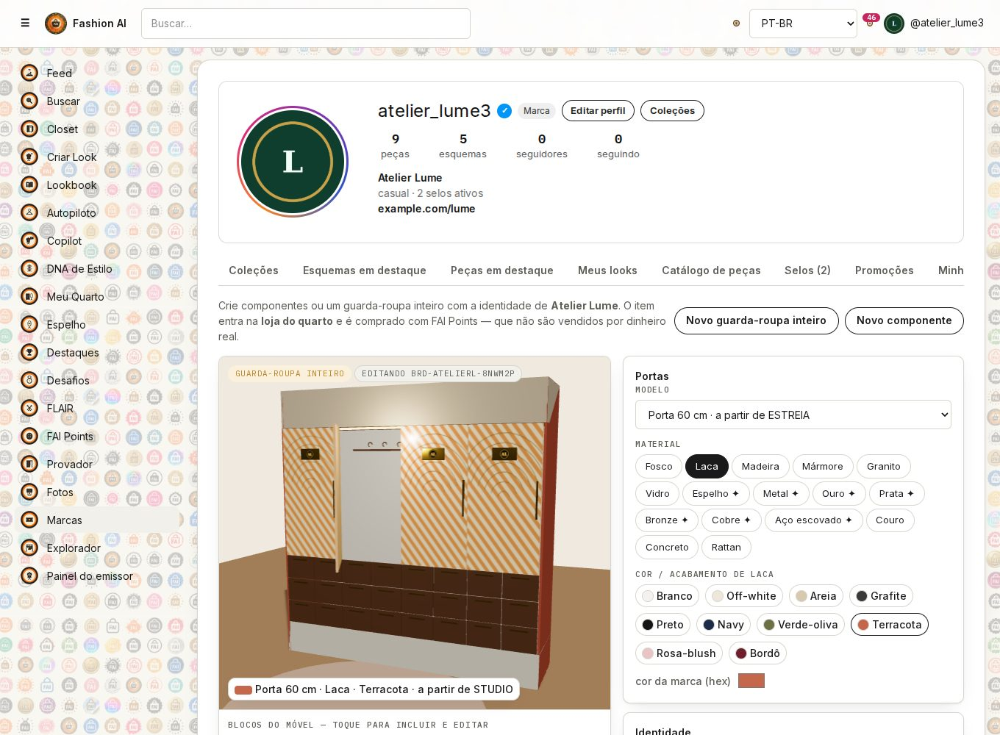
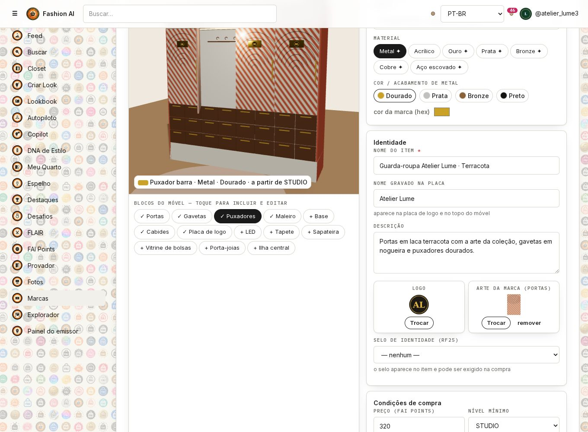
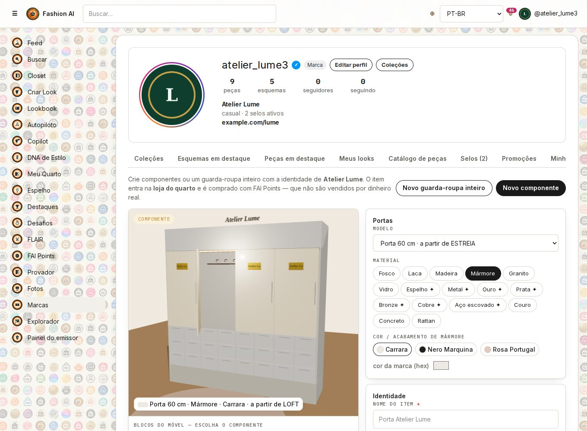
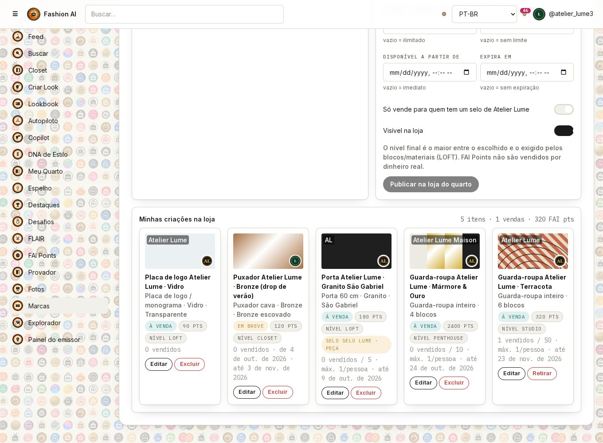
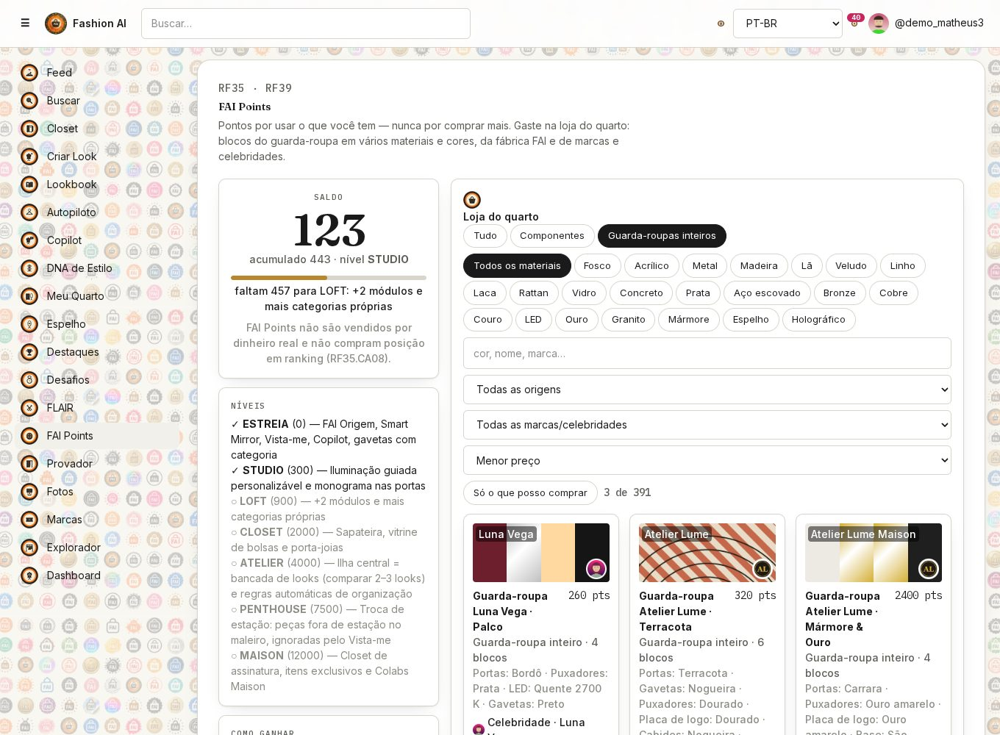
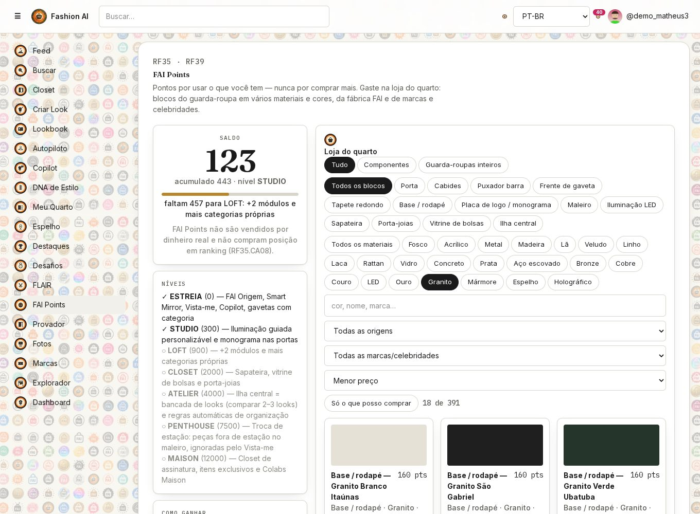
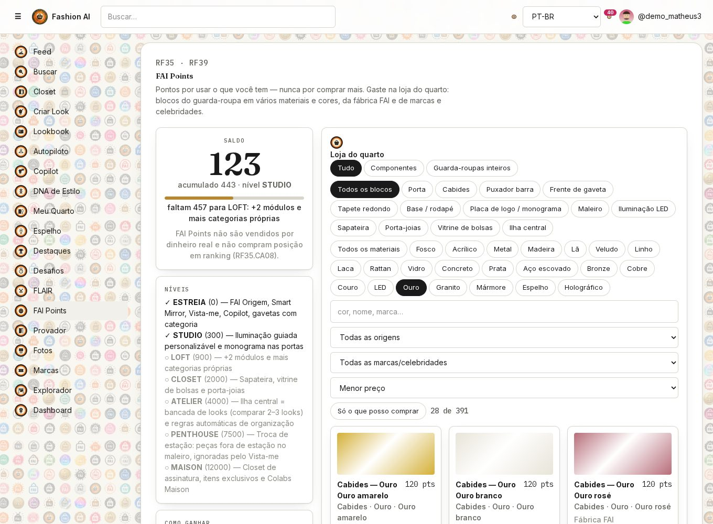
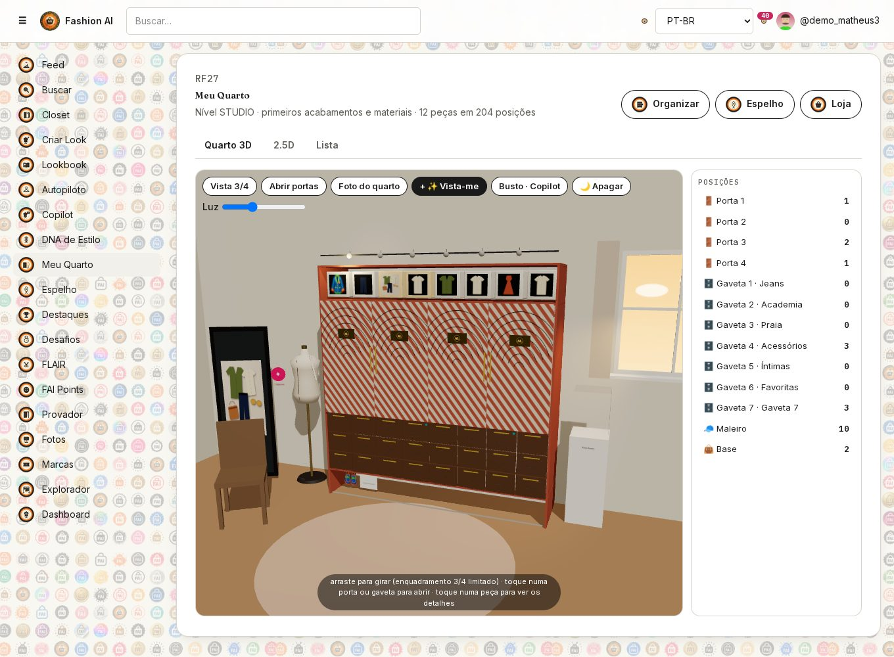
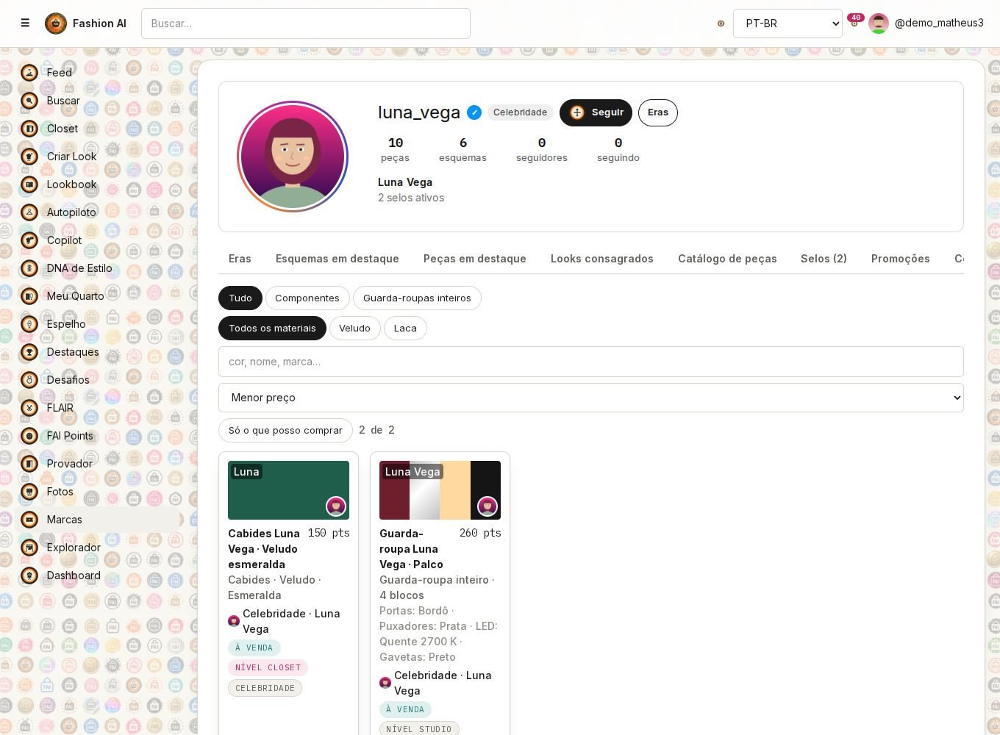

# RF39 — Criar guarda-roupa 3D (marca/celebridade) e loja do guarda-roupa

**Ator:** perfil de marca ou celebridade (cria) · usuário comum (compra).
**Onde:** aba **"Criar guarda-roupa 3D"** do perfil da marca/celebridade (`/brands/{slug}?tab=GUARDA_ROUPA`) e **Loja do quarto** em FAI Points (`/points`).
**Moeda:** FAI Points. Não são vendidos por dinheiro real e não compram posição em ranking (RF30).

## Critérios de aceite

| CA | Descrição |
|----|-----------|
| CA01 | Só perfis **MARCA** ou **CELEBRIDADE** acessam o criador. Outros perfis recebem `403 ACESSO_NEGADO`. Visitantes veem a aba "Guarda-roupa 3D" com os itens daquela marca à venda. |
| CA02 | Criar um **componente** (um bloco: modelo, material e cor) ou um **guarda-roupa inteiro** (conjunto de blocos, com um acabamento por tipo de bloco). |
| CA03 | Blocos do móvel: portas (60/90 cm), frentes de gaveta, puxadores (cava, barra, couro), maleiro, base, cabides, placa de logo/monograma, iluminação LED, tapete, sapateira, vitrine de bolsas, porta-joias e ilha central. |
| CA04 | Materiais: fosco, laca, **madeira**, **mármore**, **granito**, **vidro**, espelho, metal, **ouro**, **prata**, **bronze**, cobre, aço escovado, couro, veludo, linho, acrílico, lã, concreto, rattan e LED. Cada material tem as próprias cores/acabamentos (ex.: granito São Gabriel, Branco Itaúnas, Verde Ubatuba e Vermelho Brasília; ouro amarelo, rosé e branco), além de rugosidade, metalicidade, fator de preço e nível mínimo. |
| CA05 | Identidade da marca: logo (PNG), arte da marca aplicada nas portas, nome gravado na placa e **selo de identidade** (RF25). |
| CA06 | Condições de compra: preço (0 a 20 000 FAI Points; o sistema sugere Σ preço base × fator do material), nível mínimo (o maior entre o escolhido, o do bloco e o do material), estoque (edição limitada), limite por pessoa, **disponível a partir de**, **expira em** e "exige selo aprovado num look". |
| CA07 | Pré-visualização 3D do FAI Origem. Tocar num bloco da cena o seleciona para edição (criador de blocos). |
| CA08 | "Minhas criações" mostra vendas e pontos, e permite editar e excluir. Um item que já foi vendido só sai da loja: quem comprou continua com ele. |
| CA09 | A loja lista todos os blocos × materiais × cores da fábrica FAI (catálogo gerado na inicialização) e os itens de marcas/celebridades. Filtros: tipo, bloco, material, origem, marca, busca por cor/nome, "só o que posso comprar" e ordenação. |
| CA10 | A compra valida nível, estoque, janela de disponibilidade, limite por pessoa e selo, e responde `409` com o motivo (`NIVEL_INSUFICIENTE`, `ESGOTADO`, `CONDICAO_DE_COMPRA`, `SALDO_INSUFICIENTE`). |
| CA11 | Montagem: o componente vai para um módulo compatível. O guarda-roupa inteiro usa `moduleId=ALL` e troca o acabamento de todos os módulos de cada tipo de bloco. A caixa de entrega do Meu Quarto também monta sozinha. |
| CA12 | Os selos do RF25 têm **disponível a partir de** e **expira em**. A lista de selos mostra a janela e o selo fica indisponível fora dela. |

## Endpoints

| Método | Endpoint | Uso | Banco |
|--------|----------|-----|-------|
| GET | `/api/room-creator/options` | blocos, materiais, cores, níveis, identidade e selos ativos | MySQL (`users`, `brand_profiles`/`celebrity_profiles`, `seals`) |
| GET | `/api/room-creator/items` | minhas criações + vendas | MySQL `room_catalog` |
| POST | `/api/room-creator/items` | cria um componente ou um guarda-roupa inteiro | MySQL `room_catalog` (V20: `kind`, `material`, `color_name`, `bundle_json`, `logo_url`, `art_url`, `label_text`, `seal_id`, `available_from/until`, `per_user_limit`, `requires_seal`) |
| PUT | `/api/room-creator/items/{sku}` | edita o item e as condições | MySQL `room_catalog` |
| DELETE | `/api/room-creator/items/{sku}` | exclui o item; se já vendido, só o desativa | MySQL `room_catalog` |
| POST | `/api/room-creator/uploads?kind=logo\|art` | envia o logo (PNG) ou a arte (JPEG) | armazenamento de mídia (local/S3) |
| GET | `/api/points/shop` | loja com condições, `blocker`, unidades compradas e módulos compatíveis | MySQL `room_catalog`, `room_inventory`, `fai_points_ledger` |
| POST | `/api/points/shop/{sku}/purchase` | compra | MySQL `fai_points_ledger`, `room_inventory`, `room_catalog.sold_count` |
| POST | `/api/me/room-inventory/{id}/apply` | monta o item (`moduleId` ou `ALL`) | MySQL `room_layouts.modules_json` |
| GET | `/api/me/room` | quarto com os acabamentos (cor, material, metalicidade, arte, logo, nome gravado) | MySQL `room_layouts` |

## Teste de ponta a ponta (API real + MySQL)

| Passo | Resultado |
|-------|-----------|
| Atelier Lume envia o logo e a arte | 200, mídia gravada |
| Cria "Guarda-roupa Atelier Lume · Terracota" (6 blocos: portas em laca terracota com a arte, gavetas em nogueira, puxadores e placa dourados, cabides em nogueira e maleiro em laca areia) | 201, nível calculado STUDIO |
| Cria "Mármore & Ouro" (portas Carrara, puxadores e placa em ouro amarelo, base em granito São Gabriel) | 201, nível PENTHOUSE (por causa do ouro) |
| Cria uma porta de granito com selo exigido, estoque 5 e 1 por pessoa | 201, nível LOFT |
| Cria um puxador de bronze com "disponível a partir de" daqui a 10 dias | 201, `EM_BREVE` |
| Material inválido para o bloco (LED na porta), bloco desconhecido, janela invertida, guarda-roupa sem blocos, preço 99 999, usuário comum criando | 400 `MATERIAL_INVALIDO` / 400 `BLOCO_INVALIDO` / 400 `PERIODO_INVALIDO` / 400 `SEM_BLOCOS` / 400 `PRECO_INVALIDO` / 403 |
| Luna Vega (celebridade) cria cabides de veludo esmeralda e um guarda-roupa "Palco" | 201, raridade `CELEBRIDADE` |
| demo_matheus3 (nível STUDIO) compra os itens bloqueados | 409 `NIVEL_INSUFICIENTE` |
| demo_matheus3 compra "Terracota" e monta com `ALL` | 200. Saldo 443 → 123. Portas, gavetas, puxadores, placa, cabides e maleiro trocam de acabamento em `/api/me/room` |
| Segunda compra do mesmo item | 409 `CONDICAO_DE_COMPRA` ("Limite de 1 por pessoa") |
| Minhas criações após a venda | 1 venda · 320 FAI pts |

Os testes unitários estão em `WardrobeCatalogTest`: todo material de bloco existe, toda cor de material tem hex, os materiais pedidos existem e os estados de disponibilidade (DISPONIVEL, EM_BREVE, EXPIRADO, ESGOTADO, INATIVO) estão cobertos.

## Telas

| | |
|---|---|
|  |  |
|  |  |
|  |  |
|  |  |
|  | |

> "Granizo", no pedido, foi interpretado como **granito** (pedra de bancada). Se a intenção era outro acabamento, basta acrescentar um material em `WardrobeCreatorService.MATERIALS`.
