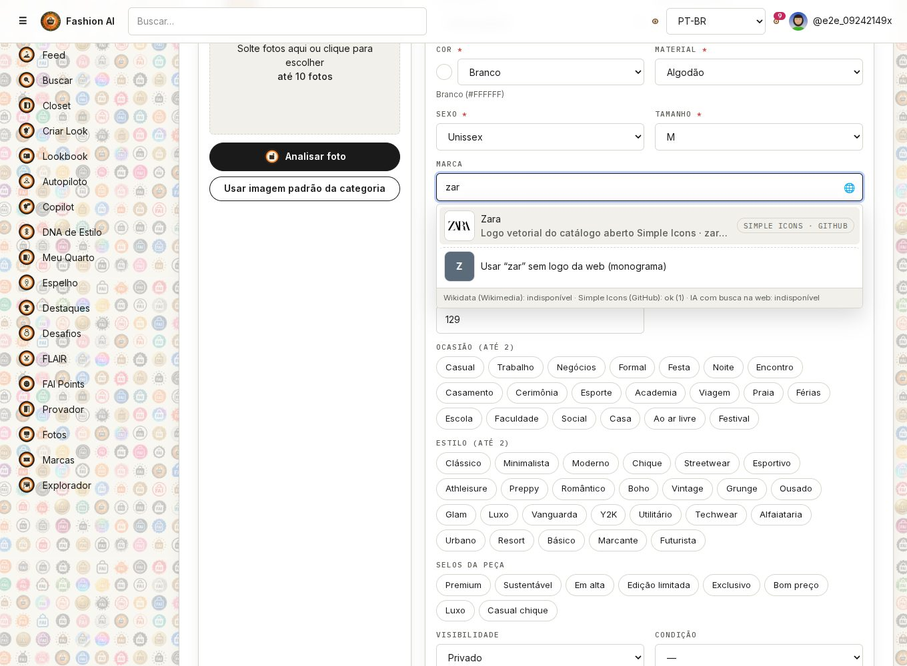
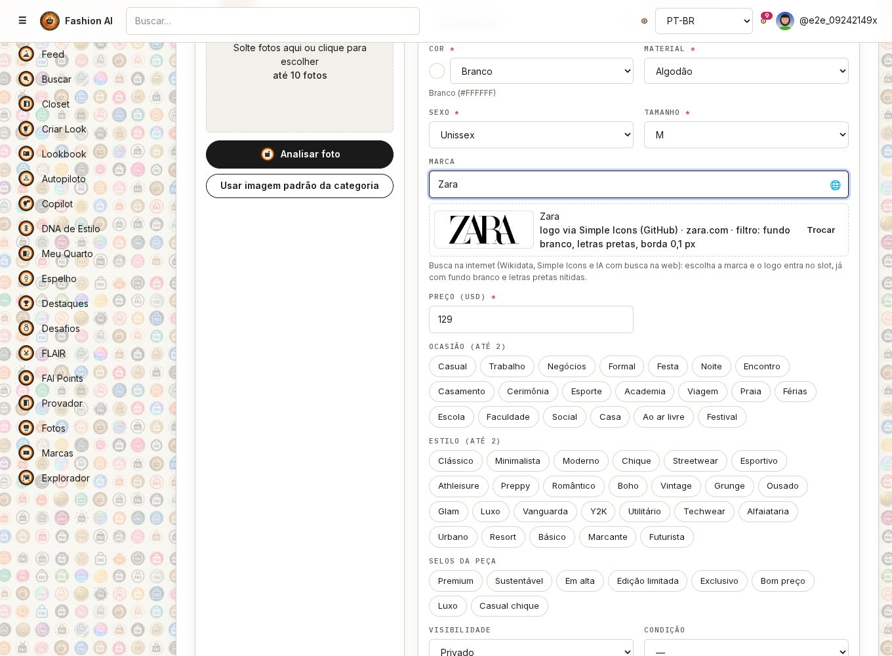
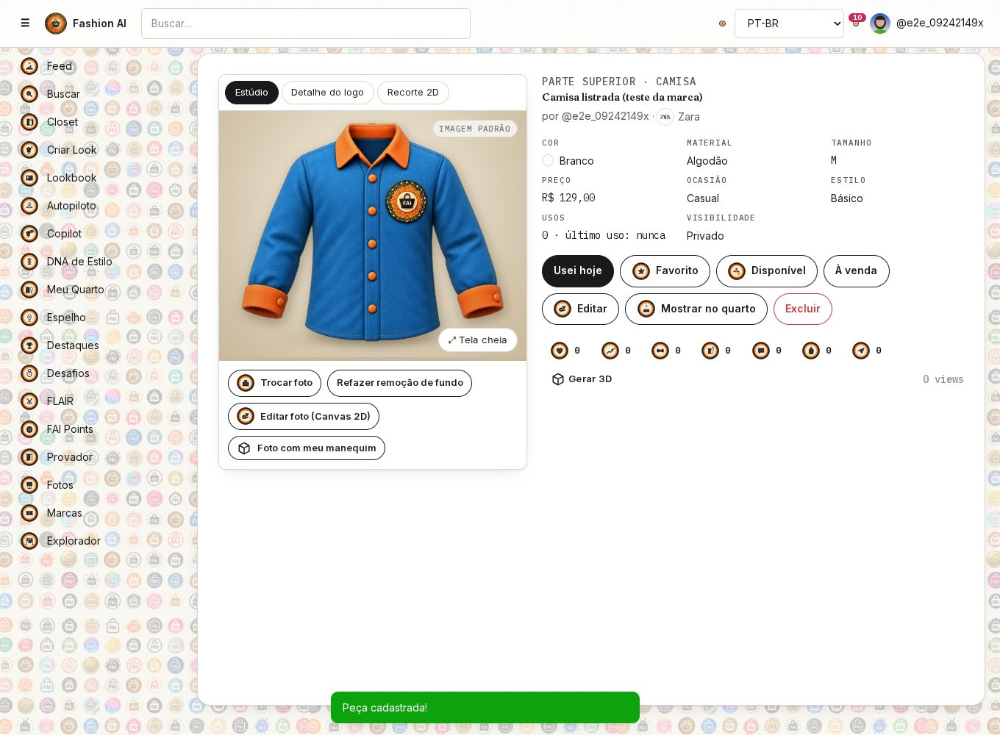
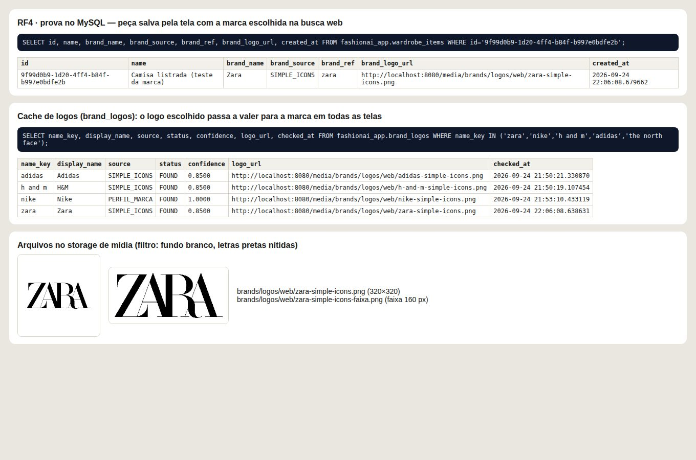
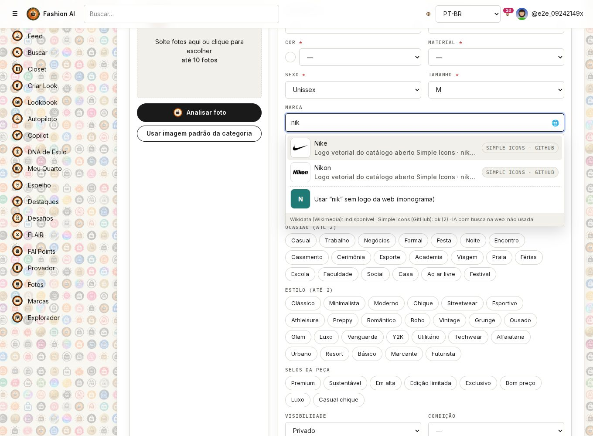
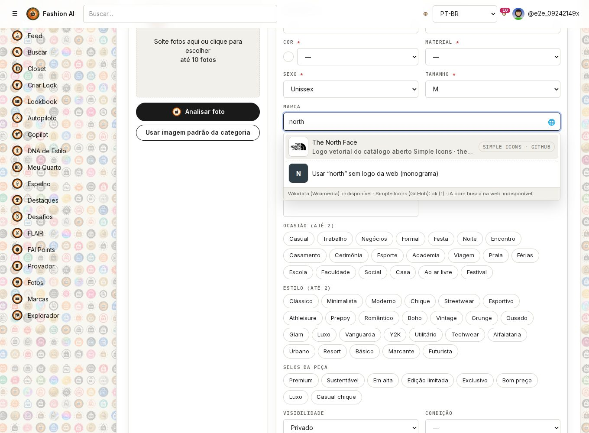
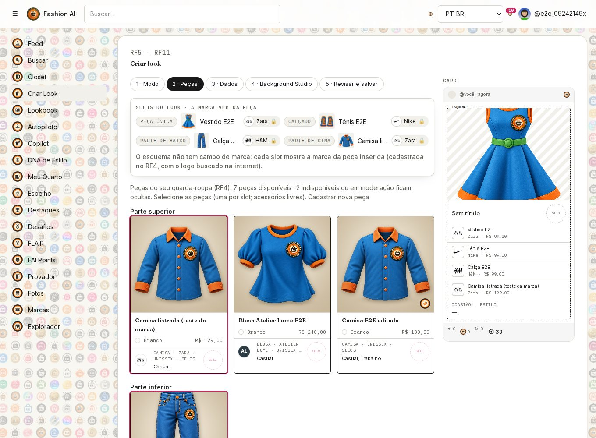
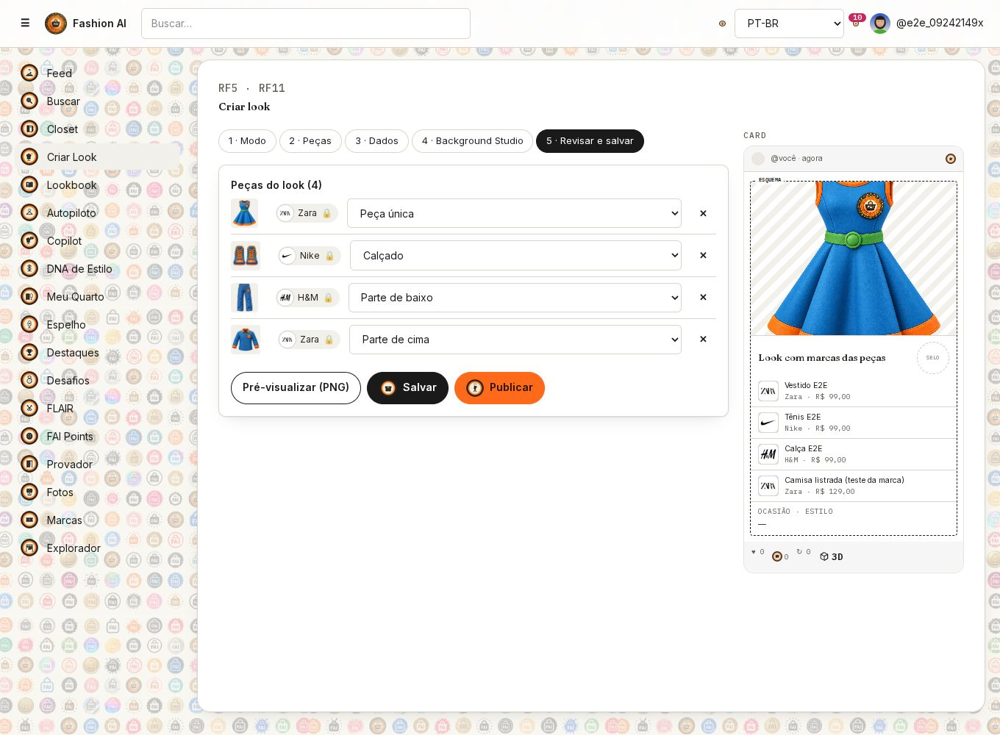
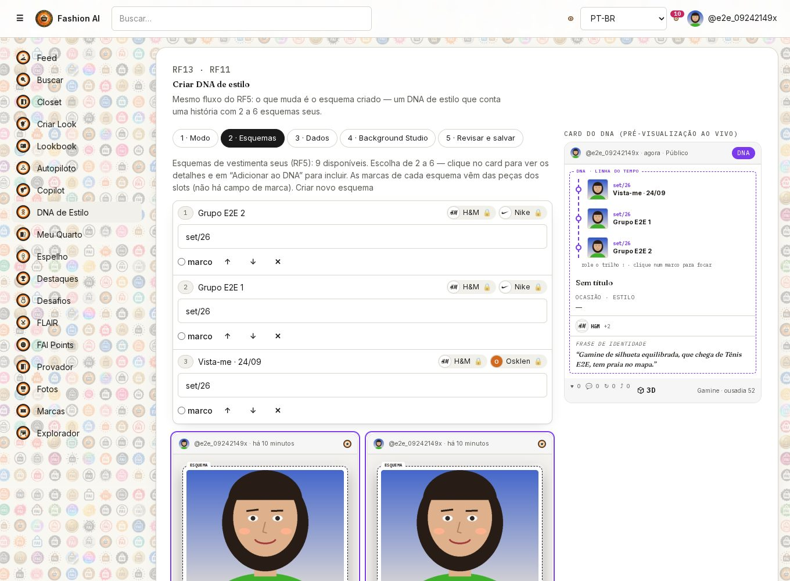
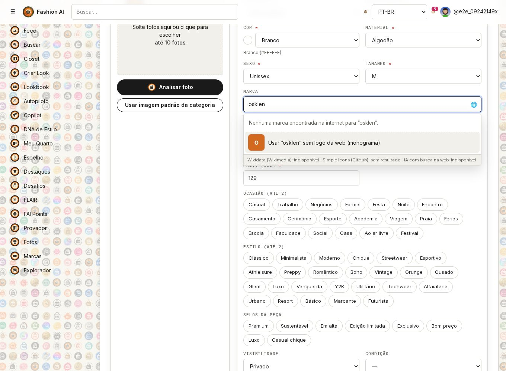

# RF4 — Campo marca como buscador web (e marca automática no RF5/RF13)

**Pedido:** o campo marca do formulário de peça (RF4) passa a buscar a marca **na internet**, sem catálogo de marcas
pré-cadastrado no backend. A busca preenche o nome **e o slot do logo**. O logo tem sempre **fundo branco e letras
pretas nítidas**; logo sem nitidez é recusado. No RF5 (esquema) e no RF13 (DNA) **não existe campo de marca**: a marca
de cada slot vem da peça inserida.

## Como funciona

| Etapa | O que acontece | Código |
|-------|----------------|--------|
| Digitação | a partir de 2 letras, 380 ms depois da última tecla, o formulário chama `GET /api/brand-search?q=` | `components/brand-search-input.tsx` |
| Fontes | **Wikidata** (itens de moda, logo oficial P154 via Wikimedia Commons, site P856) e **Simple Icons** (catálogo aberto CC0 de logos vetoriais, lido do GitHub na hora) em paralelo; a **IA com busca na web** (`BRAND_LOGO_FINDER`) entra quando as duas trazem menos de 2 marcas com nome igual ou começando pelo texto | `BrandWebSearchService` |
| Junção | a mesma marca vinda de fontes diferentes vira um resultado (fonte mais confiável; herda site/logo que faltar) e a lista é ordenada: nome igual → começa com → contém | `BrandWebSearchService.merge` |
| Filtro do logo | até 6 logos por busca passam pelo pipeline: vetor desenhado em preto no branco; imagem com fundo, contraste e **nitidez** medidos; recorte; binarização em S; saídas quadrada (320×320) e faixa (160 px) | `LogoFilter`, `SvgPathRenderer` |
| Escolha | o nome e o slot "logo da marca" são preenchidos; "usar o texto sem logo da web" deixa a marca como texto livre (monograma) | `BrandSearchInput` |
| Gravação | `POST/PUT /api/pieces` com `brandName`, `brandLogoUrl`, `brandSource`, `brandRef`; o backend só aceita logo que esteja no storage próprio e registra o logo em `brand_logos`, valendo para a marca em todas as telas | `WardrobeService.brandFromWebSearch`, `BrandLogoService.acceptWebLogo` |
| RF5/RF13 | o slot mostra a marca da peça (logo + nome, 🔒). O payload do esquema não tem marca | `SlotBrand` (scheme-builder), `SchemeBrands` (dna-builder) |

Não há catálogo de marcas guardado: o índice do Simple Icons e o resultado de cada busca ficam **só em memória**
(12 h e 30 min). Só a marca escolhida é gravada — na peça (`wardrobe_items.brand_*`, migração V21) e no cache de logos.

## Pipeline de filtro do logo

1. achata a transparência sobre branco;
2. fundo = branco (PNG transparente) ou a cor mais comum da moldura; moldura com menos de 60% dessa cor → `FUNDO_NAO_UNIFORME`;
3. tinta = distância de cada pixel à cor do fundo (logo colorido, claro no escuro ou escuro no claro vira preto);
4. contraste do desenho < 0,35 → `CONTRASTE_BAIXO`;
5. limiar de Otsu; **nitidez** = largura média da transição no contorno e gradiente; borda > 2,2 px ou gradiente < 0,30 → `SEM_NITIDEZ`;
6. recorte justo; ampliação acima de 2× num recorte pequeno → `RESOLUCAO_BAIXA`; bloco sólido → `BLOCO_SOLIDO`;
7. binarização em curva S estreita: preto puro no desenho, branco puro no fundo, 1 px de antisserrilhado;
8. saídas quadrada 320×320 e faixa 160 px; a borda final fica registrada (`larguraDaBordaFinalPx`).

Testes: `LogoFilterTest` (vetor aceito e nítido, arco SVG com flags colados, fundo escuro invertido, logo vermelho vira
preto, logo borrado recusado, miniatura recusada, foto recusada) e `BrandWebSearchServiceTest` (slug do Simple Icons,
casamento do texto, junção das fontes).

## O que foi possível testar neste ambiente

A política de rede do container bloqueia `wikidata.org`, `wikimedia.org`, Google e outros hosts (403 no proxy), e não
há chave de IA configurada. Por isso, nas telas deste teste, **Wikidata e IA aparecem como "indisponível"** e os
resultados vêm do **Simple Icons**, lido ao vivo de `raw.githubusercontent.com`. Marcas que não estão no Simple Icons
(ex.: Osklen) não aparecem aqui e ficam como texto livre; com a rede liberada, a Wikidata e a IA cobrem essas marcas.
Para liberar: nas configurações do ambiente, em *Network access*, adicionar `www.wikidata.org`, `commons.wikimedia.org`
e `upload.wikimedia.org` (e configurar `ANTHROPIC_API_KEY` para a IA).

## Endpoints

| Método | Endpoint | Banco |
|--------|----------|-------|
| GET | `/api/brand-search?q=` | nada gravado na busca; logos filtrados vão para o storage de mídia (`brands/logos/web/`) |
| POST | `/api/pieces` · PUT `/api/pieces/{id}` | MySQL `wardrobe_items` (`brand_name`, `brand_logo_url`, `brand_source`, `brand_ref`) e `brand_logos` |

## Telas (teste real neste ambiente)

| | |
|---|---|
|  |  |
|  |  |
|  |  |
|  |  |
|  |  |

Diagramas: `docs/diagramas/RF4/RF4-atividades-v3.puml`, `RF4-sequencia-v3.puml`, `RF4-pipeline-filtro-logo.puml`,
`RF4-classes-buscador-marcas.puml` e `docs/diagramas/RF5/RF5-atividades-v4.puml`, `RF5-sequencia-v3.puml`.
