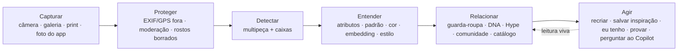
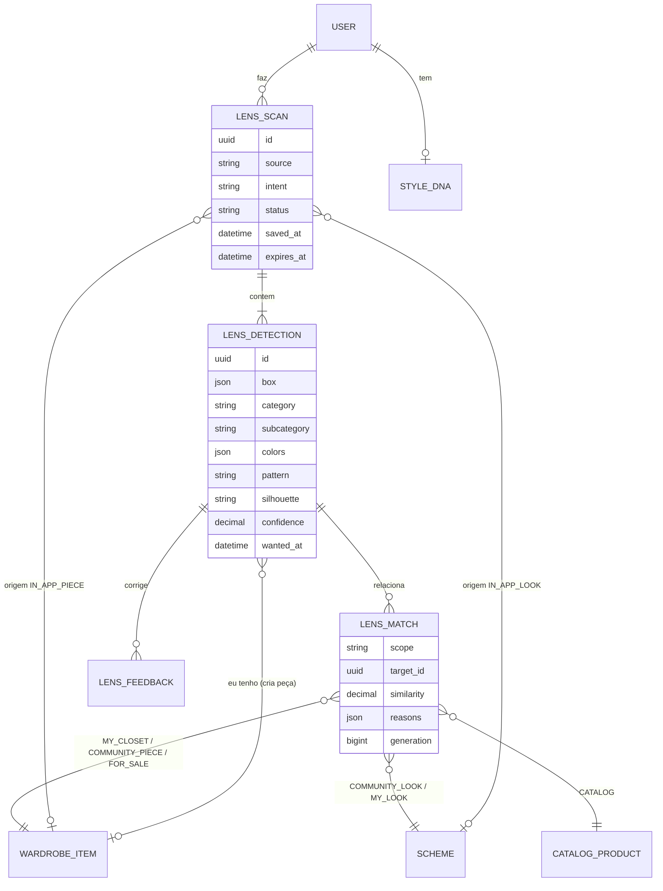
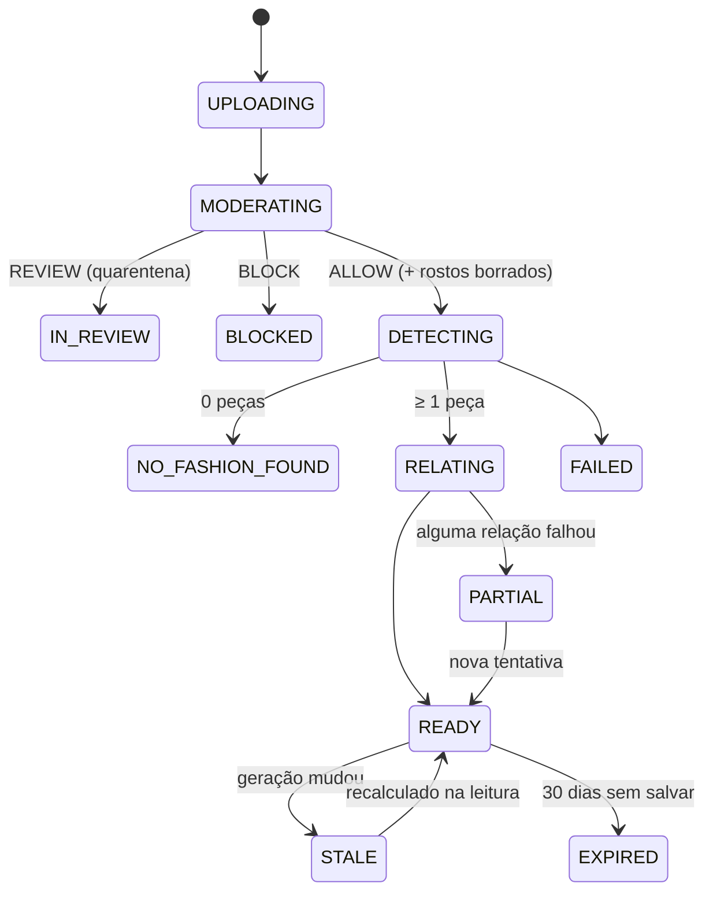

# RF54 — FashionAI Lens (especificação + MVP implementado em 2026-10-05)

> **O Google Lens responde "o que é isto e onde compro?". O FashionAI Lens responde "o que isto significa para o meu
> estilo e para o meu guarda-roupa?".** A pessoa aponta a câmera (ou envia uma foto ou um print) para uma roupa vista na
> rua, numa vitrine, num post ou dentro do próprio app. O Lens reconhece as peças, lê o estilo e liga cada peça ao
> guarda-roupa, aos looks, ao DNA de estilo, ao Hype e ao Copilot. Comprar é a última opção, não a primeira.

**Numeração.** A numeração oficial é a do Trello e um RF novo recebe o próximo número livre
(`markdowns/02-rf-reestruturados-e-criterios-aceite.md` §1). Este documento nasceu como "RF48", mas o RF48 ficou com
o resgate e as doações de FAI Points ([documento](RF48_FAI_Points_Resgate_e_Doacoes.md)) e o RF53 com o HypeScore v2
([documento](RF53_HypeScore_v2.md)). Por isso o Lens é proposto como **RF54**: confirme no board antes de criar os
cards RF54 e HU-RF54.

Contexto: este RF faz parte da refatoração por domínios descrita em
[`docs/hype/01-AUDITORIA_E_PROPOSTA_IA.md`](../hype/01-AUDITORIA_E_PROPOSTA_IA.md) e usa o HypeScore v2
([`docs/hype/HYPESCORE_ARCHITECTURE.md`](../hype/HYPESCORE_ARCHITECTURE.md)).

---

## Implementação (2026-10-05)

O MVP entrou nos commits `d865abc5` (backend), `07262131` e `87c00ed3` (frontend). Ele cobre a fase 1 e parte das
fases 2 e 3 do §14, pelo contrato de API do MVP. Daqui em diante, o resto do documento é a **especificação**; onde o
código ficou diferente, vale esta seção.

### O que foi feito × especificação

| Tema | Especificação | Implementado |
|---|---|---|
| Processamento | assíncrono (`JobQueuePort`), `202` + consulta | **síncrono**: o `POST` já devolve o scan pronto (`200`) |
| Rostos | borrados no servidor (`OnnxPersonSegmenter`) | borrados **no navegador**, antes do upload (`lib/lens/redact.ts`): a foto é redesenhada num canvas (o que descarta EXIF/GPS), e cada rosto achado pelo MediaPipe Face Landmarker (o mesmo do Avatar 3D) é pixelado e desfocado, em até 4 passadas. Sem detector (offline, sem WebAssembly/WebGL), `faces = -1` e a tela exige a confirmação explícita "a foto não mostra o rosto de ninguém" antes de enviar. O servidor grava `faces_redacted` e `redaction_confirmed`, mas **não** borra de novo |
| Detecção | núcleo do `MultiPieceService` | `MultiPieceService.detectPieces` (extraído do cadastro de várias peças), pelo `AiEngine` (`MULTI_PIECE_DETECTOR`: consentimento `AI_EXTERNAL_PHOTO_PROCESSING`, cota, orçamento). Sem IA: **leitura local** = uma peça cobrindo a foto, sem categoria e com confiança 0 (faixa "baixa"); o scan sai `READY`, com `aiSource = local` e `errorCode` `CONSENT_REQUIRED` ou `QUOTA` quando é esse o motivo |
| Leitura do recorte | `PatternAnalyzer`, `ColorMath`, `GarmentEmbedder` | `LensImageAnalysis`: paleta com a fração de cada cor (cor principal primeiro), padrão (`solid`, `striped`, `checked`, `printed`) e embedding de 96 dimensões do recorte |
| Semelhança | §9.2 | `LensSimilarity` + `LensConfig` (`LENS_V1`): pesos .45/.35/.20, atributos .40/.15/.15/.15/.15, cor por **ΔE00 (CIEDE2000, Sharma et al. 2005)** com teto 40, renormalização sem embedding ou sem cor, pisos 55 (`MY_CLOSET`) e 65 (`COMMUNITY`), top 12 |
| Camada viva | recalculada quando a geração muda | recalculada **a cada leitura** e nunca gravada (não existe `lens_matches`): correspondências, compatibilidade, Hype do grupo e plano sempre refletem o guarda-roupa, o DNA e o Hype de agora |
| Hype do grupo | §10.1 | `LensReading.trend`: chaves `cc:`/`st:`/`cm:` no formato do `HypeSnapshotService`, ordem cor → estilo → material, ≥ 5 peças públicas elegíveis; senão "dados insuficientes" |
| Recriar | modos + slots | `POST …/recreate`: slots TOP, BOTTOM, FULL, SHOES, ACCESSORY (estado `own`, `alternative` ou `gap`), peso da semelhança por modo (Seguro .75, Descoberta .55, Experimental .35), `locked`, os seis números do `RecommendationScoring` e `createHref` para o criador de looks |
| Correções | chips editáveis + `lens_feedback` | `PATCH …/detections/{did}` (categoria, subcategoria, cor, material, padrão, estilos, `dismissed`) grava `lens_feedback` (`WRONG_CATEGORY`, `WRONG_COLOR`, `WRONG_ATTRIBUTE`, `NOT_CLOTHING`, `MISSING_PIECE`…), com `training_consent` só se a pessoa concedeu `AI_MODEL_TRAINING` |
| Cota e retenção | 30 scans/dia; 30 dias | `RateLimitPort` (`fashionai.lens.daily-scans`, padrão 30): estourada, `429 QUOTA` com `resetAt` e nada gravado; falha do detector devolve a cota. `LensRetentionJob` (diário, 04:40, America/Sao_Paulo) apaga scans não salvos vencidos (imagem, miniatura, peças e correções); excluir a conta apaga todos (`AccountService` → `LensService.deleteAllFor`) |
| Telas | 6 abas + captura | `/lens` (Câmera · Galeria · Recentes; a câmera é `<input capture="environment">`) e `/lens/[scanId]` com hotspots, **Foco** na URL (`?focus=`) e as abas Leitura, Seu guarda-roupa, Recriar, Estilo & Hype e Descobrir (`?tab=`); `LensDetectionCard` com flip próprio; item "FashionAI Lens" no menu |

### API (13 rotas em `/api/lens/**` + o histórico em `/api/me/lens/scans`; todas exigem login)

| Método | Rota | Observação |
|---|---|---|
| POST | `/api/lens/scans` | multipart `image`, `source` (CAMERA, GALLERY, UPLOAD), `intent` (IDENTIFY, RECREATE), `facesRedacted`, `redactionConfirmed`; passa pelo `UploadSafetyInterceptor` |
| POST | `/api/lens/scans/from-app` | `{type: PIECE\|LOOK, id}`: 404 se quem pede não pode ver o original; nada vira visualização |
| GET | `/api/lens/scans/{id}` | scan + peças + leitura |
| GET | `/api/lens/scans/{id}/image?variant=thumb` | JPEG sem metadados, `Cache-Control: private` (rota nova, não estava no §9.3) |
| PATCH · DELETE | `/api/lens/scans/{id}` | `{saved}` (inspiração não expira) · apaga tudo (204) |
| GET | `/api/lens/scans/{id}/matches?detection=&scope=MY_CLOSET\|COMMUNITY` | `COMMUNITY` = só peças públicas elegíveis de **outras** pessoas, visíveis para quem pede |
| GET | `/api/lens/scans/{id}/reading?detection=` | estilos, paleta, ocasiões, estação, `fit` (DNA; nulo sem DNA), `trend` (Hype do grupo), `impact` |
| POST | `/api/lens/scans/{id}/recreate` | `{mode, focus?, locked?}` |
| PATCH | `/api/lens/scans/{id}/detections/{did}` | correção ou "não é roupa" |
| POST | `/api/lens/scans/{id}/detections` | a pessoa marca uma peça (caixa em %, lado mínimo 3%) |
| PUT | `/api/lens/scans/{id}/detections/{did}/want` | `{wanted}` ("Quero"; no lugar do PUT/DELETE do §9.3) |
| POST | `/api/lens/scans/{id}/detections/{did}/own` | "Eu tenho": liga a uma peça própria ou devolve `/pieces/new?…` pré-preenchido, nunca com o recorte da foto |
| GET | `/api/me/lens/scans?saved=&wanted=&page=&size=` | histórico e inspirações (`Page<LensScanCard>`) |

Outra pessoa recebe **404** em qualquer rota (nunca 403). `GET /api/admin/lens/metrics` não foi implementado.

### Dados (Flyway `V40__fashionai_lens.sql`)

`lens_scans` (dono, origem, intenção, estado, `error_code`, chaves `restricted/users/{id}/lens/{scanId}.jpg` e
`-thumb.jpg`, tamanho, `faces_redacted`, `redaction_confirmed`, `ai_source`, `model_version`, `algorithm_version`,
`ai_inference_id`, `saved_at`, `expires_at`), `lens_detections` (caixa em %, rótulo, taxonomia, material, cores,
padrão, estilos, ocasiões, confiança, `attribute_confidence_json`, embedding, estado, `dismissed_at`, `wanted_at`,
`owned_item_id`) e `lens_feedback` (antes/depois da correção, tipo, `training_consent`). Diferenças do §5.2: estados do
scan reduzidos a `READY`, `PARTIAL` (reservado; o MVP síncrono não usa), `NO_FASHION_FOUND` e `FAILED`; intenções só
`IDENTIFY` e `RECREATE`; sem `lens_matches`.

### Privacidade

Scan sempre privado (só o dono lê, terceiros recebem 404); imagem em área `restricted/`, regravada em JPEG sem
EXIF/GPS e servida só ao dono; rostos borrados no aparelho antes do envio; o Lens **nunca** escreve em
`hype_signal_daily` nem entra em ranking ou estatística pública (teste `lensNuncaEscreveSinalDeHype`); "Eu tenho" nunca
usa o recorte da foto como foto da peça; retenção de 30 dias sem salvar; exclusão da conta apaga os scans.

### O que ficou de fora do MVP

- **Desenhar a caixa**: "Marcar uma peça" envia a imagem inteira como caixa (o backend já aceita caixa em %).
- **Confiança por atributo** na tela: o banco guarda a da detecção e a do padrão (`attribute_confidence_json`), mas a
  interface mostra uma faixa só por peça.
- **Provar** as peças do plano (RF18), **modo ao vivo** (`getUserMedia` + MediaPipe contínuo) e a foto no Copilot.
- **Descobrir** sem filtros e só com peças da comunidade: faltam Catálogo RF47 (`CatalogProductCard`), peças à venda e
  looks parecidos.
- Ponto de entrada "Ver no Lens" dentro do app (o backend `from-app` existe, a tela ainda não chama), segmento
  Inspirações no Lookbook, evento `LENS_SCAN` no Histórico, "desde o scan" (`LensDiff`), intenções do Copilot e
  `/api/admin/lens/metrics`.
- Borrão de rosto **no servidor**: quem chama a API sem o cliente web (ou com o detector indisponível e a confirmação
  marcada) envia a imagem como está; a moderação de upload continua valendo. `docs/seguranca/moderacao-de-imagens.md`
  continua pendente.

### Testes

| Camada | Classe / arquivo | Casos |
|---|---|---|
| Backend | `LensSimilarityTest` (pesos, renormalização, ΔE00 com dados de referência, pisos e top N) | 8 |
| Backend | `LensReadingTest` (composição de estilo, paleta, chaves do Hype, k ≥ 5, slots) | 6 |
| Backend | `LensServiceTest` (imagem privada sem metadados, 404 em toda rota, NO_FASHION_FOUND, leitura local, correção + feedback, descartar e desfazer, retenção de 30 dias, excluir scan e conta, "Ver no Lens" com visibilidade, comunidade sem peça própria nem não pública, Hype do grupo, Recriar, Eu tenho/Quero, cota sem gravar nada, validação, nunca escreve sinal de Hype) | 16 |
| fai-web | `LensAccessTest` (visitante 401, outra pessoa 404, dono lê scan e imagem, multipart do contrato) | 4 |
| Frontend | `components/lens/lens-capture.test.tsx` (login, rostos borrados → multipart, confirmação com `faces = -1`, cota, Recentes) | 5 |
| Frontend | `components/lens/lens-result.test.tsx` (hotspots acessíveis, Foco na URL, flip, Quero, nunca "0%", correção sem recarregar, Recriar, DNA × Hype separados, NO_FASHION_FOUND, cota, salvar, excluir, 404) | 15 |
| Frontend | `lib/lens/model.test.ts` (hotspot, caixa saneada, recorte, expiração, caixa do rosto, sem detector → `faces = -1`) | 8 |

### Evidência real (E2E de 2026-10-05)

Com MySQL 8.4 (V1–V40), o backend local e o Next no Chromium sem interface (Playwright), uma foto de jaqueta
(1532 × 1027) enviada pela aba Câmera:

1. O navegador sem interface não carrega o detector de rostos, então a tela pediu a confirmação explícita antes de
   enviar (`redaction_confirmed = true`, `faces_redacted = 0`).
2. O scan voltou `READY` com **1 peça detectada**: paleta azul (59%), preto (25%) e laranja (16%), padrão
   "estampado", sem categoria. Sem IA externa no ambiente, a leitura foi **local**
   (`model_version = multi-piece-detector@local+garment-embedding@1.0.0`), e a tela avisou: "Leitura local: a IA
   online não foi usada" e "baixa confiança · confira esta leitura".
3. Seu guarda-roupa: "Sem correspondência no seu guarda-roupa" + a lacuna (nunca "0%"). Estilo & Hype: sem DNA, convite
   para criar; Hype do grupo "Dados insuficientes". Recriar: sem plano, porque a peça local não tem categoria.
   Descobrir: nenhuma peça pública parecida.
4. Expiração mostrada: 30 dias (`expires_at` = criação + 30 dias).

Telas em [`docs/hype/EVIDENCIAS_E2E.md`](../hype/EVIDENCIAS_E2E.md) (11 e 12). Diagramas (os cinco tipos):
`docs/diagramas/RF54/`.

---

## 1. Objetivo principal

**Transformar qualquer imagem de moda do mundo real numa decisão de estilo pessoal**, nesta ordem:

| # | Pergunta da pessoa | Quem responde no app | Saída do Lens |
|---|---|---|---|
| 1 | **O que é isto?** | detecção multipeça + análise de atributos (RF4) | peças com categoria, cor, material, padrão, silhueta e estilo, sempre com a confiança escrita |
| 2 | **Eu já tenho algo assim?** | guarda-roupa (RF7/RF31) + embeddings | correspondências no próprio guarda-roupa e as lacunas (o que falta) |
| 3 | **Combina comigo?** | DNA de estilo (RF13) + `StyleCompatibility` | compatibilidade com o DNA, separada do Hype |
| 4 | **Como eu uso ou recrio isto?** | Copilot (RF10) + `RecommendationScoring` | look recriado com as peças da pessoa, nos modos Seguro, Descoberta e Experimental |
| 5 | **Isto está em alta?** | HypeScore v2 | tendência do estilo ou do grupo de peças parecidas (tendência ≠ popularidade) |
| 6 | **Onde encontro?** *(por último)* | comunidade, Catálogo RF47, peças à venda | peças e looks públicos parecidos e produtos do catálogo, ordenados só por semelhança |

### 1.1 FashionAI Lens × Google Lens

| | Google Lens | FashionAI Lens |
|---|---|---|
| Unidade de resultado | produto parecido | **peça interpretada** (atributos + estilo + contexto) |
| Primeira resposta | onde comprar | **o que você já tem** (closet-first) |
| Referência | catálogo da web | **o seu guarda-roupa**, o seu DNA, os seus looks e depois a comunidade |
| Tempo | foto estática | **leitura viva**: o resultado muda quando o guarda-roupa, o DNA ou a tendência mudam (§1.2) |
| Pessoas na foto | pode buscar rostos e pessoas | **identifica roupas, nunca pessoas** (rostos borrados, sem reconhecimento facial) |
| Ordenação | relevância comercial | semelhança e utilidade para a pessoa; patrocínio fica fora do ranking |

### 1.2 Estilo dinâmico: o scan é um objeto vivo

Um scan tem duas camadas:

```
 CAMADA ESTÁVEL (o que está na foto)          CAMADA VIVA (o que a foto significa para você, hoje)
 ─────────────────────────────────           ───────────────────────────────────────────────────
 imagem (com rostos borrados)                correspondências no guarda-roupa  ← muda quando você adiciona/remove peças
 peças detectadas (caixa, categoria,         compatibilidade com o DNA         ← muda quando o DNA evolui
 cor, material, padrão, silhueta)            Hype do grupo de peças parecidas  ← muda com a tendência (snapshots v2)
 correções feitas pela pessoa                plano "Recriar"                   ← muda com o guarda-roupa e o modo
 embedding visual de cada peça               peças/looks públicos parecidos    ← mudam com a comunidade
```

A camada estável é gravada uma vez, versionada por `model_version`. A camada viva é recalculada na leitura quando
fica velha (geração do guarda-roupa, do DNA ou do Hype; mesmo padrão do `HypeCache`). A diferença aparece como
**"desde o scan"**, por exemplo: "+2 peças suas recriam este look", "a tendência deste estilo esfriou ↓" ou
"agora combina mais com o seu DNA". Por isso uma inspiração salva há três meses continua útil.

---

## 2. Princípios

1. **Closet-first.** Antes de mostrar onde encontrar, mostra o que a pessoa já tem e quantos looks novos isso
   destrava. Mesma regra do `purchaseRules` do Copilot (reusar antes de comprar).
2. **Identifica roupas, nunca pessoas.** Sem reconhecimento facial e sem "quem é esta pessoa". Os rostos são borrados
   antes de gravar ou enviar a terceiros. A finalidade `FACIAL_RECOGNITION` nunca é usada.
3. **Três números, nunca misturados:** **Semelhança** ("é parecida?"), **Compatibilidade** ("combina com você?") e
   **Hype** ("está em alta?"). Cada um tem o próprio rótulo e explicação.
4. **Confiança sempre escrita.** "Alta / média / baixa confiança" em texto, nunca só por cor. Se não há dado, o app
   diz "sem correspondência", nunca "0%".
5. **A pessoa corrige e o app aprende.** Todo atributo é um chip editável; a correção refaz as correspondências na
   hora e alimenta um conjunto de avaliação (com consentimento).
6. **Privado por padrão.** Scans e imagens são da pessoa: nunca públicos, nunca no ranking nem nas estatísticas, e
   expiram se não forem salvos.
7. **Sem pay-to-win.** Semelhança é a única régua da aba Descobrir. Selo de marca, cupom ou patrocínio não sobem
   resultado. Patrocínio, se existir, fica num bloco separado e rotulado.
8. **Explicar, não julgar.** "Esta jaqueta tem silhueta oversized e lavagem clara", nunca "esta jaqueta é bonita".

---

## 3. Fluxo



Meta de tempo: primeiras peças detectadas em ≤ 3 s (p95) e relações completas em ≤ 8 s (p95). O resultado é
progressivo: as peças aparecem antes das correspondências.

---

## 4. O que já existe e é reaproveitado (nada duplicado)

| Necessidade do Lens | Já existe | Onde | O que falta |
|---|---|---|---|
| Várias peças numa foto, com caixa | `MultiPieceService` (`MULTI_PIECE_DETECTOR`, Claude vision → Gemini → local; até 12 peças; caixa mín. 3%) | `POST /api/pieces/analysis/multi`, `components/multi-piece-review.tsx` | extrair o núcleo de detecção para um serviço comum ao cadastro e ao Lens |
| Atributos de uma peça | `WardrobeService.analyze` / `analyzeForCapture` (flat lay, qualidade, prefill com confiança) | `POST /api/pieces/analysis` | modo "leitura": sem rejeitar a foto (como o `lenient`) e sem criar rascunho de peça |
| Padrão (listrado, xadrez…) | `PatternAnalyzer` | `application/vision/analysis` | ligar ao pipeline (hoje não é usado) |
| Semelhança visual | `GarmentEmbedder` (96 dimensões) + tabela `garment_embeddings` (V29) | `application/vision/analysis`, V29 | job de *backfill* dos embeddings das peças do guarda-roupa; hoje nada usa |
| Semelhança por atributos e cor | `ai/local/Similarity` (assinaturas ponderadas, cosseno), `ColorMath` (ΔE, `nearestTaxonomyColor`), `item_embeddings` | `ai/local` | — |
| Produto oficial | `CatalogMatchScorer` (marca .25, subcategoria .20, texto .35, cor .10, **visual .15**) + Catálogo RF47 | `/api/catalog/*` | entrada por imagem (o peso visual já existe) e primeiro uso no frontend |
| Motor de IA governado | `AiEngine`: consentimento por finalidade, cota diária por capacidade, `AiBudget`, *fallback* local, `ai_inference_log` | `application/ai` | capacidade nova `LENS_READER` (ou reuso de `MULTI_PIECE_DETECTOR` + `PIECE_ANALYZER`) |
| Moderação do upload | `UploadSafetyInterceptor` + `ImageSafety` (ALLOW/REVIEW/BLOCK) + `UploadQuarantine` | `fai-web/support`, `application/moderation` | — (o Lens passa pelo mesmo interceptor) |
| Rosto na foto | `OnnxPersonSegmenter` (já separa pele do rosto na moderação) | `fai-infrastructure/ai-providers` | **borrar rostos** antes de gravar e de enviar a terceiros (não existe hoje) |
| EXIF/GPS | `ImageOps.decode` (orientação) + regravação em JPEG sem metadados | `application/imaging` | — |
| Compatibilidade com o DNA | `StyleCompatibility` (coeficiente de sobreposição de estilos, cores e ocasiões) | `application/hype` | — |
| Tendência e Hype | `HypeSnapshotService.attributeKeys` (pares categoria×cor, categoria×material, categoria×estilo), `hype_scores`, `HypeQueryService` | `application/hype` | **Hype de grupo** (média dos públicos com o mesmo par de atributos), §10.1 |
| Recriar com o que tem | `CopilotService` (modos SEGURO/DESCOBERTA/EXPERIMENTAL), `RecommendationScoring` | `application/service`, `application/hype` | intenção `LENS_RECREATE` com as peças detectadas como alvo |
| Salvar como look | `SchemeService` + `/schemes/new?pieces=` | `components/scheme-builder.tsx` | — |
| Provar | `/api/try-on` (FASHN, compositor local) | RF18 | levar as peças do plano para o provador |
| Card com frente e verso | `FashionCard`, `CardFlipButton`, `HypeMetricBar`, `HypeBadge`, `HypeVsStyle`, `HypeStateNotice` | `components/fashion-card.tsx`, `components/hype/*` | — |
| Card de correspondência | `PieceCard` / `SchemeCard` com o slot `extra` | `components/piece-card.tsx` | só o selo `LensMatchBadge` |
| Abas, filtros e segmentos | `Tabs`, `SegmentPicker`, `FilterBar` | `components/ui`, `components/filter-bar.tsx` | — |
| Histórico | `/history` (linha do tempo, estilo, uso, Hype, insights), `TimelineProjectionPort` | `components/history/*` | evento `LENS_SCAN` na linha do tempo |
| Salvos | Lookbook › Salvos com `SegmentPicker` (looks, peças) | `components/lookbook-tabs.tsx` | segmento **Inspirações** |
| Captura por câmera | enum `CaptureSource.CAMERA` (sem uso), MediaPipe já hospedado em `public/mediapipe` | `fai-domain`, `lib/avatar3d` | **não há UI de câmera**: `getUserMedia` com *fallback* para `<input capture="environment">` |

---

## 5. Entidades

### 5.1 Modelo



### 5.2 Tabelas novas (próxima migração livre do Flyway — hoje seria a V38; auditar o banco antes, como no V31 do HypeScore v2)

**`lens_scans`**: um scan por imagem.

| Coluna | Tipo | Regra |
|---|---|---|
| `id`, `user_id` | CHAR(36) | dono; nunca exposto a terceiros |
| `source` | VARCHAR(20) | reusa `CaptureSource` (CAMERA, GALLERY, UPLOAD, IMPORT) + `IN_APP_PIECE`, `IN_APP_LOOK` |
| `source_ref_id` | CHAR(36) NULL | peça ou look do app analisado (só se quem pede pode vê-lo) |
| `intent` | VARCHAR(20) | `IDENTIFY` (padrão), `RECREATE`, `COMPLETE` (o que falta), `COMPARE` |
| `image_key`, `thumb_key` | VARCHAR | chave privada `restricted/users/{id}/lens/…`; imagem já com rostos borrados e sem EXIF |
| `width`, `height`, `faces_redacted` | INT | |
| `status` | VARCHAR(20) | máquina de estados, §8.7 |
| `error_code` | VARCHAR(40) NULL | `NO_FASHION_FOUND`, `IMAGE_REVIEW`, `CONSENT_REQUIRED`, `QUOTA`, `FAILED` |
| `model_version`, `algorithm_version` | VARCHAR | detector/embedding e `LENS_V1` (o resultado sempre diz com qual versão foi feito) |
| `ai_source` | VARCHAR(10) | `ia` ou `local` (igual ao `MultiPieceService`); a UI avisa quando a leitura foi local |
| `saved_at` | DATETIME NULL | salvo como **inspiração** (não expira) |
| `expires_at` | DATETIME | `created_at + 30 dias` se não salvo; job apaga imagem e linhas |
| `created_at`, `processed_at` | DATETIME(6) | |

**`lens_detections`**: as peças encontradas (camada estável).

| Coluna | Regra |
|---|---|
| `scan_id`, `ordinal` | ordem de leitura (de cima para baixo) |
| `box_json` | `{x, y, w, h}` em % (mesmo formato do `DetectedPiece.box`) |
| `category`, `subcategory`, `material`, `sex` | taxonomia oficial (`Taxonomy`); valor fora dela vira `null` + texto livre em `label` |
| `colors_json` | `[{name, hex, share}]`, cor principal primeiro (`ColorMath.nearestTaxonomyColor`) |
| `pattern`, `silhouette`, `length`, `details_json` | `PatternAnalyzer` + leitura da IA (decote, gola, lavagem…) |
| `style_tags`, `occasion_tags`, `season` | máx. 2 estilos (regra da taxonomia) |
| `confidence`, `attribute_confidence_json` | 0–1; o texto da faixa (alta ≥ 0,75, média ≥ 0,5, baixa) é derivado |
| `embedding_json`, `embedding_model` | vetor `GarmentEmbedder` (96) do recorte; mesmo modelo dos `garment_embeddings` do guarda-roupa |
| `status` | `DETECTED`, `CORRECTED`, `DISMISSED` ("não é roupa"), `ADDED_BY_USER` (a pessoa marcou uma peça que faltou) |
| `wanted_at` | "Quero" (lista de desejos dentro das inspirações; não existe wishlist hoje, e este estado evita criar uma entidade) |
| `owned_item_id` | "Eu tenho": a peça do guarda-roupa que a pessoa disse ser esta |

**`lens_matches`**: o top-N por escopo, gravado para a lista abrir rápido e para auditoria. É camada viva (§1.2).

| Coluna | Regra |
|---|---|
| `detection_id`, `scope` | `MY_CLOSET`, `MY_LOOK`, `COMMUNITY_PIECE`, `COMMUNITY_LOOK`, `CATALOG`, `FOR_SALE` |
| `target_type`, `target_id` | peça, look ou produto do catálogo |
| `similarity` | 0–100 (§9.2); abaixo do piso do escopo, não é gravado |
| `components_json` | `{visual, attributes, color}`, para a explicação |
| `reasons_json` | códigos: `SAME_SUBCATEGORY`, `COLOR_CLOSE`, `SAME_PATTERN`, `SAME_SILHOUETTE`, `SAME_MATERIAL`, `VISUAL_CLOSE`, `STYLE_OVERLAP` |
| `rank`, `generation`, `computed_at` | `generation` = geração do guarda-roupa/comunidade usada; se mudou, recalcula na leitura |

**`lens_feedback`**: correções (aprendizado e avaliação).

| Coluna | Regra |
|---|---|
| `detection_id`, `user_id`, `kind` | `WRONG_CATEGORY`, `WRONG_COLOR`, `WRONG_ATTRIBUTE`, `NOT_CLOTHING`, `MISSING_PIECE`, `BAD_BOX`, `WRONG_MATCH`, `GOOD_MATCH` |
| `before_json`, `after_json` | o que a IA disse e o que a pessoa corrigiu |
| `training_consent` | só entra no conjunto de avaliação com consentimento explícito |

**Reaproveitadas sem mudança:** `garment_embeddings` (embeddings das peças do guarda-roupa, preenchidos por job),
`saved_items` (salvar peça/look **de outra pessoa** encontrado no Lens usa o salvar de sempre e gera o sinal
`SAVE_CREATED` normal), `ai_inference_log`, `catalog_*`, `hype_scores`.

**Por que inspiração não vai para `saved_items`:** salvar ali é um ato social e vira sinal de Hype. Um scan é
privado e não tem dono público. Por isso fica em `lens_scans.saved_at`, e o Lookbook o lista no segmento
**Inspirações** sem tocar no Hype.

### 5.3 Objetos derivados (não persistidos)

| Objeto | Conteúdo | Fonte |
|---|---|---|
| `LensReading` | leitura do look inteiro: composição de estilo (%), silhueta dominante, paleta (3–5 cores), ocasião provável, estação | detecções + `Taxonomy` |
| `LensFit` | compatibilidade com o DNA (`StyleCompatibility.score` → `{score, parts}`) ou `null` sem DNA | `StyleDna` |
| `LensTrend` | Hype do grupo de peças parecidas (nível, tendência, direção, histórico curto, qual grupo) ou "dados insuficientes" | `hype_scores` dos públicos com o mesmo par de atributos (§10.1) |
| `LensRecreatePlan` | slots (topo, base, calçado, terceira peça, acessório) → peça própria, alternativas e lacunas; scores do `RecommendationScoring` | Copilot |
| `LensImpact` | "destrava N looks novos com o que você tem", "você já tem 3 parecidas" (redundância), custo por uso estimado quando há preço | guarda-roupa + `Similarity` |
| `LensDiff` | o que mudou desde o scan (novas correspondências, tendência, DNA) | camada viva × gravada |

---

## 6. Abas e navegação

Regra da refatoração: **aba muda o contexto, filtro restringe os dados**. No Lens, a peça em foco **não** é aba nem
filtro: é uma seleção (o "Foco", §8.2) que todas as abas respeitam.

### 6.1 Rotas

| Rota | Tela |
|---|---|
| `/lens` | captura: **Câmera** · **Galeria** · **Recentes** (`SegmentPicker`) |
| `/lens/[scanId]` | resultado: imagem com hotspots + Foco + abas |
| `/lens/[scanId]?tab=closet&focus={detectionId}` | link direto (Histórico, Copilot, notificação) |

### 6.2 Abas do resultado (`/lens/[scanId]`)

| Aba | Pergunta | Conteúdo | Filtros (restringem) | Reuso |
|---|---|---|---|---|
| **Leitura** (padrão) | o que é? | `LensReading` do look + `LensDetectionCard` de cada peça | confiança mínima | `FashionCard`, `HypeMetricBar` |
| **Seu guarda-roupa** | eu já tenho? | `MY_CLOSET` e `MY_LOOK` por peça; lacunas; `LensImpact` | só disponíveis, categoria | `PieceCard` + `LensMatchBadge`, `SchemeCard` |
| **Recriar** | como uso? | `LensRecreatePlan` com modo Seguro/Descoberta/Experimental; **Salvar como look**, **Provar**, **Perguntar ao Copilot** | — (o modo é segmento, não filtro) | `SegmentPicker` do Copilot, `LookScoresRow` (hoje local em `copilot/page.tsx`; vira componente compartilhado) |
| **Estilo & Hype** | combina comigo? está em alta? | `LensFit` e `LensTrend` lado a lado, nunca somados; histórico curto do grupo | janela Hoje/7/30 dias | `HypeVsStyle`, `HypeHistoryChart`, `HypeStateNotice` |
| **Descobrir** | onde encontro? | peças e looks públicos parecidos, produtos do Catálogo RF47 e peças à venda | escopo (Looks, Peças, Catálogo, À venda), preço, cor | `PieceCard`, `SchemeCard`, `CatalogProductCard` (novo, §7.6) |

A aba **Descobrir** sempre mostra antes um resumo do **Seu guarda-roupa** ("você já tem 2 parecidas"). É o
closet-first aplicado na própria tela.

### 6.3 Pontos de entrada

| Onde | Ação |
|---|---|
| Menu, grupo **Descobrir** (`app-shell` GROUPS) | item **Lens** (`/lens`) |
| Navegação inferior (mobile) | botão de câmera central → `/lens` (abre direto na câmera) |
| Guarda-roupa › **Adicionar peça** | "Pela foto de um look (Lens)": cria scan com `intent=IDENTIFY` e o atalho **Eu tenho** |
| Card expandido de peça ou look de outra pessoa | "Ver no Lens" → `IN_APP_PIECE` / `IN_APP_LOOK` (respeita a visibilidade) |
| Copilot | anexar foto → scan com `intent=RECREATE`, resposta já na aba Recriar |
| Histórico › Linha do tempo | evento **Lens** (filtro por tipo, não aba nova) |
| Lookbook › Salvos | segmento **Inspirações** (scans salvos, filtro "Quero") |

---

## 7. Cards

Todos usam o **FashionCard**: a frente é visual e de ação, o verso é análise. Só o botão ↻ vira o card, o estado é
local e o verso só é montado no primeiro giro.

### 7.1 `LensDetectionCard` (nova): a peça detectada

```
 FRENTE                                   VERSO "Leitura da peça"
 ┌──────────────────────────────┐        ┌──────────────────────────────┐
 │ [recorte da peça]            │        │ Leitura da peça          ↻   │
 │                              │        │ Categoria   Jaqueta · alta   │
 │                              │        │ Cor         Azul-claro ■ alta│
 │ Jaqueta jeans oversized      │        │ Padrão      Liso · média     │
 │ ■ azul-claro · denim         │        │ Silhueta    Oversized · média│
 │ [casual] [urbano]  alta conf.│        │ ── Estilo & Hype ──          │
 │ ↻  Eu tenho · Quero · Recriar│        │ Combina com você  72  ↑      │
 └──────────────────────────────┘        │ Hype do grupo  Em alta ↑ +8  │
                                         │ Por que lemos assim (3)      │
                                         │ [Corrigir]   [Ver parecidas] │
                                         └──────────────────────────────┘
```

- Frente: recorte, nome descritivo, cor principal (amostra + nome), material, até 2 estilos e a confiança em texto.
  Ações: **Eu tenho** (liga a uma peça própria ou abre `/pieces/new` pré-preenchido), **Quero** (`wanted_at`) e
  **Recriar** (aba Recriar com foco nesta peça).
- Verso: atributos com a confiança de cada um (`HypeMetricBar` com rótulo de texto), compatibilidade e Hype
  **separados**, motivos da leitura e **Corrigir** (abre os chips editáveis, §8.3).
- Confiança baixa: borda tracejada + "confira esta leitura"; nunca esconde a peça.

### 7.2 Correspondência: `PieceCard` / `SchemeCard` + `LensMatchBadge` (sem card novo)

O `PieceCard` já aceita `extra` (renderizado dentro do card). O Lens passa:

```
 ┌──────────────────────────────┐
 │ [foto da peça do guarda-roupa]│
 │ Jaqueta jeans Levi's          │
 │ ┌ Semelhança 86% ───────────┐ │  ← LensMatchBadge (texto + barra; nunca só cor)
 │ │ mesma subcategoria · cor   │ │
 │ │ próxima · mesma lavagem    │ │
 │ └────────────────────────────┘ │
 │ HypeBadge  ↻                   │  ← o verso continua sendo o Hype da peça
 └──────────────────────────────┘
```

### 7.3 `LensGapCard` (nova): a lacuna

Silhueta da categoria que falta + "Você ainda não tem uma peça assim". Ações:
**Usar uma alternativa sua** (a peça mais próxima de outra subcategoria), **Ver na comunidade e no catálogo**
(aba Descobrir com foco) e **Quero**. Sem preço e sem marca na frente: é uma lacuna, não um anúncio.

### 7.4 `LensReadingCard` (nova): o look inteiro

Composição de estilo (barras com %), paleta (amostras com nome), silhueta, ocasião e estação. No verso, a
explicação e a compatibilidade com o DNA (`HypeVsStyle`).

### 7.5 `LensScanCard` (nova): histórico e inspirações

Miniatura + "3 peças · minimalista · 2 no seu guarda-roupa" + selos da leitura viva ("+2 combinações desde o
scan", "tendência ↓"). Usada em `/lens` › Recentes, Lookbook › Salvos › Inspirações e no evento da linha do tempo.

### 7.6 `CatalogProductCard` (nova, reutilizável)

O Catálogo RF47 ainda não tem nenhum card no frontend. Este card mostra: imagem oficial (respeitando
`REFERENCE_ONLY`), marca, nome, cor e a fonte oficial com o domínio. A semelhança fica no `LensMatchBadge`. Não tem
botão de compra dentro do app, só "ver na fonte oficial". Depois serve também ao Explorador › Buscar marcas & lojas.

| Card | Vira? | Frente | Verso |
|---|---|---|---|
| `LensDetectionCard` | sim | recorte + identidade + ações | atributos com confiança, Estilo & Hype, motivos, Corrigir |
| `PieceCard`/`SchemeCard` + `LensMatchBadge` | sim (já existente) | peça/look + semelhança | Hype da peça/look (verso de sempre) |
| `LensGapCard` | não | lacuna + alternativas | — |
| `LensReadingCard` | sim | composição, paleta, silhueta | explicação + compatibilidade |
| `LensScanCard` | não | resumo + leitura viva | — |
| `CatalogProductCard` | não | produto oficial | — |

---

## 8. Objetos dinâmicos

### 8.1 Hotspots sobre a imagem (`LensHotspot`)

Cada detecção vira um ponto interativo sobre a foto, posicionado pelo centro da caixa (`box_json`).

| Estado | Aparência (sempre com texto acessível) | Quando |
|---|---|---|
| `detecting` | pulso suave (sem pulso com `prefers-reduced-motion`) | enquanto o detector roda |
| `detected` | ponto com o número da peça | detecção pronta |
| `focused` | contorno da caixa + rótulo "Jaqueta" | a peça está em foco |
| `low-confidence` | contorno tracejado + "confira" | confiança < 0,5 |
| `corrected` | marca ✓ | a pessoa corrigiu |
| `dismissed` | some (desfazer por 5 s) | "não é roupa" |
| `added` | ponto criado pela pessoa (arrastar uma caixa) | peça que o detector não viu (`MISSING_PIECE`) |

Acessibilidade: os hotspots são botões numa ordem de Tab de cima para baixo, com `aria-label` "Peça 2 de 4:
Jaqueta jeans, alta confiança". Há também a lista equivalente em texto (o Foco, §8.2). **Nunca há hotspot em rosto
ou corpo**, só na caixa da roupa.

### 8.2 Foco (seleção que atravessa as abas)

Uma linha de chips acima das abas: **Look inteiro** · 1 Jaqueta · 2 Camiseta · 3 Calça · 4 Tênis. Tocar num chip
ou num hotspot muda o foco, e as abas passam a falar daquela peça. O foco vai para a URL (`?focus=`), então dá para
compartilhar o link consigo mesma e o botão Voltar funciona. Não é filtro, porque não esconde dados de uma
lista; troca o assunto da tela inteira.

### 8.3 Chips de atributo corrigíveis

Cada atributo (categoria, cor, material, padrão, silhueta, estilo) é um chip editável com as opções da taxonomia.
Corrigir:
1. grava `lens_feedback` (`before`/`after`);
2. muda o `status` da detecção para `CORRECTED`;
3. **refaz na hora** as correspondências da peça (o embedding fica; atributos e cor são recalculados) e atualiza as
   abas sem recarregar a página.

### 8.4 Slots do Recriar

O plano tem um slot por parte do look (topo, base, calçado, terceira peça, acessório). Cada slot é um objeto com
estados `own` (peça sua), `alternative` (peça sua de outra subcategoria), `gap` (lacuna, `LensGapCard`) e `locked`
(a pessoa fixou). Deslizar ou usar as setas troca para a próxima alternativa. **Fixar** prende o slot, e trocar o
modo (Seguro → Experimental) refaz só os slots soltos. **Salvar como look** abre `/schemes/new?pieces=…`, que já
aceita o parâmetro.

### 8.5 Leitura viva (`LensDiff`)

Ao reabrir um scan salvo, a camada viva é recalculada se a geração mudou, e os selos mostram o que mudou:
"+2 peças suas recriam este look", "a tendência esfriou ↓", "agora combina mais com o seu DNA (+9)". Com opt-in, uma
inspiração pode avisar (`NotificationProjectionPort`) quando uma peça nova do guarda-roupa completa o look ou quando
a tendência do grupo muda de nível. É no máximo um aviso por inspiração por semana.

### 8.6 Modo ao vivo (fase 5)

A câmera mostra caixas em tempo real com detecção no aparelho (MediaPipe Object Detector, que já é hospedado em
`public/mediapipe` para o Avatar 3D). As caixas têm rastreamento estável, sem tremor. **Capturar** congela o quadro e
segue o fluxo normal. Nada é enviado enquanto a pessoa só aponta a câmera.

### 8.7 Máquina de estados do scan e estados de tela



| Estado | Tela | Nunca |
|---|---|---|
| `UPLOADING` / `MODERATING` | foto com véu + "Enviando…" / "Verificando a imagem…" | spinner sem texto |
| `DETECTING` | hotspots `detecting` + "Procurando peças…" | — |
| `RELATING` | peças prontas; abas com *skeleton* | bloquear a aba Leitura |
| `READY` | tudo | — |
| `PARTIAL` | o que ficou pronto + aviso por aba ("não conseguimos buscar no catálogo agora") | esconder o que deu certo |
| `NO_FASHION_FOUND` | "Não encontramos roupas nesta foto" + dicas de enquadramento + **Marcar uma peça** | "0 peças" seco |
| `IN_REVIEW` | "Imagem retida para revisão" (texto da moderação de sempre) | — |
| `CONSENT_REQUIRED` | explica a finalidade e oferece **Leitura local** (degradada) ou **Permitir** | processar sem consentimento |
| `QUOTA` | "Você usou os scans de hoje", com o horário de volta | — |
| `STALE` | resultado antigo + "Atualizando…" discreto | apagar a tela |
| `EXPIRED` | "Este scan expirou" + **Salvar da próxima vez** | — |
| Sem dado numa relação | "Sem correspondência no seu guarda-roupa" / "Hype: dados insuficientes" | **0%** ou 0 |

---

## 9. Pipeline, cálculo e API

### 9.1 Pipeline (assíncrono, `JobQueuePort`)

| # | Etapa | Reuso | Saída |
|---|---|---|---|
| 1 | decodificar, orientar (EXIF), reduzir a ≤ 2048 px, regravar sem metadados | `ImageOps` | imagem limpa |
| 2 | moderação | `UploadSafetyInterceptor` / `ImageSafety` / `UploadQuarantine` | ALLOW / REVIEW / BLOCK |
| 3 | **borrar rostos** | `OnnxPersonSegmenter` (pele do rosto) + desfoque gaussiano forte | imagem gravada e enviada à IA |
| 4 | detectar peças | núcleo do `MultiPieceService` (`MULTI_PIECE_DETECTOR`, consentimento `AI_EXTERNAL_PHOTO_PROCESSING`; sem consentimento, local) | caixas + rótulos |
| 5 | entender cada peça | recorte → `PatternAnalyzer`, `ColorMath`, `GarmentEmbedder`; atributos finos pela IA (mesmo prompt do `PIECE_ANALYZER`, modo leitura) | `lens_detections` |
| 6 | relacionar | §9.2 por escopo (guarda-roupa primeiro, depois looks, comunidade, catálogo e venda) | `lens_matches` |
| 7 | ler o look | `StyleCompatibility`, Hype de grupo (§10.1), `RecommendationScoring` | `LensReading`, `LensFit`, `LensTrend` |
| 8 | publicar | `DomainEvents.LensScanCompleted` → linha do tempo; `ai_inference_log` e `AiBudget` em cada chamada | evento |

### 9.2 Semelhança (0–100)

```
semelhança = 100 · ( 0,45·visual + 0,35·atributos + 0,20·cor ) / Σ pesos presentes
visual     = cosseno(embedding da detecção, embedding da peça)          (GarmentEmbedder, mesmo model_version)
atributos  = 0,40·subcategoria + 0,15·categoria + 0,15·material + 0,15·padrão + 0,15·sobreposição de estilo
cor        = max(0, 1 − ΔE00(cor principal, cor da peça) / 40)          (ColorMath)
```

- Uma dimensão sem dado (peça sem embedding, por exemplo) sai da conta e os pesos são renormalizados, como no
  HypeScore. A explicação diz o que faltou.
- No `CATALOG`, a nota final é a do `CatalogMatchScorer` (o peso visual .15 já está lá), alimentado pela leitura do
  Lens.
- Pisos por escopo: `MY_CLOSET` 55 (mostra até a "parecida de longe", com rótulo "inspiração próxima"); comunidade
  e catálogo 65. Top 12 por escopo e por peça.
- Os pesos ficam num `LensConfig` com `algorithmVersion = LENS_V1`, como o `HypeScoreConfig`.
- **Semelhança não é compatibilidade nem Hype**: os três aparecem separados (Princípio 3).

### 9.3 API

| Método | Rota | Regra |
|---|---|---|
| POST | `/api/lens/scans` | multipart `image` + `source`, `intent` → `202 {id, status}`. Cota diária por pessoa (`RateLimitPort`) |
| POST | `/api/lens/scans/from-app` | `{type: PIECE\|LOOK, id}`: usa a imagem do app só se quem pede pode ver (mesmo `Guard.canView` do Hype); a peça privada de outra pessoa é 404 |
| GET | `/api/lens/scans/{id}` | scan + detecções + estado; o front consulta até `READY`/`PARTIAL` (SSE opcional depois) |
| GET | `/api/lens/scans/{id}/matches` | `?detection=&scope=&page=`: recalcula se `STALE` |
| GET | `/api/lens/scans/{id}/reading` | `?detection=`: `LensReading`, `LensFit`, `LensTrend`, `LensImpact` |
| POST | `/api/lens/scans/{id}/recreate` | `{mode, focus?, locked?}` → `LensRecreatePlan` |
| PATCH | `/api/lens/scans/{id}/detections/{did}` | correção de atributos (grava `lens_feedback` e refaz as relações) |
| POST | `/api/lens/scans/{id}/detections` | a pessoa marca uma peça que faltou (caixa) |
| DELETE | `/api/lens/scans/{id}/detections/{did}` | "não é roupa" (`DISMISSED`) |
| POST | `/api/lens/scans/{id}/detections/{did}/own` | **Eu tenho**: liga a uma peça (`itemId`) ou devolve o rascunho para `/pieces/new` |
| PUT/DELETE | `/api/lens/scans/{id}/detections/{did}/want` | **Quero** |
| PATCH | `/api/lens/scans/{id}` | `{saved: true\|false}`: salvar como inspiração |
| DELETE | `/api/lens/scans/{id}` | apaga imagem, detecções, relações e correções |
| GET | `/api/me/lens/scans` | `?saved=&wanted=&page=`: histórico e inspirações |
| GET | `/api/admin/lens/metrics` | precisão por categoria, taxa de correção, custo por scan (agregado, sem imagem) |

Todo o conteúdo do scan é visível só para o dono. Terceiros recebem 404, sem revelar que o scan existe.

---

## 10. Integrações

### 10.1 HypeScore v2

- **Hype de grupo.** O Lens não tem entidade pública para pontuar. Ele monta as chaves da detecção no mesmo formato
  de `HypeSnapshotService.attributeKeys` (`cc:` categoria×cor, `cm:` categoria×material, `st:` categoria×estilo) e lê
  a média dos `hype_scores` **públicos e elegíveis** de cada chave. Mostra a chave mais específica que tiver ≥ 5
  itens, na ordem cor → estilo → material, e diz qual é ("jaquetas azul-claras"). Sem chave com 5 itens, a resposta
  é "dados insuficientes". O `cohortKey` (produto do catálogo ou categoria+subcategoria+marca) continua só na
  raridade.
- **O scan nunca gera Hype.** Escanear não é curtir: nada do Lens entra no `hype_signal_daily` por padrão. Salvar ou
  comentar uma peça pública encontrada no Lens usa as ações normais, com os sinais e a `HypeIntegrityPolicy` de
  sempre.
- **Ponto de extensão "procura".** Um sinal `LENS_MATCH_OPENED` agregado por **par de atributos**, nunca por
  pessoa nem por peça, com peso 0 no `HYPE_V2`. Ele só é observado, deduplicado por pessoa e dia, com k-anonimato
  ≥ 20 antes de qualquer exibição. É candidato a uma dimensão "demanda" num `HYPE_V3`.

### 10.2 DNA de estilo

`LensFit` usa `StyleCompatibility` (o mesmo do Copilot e do Hype vs Estilo). Sem DNA, a tela convida a criar o DNA
e não inventa um número.

### 10.3 Copilot

Intenções novas no `CopilotService`, no padrão do `HYPE_QUESTION`: **recriar este look**, **como uso isto com o que
eu tenho?** e **vale a pena comprar?**. A última responde com `LensImpact` (looks destravados, redundância e custo
por uso). Mantém o aviso de contexto do Hype e as `purchaseRules` (reusar antes de comprar, sem empurrar marca).

### 10.4 Guarda-roupa, looks e provador

- **Eu tenho** liga a detecção a uma peça existente ou cria uma pelo `/pieces/new` pré-preenchido. A foto da peça
  **nunca** é o recorte da foto de outra pessoa: a pessoa envia a foto dela, ou usa a imagem do catálogo (quando
  houver correspondência `CATALOG`), ou a recriação por IA com selo (`PIECE_IMAGE_RECREATOR`, que já existe).
- **Salvar como look** → `/schemes/new?pieces=`.
- **Provar** → `/try-on` com as peças do plano (RF18).

### 10.5 Histórico e Lookbook

O evento `LENS_SCAN` entra na linha do tempo (filtro por tipo). Lookbook › Salvos ganha o segmento
**Inspirações** (scans salvos; filtro "Quero").

---

## 11. Privacidade, segurança e ética

| Risco | Regra |
|---|---|
| Fotos de desconhecidos (rua, posts) | rostos borrados antes de gravar e de enviar à IA; sem reconhecimento facial; o recorte nunca vira foto de peça nem é publicado |
| Exposição | scan sempre privado, chave `restricted/…`, servido só ao dono; nunca entra em ranking, Hype ou estatística pública |
| Retenção | 30 dias sem salvar → job apaga imagem e linhas; excluir a conta apaga todos os scans (`AccountService`) |
| Localização | EXIF/GPS removidos; o Lens não pede nem guarda localização |
| Consentimento | `AI_EXTERNAL_PHOTO_PROCESSING` para a IA externa; sem ele, leitura local (degradada e avisada); correções só viram dado de avaliação com `training_consent` |
| Conteúdo impróprio | mesmo `UploadSafetyInterceptor` (ALLOW/REVIEW/BLOCK) e quarentena de sempre |
| Custo e abuso | cota diária por pessoa (proposta: 30 scans), `AiBudget` (por pessoa e global), tamanho máximo do arquivo, sem lote |
| Prints de posts de terceiros | uso pessoal: o Lens não oferece publicar a imagem; compartilhar só leva a uma peça ou look **próprio** criado a partir da leitura |
| Pessoas menores de idade na foto | o borrão vale para todos os rostos; nenhuma inferência sobre a pessoa (idade, corpo, gênero) é feita ou exibida |

Pendência herdada: o código aponta para `docs/seguranca/moderacao-de-imagens.md`, que não existe. Criar esse arquivo
junto com o RF54, porque o Lens passa a depender dele.

---

## 12. Sem pay-to-win

- Descobrir é ordenada só pela semelhança (§9.2). `HypeIntegrityPolicy` e `purchaseRules` continuam valendo.
- Selo de marca, cupom (RF38), FLAIR patrocinado ou parceria não mudam a nota nem a posição.
- Patrocínio (se algum dia existir no Lens) aparece num bloco separado, rotulado "Patrocinado", depois dos
  resultados e nunca dentro deles, como o bloco `sponsored` do Copilot.
- O Lens não tem botão "comprar" dentro do app; o catálogo leva à fonte oficial.

---

## 13. Critérios de aceite (proposta para o HU-RF54)

| ID | Dado que | Quando | Então |
|---|---|---|---|
| RF54.CA01 | pessoa logada em `/lens` | tira uma foto ou escolhe uma imagem | o scan é criado e a tela mostra o progresso em texto até as peças aparecerem |
| RF54.CA02 | foto com várias roupas | a detecção termina | cada peça aparece como hotspot e como card, com categoria, cor e a confiança escrita |
| RF54.CA03 | foto com rostos | o scan é gravado ou enviado à IA | os rostos estão borrados e nenhum dado sobre a pessoa é mostrado |
| RF54.CA04 | foto sem roupas | a detecção termina | o app diz que não encontrou roupas, dá dicas e permite marcar uma peça |
| RF54.CA05 | detecção com atributo errado | a pessoa corrige o chip | a correção é gravada e as correspondências se atualizam sem recarregar |
| RF54.CA06 | peça detectada | a pessoa abre "Seu guarda-roupa" | vê as peças próprias parecidas com a semelhança (%) e os motivos, ou "sem correspondência" (nunca 0%) |
| RF54.CA07 | peça sem correspondência no guarda-roupa | a aba Recriar abre | o slot aparece como lacuna, com a alternativa própria mais próxima |
| RF54.CA08 | plano de recriação | a pessoa troca o modo Seguro/Descoberta/Experimental | só os slots não fixados mudam |
| RF54.CA09 | plano pronto | a pessoa toca "Salvar como look" | o criador de looks abre com as peças próprias do plano |
| RF54.CA10 | pessoa com DNA de estilo | abre "Estilo & Hype" | vê a compatibilidade e o Hype do grupo separados, cada um com explicação |
| RF54.CA11 | grupo com poucos itens públicos | abre "Estilo & Hype" | o Hype aparece como "dados insuficientes" |
| RF54.CA12 | resultados em Descobrir | a lista é exibida | a ordem é só por semelhança; nada patrocinado aparece dentro dos resultados |
| RF54.CA13 | peça ou look privado de outra pessoa | alguém tenta escaneá-lo pelo app | a API responde 404 |
| RF54.CA14 | scan de uma pessoa | outra pessoa tenta abri-lo | a API responde 404 |
| RF54.CA15 | scan não salvo | passam 30 dias | imagem, detecções e correspondências são apagadas |
| RF54.CA16 | scan salvo como inspiração | a pessoa adiciona ao guarda-roupa uma peça que completa o look | ao reabrir, aparece "desde o scan: +1 peça sua recria este look" |
| RF54.CA17 | pessoa sem consentimento para IA externa | faz um scan | o app explica e oferece a leitura local, sem enviar a imagem a terceiros |
| RF54.CA18 | pessoa que atingiu a cota do dia | tenta um novo scan | o app informa quando poderá voltar a escanear |
| RF54.CA19 | qualquer scan | é concluído | nada do scan entra no Hype, nos rankings ou em estatísticas públicas |
| RF54.CA20 | detecção "Eu tenho" sem peça correspondente | a pessoa confirma | `/pieces/new` abre pré-preenchido, sem usar o recorte da foto de outra pessoa como foto da peça |
| RF54.CA21 | leitor de tela ou teclado | a pessoa navega pelo resultado | hotspots, Foco, chips e cards são alcançáveis e descritos, e o flip segue as regras do FashionCard |

---

## 14. Fases de entrega

| Fase | Entrega | Depende de |
|---|---|---|
| 0 | este documento + card HU-RF54 + `docs/seguranca/moderacao-de-imagens.md` | numeração no Trello |
| 1 · MVP | `/lens` com upload e galeria (câmera via `<input capture>`); pipeline 1–6 só com `MY_CLOSET`; abas **Leitura** e **Seu guarda-roupa**; rostos borrados; retenção; histórico básico | núcleo do `MultiPieceService` extraído; backfill de `garment_embeddings` |
| 2 | **Recriar** (modos + slots + Salvar como look), chips corrigíveis, Eu tenho / Quero, Inspirações no Lookbook | Copilot |
| 3 | **Estilo & Hype** (Hype de grupo, `LensFit`), **Descobrir** (comunidade, Catálogo RF47 com imagem, à venda), `CatalogProductCard`, leitura viva | HypeScore v2 |
| 4 | Lens dentro do app ("Ver no Lens"), foto no Copilot, notificações de inspiração (opt-in) | — |
| 5 | modo ao vivo (`getUserMedia` + MediaPipe no aparelho), provar as peças do plano | RF18 |

---

## 15. Métricas de sucesso

| Métrica | Meta inicial |
|---|---|
| Acerto de categoria (top-1) no conjunto de avaliação | ≥ 85% |
| Scans com ≥ 1 correspondência útil no guarda-roupa (sem correção de `WRONG_MATCH`) | ≥ 60% |
| Taxa de correção por detecção | acompanhar a queda por `model_version` |
| **Closet-first**: ações "Recriar/Salvar como look/Eu tenho" ÷ cliques em Descobrir | > 1 |
| Tempo até as primeiras peças / até `READY` (p95) | ≤ 3 s / ≤ 8 s |
| Custo médio por scan (`ai_inference_log`) | dentro do `user-daily-budget-usd` com a cota proposta |

---

## 16. Testes

- **Unidade (backend):** `LensSimilarity` (pesos, renormalização sem embedding, ΔE, pisos), mapeamento
  `MultiPiece → LensDetection`, máquina de estados, expiração, `LensDiff`, Hype de grupo com k mínimo,
  `LensConfig` (versão e pesos).
- **Privacidade (backend):** scan alheio → 404; `from-app` de peça privada alheia → 404; scan nunca grava
  `hype_signal_daily`; imagem salva sem EXIF e com rosto borrado (fixture autorizada); exclusão da conta apaga
  scans.
- **Integração:** pipeline com o provedor falso (`ai` e `local`), cota (`AiOutcome.Quota`), moderação REVIEW/BLOCK.
- **Frontend:** hotspots (estados, teclado, `aria-label`), Foco ↔ URL, chips corrigíveis atualizando a lista,
  `LensMatchBadge` sem "0%", estados de tela (§8.7), flip do `LensDetectionCard` (mesmas regras do FashionCard),
  i18n pt-BR/en/es sem texto embutido (`scripts/i18n/scan.js`).
- **Ponta a ponta (Playwright):** foto de teste autorizada → peças → Seu guarda-roupa → Recriar → Salvar como look.

---

## 17. Riscos e questões em aberto

| Risco / questão | Proposta |
|---|---|
| Embedding de 96 dimensões (`GarmentEmbedder`) é simples para fotos de rua | começar com ele (já existe e roda local); medir; trocar por um modelo de embeddings de moda atrás do mesmo `ModelRef` sem mudar a API |
| Fotos de rua têm oclusão, pose e luz ruins | o recorte da caixa pode ficar ruim: a confiança cai, o hotspot fica tracejado e o app pede confirmação |
| Guarda-roupas antigos sem embedding | job de backfill (estúdio > recorte > foto original) e semelhança só por atributos/cor enquanto isso (renormalizada) |
| Número do RF | confirmar no Trello (RF42–RF46 podem estar reservados) |
| Lista de desejos | resolvida como estado da detecção (`wanted_at`); uma wishlist de verdade seria outro RF |
| Venda entre pessoas | hoje é só `forSale + price`; o Lens só mostra, sem negociar |
| Custo da IA externa | cota + `AiBudget` + detector local como padrão quando o orçamento do dia acabar |
