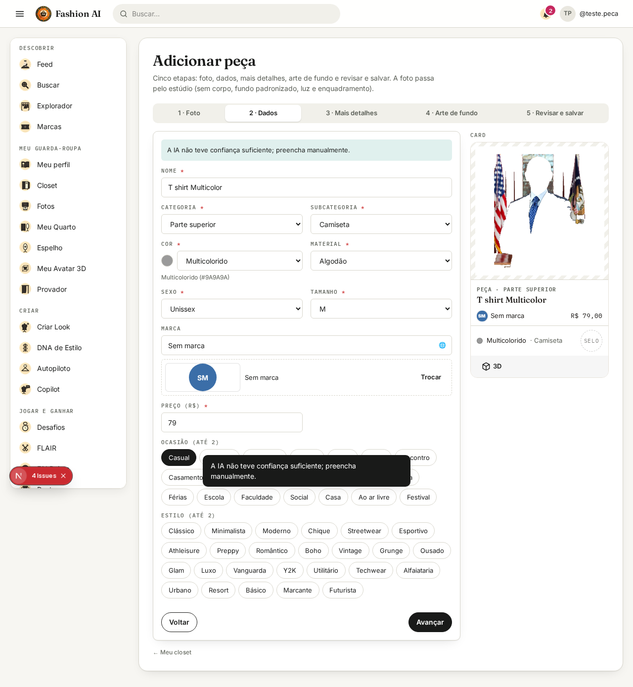
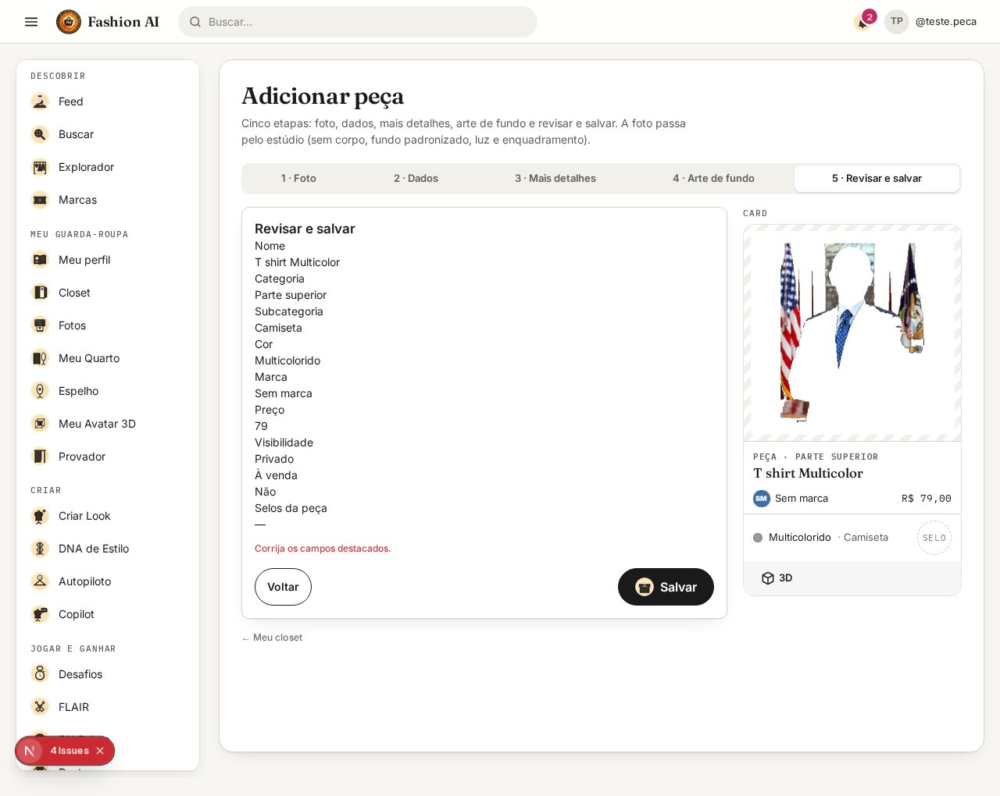
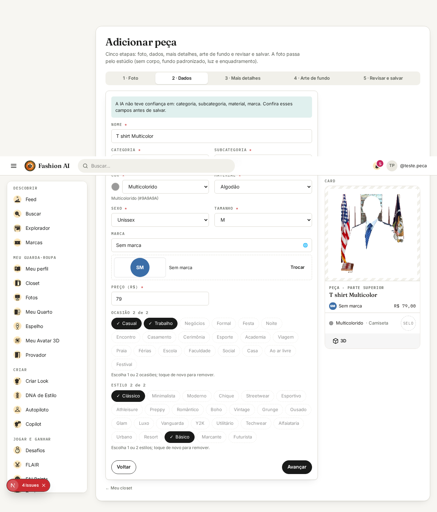
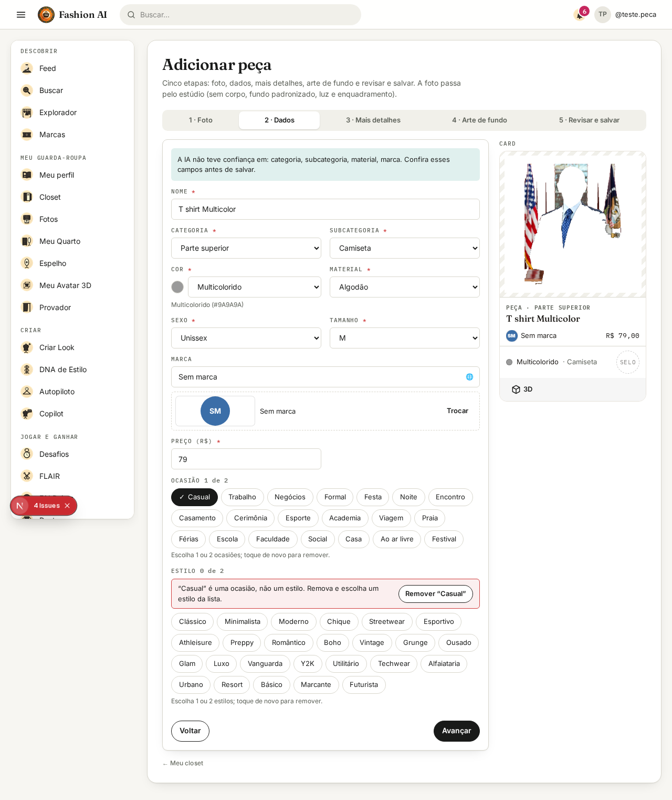
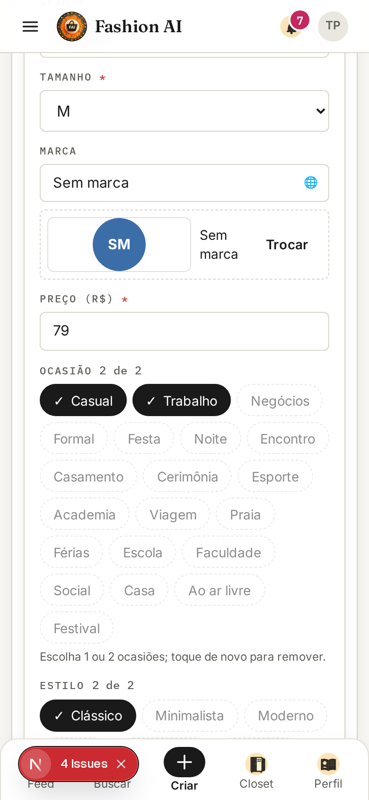
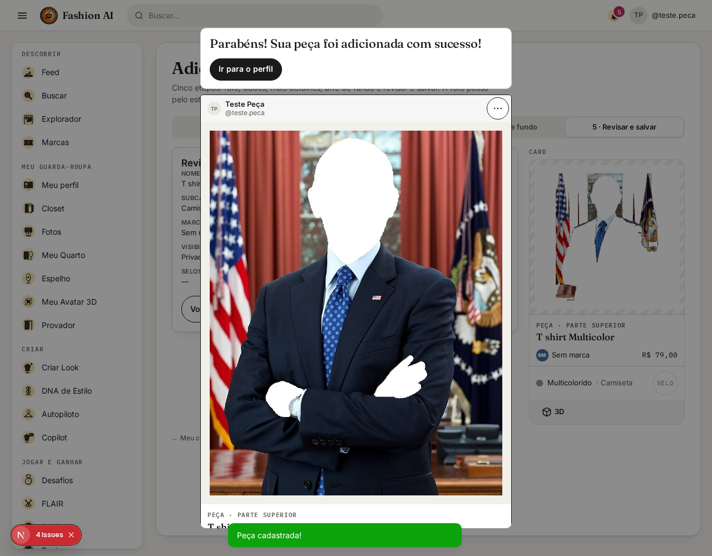

# Criar peça — correção dos dois P0 (27/09/2026)

Os dois defeitos que impediam o cadastro foram reproduzidos contra a API real, corrigidos no servidor e no formulário
e verificados de ponta a ponta (navegador → API → MySQL → recarga).

- **Salvar:** uma tentativa e um pedido por ação; uma única nota de baixa confiança; a peça é gravada uma vez.
- **Estilos e ocasiões:** até 2 de cada, com contador, remoção e mensagem de limite; `casual` deixou de ir para o
  campo de estilo.

Os itens P1 e P2 do mesmo pedido (marca pelo logo, anatomia do card, Seção C e padrão de listas) continuam abertos.

---

## 1. Como foi reproduzido

- Backend local isolado: ambiente limpo, MySQL local, IA só local, nenhuma credencial remota herdada.
- Frontend de desenvolvimento apontando para esse backend.
- Foto de teste `portrait.jpg` (retrato público), que a IA local reconhece com baixa confiança.
- Roteiro Playwright: envia a foto, avança as etapas e dá dois cliques rápidos em **Salvar**.

Resultado antes da correção:

| Observado | Valor |
|---|---|
| Estilo pré-preenchido | `casual` (invisível no seletor) |
| Aviso de baixa confiança na etapa Dados | 2 cópias (notificação + faixa) |
| Pedidos `POST /api/pieces` com dois cliques | 2 |
| Resposta de cada pedido | 400, `style: "Valor fora da taxonomia: casual"` |
| Etapa depois da falha | continuou em "Revisar e salvar", com o erro em outra etapa |




---

## 2. Defeito → causa raiz → arquivo → correção → teste

| # | Defeito | Causa raiz | Arquivo | Correção | Teste |
|---|---|---|---|---|---|
| 1 | "Valor fora da taxonomia: casual" no estilo | O pré-preenchimento devolvia `casual` como estilo padrão; `casual` é código de **ocasião** (e de wearstyle), não de estilo | `WardrobeService.defaultStyle` | Estilo padrão `basic`; comentário explica a diferença | `WardrobePrefillTest.preenchimentoDeQualquerSubcategoriaPassaNaValidacaoDoSalvamento` (todas as subcategorias, IA confiante e não confiante) |
| 2 | Só dava para escolher 1 estilo | O valor inválido não aparecia no seletor, mas ocupava uma das 2 vagas | `components/piece-form.tsx` (`TagPicker`) | Valores fora da lista aparecem no topo, com explicação e botão Remover, e não contam no limite | Playwright: `0 de 2` com `casual` injetado; aviso contextual visível |
| 3 | Mensagem interna ao usuário | Validação genérica com texto técnico | `Taxonomy.requireTags` + mensagens `taxonomy.*` (pt, en, es) | Mensagens por campo: ocasião no lugar de estilo, estilo no lugar de ocasião, ocasião fora da categoria, limite de 2 da peça (3 do look) | `TaxonomyTest` (4 casos novos) |
| 4 | Aviso de baixa confiança repetido | O mesmo texto saía em notificação ao analisar **e** em faixa na etapa Dados | `app/(app)/pieces/new/page.tsx` | Uma nota só, na etapa Dados, listando os campos a conferir; na etapa Foto, só "Foto analisada" | Playwright: 0 avisos na etapa Foto, 1 na etapa Dados |
| 5 | Dois pedidos com duplo clique | O botão só desabilitava depois da nova renderização | `pieces/new/page.tsx` e `expanded-card.tsx` (edição) | Trava síncrona por `ref` e botão desabilitado depois do sucesso | Playwright: duplo clique + clique extra = 1 pedido |
| 6 | Peça duplicada em nova tentativa | O servidor não ligava o salvamento ao rascunho da foto | `WardrobeService.create`, `PipelineJobRepository.findByIdForUpdate` | Rascunho travado (`SELECT … FOR UPDATE`); se já virou peça, devolve a mesma peça | 3 pedidos paralelos com o mesmo rascunho: mesma peça, 1 linha |
| 7 | Erro ficava longe do campo | `create.error` era lido antes de o estado atualizar, então a navegação para o campo nunca acontecia | `pieces/new/page.tsx` | Validação no cliente antes de enviar; erro de 400 leva à etapa do primeiro campo | Playwright: com `casual`, 0 pedidos e volta para "2 · Dados" com o erro no campo |
| 8 | Duas rodadas de erro | O servidor validava a taxonomia e parava; nome e preço só apareciam na tentativa seguinte | `Taxonomy.pieceErrors` + `WardrobeService.validate` | Todos os campos numa resposta só | Chamada à API: 4 campos na mesma resposta |
| 9 | Falhas indistintas | Toda falha virava a mesma mensagem | `pieces/new/page.tsx` | Mensagens separadas: validação (no campo), rede, servidor (com referência), upload, análise | Estático e manual; os dados continuam na página em todas |
| 10 | Duplicatas e caixa | `["classic","classic"]` contava 2 | `Taxonomy.canonicalTags` | Códigos minúsculos, sem vazios e sem repetição, na validação e na gravação | `TaxonomyTest.duplicatasContamUmaVez` |

**Por que `casual` era rejeitado.** Não é grafia divergente nem rótulo antigo: `casual` pertence à taxonomia de
**ocasiões** (`Taxonomy.OCCASIONS`) e é também a chave de um grupo de wearstyle. A lista oficial de **estilos**
(`Taxonomy.STYLES`) não tem `casual`; o equivalente para peças do dia a dia é `basic` ("Básico"). Por isso `casual`
não foi acrescentado aos estilos.

**Dados legados.** Não havia como `casual` ter sido gravado como estilo, porque o servidor sempre o recusou. As 227
peças do banco local de demonstração não têm estilo nem ocasião fora das listas. O banco de produção não foi
consultado; se aparecer um valor antigo, o formulário o mostra com a explicação e o botão Remover, sem trocá-lo em
silêncio.

---

## 3. Payload e persistência de uma peça com 2 estilos e 2 ocasiões

Pedido enviado pelo formulário, com campos irrelevantes omitidos:

```json
{ "category": "upper_piece", "subcategory": "t_shirt", "style": ["basic", "classic"], "occasion": ["casual", "work"] }
```

| Etapa | Resultado |
|---|---|
| Resposta do `POST /api/pieces` | 201, `style: ["basic","classic"]`, `occasion: ["casual","work"]` |
| `GET /api/pieces/{id}` depois de recarregar | 200, mesmos valores |
| Linha em `wardrobe_items` | `style_tags = basic,classic`, `occasion_tags = casual,work` |

Os três roteiros (desktop, sugestão inválida da IA e celular) gravaram uma linha cada, sempre com esses valores.
Resultado completo em `p0-verificacao-2026-09-27.json`.

Validação do servidor para um pedido errado (estilo `casual`, 3 ocasiões, sem nome e sem preço), numa só resposta:

```json
{
 "occasion": "Selecione até 2 ocasiões para esta peça.",
 "style": "“Casual” é uma ocasião, não um estilo. Escolha um estilo da lista.",
 "name": "Informe o nome da peça.",
 "price": "Informe o preço (use 0 se não quiser informar)."
}
```

---

## 4. Matriz de testes

| Caso | Como | Resultado |
|---|---|---|
| 0 estilos | Desmarca tudo e salva | Sem pedido; "Escolha 1 ou 2 estilos para esta peça." no campo |
| 1 estilo | Pré-preenchido `basic` | `1 de 2` |
| 2 estilos | + Clássico | `2 de 2` |
| 3 estilos | Toque em Chique | Continua com 2; "Selecione até 2 estilos para esta peça…"; o botão tem `aria-disabled` |
| Duplicata | Toque de novo em Clássico | Remove (não duplica); o servidor também ignora repetições |
| Sugestão inválida da IA | `prefill.style = ["casual"]` injetado na resposta | Aviso contextual + Remover; tentar salvar não envia e volta ao campo |
| Ocasiões | Casual + Trabalho | `2 de 2`; enviadas em `occasion`, nunca em `style` |
| Duplo clique em Salvar | `dblclick` + clique extra | 1 pedido, 201, modal "Parabéns! Sua peça foi adicionada com sucesso!" |
| Pedidos paralelos (servidor) | 3 `POST` simultâneos, mesmo rascunho | Mesma peça nos 3; 1 linha |
| Recarga | `GET` da peça criada | Mesmos 2 estilos e 2 ocasiões |
| Celular (390 px) | Mesmo roteiro | Igual ao desktop |
| Backend | `mvn -o test` (todos os módulos) | Verde |
| Frontend | `tsc`, `vitest` (74), i18n `check` e `scan` | Verdes |






---

## 5. Limitações e o que falta

- **Sem idempotência para peça sem foto.** Uma peça criada com a imagem padrão não tem rascunho, então o servidor
  não tem com o que comparar uma nova tentativa. A trava do formulário cobre o duplo clique; uma resposta perdida
  na rede ainda pode gerar duas peças nesse caso.
- **Recorte da foto de teste.** A foto de retrato mostra outro problema, do pipeline de imagem: a pessoa foi removida
  e o fundo (bandeiras) ficou. Isso pertence ao pedido de fotografia de produto padronizada, ainda aberto.
- **Pendentes do mesmo pedido:** marca pelo logo (caso Lacoste), anatomia e artes do card de peça, variações da
  Seção C, e padrão visual de todos os campos de lista (auditoria completa em andamento).

---

## 6. Arquivos alterados

| Arquivo | Mudança |
|---|---|
| `fai-application/.../taxonomy/Taxonomy.java` | `pieceErrors`, `requireTags` com contexto, `canonicalTags`, `label`, limites da peça e do look |
| `fai-application/.../service/WardrobeService.java` | Estilo padrão `basic`, idempotência por rascunho, tags canônicas, erros numa resposta só |
| `fai-domain/.../repository/PipelineJobRepository.java` | `findByIdForUpdate` com trava de escrita |
| `fai-application/src/main/resources/i18n/messages*.properties` | Mensagens por campo em pt, en e es; texto do preço sem moeda |
| `components/piece-form.tsx` | `TagPicker`, `tagProblem`, `validatePieceForm`, `PIECE_FIELD_STEP` |
| `app/(app)/pieces/new/page.tsx` | Trava de envio, validação antes do pedido, erros por tipo, nota única da IA |
| `components/expanded-card.tsx` | Mesma trava e validação na edição |
| `components/ui/index.tsx` | `Chip` com estado `blocked` (`aria-disabled`) |
| `app/globals.css` | Estilos do seletor, contador e aviso de correção |
| `lib/i18n/messages/*.json` | Textos novos em pt-BR, en e es |
| `TaxonomyTest`, `WardrobePrefillTest` | Testes de regressão |
