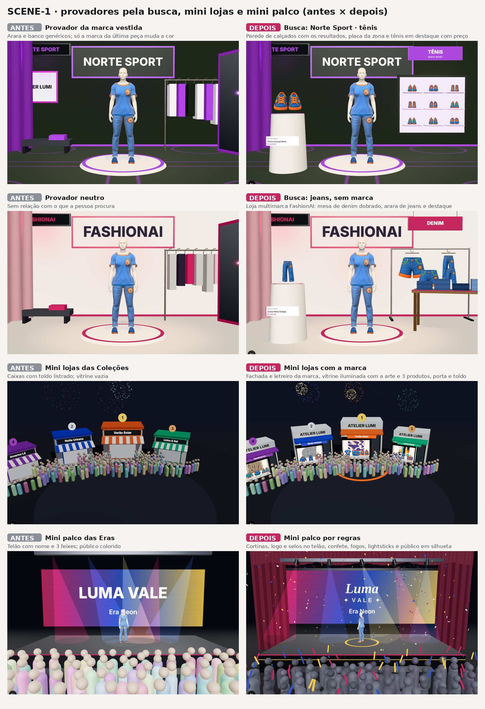

# Plano mestre — o que foi entregue, o que falta e em que ordem (05/10/2026)

Este documento junta os objetivos pedidos em abertos nas últimas rodadas. Ele vale até tudo estar entregue. Cada
entrega fecha com testes, métricas, documentação, commit e push no ramo `claude/fashion-ai-interfaces-config-id7naj`.

**Regras que valem para tudo:**

- **Privacidade:**
  - fotos de pessoas, renders de rostos e parâmetros individuais nunca vão para o repositório nem para log;
  - no repositório entram só agregados.
- **Ambiente:**
  - backend local só pelo lançador isolado (localhost, sem IA remota);
  - nenhuma mudança em Railway, Vercel, Resend, DNS ou CORS sem pedido explícito.
- **Imagem:**
  - nenhum embelezamento automático;
  - nenhuma imagem de pessoa sem roupa.

---

## 1. Já entregue nesta rodada

| Item | Entrega | Onde |
|---|---|---|
| HAIR-F2 | Cabelo em fios por padrão (Kajiya-Kay, níveis de detalhe) | commit 5178d1d |
| GARMENT-AUDIT | Diagnóstico do pipeline 3D de roupas (15 entregáveis) | `docs/avatar3d/auditoria-roupas-3d/` |
| AVATAR-ID-AUDIT | Diagnóstico de identidade do avatar (22 entregáveis) | `docs/avatar3d/auditoria-identidade-avatar/` |
| PROV-2D | Prévia 2D no Espelho e no Vista-me com o mesmo Avatar 3D; reflexo no vidro do espelho do quarto | `docs/novos-rf/RF28_Previa_2D_Espelho_Vista-me.md` |
| AVATAR-ID I0 | Métricas de fidelidade, gate de identidade, logs sem dado pessoal, linha de base no CI | seção 23 da auditoria de identidade |
| AVATAR-ID I1 | Identidade versionada: refazer não apaga a aprovada; aprovar, restaurar, histórico | V42 + `Avatar3dService` |
| AVATAR-ID I2 | Camada de resíduo assimétrico + medidas nomeadas: SFace de frente 0,369 → 0,476, top-1 15/15 | `face-residual.ts`, `face-profile.ts` |
| AVATAR-ID I3 | Pele com balanço de branco pela esclera, rosto casado com o corpo: erro de cor 0,2, sem costura, gate 14/15 | `skin-tone.ts` |
| WARDROBE-FIX | Espelho: botão "Do guarda-roupa" em cada parte do look lista todas as peças elegíveis do slot, sem IA (`GET /api/me/mirror/wardrobe`), com as que já estão no espelho marcadas; "Levar ao espelho" no quarto fecha a etiqueta e foca o espelho; `POST /api/me/mirror/pieces` sem peça devolve 400 (era 500); o snapshot e as conquistas do Inventory Score passam a gravar em transação própria — duas leituras simultâneas do quarto davam 500 por chave duplicada (`uq_inv_snap`) | `MirrorService.wardrobe`, `InventoryScoreService`, `mirror/page.tsx`, `room/page.tsx` |
| AVATAR-ID I4 | Olhos, óculos e sobrancelhas: cor da íris medida na foto corrigida (11 classes por matiz; a malha usa a cor contínua), textura do olho recolorida, córnea e linha d'água só de reflexo, ossos `LeftEye`/`RightEye`; óculos escuros saem da textura (íris padrão), os de grau saem da textura e voltam como acessório 3D afastado do rosto (≥ 4 mm), com liga/desliga; sobrancelhas medidas (cor, espessura, arco, densidade); `eyes`/`brows` validados no app e no backend | `iris.ts`, `glasses.ts`, `identity/brows.ts`, `human/eyes.ts`, `human/glasses-3d.ts`; seção 23 da auditoria de identidade |
| DIAG-ALL | Todos os diagramas de atividades, sequência, componentes, estados e classes reescritos a partir do código (319 gerados; 7 de estados mantidos do time com legenda, porque o código não tem o estado equivalente) + globais v5 + índice | `scripts/diagramas/v5`, `docs/diagramas/INDICE-2026-10.md` |
| TWIN-FID | Bateria de fidelidade do digital twin: 16 pessoas, 6 × 6 capturas variadas, 6 corpos. De frente, 15/15 gêmeos identificados entre 16 fotos pelos dois reconhecedores (SFace 0,471); forma do rosto muda < 0,6 mm com luz, resolução e inclinação (4,6 mm entre pessoas). Corrigiu o balanço de branco do I3 (pele fora da faixa humana 7 → 1 de 16) e o peso do ajuste de corpo da pessoa (erro máx. 1,74 → 0,81 cm) | `docs/avatar3d/fidelidade-digital-twin-2026-10-06.md` |
| SCENE-1 | Primeiro incremento do motor de cenas (9.2): `lib/scene3d/scene.ts` puro e testado (busca → loja, zona, expositores e produto em destaque; regras do mini palco). Provador pela Busca Catalogada na tela `/try-on` (parede de calçados, arara, mesa de denim, vitrine de acessórios, placa da zona, destaque com nome e preço; busca sem marca abre a loja multimarca FashionAI). Mini lojas das Coleções com fachada, letreiro e vitrine da marca do perfil. Mini palco com cortinas, logo e selos no telão, confete, fogos, lightsticks e plateia em silhueta. Corrigiu o ambiente procedural de marca que ficava sem estilo, e quebrava o provador, quando o hash do nome passava de 2³¹ | `docs/plano/img/scene-1/`, `/lab/scenes` (dev) |
| HAIR-MOTION | Olhos sem o "risco": o brilho saiu do globo, de poucos polígonos, e ficou só na córnea; a esclera ganhou sombra. Cabelo natural: fibras finas em vez de tiras sólidas, guias que acompanham a cabeça (sem "sino"), base fosca com linha do cabelo de fios curtos e colisão com o alto do ombro. Franjas escolhidas no Meu Avatar 3D (reta simétrica cobrindo a testa até a sobrancelha, lateral, cortina, desfiada), com validação no backend. A franja medida voltou a aparecer. Vento e atraso dos gestos no cabelo, na GPU. Movimento do corpo com troca de apoio, joelho livre sem patinar e olhada para o lado | `docs/avatar3d/cabelo-olhos-movimento-2026-10-06.md` |
| SHARE-FIX | Botão Compartilhar consertado e publicando no feed social do FashionAI. Havia cinco falhas: (1) nos cards das listas, o diálogo ficava preso e cortado dentro do card (a contenção do card virava o "viewport" do `position: fixed`); agora `Dialog` e `Sheet` abrem por portal no `<body>`; (2) o Feed da comunidade não mostrava compartilhamento nenhum, e a Passarela só os de looks de quem a pessoa segue; agora os dois mostram looks **e peças** compartilhados, com "@pessoa compartilhou" e a legenda, e a Passarela mostra também os posts da própria pessoa; (3) peça ou look privado da dona saía num post que ninguém via; agora o diálogo avisa e pede "Tornar público e publicar"; (4) "Copiar link" copiava depois de esperar a rede (o Safari recusa) e agora usa `ClipboardItem` com promessa, mostrando o link para copiar à mão se o navegador negar; (5) o DNA de estilo mandava o tipo `DNA_SCHEME`, que a API recusava (400) em curtir, comentar, salvar e compartilhar. A contagem sobe na hora | `SocialService.share`, `SearchService.communityFeed`/`runway`, `components/interactions.tsx`, `components/ui/index.tsx`, `app/(site)/(app)/feed/page.tsx`; testes `SocialServiceTest`, `SearchHypeV2Test`, `components/share.test.tsx` |
| SHARE-OPT + FLAIR-UT F1–F3 (1ª versão) | No criador de peças, a etapa final ganhou **"Depois de salvar"** com "Compartilhar no feed do FashionAI" e "Converter para FLAIR", as duas **desligadas** por padrão: sem Compartilhar, nada vai ao feed e a peça fica só no perfil (auditoria: nenhum caminho publica sem gesto da pessoa). "Converter para FLAIR" **duplica** a peça numa carta (`flair_card_instance`, V55; uma por peça por temporada) com nota e nível pelo `FlairTier` (§4 da especificação, exemplos como testes); a carta aparece na nova sub-aba **"Minhas cartas FLAIR"** do perfil, por nível, e o detalhe da peça ganhou o bloco "Converter para FLAIR / Ver carta FLAIR". Componente `FlairGameCard` com os 4 metais | `FlairTier`, `FlairCollectionService`, `components/flair/flair-game-card.tsx`, `flair-collection.tsx`, `pieces/new`; testes `FlairTierTest`, `FlairCollectionServiceTest`, `flair-collection.test.tsx` |

---

## 2. Ordem de execução do que falta

| # | Item | Por que nesta posição |
|---|---|---|
| 1 | ~~**WARDROBE-FIX**~~ — entregue (seção 1) | — |
| **1b** | **FLAIR-UT** (pedido de 07/10, **próximo item**): cartas FLAIR por nível (Bronze, Prata, Ouro, Especial) com o Hype em números na frente e a seção E na prancha de anatomias; "Gerar como FLAIR" nos criadores e "Converter para FLAIR" no detalhe; "Minhas cartas FLAIR" no perfil; grupo próprio do FLAIR na barra lateral; **Desafios de Montagem** com cenários que contam uma história; Momentos; cartas especiais pela loja, jogos, desafios e selos; recompensas; **carta com selo vira FLAIR Especial**; **mercado de transferências em FAI Points**, com "Inserir no mercado de transferência" no detalhe da peça; a conversão **duplica** a carta (o original fica no guarda-roupa e vai ao feed, a cópia FLAIR joga e é negociada) (seção 10 e [FLAIR_UT_Cartas_e_Desafios.md](FLAIR_UT_Cartas_e_Desafios.md)) | Pedido da pessoa responsável para passar à frente. F1–F5 não dependem do avatar nem do GARMENT; o dinheiro como prêmio espera parecer jurídico (seção 10.4) |
| 2 | **AVATAR-ID I5–I7** (o I4 — olhos, óculos e sobrancelhas — está entregue, seção 1): cabelo e barba (incluindo penteados presos — rabo de cavalo, coque, trança — sobre as guias e o movimento do HAIR-MOTION), rig facial, revisão visual, níveis de detalhe; mais **EXPO** (brilho de referência pela esclera: foto subexposta escurece a pele do gêmeo em ΔE ≈ 24), **IRIS-RECAL** (classes da íris recalibradas no balanço de branco corrigido; íris clara com centro âmbar) e **WB-2** (esclera amarelada pela idade lida como luz quente; realces sem mudar a matiz) achados pelo TWIN-FID — **mais os itens de rosto e cabelo da lista de 29/09 (seção 5.2) e os acréscimos da especificação completa (seção 6)** | Continua a cadeia de identidade; o desfile e o quarto usam o mesmo avatar |
| 3 | **GARMENT F0–F6**: moldes paramétricos, passes com restrições, XPBD, camadas, detalhes — **mais os itens de roupa da lista de 29/09 (seção 5.2) e o PROV-3D (seção 5.1)** | Base de "roupa que veste" e de "tecido com movimento natural" (itens 5 e 6) |
| 4 | **CATALOG-IMG V2**: pipeline profissional das fotos oficiais da Busca Catalogada (seção 4) — **com o FRAME e o relatório de 79 perguntas (seção 5.1)** | Alimenta cards, IA, 2D, 3D e Hype Score |
| 4b | **RF4-FOTO**: etapa opcional "Fotografia" no criador de peça (seção 5.1) | Definição nova do RF4 no Trello; o editor completo é o RF15 (Tema Futuro) |
| 5 | **QUARTO-REAL**: quarto, guarda-roupa e espelho coerentes e realistas, avatar dentro do quarto, looks do Copilot (seção 3.5) | Depende de 2 e 3 |
| 6 | **ENV3D**: ecossistema Palco + Passarela + Loja 3D (seção 7), **revisto em 06/10 (seção 9)**: auditoria (6.0), motor de cenas e plateia comum (6.1), **Passarela 3D** com caminhada real e cena configurada pelos filtros (6.2), **mini lojas** como porta do provador (6.3), **mini palcos** depois do estudo (6.4), polimento (6.5). Absorve **PASSARELA-REAL** (3.2) e **PALCOS-ARTISTAS** (3.3) | 6.0–6.2 não esperam o GARMENT (seção 9.6); 6.3 depende de 7.1 |
| 7 | **PROVADOR-BUSCA**: **provadores 3D dinâmicos**, gerados pela Busca Catalogada embarcada (seção 8, **revista em 06/10 na seção 9.3**): P1–P5 (7.1) e P6–P8 (7.2). Absorve **PROVADOR-MARCA** (3.1) | 7.1 depende só do motor de cenas (6.1); 7.2 depende do GARMENT F0–F3 |
| 8 | *(incorporado ao item 6: mini palcos por artista no passo 6.4 e mini lojas no 6.3, seção 9.4)* | — |
| 9 | **LOJA-EXCLUSIVOS**: itens, consumíveis, peças e looks exclusivos de celebridades, marcas e do FashionAI com FAI Points (seção 3.4), vendidos no Store Mode da Loja 3D | Usa os itens 5, 6 e 7 |
| 10 | **SEC-A** e **SEC-B**: auditoria do gate de desenvolvedor e planilha RF × entidade × banco calculada das fontes (seção 5.1) | Pedidos anteriores ainda abertos; o SEC-A protege a produção pública |
| 11 | **MOD-1**: plano estratégico de moderação das imagens enviadas (seção 5.1) | A fila de moderação já existe; falta o plano e a verificação central |
| 12 | **FRONT-10**: telas, imagens, desempenho, qualidade do código e medição; listas; marca por logo no card (seção 5.1) | Fecha o "Frontend nota 10" |
| 13 | **VISÃO-RF**: melhorias de visão de produto nos RF1–RF39 com relatório do que mudou e por quê (seção 5.1) | Revisão final, depois que as telas estiverem estáveis |

O **RF15** (Editor de Fotografia da Peça, fases E0–E7) é Tema Futuro: está estudado e planejado em
[RF15_Editor_de_Fotografia_da_Peca.md](../novos-rf/RF15_Editor_de_Fotografia_da_Peca.md) e entra na ordem quando o
time o tirar do Tema Futuro no Trello.

As decisões padrão das auditorias continuam valendo até a pessoa responsável pedir outra coisa:

- moldes procedurais em código;
- HIGH_QUALITY só no navegador;
- parâmetro de pescoço no corpo;
- limiares propostos no gate.

---

## 3. Itens novos (pedido de 05/10/2026)

### 3.1 Provador de marcas 3D ultra-realista

*Revisto em 06/10: os provadores passam a ser gerados pela busca (seção 9.3).*

- **Só a marca escolhida:** o provador da Adidas mostra só a marca Adidas (logo, letreiro, materiais e detalhes da
  loja). Hoje há painéis de outras marcas vestidas e temas genéricos.
- **Ambiente da loja da marca:**
  - piso, paredes, iluminação de loja, araras, espelho, provador com cortina, vitrine e sinalização;
  - nada de cor aleatória.
- **Identidade visual da marca:**
  - logo e paleta vêm do cadastro da marca (perfil MARCA, selos, guarda-roupa da marca);
  - sem cadastro, só o nome da marca, com tipografia neutra e materiais neutros de loja premium.
- **Avatar:** o mesmo da pessoa, com as roupas vestidas pelo fitting novo (item 3 da ordem).

### 3.2 Passarela 3D profissional

*Revista em 06/10 (seção 9.5): o RF33 fica; a cena, a caminhada e a plateia mudam.*

- **Plateia:**
  - avatares semi-realistas coerentes (corpo humano do mesmo sistema, roupas padrão variadas, poses sentadas,
    reações discretas);
  - distribuídos em fileiras com escala e iluminação corretas;
  - níveis de detalhe para desempenho;
  - nunca bonecos genéricos desproporcionais.
- **Quem desfila:** é **exatamente** o avatar da foto de perfil (mesma versão aprovada da identidade).
- **Caminhada:**
  - ciclo de caminhada estilosa, humana e suave: passo cruzado de passarela, balanço de quadril e ombro, braços
    soltos, giro no fim, ritmo constante;
  - rig com pesos corretos;
  - roupa acompanhando o movimento.

### 3.3 Mini-palcos e mini-lojas 3D de artistas e marcas

*Revisto em 06/10 (seção 9.4): recomendação provisória (d) híbrido; a mini loja vira porta do provador.*

- **Fim do genérico:**
  - nada de nomes genéricos estampados nem cores aleatórias;
  - cada palco tem nome, logo, selos, cortinas, fogos, confetes, luzes e plateia com características do artista.
- **Estudo a fundo (entregável antes da implementação):** como resolver a variedade, já que os artistas cadastrados são
  aleatórios. Alternativas a comparar:
  - (a) banco curado de mini-palcos dos principais artistas;
  - (b) personalização feita pelo próprio perfil após o cadastro (editor de palco com tema, paleta, logo, efeitos);
  - (c) geração por regras a partir dos dados do perfil (gênero musical, paleta da foto, selos, eras);
  - (d) híbrido: base por regras + editor + curadoria dos maiores.
- **Critérios do estudo:**
  - direitos de imagem e marca (sem usar marca de terceiros sem autorização);
  - custo;
  - qualidade;
  - moderação;
  - desempenho;
  - manutenção.

### 3.4 Exclusivos na loja, no quarto e no espelho

- **Exclusivos de celebridades e marcas, comprados com FAI Points:**
  - itens e consumíveis;
  - peças de roupa e looks;
  - personalização do quarto, do espelho e do guarda-roupa.
- **Itens únicos do FashionAI:**
  - mais peças e looks com o logo FashionAI (variações);
  - peças de guarda-roupa (portas, puxadores, cabideiros, iluminação, acabamentos) exclusivas.
- **Regras:** disponibilidade, expiração, selo da marca ou celebridade e moderação, como nos selos do RF25.

### 3.5 Quarto, guarda-roupa e espelho realistas (refatoração)

- **Defeito (prioridade 1):** não é possível tirar uma roupa do guarda-roupa e prová-la no espelho.
- **Roupas no guarda-roupa:**
  - cabide posicionado corretamente, espaço ao redor, dobra e caimento;
  - nada de peça renderizada como pedra ou sólido.
- **Tecido com movimento natural:**
  - simulação leve (XPBD da fase F4) ou animação de tecido pré-calculada para as peças penduradas e vestidas.
- **Avatar dentro do quarto:**
  - escolhe a peça, abre e fecha a porta, pega a peça e prova no espelho;
  - animações acionadas pelo comando da pessoa.
- **Ambiente coerente:**
  - piso, cadeiras, espelho e iluminação com escala real e materiais realistas;
  - nada de objeto sem sentido.
- **Looks completos:**
  - saem das "caixinhas" nas gavetas e viram sugestões do Copilot;
  - ao escolher uma, o quarto abre com o avatar vestindo as peças do look.

---

## 4. CATALOG-IMG V2 — pipeline das fotos oficiais da Busca Catalogada

**Objetivo:** toda foto oficial (site da marca, página oficial do produto, varejista autorizado, loja oficial em
marketplace) vira uma **fotografia de catálogo FashionAI** antes de entrar no acervo. Ela é isolada, limpa, reenquadrada
pela semântica da peça, preserva os detalhes e é validada por métricas. Serve para:

- cards, busca e modal;
- IA de marca, subcategoria, cor e material;
- 2D, 3D, Hype Score, embeddings e comparação.

### 4.1 Entrada e regras gerais

- **Entrada (com o que houver):** `officialImageUrl`, `brand`, `productName`, `category`, `subcategory`, `pieceType`,
  `sourceUrl`, `imageUrl`.
- **A original nunca é usada direto nem sobrescrita:**
  - guarda `sourceImage`;
  - gera `catalogMasterImage` e, quando couber, `catalogThumbnail`, `catalogDetailImage` e `catalogAiAnalysisImage`;
  - o pipeline é reversível e auditável.
- **Fluxo:**
  1. validação;
  2. detecção do produto;
  3. segmentação;
  4. remoção de distratores;
  5. ROI por categoria;
  6. reenquadramento semântico;
  7. fundo normalizado;
  8. preservação de detalhes;
  9. QA;
  10. master.
- **O que nunca muda:** logo, costura, número de botões, geometria de bolso, cadarço, estampa ou cor. A saída é
  "representação normalizada do produto original", nunca "reinterpretação por IA" (§88–89).

### 4.2 Detecção, segmentação e limpeza

- **Detecção:**
  - acha o `primaryProduct` e a bounding box;
  - distingue peça de humano, manequim, cabide, móveis, caixa, props, fundo e outras peças.
- **Pessoas (§5):**
  - remove o humano, preservando a peça inteira (prioridade: peça > cena);
  - reconstrução só onde falta pouco, há simetria e a confiança é alta;
  - senão `REJECT_IMAGE` e procura outra foto oficial;
  - nunca alucinar geometria (§40–41).
- **Objetos irrelevantes (§6):** cadeiras, mesas, plantas, sacolas, caixas, mãos, celular, espelho, cabide e pedestal
  saem.
- **O que pertence à peça (§7):** botões, zíper, cadarço, fivela, alças, correntes, patches, logos, cordões, bolsos e
  costuras ficam.
- **Máscara (§8–9):**
  - `productMask` precisa, com bordas, mangas, golas, elementos finos, transparências e franjas;
  - refino de borda sem halo branco ou escuro nem serrilhado;
  - não pode faltar tecido nem cortar cadarço ou alça.

### 4.3 Reenquadramento semântico por `pieceType` (Strategy, §10–24, §77–79)

**Conceito:** `semanticFocusRegion` decide escala, crop, posição e zoom. "Foco" é enquadrar e escalar, nunca desfocar o
resto.

| pieceType | Região principal | Detalhes a preservar |
|---|---|---|
| UPPER_PIECE | Gola, decote e parte alta do peito (âncora visual, sem cortar a peça) | Polo e camisa: gola, carcela, botões de cima, logo bordado, costura do ombro. Moletom: capuz, cordões, zíper. Jaqueta: gola, lapela, zíper, bolsos de cima |
| LOWER_PIECE | Cós, bolso e costuras de cima (cós → bolso → coxa), sem perder a silhueta | Jeans: bolso da frente e moedeira, passantes, braguilha, pespontos. Vista de trás: bolso traseiro e pala |
| SHOES_PIECE | Cadarço, gáspea e lingueta; sem cadarço, a região equivalente | Mocassim: gáspea. Salto: cabedal e salto. Sandália: tiras. Bota: cano e fechamento. Largura útil ≈ 85–95% |
| ACCESSORY_PIECE | O acessório inteiro com ocupação máxima | Bolsa: fecho, alça e logo. Relógio: mostrador. Cinto: fivela. Óculos: armação. Boné: frente e logo. Colar: pingente. Anel: peça central |

**Registro de regiões semânticas** configurável por subcategoria (§79), por exemplo:

- POLO → `primaryFocus: [COLLAR, PLACKET]`, `secondaryFocus: [LOGO]`;
- JEANS → `[WAISTBAND, FRONT_POCKET]`, `[STITCHING]`.

### 4.4 Crop, escala e composição (§25–31, §50–52, §84–87)

- **Ocupação:** `frameOccupancyRatio` = área da máscara ÷ área do quadro, alvo inicial 0,70–0,90 por categoria
  (`Category Scale Profile`). Os paddings dos 4 lados são medidos e a margem de segurança é de 4–8%.
- **`semanticCrop()` em vez de `centerCrop()`:** considera bbox, região de foco, detalhes críticos (`mustPreserve`),
  orientação, categoria, proporção e margem.
- **`CropScore`** = cobertura do produto + visibilidade do foco + visibilidade dos detalhes críticos + simetria −
  penalidade de espaço vazio − penalidade de corte. Vence o crop com maior score.
- **`productPreservationScore`:** quanto da peça original continua visível.
- **Proporção oficial do card** (4:5 ou a do frontend):
  - adaptação por escala, crop semântico e smart padding;
  - **nunca esticar** (aspecto original preservado);
  - centro visual calculado pelo foco, não pelo centro da bbox.
- **Consistência da coleção:** peças parecidas com escala parecida (10 camisetas não podem variar de tamanho).

### 4.5 Fundo, cor e detalhe (§32–39, §49)

- **Fundo:** master transparente, com versões branca, neutra e de card FashionAI. O fundo nunca contamina cor, borda,
  transparência, renda ou tela.
- **Cor:**
  - preservação com `colorPreservationScore`;
  - sem saturação, contraste ou filtro;
  - balanço de branco só quando necessário;
  - guarda `sourceImageColorProfile`.
- **Logos, bordados e patches:**
  - preservados por inteiro;
  - detecção de logo (`logoDetected`, `logoConfidence`, `logoRegion`) com `preservePriority = HIGH`;
  - sem borrar nem reconstruir.
- **Costuras:** gola, ombro, bolso, cós, pesponto de jeans e cabedal preservados.
- **Nitidez e resolução:**
  - sharpening só leve, sem textura, costura ou logo falsos;
  - sem upscale destrutivo: resolução baixa dá `IMAGE_TOO_SMALL` e procura outra fonte.

### 4.6 Várias imagens, ranking e vistas (§42–47)

- **Processamento:** todas as fotos oficiais da página viram `CatalogProductImage` (`viewType`, `qualityScore`,
  `sourceUrl`, `processedUrl`).
- **`ImageCandidateScore`:**
  - entram visibilidade do produto, resolução, oclusão, vista de frente, complexidade do fundo, presença de humano e
    de objetos, e visibilidade de detalhes;
  - preferência: só o produto, frente, alta resolução, fundo neutro, sem oclusão, peça completa.
- **Vistas:** FRONT, BACK, LEFT, RIGHT e DETAIL.
- **Imagem canônica:** `CANONICAL_PRODUCT_IMAGE` para cards, busca, grids e recomendações.
- **Foto de detalhe:** uma foto só do logo ou do bolso nunca vira master; vira `catalogDetailImage`.

### 4.7 Métricas, gate e fallback (§57–63, §90)

- **Métricas:**
  - segmentação: `segmentationScore`, `edgeQualityScore`;
  - presença e preservação do produto: `productVisibilityScore`, `productPreservationScore`, `garmentCompletenessScore`;
  - enquadramento: `frameOccupancyRatio`, `emptySpaceRatio`, `focusRegionVisibility`;
  - logo e cor: `logoPreservationScore`, `colorPreservationScore`;
  - reconstrução e origem: `reconstructionConfidence`, `sourceImageQuality`.
- **Gate:**
  - exige produto detectado, segmentação aceitável e detalhes críticos preservados;
  - exige ocupação aceitável, cor preservada e nenhum corte grave;
  - exige nenhum resto de humano (`humanPixelRatio ≈ 0`, nova detecção depois do processamento) e nenhum objeto
    alheio (nova detecção de objetos);
  - senão `NEEDS_REPROCESSING` ou `REJECTED`.
- **QA por categoria:**

  | pieceType | Precisa ficar visível |
  |---|---|
  | UPPER | gola, decote e construção de cima |
  | LOWER | cós, região do bolso e costuras de cima |
  | SHOES | cabedal, fechamento e parte da sola |
  | ACCESSORY | o objeto completo e o detalhe de assinatura |

- **Fallback, nesta ordem:**
  1. outra foto oficial;
  2. outra vista oficial;
  3. exigência de reconstrução menor;
  4. revisão manual;
  5. rejeitar.

  Nunca aceitar foto ruim só porque é oficial.
- **Confiança:** toda decisão de visão computacional tem `confidence`; se baixa, `manualReview = true`.

### 4.8 Arquitetura, jobs e dados (§64–80)

- **Serviços modulares:**
  - entrada: `OfficialImageFetcher`, `ImageCandidateRanker`;
  - detecção e limpeza: `ProductDetector`, `ProductSegmenter`, `HumanRemover`, `DistractorRemover`;
  - enquadramento: `GarmentRegionDetector`, `SemanticFocusAnalyzer`, `SemanticCropper`;
  - acabamento e QA: `BackgroundNormalizer`, `DetailPreserver`, `ImageQualityAnalyzer`, `CatalogImageValidator`;
  - estratégias `Upper`, `Lower`, `Shoes` e `AccessoryFramingStrategy`.
- **Jobs assíncronos:**
  - estados PENDING, DOWNLOADING, ANALYZING, SEGMENTING, CLEANING, REFRAMING, VALIDATING, APPROVED, REJECTED;
  - idempotência por `imageUrl + pipelineVersion`;
  - `imagePipelineVersion = CATALOG_IMAGE_PIPELINE_V2`, para reprocessar quando o algoritmo melhorar;
  - cache por `sourceImageHash` e deduplicação por `perceptualHash`.
- **Proveniência:** `sourceType = BRAND_OFFICIAL`, `sourceUrl`, `retrievedAt`.
- **Segurança da URL:**
  - proteção contra SSRF, URL malformada, redirecionamento abusivo e arquivo grande demais;
  - só `image/jpeg`, `image/png` e `image/webp`;
  - limite de tamanho configurável, sem carregar arquivo arbitrário na memória.
- **`CatalogProduct`:** `sourceImageUrl`, `canonicalImageUrl`, `imageProcessingStatus`, `imagePipelineVersion` e
  `imageQualityScore`, sem duplicar o que já existe em `CatalogImage`.
- **Logs estruturados:** `catalogProductId`, `pieceType`, scores, `humanDetectedAfterProcessing`, `qualityStatus`.
- **Depuração e admin:**
  - modo de depuração com cores para bbox, máscara, foco, regiões críticas, crop candidato e crop final;
  - comparação original | processada só no admin e no dev, nunca na navegação do usuário.
- **Integração:**
  - a Busca Catalogada mostra a imagem canônica processada;
  - a imagem limpa alimenta o analisador (marca, cor, material, caimento, subcategoria, variação).

### 4.9 Testes, revisão e painel (§91–96)

- **Conjunto de validação:**
  - peças de cima e de baixo, no modelo e sem modelo, calçados, bolsas, cintos, relógios, bonés e óculos;
  - fotos limpas, complexas, de fundo escuro ou branco, com vários objetos, oclusão parcial, humano e manequim.
- **Testes obrigatórios:**
  - remover humano não remove a peça;
  - o crop não corta detalhe crítico;
  - o logo continua visível;
  - o aspecto não muda;
  - o espaço vazio diminui;
  - o fundo fica normalizado.
- **Regressão:** cada defeito visual corrigido vira fixture; as aprovadas não podem regredir.
- **Painel de qualidade (admin):** ocupação média, taxa de rejeição, falhas de remoção de humano, de segmentação e de
  crop por categoria.
- **Revisão manual:**
  - fila `CatalogImageReviewQueue`: original, processada, foco e avisos;
  - ações APPROVE, REPROCESS, SELECT_ALTERNATE_IMAGE e REJECT.

### 4.10 Entregáveis (§99) e aceite (§100)

**Entregáveis:**

1. auditoria do pipeline atual;
2. fluxo de imagens atual;
3. problemas encontrados;
4. arquitetura proposta;
5. estratégia por pieceType;
6. estratégia por subcategoria;
7. modelo de SemanticFocusRegion;
8. algoritmo de SemanticCrop;
9. ranking de imagens oficiais;
10. remoção de humanos;
11. remoção de objetos;
12. preservação de logos e costuras;
13. normalização de fundo;
14. normalização de escala;
15. métricas;
16. quality gate;
17. fallback;
18. multi-imagem;
19. modelagem em CatalogProduct;
20. workers e jobs;
21. segurança de URLs;
22. testes;
23. fixtures visuais;
24. plano incremental.

**Aceite:** não basta "o fundo foi removido". Está pronto quando cada foto oficial vira uma foto de catálogo que:

- isola o produto;
- remove humanos e objetos;
- preserva design, logos, costuras e cores;
- identifica a região semântica;
- reenquadra pelo tipo de peça;
- maximiza a ocupação útil;
- é consistente com o resto do catálogo;
- passa nas métricas automáticas.

---

## 5. Pendências anteriores (revisão de todo o histórico, 05/10/2026)

Os 287 pedidos da conversa, desde 23/09, foram relidos e conferidos com o git e os documentos. As seções 1–4 cobriam só
a rodada de 05/10. Abaixo está o que tinha ficado de fora, com o estado conferido e o lugar na ordem da seção 2.

### 5.1 Itens abertos ou parciais

| Item | Pedido (data) | Estado conferido | Entra em |
|---|---|---|---|
| **RF4-FOTO** | Trello, 05/10: RF4 = busca catalogada, formulário & fotografia, com foto opcional | Parcial: dá para trocar a foto depois (`/api/pieces/{id}/image`), mas o criador força a imagem padrão (`useDefaultImage: true`) e não tem a etapa "Fotografia" | 4b |
| **FRAME** | 27/09: enquadramento por subcategoria (camiseta com foco no peito, gola, ombros e mangas; jeans do cós até perto do joelho), pranchas antes/depois de 5 camisetas e 5 jeans, ajuste pela pessoa | Parcial: há `PhotographySpecs` e o enquadramento por categoria; faltam os gabaritos por subcategoria, as pranchas e o ajuste manual | 4 (§4.3 e §4.4) |
| **Relatório de imagens** | 27/09: 40 perguntas de qualidade + 39 de isolamento e enquadramento | Aberto: as respostas estão espalhadas (auditoria de captura adaptativa, RF15, seção 4); falta o relatório que responde pergunta por pergunta | 4 (entregáveis 1–3 do §4.10) |
| **SEC-A** | 27/09: auditoria do gate de desenvolvedor (Google + PIN) | Aberto: o gate existe (`middleware.ts`, `app/(gate)/gate/*`, `lib/gate/token.ts`) e há `SEGURANCA_PRODUCAO.md`, mas não há a auditoria pedida (mapa de superfícies, identidade, PIN e bloqueio, cookie, `next`, CSRF, cache, UI e logs, tabela de achados, testes negativos e positivos, plano de correção) | 10 |
| **SEC-B** | 27/09: planilha própria RF × entidade × banco gerada das fontes do projeto | Aberto: `docs/planilhas/Entidades_BD_por_RF_RNF.xlsx` existe, mas foi escrita à mão; falta a versão calculada do código (entidades JPA, repositórios, Flyway, adaptadores), com contagens e "não verificado" onde faltar prova | 10 |
| **MOD-1** | 27/09: moderação das imagens enviadas | Parcial: `ModerationQueueItem` e a fila existem; faltam o plano estratégico, a verificação central única para todo upload e a política de retenção para revisão | 11 |
| **FRONT-10** | 25/09: "Frontend nota 10" | Fundação, navegação e cards feitos; faltam as telas restantes (perfil, social, 3D, pontos, admin, cadastro, notificações) e o bloco de imagens, desempenho, qualidade do código e medição | 12 |
| **LISTAS** | 27/09: padrão FashionAI dos campos de lista (única, múltipla, pesquisável) | Parcial: checklist feito, migração incompleta | 12 |
| **PEÇA-P1/P2** | 27/09: marca por logo, anatomia e artes do card de peça, variações da Seção C, controles de lista | Parcial: marca pelo logo com "É essa a marca?" e sub-retângulos (25737e0); faltam as variações da Seção C e os controles de lista | 12 |
| **A6–A8** | 27/09: analisador que sempre preenche; estados da marca pelo logo (confirmada, possível, logo sem marca, sem logo) | Parcial: `BrandEnsembleResolver` e `IdentificationHierarchy` (IDENTIFIED, LIKELY, POSSIBLE, UNKNOWN) existem; falta o estado "logo sem marca" ponta a ponta e a verificação com capturas | 12 |
| **VISÃO-RF** | 24/09: melhorias de visão de produto nos RF1–RF39, simulando usuários reais, com relatório | Aberto | 13 |
| **PROV-3D** | 02/10: roupa vestida de verdade no provador (não imagem colada sobre casca justa) | Aberto; é o objetivo da GARMENT F0–F6 | 3 |

### 5.2 Lista de problemas do avatar (29/09) → fases

| # | Problema relatado | Estado | Fase |
|---|---|---|---|
| 1 | Cabelo sempre com o mesmo formato e a mesma franja | Parcial: fios por padrão (HAIR-F2), volume pela foto; falta variedade de forma e franja | AVATAR-ID I5 |
| 2 | Orelhas quebradas | Aberto: orelha genérica do MakeHuman, a malha do MediaPipe não cobre orelha | AVATAR-ID I6 (detalhes individuais; acréscimo à fase) e I7 (revisão visual) |
| 3 | Óculos escuros devem ser removidos; óculos de grau ficam | **Entregue (I4)**: tipo detectado na foto; escuros saem da textura; de grau saem da textura e voltam como acessório 3D, com liga/desliga | — |
| 4 | Cabelo parece capacete, sem movimento | Parcial: fios com volume; falta o movimento (física leve do cabelo) | AVATAR-ID I5 + GARMENT F4 (XPBD) |
| 5 | Braços travados | Parcial: pose de repouso e respiração (A2); falta movimento natural dos braços | PASSARELA-REAL (ciclo de caminhada) e QUARTO-REAL (animações por comando) |
| 6 | Golas e mangas sem polimento | Medido na auditoria de roupas (P4) | GARMENT F2–F3 |
| 7 | Óculos grudados no rosto | **Entregue (I4)**: armação presa à cabeça, lente 12 mm à frente da córnea e ≥ 4 mm de qualquer ponto do rosto, hastes por fora da cabeça | — |
| 8 | Rostos parecidos demais | Melhorou: SFace 0,369 → 0,476, top-1 15/15 (I2) | AVATAR-ID I4–I7 (gate continua medindo) |
| 9 | Bochechas no mesmo padrão | Parcial: medidas nomeadas (I2), cor da bochecha (I3) | AVATAR-ID I6 (detalhes individuais por máscara) |
| 10 | Pouca variação de olhos e cor de olhos | **Entregue (I4)**: cor da íris medida e aplicada à textura, córnea, ossos dos olhos; a forma do olho já vinha da malha (468 pontos) | Pálpebras e olhar: I6 |
| 11 | Pouca variação de nariz | Parcial: `NOSE_WIDTH`, `NOSE_LENGTH`, `NOSE_PROJECTION` (I2) | AVATAR-ID I6 |
| 11b | Detecção automática de cor e tipo de olhos, tipo de rosto, tipo e cor de cabelo, franja | Parcial: sexo, cabelo, pele, altura, peso, volume, **cor e padrão dos olhos, óculos e sobrancelhas (I4)** já detectados | AVATAR-ID I5 (franja, risca, linha do cabelo) |
| 12 | Moletons e casacos estufados, como armadura | Medido: folga de 13–18 mm (auditoria de roupas) | GARMENT F2–F3 |
| 13 | Avatar descalço | Feito: tênis 3D de verdade (7d3d83f); conferir em todos os ambientes | GARMENT F0 (teste de regressão) |

### 5.3 Feitos, mas com status desatualizado na lista de tarefas

| Item | Prova |
|---|---|
| RF5-ART (Criar Look com a mesma estrutura da Arte de fundo) | 5a87c99 — Background Studio no mesmo padrão (look, peça, DNA) |
| CARDS (card e detalhe com leitura de rede social) | `docs/checklist/CARDS_DETALHE_2026-09-27.md`, 0faa450 |
| Eras, Coleções, My Stage, Gerar 3D, Foto com meu manequim | a1e4d51 |
| Animação da arte na prévia e asset por subcategoria | bbb3e44 |
| Editar perfil com "+" e caixa 3D | 25d3766 |
| Deploy (Vercel + backend + domínio) | domínio em uso; deploy de produção pelo `main` |

Os documentos de diagnóstico (auditorias de roupa e de identidade) e as decisões da seção 2 continuam valendo para
estes itens.

---

## 6. AVATAR-ID: especificação completa do digital double (reafirmada em 05/10/2026)

A especificação de 76 requisitos ("representação 3D reconhecível daquela pessoa específica, e não um avatar humano
parecido") continua valendo na íntegra. Os 22 entregáveis técnicos dela estão em
[`docs/avatar3d/auditoria-identidade-avatar/`](../avatar3d/auditoria-identidade-avatar/README.md) (seções 1–22). A tabela
liga cada grupo de requisitos à seção da auditoria, à fase e ao estado conferido **no código** (não só no documento).

| Req. | Tema | Auditoria | Fase | Estado no código |
|---|---|---|---|---|
| 1 | Auditoria do pipeline e ponto de perda de identidade | §1 | — | Entregue (c15f507) |
| 2–3, 36–37 | Identidade separada do estilo; perfil persistente; identidade canônica única; versões sem sobrescrever a aprovada | §2, §4 | I1 | Versões, aprovação e histórico entregues (V42). **Falta** o campo `renderStyle` separado da identidade |
| 4–6, 62–63 | Formato do rosto com medidas contínuas, assimetria preservada, estrutura craniofacial, topologia canônica e morphs nomeados | §5, §9 | I2 | Entregue (resíduo assimétrico, 19 morphs nomeados) |
| 7–9, 44 | Olhos: forma, medidas, diferença entre os dois, cor detalhada e contínua, shader com córnea, ossos dos olhos | §6 | I4 | **Entregue**: cor contínua por olho (heterocromia), padrão, confiança, córnea e linha d'água, ossos; forma e medidas pela malha. Ficam para o I6: parallax da íris e sombra das pálpebras |
| 10 | Sobrancelhas: espessura, curvatura, densidade, cor | §5 | I4 | **Entregue**: `identity/brows.ts` (cor, espessura, arco, densidade, confiança); forma na malha e pelos na textura |
| 11–13 | Nariz, boca e lábios, mandíbula e queixo, sem embelezar | §5, §9 | I2 | Entregue nas medidas e morphs; o gate mede a boca (1 retrato reprova na reprojeção da boca) |
| 14 | Orelhas | §5 | I6 | Aberto (genéricas; ver 5.2, item 2) |
| 15–17 | Pele: tom, subtom, melanina, rugosidade, subsuperfície; luz separada da cor | §7 | I3 | Entregue (balanço pela esclera, ΔE 0,2, sem costura) |
| 18–21, 56 | Sardas, pintas, acne, cicatrizes, rugas estáticas e de expressão, olheiras, nos três níveis (textura, superfície, geometria), sem exagero e sem remover | §12 | I6 | Aberto (`DistinctiveFeature` ainda não existe) |
| 22–30, 64 | Cabelo como identidade: comprimento medido, curvatura 1A–4C só com confiança, densidade × volume × espessura, linha do cabelo, risca, franja, silhueta primeiro, níveis de geometria | §8, §13 | I5 | Parcial: silhueta, volume, curvatura e níveis de fios (HAIR-F2) existem; faltam linha do cabelo, risca, franja tipada e variedade de forma |
| 31–32 | Barba e bigode; cor base, mecha e raiz | §8, §13 | I5 | Aberto |
| 33–34, 67, 70 | Não alucinar; `value` + `confidence` + `source`; oclusão; nada além do visual | §11 | I1 + cada fase | Confiança por característica entregue no I1; cada fase nova grava a sua |
| 35 | Várias fotos quando houver; uma foto continua funcionando, com incerteza maior | §11 | I7 | Parcial (uma foto: confiança de profundidade limitada a 0,6) |
| 38–39, 57 | Revisão visual simples, correção localizada sem refazer o resto, refazer/editar/aprovar/apagar | §4 | I7 | Parcial (aprovar, restaurar e refazer existem; faltam os cartões de revisão e a correção localizada) |
| 40–41 | Cabelo desacoplado da cabeça; penteado, maquiagem, idade e styling como **modificadores** que nunca gravam na identidade | §8 | I5 (cabelo), I7 (modificadores) | Cabelo já é malha separada; a camada de modificadores não existe (**acréscimo ao I7**) |
| 42–43, 45 | Rig facial (piscar, sorrir, abrir a boca, sobrancelhas, olhar), blendshapes no padrão ARKit sem amarrar a uma plataforma, dentes e boca | §14 | I6 | Aberto |
| 46–48 | LOD 0–3, mapas separados (cor, normal, rugosidade, subsuperfície, deslocamento, AO), microdetalhe por normal | §7, §18 | I3 (mapas), I7 (LOD) | Mapas de pele no I3; LOD só no cabelo (`hair-lod.ts`) |
| 49–54 | Métricas, reprojeção de pontos, silhueta, validação em vários ângulos, gate, não depender só de embedding | §15, §16 | I0 | Entregue (gate 14/15); a renderização automática em 6 vistas para o gate é **acréscimo ao I7** |
| 55 | Sem embelezamento automático | §2 | todas | Regra ativa; teste de regressão no gate (assimetria preservada) |
| 58 | Dados derivados sensíveis fora dos logs | §21 | I0 | Entregue (`privacy.ts` e teste de privacidade dos logs) |
| 59 | Modo de depuração visual (pontos, malha, máscaras, confiança) só para desenvolvimento autorizado | §21 | I7 | Aberto (**acréscimo ao I7**, atrás do gate de desenvolvedor) |
| 60–61 | Módulos separados (`FaceAnalyzer` … `AvatarAssembler`) e pipeline recomendado | §2, §3 | I1–I7 | Parcial (`face-profile`, `face-residual`, `skin-tone`, `identity/*` separados; `pipeline.ts` ainda concentra etapas) |
| 65 | Passes progressivos 1–11, cada um preservando os anteriores | §22 | I2–I7 | Seguido na ordem das fases; **acréscimo**: o gate roda depois de cada passe e a regressão não pode piorar mais que 0,03 |
| 66 | Casos de teste obrigatórios (tipos de cabelo, tons de pele, detalhes, barba, óculos) | §17 | I0 + cada fase | Parcial (15 retratos autorizados, só agregados no repositório) |
| 66, 3 do 29/09 | Óculos como acessório externo, nunca parte do rosto; óculos escuros removidos, de grau mantidos | §5 | I4 | **Entregue** (`glasses.ts`, `human/glasses-3d.ts`) |
| 68–69 | Qualidade da foto antes do pipeline e captura guiada (olhar para a câmera, expressão neutra, luz frontal, sem filtro, sem mão no rosto) | §1, §11 | I7 | Aberto (**acréscimo ao I7**: `ImageQualityGate` + instruções visuais na tela Meu Avatar 3D) |
| 71 | Mesmo `CanonicalAvatar` no FashionAI e no Scores, com perfil de render, LOD e rig próprios | §20 | I7 | Aberto |
| 72–74 | Esqueleto, medidas e âncoras compatíveis com o provador; cabeça e corpo da mesma pessoa; pescoço sem costura | §19 | I3 + GARMENT F1 | Costura resolvida no I3; âncoras do pescoço na GARMENT F1 |
| 75–76 | Aceite: reconhecível por quem conhece a pessoa e mensurável | §16, §23 | I7 | O aceite final exige o gate nas 6 vistas e a revisão humana |

**Aceite (requisito 76):** a fase I7 só fecha quando o sistema produz "uma representação 3D reconhecível daquela pessoa
específica", e não "um avatar humano parecido". Isso vale nas métricas do gate, nas 6 vistas e na revisão da própria
pessoa.

---

## 7. ENV3D — ecossistema de Palco, Passarela e Loja 3D (pedido de 05/10/2026)

Especificação completa, agrupada (59 requisitos, 22 entregáveis, fases E0–E5):
[ENV3D_Palco_Passarela_Loja3D.md](ENV3D_Palco_Passarela_Loja3D.md).

- **Princípio:** o Palco é "onde eu apresento", a Passarela é "onde eu avalio e exibo looks em movimento" e a Loja 3D é
  "onde eu descubro, experimento e compro". Os três usam o mesmo avatar canônico, o mesmo catálogo e inventário e a
  mesma linguagem visual.
- **Primeiro passo (E0):** auditoria do que existe, com matriz de utilidade e decisão KEEP/IMPROVE/MERGE/MOVE/RENAME/
  REDESIGN/REMOVE por área. A justificativa de cada ambiente responde "por que existe? vale o custo?". Nada de tela ou
  objeto novo antes da auditoria.
- **Achados iniciais da conferência:**
  - `runway-scene.tsx` e `stage-scene.tsx` usam o manequim genérico (`mannequin.tsx`), não o avatar canônico;
  - `store-street-scene.tsx` (mini lojas das Coleções) não tem avatar nem compra;
  - a loja do quarto (`room-store.tsx`) já separa prova, compra e aplicação, base para PREVIEW ≠ OWNED ≠ EQUIPPED.
- **Relação com itens anteriores:**
  - PASSARELA-REAL (3.2) vira a fase E2;
  - PALCOS-ARTISTAS (3.3) vira a fase E4, com o estudo;
  - a Loja 3D (E3) é a mesma do PROVADOR-BUSCA (seção 8);
  - os exclusivos (3.4) são vendidos no Store Mode.

## 8. PROVADOR-BUSCA — Provador com a Busca Catalogada embarcada (pedido de 05/10/2026)

Especificação completa, agrupada (108 requisitos, 22 entregáveis, fases P1–P8):
[PROVADOR_Busca_Catalogada_Embarcada.md](PROVADOR_Busca_Catalogada_Embarcada.md).

- **Mudança central:** o formulário da Busca Catalogada, dentro do Provador, é o controle semântico da Loja 3D.
  - a marca muda o contexto;
  - a categoria muda a área;
  - a subcategoria muda os expositores;
  - o produto vira o hero;
  - o Vista-me acontece sem sair da cena e sem perder a busca.
- **Estado e camadas:**
  - estados separados: `CatalogSearchState`, `StoreSceneState` e `TryOnSession`;
  - `StoreSceneResolver` com `BrandSceneProfile` e `CategorySceneProfile` centralizados (sem `if marca` espalhado);
  - o backend devolve só dados de catálogo; câmera, luz e layout ficam no frontend.
- **Achados iniciais da conferência:**
  - o `/try-on` já embute o `CatalogSearch` e usa os 4 slots certos;
  - o ambiente de marca é resolvido pelas **peças vestidas** (`resolveEnvironment`), não pela **busca**: esta é a
    primeira mudança de arquitetura;
  - as abas `stores | wardrobe | saved` devem ser reavaliadas como modos ou painéis.
- **Teste crítico:** Nike → Sneakers → Air Max → Vista-me → Voltar retorna exatamente ao mesmo contexto.


## 9. Revisão de 06/10/2026 — provadores 3D dinâmicos, mini palcos e mini lojas, Passarela 3D

Pedidos de 06/10/2026: "Provadores 3D dinâmicos de ambientes configurados através da busca catalogada; mini palcos &
lojas 3D" e "Passarela 3D". Esta seção revê as seções 3.1–3.3, 7 e 8 contra o código de hoje e reorganiza os itens 6 e
7 da ordem. Os documentos [ENV3D](ENV3D_Palco_Passarela_Loja3D.md) e [PROVADOR-BUSCA](PROVADOR_Busca_Catalogada_Embarcada.md)
continuam valendo como especificação; onde houver conflito, vale esta seção.

### 9.1 O que a reconferência do código mudou

| Área | O plano dizia (05/10) | Conferido em 06/10 |
|---|---|---|
| Avatar na passarela e no palco | "usam o manequim genérico" | Desatualizado. `Mannequin` já desenha o `HumanAvatar` com o avatar canônico do dono do look quando quem vê tem permissão (`ShowcaseService` só envia `avatar` nesse caso; regra em `Avatar3dService`). Sem permissão, corpo padrão do sexo. O problema real é outro: na passarela o corpo **desliza** (o `Walker` de `runway-scene.tsx` só translada e gira o grupo, sem passos) e cada um dos 12 do lote monta um `HumanAvatar` completo |
| Plateia (passarela, palco, rua das lojas) | — | Cápsula + esfera instanciadas nos três lugares: é o "boneco genérico" que a seção 3.2 proíbe |
| Provador | "o ambiente segue as peças vestidas" | Confirmado: `resolveEnvironment(items, mode)` em `/try-on`. Além disso, `CatalogSearch` usa `key={store}`: trocar de loja **remonta** a busca, e a busca não altera a cena |
| Mini lojas (Coleções) | "sem avatar nem compra" | Confirmado. Letreiro com o nome em canvas e toldo listrado na cor; nada liga a mini loja ao provador |
| Mini palcos (Eras) | "palco por celebridade com manequim" | `StageScene`: telão LED com nome e era em canvas, plateia de cápsulas e o look girando num pedestal. Sem logo, selos, cortina, fogos nem confete |
| Passarela: dados e filtros | — | O RF33 já entrega Top 100 Global, Regional e do País, Seguindo, Em alta e Recentes; filtros de região, país, cores, ocasiões, estilos e sexo; lote de 12; tabela até 100; Hype v2; 2D primeiro no celular e 3D sob pedido (`runway-panel.tsx`). **Tudo isso fica**: a revisão é da cena, não do ranking |

### 9.2 Um motor de cenas para os quatro ambientes

Provador, mini loja, mini palco e passarela são a mesma coisa em escalas diferentes. Um **contexto** vira um **perfil de
cena**, e a cena troca só os módulos que mudaram. O contexto pode ser:

- a busca do catálogo;
- os filtros da passarela;
- o perfil do artista ou da marca.

```
CONTEXTO                     RESOLVEDOR (puro, testado)        PERFIL DE CENA          CENA PERSISTENTE
busca do catálogo     ─┐     BrandSceneProfile                 layout, zonas,          shell, luz base e câmera
filtros da passarela  ─┼──►  CategorySceneProfile        ──►   expositores, câmera, ──► ficam; marca, produtos,
perfil artista/marca  ─┘     ArtistStageProfile                luz, marca, efeitos     plateia e efeitos trocam
                             RunwaySceneProfile                                        com transição curta
```

- **Módulo novo `lib/scene3d/`:**
  - puro, sem React nem three, como `lib/tryon/fitting-room.ts`;
  - contém `SceneContext`, `SceneProfile`, os quatro registros e `resolveScene(context)`;
  - testes de unidade cobrem cada caminho e o fallback neutro.
- **Componentes 3D só leem o perfil.** É proibido `if (brand === …)` em componente; uma busca no CI verifica.
- **Identidade de marca e de artista só com assets aprovados:**
  - logo e paleta vêm do cadastro do perfil MARCA ou CELEBRIDADE, já revisado pelo examinador (EXAM-1), ou do catálogo
    oficial;
  - sem asset aprovado, o nome aparece em tipografia neutra;
  - nunca inventar identidade; nenhuma marca de terceiros sem autorização.
- **Plateia comum (`CrowdKit`):**
  - pessoas do mesmo corpo humano (MakeHuman CC0) em nível de detalhe baixo;
  - 6 a 8 variações de forma e de tom de pele, pré-compostas;
  - sentadas ou em pé, com roupas padrão variadas;
  - `InstancedMesh` com reação discreta por atributo de instância;
  - substitui as cápsulas nos três lugares de uma vez.

### 9.3 Provadores 3D dinâmicos configurados pela Busca Catalogada (item 7, PROVADOR-BUSCA)

- **"Provadores", no plural:** não há um provador por marca desenhado à mão. Cada combinação de busca **gera** o seu:

  | Busca | Provador gerado |
  |---|---|
  | vazia | FashionAI Multi-Brand Store (neutra); as peças vestidas definem só o destaque, como hoje |
  | marca | loja-contexto da marca: sinalização, paleta aprovada, estilo de expositor, luz de destaque |
  | categoria sem marca | zona multimarca da categoria (ex.: Denim Zone) |
  | marca + categoria ou subcategoria | zona da categoria dentro do contexto da marca (ex.: parede de tênis da marca) |
  | produto | Hero Product no pedestal central, com Vista-me a um toque |

- **Primeira mudança de arquitetura:** o ambiente passa a seguir a **busca** (`CatalogSearchState`). O
  `resolveEnvironment` atual vira o caso "busca vazia" do resolvedor.
- **A busca não remonta:**
  - `CatalogSearch` deixa de usar `key={store}`; a loja escolhida vira o campo marca da busca;
  - o estado vai para a URL (`/try-on?brand=&category=&subcategory=&product=`);
  - o "Voltar" do Vista-me e um link compartilhado reabrem a mesma cena.
- **Um canvas por sessão:** trocar de marca troca módulos com transição de até 600 ms, sem recriar o contexto WebGL
  nem o avatar.
- **Fases revistas (P1–P8 do documento):**
  - P1 a P5 (estado, busca embarcada, resolvedor, perfis de marca e de categoria, Hero Product) **não dependem do
    GARMENT** e andam com as roupas atuais;
  - P4 usa as fotos do CATALOG-IMG V2 quando existirem, com a foto atual como fallback;
  - P6 (Vista-me integrado) espera o GARMENT F0–F3.
- **Aceite mensurável, além dos testes do documento:**
  - Nike → Sneakers → Air Max → Vista-me → Voltar: mesma URL, mesmos resultados, mesma câmera (teste e2e);
  - Nike → Adidas: um único contexto WebGL na sessão, avatar visível em todos os quadros da transição, troca em até
    600 ms;
  - marca sem perfil abre a loja neutra sem erro; marca sem logo aprovado mostra o nome em tipografia neutra;
  - pelo menos 30 qps em desktop e 24 qps em celular intermediário, com 24 produtos em cena.

### 9.4 Mini lojas e mini palcos 3D (item 6, fases E3 e E4)

**Mini lojas (Coleções da marca, `store-street-scene.tsx`):**

- **Cada mini loja é o `BrandSceneProfile` em miniatura:**
  - fachada com o logo aprovado e a paleta da marca;
  - vitrine com até 3 produtos hero da coleção (fotos normalizadas);
  - sem nome genérico, sem cor aleatória.
- **Função:** a mini loja é a porta do provador dinâmico. Tocar na vitrine abre
  `/try-on?brand=<marca>&collection=<coleção>` com a busca preenchida: a pessoa entra na cena da marca, não numa lista.
- **Rua:** passantes do `CrowdKit` no lugar das cápsulas.

**Mini palcos (Eras da celebridade, My Stage 3D, `stage-scene.tsx`):**

- **Primeiro o estudo da seção 3.3**, entregue antes do código. Recomendação provisória: **(d) híbrido**.
  - Base por regras a partir do perfil: paleta da foto de perfil e das eras, gênero musical, selos.
  - Editor de palco no próprio perfil: tema, paleta, logo enviado e efeitos ligados ou desligados. O logo enviado passa
    pela moderação (MOD-1) e pelo examinador.
  - Curadoria manual só para os maiores perfis, sem marca de terceiros.
- **`ArtistStageProfile`:**
  - nome, logo aprovado e selos do perfil;
  - cortina (cor e tecido) e luzes (cor e padrão);
  - efeitos (fogos, confete, fumaça baixa) com intensidade regulável, desligados com "reduzir movimento";
  - plateia na paleta do artista (bastões de luz e camisetas na cor);
  - telão com a era.
- **Quem sobe no palco:** o look da era no avatar do perfil, quando o perfil tem avatar e permite. A animação de
  apresentação (pose e giro) é a mesma da passarela; o pedestal giratório sai.

### 9.5 Passarela 3D (item 6, fase E2): revisão completa

- **Fica do RF33:** rankings, filtros, lote de 12, tabela até o Top 100, Hype v2, 2D primeiro no celular e 3D sob pedido.
- **A passarela também é configurada pela busca.** Os filtros que já existem viram o contexto da cena
  (`RunwaySceneProfile`), como a busca no provador:
  - ranking → cenografia:
    - Top 100 Global: telão com mapa-múndi abstrato e a contagem do dia;
    - Regional e País: paleta e luz da região, com a bandeira só como faixa de cor, sem monumentos nem marcas;
    - Seguindo, Em alta e Recentes: tema editorial neutro;
  - cores filtradas → cor da luz de destaque e do piso;
  - ocasião → tema controlado (festa: luz de show; trabalho: minimalista);
  - estilo → um dos temas do ENV3D (minimalista, editorial, futurista, neon, luxury, monochrome);
  - sem filtro → passarela FashionAI padrão;
  - mudar um filtro troca a cenografia sem recarregar o desfile.
- **Quem desfila:**
  - o avatar canônico de cada perfil, na versão aprovada da identidade (a mesma do Meu Avatar), quando quem vê tem
    permissão;
  - sem permissão, corpo padrão com as medidas do perfil e cabeça neutra; nunca a foto de outra pessoa.
- **Caminhada de verdade, no lugar do deslize:**
  - clipe de caminhada de passarela no esqueleto Mixamo (52 ossos + olhos): passo cruzado, balanço de quadril e ombro,
    braços soltos, 110 a 120 passos por minuto;
  - sequência WALK → STOP → POSE (2 s) → TURN → RETURN; o próximo entra enquanto o anterior volta;
  - pé apoiado preso ao chão: deslize de no máximo 2 cm por passo, medido no esqueleto em teste;
  - roupa acompanhando: hoje pelo skinning das roupas atuais; tecido com balanço quando o GARMENT F4 (XPBD) chegar.
- **Desempenho:**
  - no máximo 3 avatares completos em cena (o que caminha, o que pousa e o que volta);
  - os outros do lote esperam como cartões na fila e na tabela;
  - plateia do `CrowdKit` com pelo menos 150 lugares, em níveis de detalhe;
  - meta de 30 qps em desktop e 24 qps em celular intermediário.
- **Plateia e fotógrafos:**
  - fileiras dos dois lados, sentadas, em escala correta (olhos a cerca de 1,2 m do chão);
  - reação discreta quando o modelo pousa;
  - fotógrafos no fim da passarela, com flashes desligados em "reduzir movimento".
- **Câmeras:** fim da passarela (padrão), lateral acompanhando, frontal baixa (editorial) e livre, com troca suave.
- **Comparação e snapshot:**
  - A × B lado a lado: dois looks do lote, ou o meu Look do Dia contra um do ranking;
  - replay da caminhada;
  - snapshot PNG da pose com o selo FashionAI e o Hype; sem o rosto de outra pessoa quando quem vê não tem permissão.
- **Aceite:**
  - testes de unidade do clipe: deslize do pé, cadência e giro de 180° no fim;
  - e2e de filtro → cena: mudar a cor muda a luz sem recarregar o desfile;
  - qps medido no laboratório;
  - `runway-hype.test.tsx` continua verde.

### 9.6 Ordem revista dentro dos itens 6 e 7

| Passo | O quê | Depende de |
|---|---|---|
| 6.0 | ENV3D E0: auditoria e matriz de utilidade, já com a reconferência 9.1 | — |
| 6.1 | Motor de cenas `lib/scene3d/`, `CrowdKit` e shell com canvas único (9.2) | 6.0 |
| 6.2 | Passarela 3D (9.5): caminhada, fila, câmeras, cena pelos filtros, comparação e snapshot | 6.1 e o avatar atual (I4 entregue); tecido com movimento depois do GARMENT F4 |
| 7.1 | Provadores dinâmicos, fases P1 a P5 (9.3) | 6.1 |
| 6.3 | Mini lojas como porta do provador (9.4) | 7.1 |
| 6.4 | Estudo da seção 3.3 e mini palcos (9.4) | 6.1; MOD-1 para o logo enviado |
| 7.2 | PROVADOR-BUSCA P6 a P8: Vista-me integrado, comparação, desempenho | GARMENT F0–F3 |
| 6.5 | ENV3D E5: polimento, temas, níveis de detalhe e analytics | 6.2 a 6.4 e 7.2 |

**Andamento (06/10, SCENE-1):** a parte pura de 6.1 (resolvedor de cena e regras do palco), um primeiro corte de 7.1
(P1–P3: contexto da busca → loja, zona e expositores; destaque no pedestal) e a fachada de 6.3 e o palco de 6.4 por
regras estão entregues, com fotos antes/depois em `docs/plano/img/scene-1/`. Continuam abertos: `CrowdKit` e canvas
único (6.1), câmera por zona e transição animada entre zonas (P4–P5), produtos das coleções na vitrine das mini lojas
(o ranking ainda não traz produtos por coleção), logo do artista aprovado pelo examinador no palco (depende do MOD-1) e
a Passarela 6.2.



Na ordem geral, os itens 6 e 7 continuam depois dos itens 2 a 5. O que muda: os passos 6.0 a 6.2 e 7.1 não esperam o
GARMENT. Se a pessoa responsável quiser a passarela e os provadores antes, eles podem subir na fila sem retrabalho.

---

## 10. FLAIR-UT — refatoração do FLAIR (pedido de 07/10/2026, próximo item)

A especificação completa está em [FLAIR_UT_Cartas_e_Desafios.md](FLAIR_UT_Cartas_e_Desafios.md). Aqui fica o resumo
do que muda, do que foi decidido e da ordem.

### 10.1 O que muda

1. **Seção E da prancha de anatomias, "FLAIR game card design".** Entra depois da D, porque a C já é "Anatomias da
   peça". São quatro conceitos de carta:
   - **Bronze** (nota < 65), **Prata** (65–74) e **Ouro** (≥ 75);
   - **Especial**, só por programa.

   A frente traz:
   - a nota e a posição (SUP, INF, CAL, ACE, VES, LOOK);
   - a marca;
   - a foto, o nome e a marca da peça no centro;
   - os **números do Hype em linha**: as 7 dimensões do verso (POP, ENG, TRD, ORI, RAR, LON, NOV) + o HYP.

   Os atributos de jogo de hoje (EDGE…SYNC) e a habilidade vão para o verso, então as 15 modalidades continuam
   funcionando.
2. **Cartas geradas pela pessoa.**
   - "Gerar como carta FLAIR" na etapa final dos criadores de peça, look e DNA, com prévia do nível.
   - "Converter para FLAIR" no detalhe ampliado.
   - Sub-aba **"Minhas cartas FLAIR"** no perfil, separada por nível.
   - Uma carta por peça por temporada.
3. **O nível vem do formulário, principalmente preço e marca.** Nota = 45 + 30·preço + 18·marca + 6·acabamento. O preço
   é **verificado** pela faixa da Busca Catalogada ou da marca; preço só digitado não passa de Prata, e Ouro com preço
   digitado vai para revisão.
4. **FLAIR com grupo próprio na barra lateral:**
   - Início;
   - Batalhas;
   - Multijogador;
   - Momentos (novo);
   - Desafios de Montagem (novo);
   - Minhas cartas;
   - Decks;
   - Loja FLAIR;
   - Recompensas;
   - Missões.
5. **Desafios de Montagem (Card Building Challenges)**, só com cartas FLAIR.
   - Requisitos de nível, nota, sintonia, marca, posição, taxonomia e números de Hype.
   - Dificuldades de Fácil a Lendário, grupos e desafios sazonais.
   - Cada desafio é um **cenário FashionAI ilustrado**, e cada carta acende a sua parte e escreve uma linha da história.
     São 12 cenários iniciais: Verão em Ipanema, Primeiro dia de estágio, Brechó de tesouros (só Bronze), Festival de
     música, Casamento no campo, Viagem a Paris, Inverno na serra, Carnaval, Noite de gala, Desfile da coleção cápsula,
     Loja pop-up e Lenda do estilo.
   - Carta entregue fica bloqueada com o selo do desafio; a peça nunca é apagada.
6. **Recompensas:**
   - FAI Points e cartas especiais;
   - itens da loja do guarda-roupa e do quarto (armários, cadeiras, espelhos, cabides, tapetes, ambientes únicos);
   - skins, cupons de marca e prêmios físicos patrocinados, retirados em loja;
   - **dinheiro só depois do estudo**.
7. **Cartas especiais** saem por cinco canais:
   - Loja FLAIR, por compra direta da carta escolhida, com tiragem numerada;
   - jogos;
   - Momentos;
   - Desafios;
   - **selos** de celebridades e marcas: o selo dá visibilidade e pode conceder a carta especial do artista ou da marca.
     O programa é aprovado pelo examinador.

8. **Carta com selo vira FLAIR Especial** ("Converter para FLAIR Especial", §12 da especificação):
   - o vínculo de selo **aprovado** funciona como ingresso de **uma** carta Especial do programa daquele selo, com número
     da tiragem reservado em transação;
   - sem programa especial, a carta sai comum, com o selo na moldura;
   - selo revogado depois da emissão: a carta fica, mas sai do mercado.
9. **Mercado de transferências** (§13), como o do FC UT, mas **só em FAI Points**:
   - anúncio com "compre já", lance inicial opcional e duração de 1 h a 3 dias; lances reservam os pontos;
   - faixa de preço por nível e nota, taxa de 5 % que sai de circulação (opcional: 2 % para quem criou a carta);
   - vendedor anônimo e sem chat; procedência da carta (quem criou, quantos donos);
   - no detalhe da peça, o bloco FLAIR ganha **"Inserir no mercado de transferência"** (ou "Converter e anunciar");
   - não vão ao mercado: o card do guarda-roupa, carta entregue em desafio, carta comprada com dinheiro, carta de peça
     privada (até a dona publicar), carta comprada há menos de 24 h;
   - antifraude contra venda de pontos por fora: faixas, limites diários, conta nova sem mercado, sinais para o admin
     e retenção da venda suspeita.
10. **Duas cartas.** Converter duplica: o card original fica no guarda-roupa, é o post social e vai ao feed pelo botão
    Compartilhar (consertado no SHARE-FIX); a cópia FLAIR vai para "Minhas cartas FLAIR", joga e pode ser vendida. A
    peça nunca sai do guarda-roupa de quem a criou.

### 10.2 Decisões que mudam regras anteriores

- **D1 — dois eixos.** A regra RF53 · P2-18 ("o preço nunca decide a raridade") **continua para a raridade**, que segue
  vindo do Hype público e vira o **acabamento "raro"** da carta. O preço passa a decidir só o **nível**, que é um eixo
  novo.
- **D5 — cartas por ação.** As cartas deixam de nascer sozinhas de cada peça do guarda-roupa: passam a nascer de um
  gesto da pessoa. Quem já joga ganha "Converter meu guarda-roupa", com limite diário.
- **D12 — o mercado não mexe no RF35.CA08** ("FAI Points nunca são vendidos"): não se compra nem se saca ponto, e a
  carta comprada com dinheiro na Loja FLAIR é intransferível; senão, dinheiro viraria pontos pelo mercado.
- **D16 — trocas não sobem nível.** As entradas do mercado no extrato não contam para os pontos vitalícios.

### 10.3 Fases

| Fase | Entrega | Depende de |
|---|---|---|
| F0 | Confirmar as decisões D1–D10 e as regras de economia | — |
| F1 | Seção E da prancha (v21) + componente `FlairGameCard` com fotos (**componente feito em 07/10**; falta a prancha) | F0 |
| F2 | Motor da nota e do nível (cliente e servidor), faixas de preço, tier de marca, antifraude (**`FlairTier` feito em 07/10** com faixas iniciais fixas; falta a tabela `price_band`) | F0 |
| F3 | Gerar e converter nos criadores e no detalhe; "Minhas cartas FLAIR" (**peça feita em 07/10**: criador de peças, detalhe e sub-aba; faltam look, DNA e "Converter meu guarda-roupa") | F1, F2 |
| F4 | Grupo FLAIR na barra lateral, hub, rotas e redirecionamentos | — |
| F5 | Desafios de Montagem com 12 cenários 2D e história | F3 |
| F6 | Momentos | F3 |
| F7 | Cartas especiais, Loja FLAIR, concessão por selo e conversão de carta com selo em Especial | F3; LOJA-EXCLUSIVOS (item 9) compartilha loja e inventário |
| F8 | Recompensas digitais, cupons e prêmios físicos patrocinados | F5 |
| F9 | Cenários em 3D (motor de cenas do ENV3D), animação de abrir carta, métricas | F5; item 6.1 |
| F10 | Mercado de transferências: anúncios, lances, compre já, reservas de pontos, faixas, taxa, liquidação, procedência, antifraude; "Inserir no mercado de transferência" no detalhe da peça | F3; reservas no `FaiPointsService`. Pode vir logo depois da F3 |

### 10.4 Precisa de estudo antes de implementar

Estes pontos são de produto e jurídicos. A especificação, §9.2, é o mapa de perguntas, não parecer:

- **Dinheiro como prêmio.** Pode ser aposta (Lei 14.790/2023) ou promoção comercial que exige autorização prévia
  (Lei 5.768/1971). Exige ainda verificação de identidade e trata de impostos e regras das lojas.
- **Prêmios físicos.** Regulamento por promoção.
- **Menores.** O ECA Digital (Lei 15.211/2025) proíbe caixas de recompensa. Por isso nada aleatório pago: carta especial
  vendida é a carta escolhida.
- **Imagem e marca.** Carta com artista ou marca reais exige licença; no TCC, só fictícios.
- **Equilíbrio.** Nível por preço não pode decidir as batalhas ranqueadas: chaves por nota e desafios "só Bronze".
- **Mercado.** Sem dinheiro e sem sorte, em princípio fica fora das apostas e das promoções com prêmio; confirmar com o
  jurídico. Para menores: mercado desligado até a pessoa responsável ligar no controle parental, limites menores e
  nenhum chat. Conferir as regras das lojas de aplicativo sobre troca de itens digitais entre pessoas (§13.6).

