# Provador — quatro lugares, avatar do usuário e prévia honesta (27/09/2026)

O Provador agora mostra o Avatar 3D da pessoa e veste as peças em quatro lugares, decididos pela categoria gravada:
parte de cima, parte de baixo, calçado e acessório. A página não cria look nem post.

**O provador 3D não está pronto.** A roupa continua sendo a foto da peça. A diferença é que agora ela é aplicada como
textura num molde que envolve o corpo, sem atravessá-lo, e não mais colada como PNG sobre a silhueta. O FashionAI não
tem malha de roupa vestível com articulações, e o avatar não tem esqueleto. Por isso a tela chama o resultado de
**prévia** e diz o que falta, peça a peça.

---

## 1. O que funcionava e o que era só composição 2D

| Parte | Antes | Agora |
|---|---|---|
| Manequim | Silhueta 2D genérica, com escolha de sexo; o 3D só aparecia quando havia avatar | O mesmo Avatar 3D do perfil (rosto, cabelo, pele, medidas); sem avatar, o manequim de referência, identificado como tal, com botão para criar o avatar |
| Lugar da peça | Camada da ordem de vestir: camisa em "Intermediária", jaqueta em "Externa", calçado junto com acessório | Categoria gravada: `upper_piece`, `lower_piece`, `shoes_piece`, `accessory_piece` |
| Vestir | Botão "Provar (N)" chamava o compositor do servidor, que colava o recorte PNG sobre o manequim (o "RENDER LOCAL" da captura) | Tocar na peça já veste; o palco 3D atualiza na hora |
| Roupa no 3D | Foto projetada num molde do corpo que atravessava os braços (até 65% dos vértices) e repetia a frente nas costas | Mesmo molde, sem vértices dentro do corpo, estampa só na frente e costas com a cor do tecido |
| Salvar | "Título do look" e "Salvar como look" criavam um esquema de vestimenta | Removidos; as escolhas ficam só na sessão do navegador |
| Câmera | Vistas fixas | Frente, perfil e costas, mais giro e zoom livres |

---

## 2. Causa da camisa em "Intermediária"

A camisa estava certa no banco: categoria `upper_piece`. O defeito estava na tela.

- A página agrupava as peças por `MannequinGeometry.layerOf`, que é a **ordem de vestir** do compositor 2D.
- Nessa ordem, `upper_piece` vira o slot `TOP`, e `TOP` fica na camada `INTERMEDIATE`.
- Pelo mesmo motivo, a calça aparecia em "Base", a jaqueta em "Externa" e o calçado em "Acessório".

A correção passa a usar a categoria gravada (`TryOnService.slotOf`). Uma peça com categoria fora da taxonomia não
entra em nenhum lugar por palpite: aparece em "Peças sem categoria válida", com link para revisar. Cada peça do
guarda-roupa também tem o link "Categoria errada? Revisar".

---

## 3. Caminho do asset, da foto até a tela

```mermaid
flowchart LR
  A["Foto original"] --> B["Análise e recorte<br/>POST /api/pieces/analysis"]
  B --> C["Recorte sem fundo<br/>WardrobeItem.imageUrl"]
  C --> D["GET /api/try-on<br/>lugar pela categoria"]
  D --> E["Textura no navegador"]
  E --> F["Molde do corpo do avatar<br/>garmentMold"]
  F --> G["Colisões com o corpo<br/>resolveCollisions"]
  G --> H["Projeção frontal da foto<br/>project"]
  H --> I["Frente com a foto;<br/>costas e laterais com a cor do tecido<br/>splitPrint"]
  I --> J["Avatar 3D do perfil<br/>AvatarViewer"]
```

O resultado é uma **textura aplicada a uma malha-molde do corpo**. Não é um PNG composto sobre o manequim, e também
não é uma malha de roupa 3D com rig. O modelo 3D que o RF16 gera para uma peça é um objeto rígido. O provador não o
usa, porque sobre o corpo ele ficaria flutuando.

---

## 4. Contrato de dados alterado

`GET /api/try-on`, campos novos ou alterados:

| Campo | Antes | Agora |
|---|---|---|
| `slots` | — | `["upper_piece","lower_piece","shoes_piece","accessory_piece"]` |
| `pieces` | por camada (`BASE`, `INTERMEDIATE`, `OUTER`, `ACCESSORY`) | por lugar; cada item tem `piece`, `slot` (categoria), `wear` (forma de vestir, para o molde 3D e a âncora 2D), `anchor`, `backgroundRemoved` |
| `needsReview` | — | peças com categoria fora da taxonomia |
| `layers`, `externalAvailable` | presentes | removidos |

`POST /api/try-on/renders` e `POST /api/try-on/schemes` continuam na API por compatibilidade, mas a tela não os chama.
O teste de aceitação confirma que a sessão de prova não faz nenhuma escrita no servidor.

---

## 5. Testes de aceitação

Rodados contra a API real local. O usuário de teste tem um Avatar 3D criado pela própria tela Meu Avatar 3D, a partir
da foto de demonstração `business-person.png` (MediaPipe, Apache-2.0), e medidas do corpo informadas.

| Critério | Resultado |
|---|---|
| Com avatar concluído, o Provador mostra esse avatar | ✅ selo "Seu Avatar 3D", palco 3D presente, nenhum selo de manequim de referência |
| A camisa azul Lacoste vai para "Parte de cima" sem mexer nos outros lugares | ✅ os outros três lugares ficaram iguais |
| Com calça e calçado escolhidos, trocar a camisa mantém os dois | ✅ |
| Peça sem modelo vestível mostra prévia identificada e explica o que falta | ✅ "Prévia 2D disponível; modelo 3D da peça ainda não gerado", mais a nota do palco |
| O Provador não pede título nem salva look | ✅ 0 ocorrências de "Título do look", "Salvar como look", "Provar" e "Meus Looks"; 0 escritas no servidor |
| Girar mostra lados e costas com corpo e roupa coerentes | ✅ capturas de frente, perfil, costas e giro manual |
| Recarregar mantém as escolhas da sessão | ✅ |
| Remover um lugar | ✅ o acessório ficou vazio |
| Sem avatar | ✅ selo de manequim de referência e botão "Criar meu Avatar 3D" |
| Celular | ✅ sem erro de página |

Resultado bruto em `aceitacao-2026-09-27.json`. Roteiro: `scripts/tryon/verify-provador.mjs`. Teste de unidade dos
lugares: `TryOnSlotsTest`.

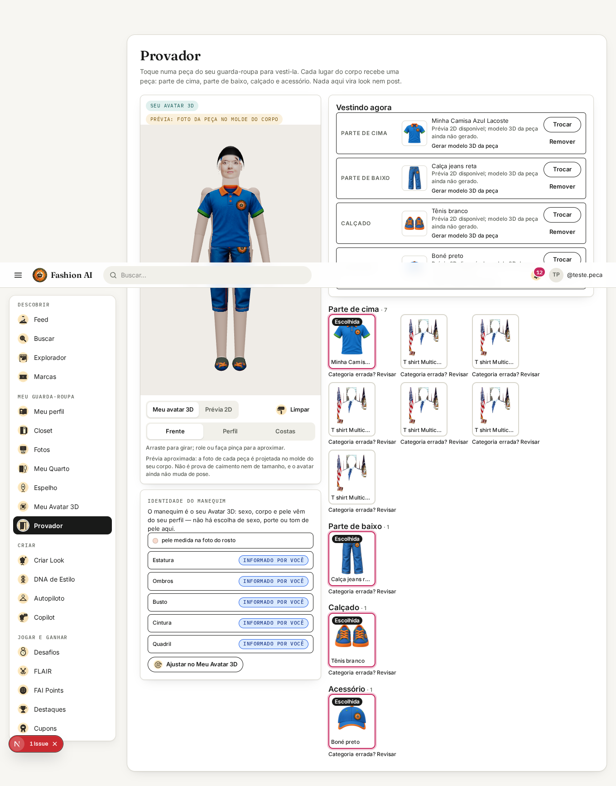

| Frente | Perfil | Costas | Giro manual |
|---|---|---|---|
| 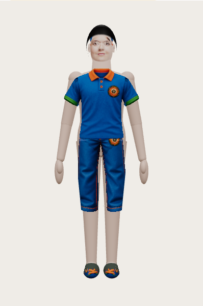 | 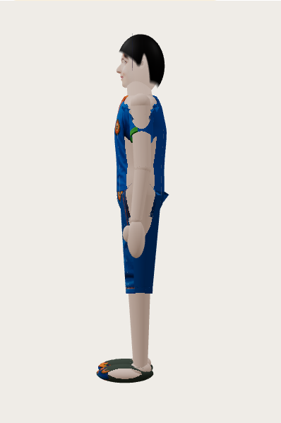 | 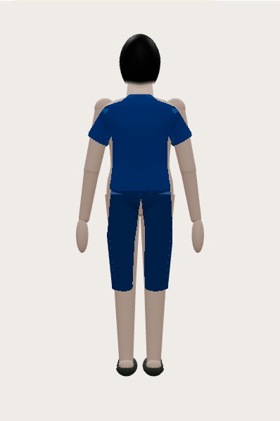 | 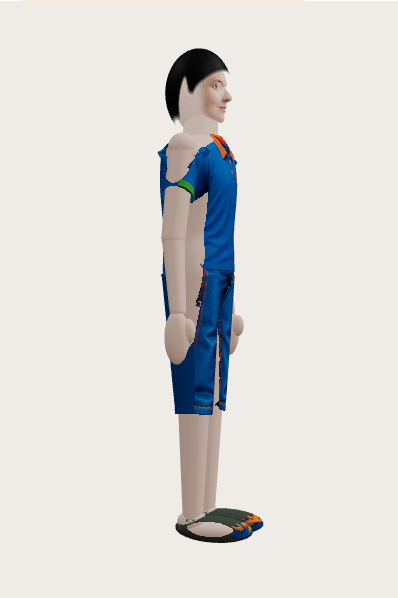 |

| Prévia 2D (mesmas medidas) | Sem avatar | Celular |
|---|---|---|
| 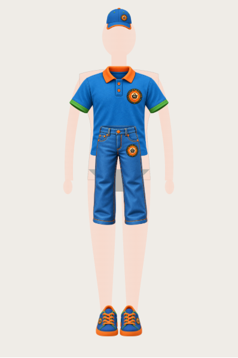 | 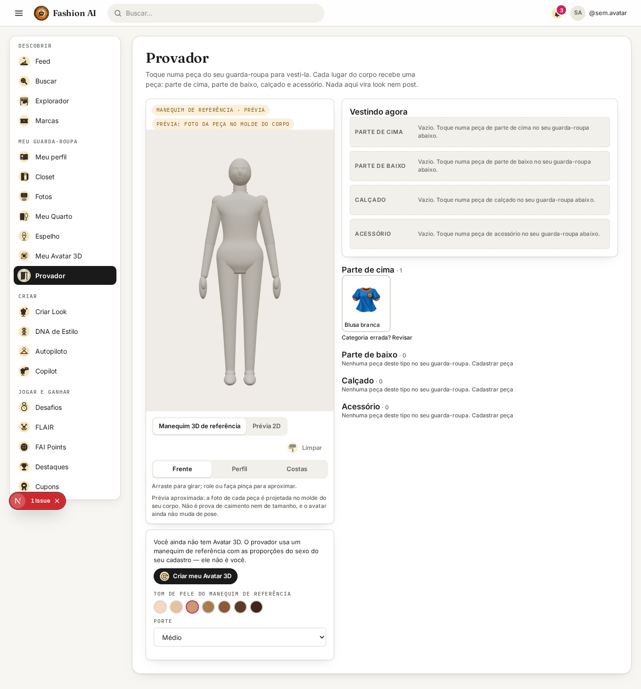 | 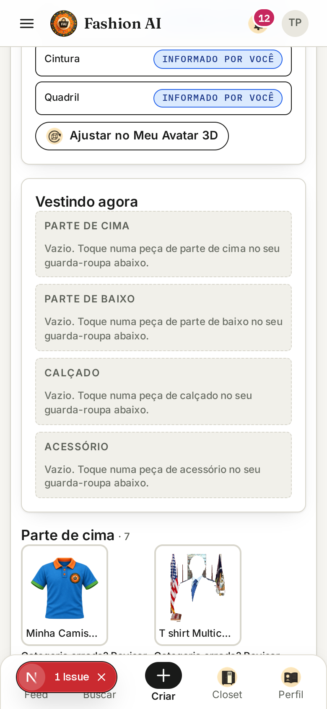 |

---

## 6. Ajuste da roupa: antes × depois, medido

Mesmas 3 peças em 4 corpos (duas referências, uma com medidas informadas e uma plus), pelo roteiro
`scripts/avatar3d/eval-garment.mjs`. Dados em `docs/avatar3d/garment-baseline-2026-09-27.json` (antes) e
`garment-depois-2026-09-27.json` (depois). Renders de frente, perfil e costas em `docs/avatar3d/img/dd/antes/` e
`docs/avatar3d/img/dd/depois/`.

| Métrica | Antes | Depois |
|---|---|---|
| Vértices da roupa dentro do corpo | 5,7–10,8% | 0% |
| Nos braços (axilas) | 21–65% | 0% |
| Estiramento da estampa, p95 | 12,2–13,7× | 2,6–2,8× |
| Folga média, camiseta e camisa | 1,3–1,5 cm | 1,2–1,4 cm |
| Folga máxima, camiseta | 1,6–1,8 cm | 2,8–3,9 cm (o tecido afastado das axilas forma bojos) |
| Moletom com folga acima de 3 cm | 42–87% | 43–87% (sem mudança) |
| Cobertura do tronco | 33–49% | 33–49% (sem mudança) |
| Tempo para montar a peça | 2–20 ms | 11–15 ms |

| Antes, costas | Depois, costas |
|---|---|
| 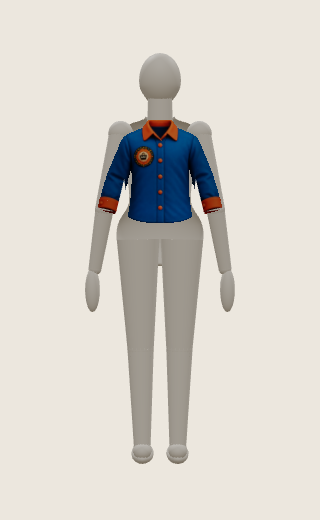 | 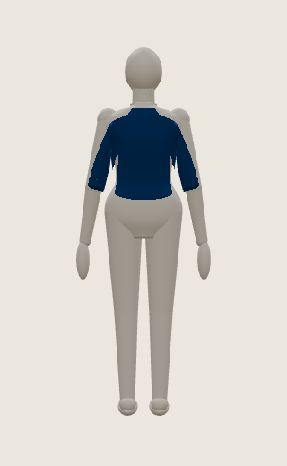 |

Antes, a frente da camisa aparecia espelhada nas costas. Agora as costas usam a cor do tecido, porque a foto não as mostra.

---

## 7. O que não foi feito e por quê

- **Braços erguidos e animação.** O avatar não tem esqueleto nem pesos de skinning. Não existe pose além da pose "A",
  então não há animação para entregar nem teste de ajuste em movimento. Isso é a fase 3 do plano
  (`docs/avatar3d/investigacao-pipeline-avatar.md`, seção 15).
- **Roupa vestível de verdade.** Falta uma malha de roupa por categoria com o mesmo rig do corpo, e as costas da peça
  precisam de foto. Até lá, a tela diz "prévia" e não marca a peça como vestida corretamente.
- **Comprimento da peça.** O comprimento vem da proporção da foto. A calça de teste saiu na altura da canela e o
  moletom mais curto que a camiseta. A cobertura do tronco não mudou.
- **Laterais vazadas no perfil.** Onde a foto frontal tem vão entre manga e tronco, a lateral do molde some.
- **Acessórios.** São placas planas. Com avatar, o boné fica escondido pela cabeça na vista 3D.
- **Foto da camisa Lacoste.** A captura enviada não chegou ao ambiente. O teste usa uma camisa azul do acervo de
  teste, cadastrada com o nome e a categoria da camisa do caso. O lugar depende da categoria, não da imagem.
- **Semelhança do avatar.** O avatar de teste vem de uma foto de demonstração. Com uma foto só, a profundidade do
  rosto é estimada, e a própria tela avisa isso.

---

## 8. Arquivos alterados

| Arquivo | Mudança |
|---|---|
| `app/(app)/try-on/page.tsx` | Reescrita: quatro lugares, avatar no palco, giro e zoom, prévia 2D identificada, sessão local, sem Provar, título ou salvar look |
| `fai-application/.../service/TryOnService.java` | `state` agrupa pela categoria (`slotOf`, `SLOTS`, `needsReview`) |
| `fai-application/src/test/.../TryOnSlotsTest.java` | Lugares pela categoria e categoria desconhecida pedindo revisão |
| `components/three/avatar-viewer.tsx` | Tom de pele do manequim de referência |
| `lib/avatar3d/garment-geometry.ts`, `garment-metrics.ts`, `components/three/mannequin.tsx` | Molde sem atravessar o corpo, estampa só na frente, normais corrigidas (commit anterior) |
| `app/globals.css` | Estilos dos quatro lugares |
| `lib/i18n/messages/*.json` | Textos novos em pt-BR, en e es |
| `scripts/tryon/verify-provador.mjs` | Testes de aceitação; substitui `scripts/avatar3d/verify-tryon.mjs`, que usava o contrato antigo |
