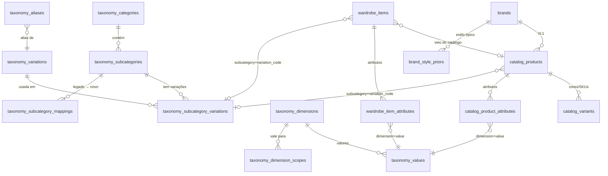

# Auditoria da taxonomia de peças e proposta CATEGORY → SUBCATEGORY → VARIATION

FashionAI · TCC 2026 · 05/10/2026 · base: `main` em `5f506ce` (schema V37)

**Status: só auditoria e proposta. Nada aqui altera código ou schema.** As mudanças dependem de aprovação (seção I).

Arquivos desta entrega:

| Arquivo | O que é |
|---|---|
| `docs/taxonomia/AUDITORIA_TAXONOMIA_PECAS.md` | este documento (seções A–I) |
| `docs/taxonomia/proposta/taxonomia_variacoes.csv` | tabela mestre: uma linha por subcategoria × variação (530 linhas) |
| `docs/taxonomia/proposta/taxonomia_variacoes.json` | proposta completa: categorias, subcategorias (ativas e legado), 353 variações, 23 dimensões de atributo com valores e aliases |
| `docs/taxonomia/proposta/seed_piece_variations.sql` | rascunho do seed: DDL das tabelas de vocabulário, categorias, subcategorias, variações, ligações e 2.486 aliases |

Resumo:

- **Taxonomia atual:** 5 categorias, 78 subcategorias, 59 cores, 7 materiais, 10 estampas, 25 estilos e 20 ocasiões, sem nenhuma noção de variação. Os vocabulários estão espalhados em pelo menos 9 lugares. Nenhum campo de taxonomia tem tabela de domínio, FK ou CHECK no banco.
- **Proposta:**
  - **72 subcategorias ativas:** 70 atuais + 2 novas, `top` e `boots`.
  - **8 subcategorias atuais viram LEGADO.** Elas continuam válidas, mas cada uma mapeia para "subcategoria + atributo".
  - **353 variações** com código único em inglês, ligadas às subcategorias em **530 pares**: 248 CORE, 212 EXTENDED e 70 NICHE.
  - **23 dimensões de atributo** separadas: acabamento, comprimento, cano, cintura, barra, manga, decote, fechamento, salto, bico, solado, uso/esporte, forma de carregar, aro, cor, material, estampa, estilo, ocasião, gênero e faixa etária.
- **Modelo de dados:** tabelas de vocabulário, mais `variation_code` na peça e no produto, mais tabelas de atributos peça→valor. **Migrations só aditivas, a partir da V39** (a V38 de produção é a identidade do avatar).
- **Busca catalogada:** todos os atributos viram select. Preço vem do JSON-LD (`offers`) das páginas oficiais. Estilo e ocasião saem de regras + IA com vocabulário fechado.

---

## A. Taxonomia atual

### A.1 Onde a taxonomia vive

| Camada | Arquivo | O que define |
|---|---|---|
| Backend (fonte "oficial") | `fai-application/.../taxonomy/Taxonomy.java` | 5 categorias × 78 subcategorias (l. 47–58), `SNEAKERS`, `RIGID_SUBCATEGORIES` (código morto), 20 ocasiões, 25 estilos, 7 materiais, 3 sexos, 59 cores em 12 famílias com hex, 31 tamanhos, mercado, wearstyles, limites de cardinalidade (l. 146–147) |
| Normalização (Java + Python) | `fai-application/src/main/resources/catalog/normalization.json` (v1.1.0) | cópia da hierarquia, 298 sinônimos de subcategoria, 176 de cor, 55 de material, 21 de gênero, 48 apelidos de marca, 20 stopwords, vocabulário de design (10 estampas, 5 posições de logo, tamanhos, lados) |
| API | `GET /api/taxonomy` (`WardrobeController:235`, `WardrobeService.taxonomy():2397`) | mapa cru (sem DTO): subcategorias, cores, famílias, materiais, tamanhos, sexos, ocasiões, estilos, ocasiões por categoria, wearstyles, imagens padrão, marcas |
| Frontend | `lib/api/taxonomy.ts` (busca a API), `lib/api/labels-{pt,en,es}.ts` (244 rótulos cada) | rótulos fixos em código; `piece-form.tsx` (4 categorias), `catalog-search.tsx`, `capture-guides.ts`, `scheme-builder.tsx` |
| Traduções backend | `messages*.properties` (`taxonomy.*`) | os mesmos 244 rótulos (sem diferença hoje, sem teste de paridade) |
| Pipeline Python | `scripts/catalog/normalize_product.py`, `providers/official_sitemap.py` | lê `normalization.json`; inferência de subtipo por n-gramas; `MODIFIERS`, `UNSUPPORTED` |
| IA | `WardrobeService.java:685–746` (analisador de peça), `MultiPieceService.java:156–184`, `CatalogTextInterpreter.java:44–52`, `OfficialCatalogDiscovery.java:34–50` | listas fechadas no prompt (exceto a descoberta oficial: cor e material livres) |
| Visão local | `LocalVision.java:90–127`, `PatternAnalyzer.java:18`, `LabelTextParser.java:24–34`, `CaptureProfiles.java` | só 5 subtipos; 4 estampas próprias; mapa de fibras; ~30 perfis de captura |
| Copilot | `CopilotService.java:108–152`, `CopilotLexicon.java:195–223` | um 4º vocabulário de texto livre |

### A.2 Hierarquia atual (5 × 78)

| Categoria | Qtde | Subcategorias |
|---|---|---|
| `upper_piece` | 18 | t_shirt, shirt, blouse, tank_top, crop_top, polo_shirt, bodysuit, sweater, sweatshirt, hoodie, cardigan, vest, blazer, jacket, coat, parka, windbreaker, kimono |
| `lower_piece` | 14 | jeans, tailored_pants, casual_pants, chino_pants, cargo_pants, jogger_pants, sweatpants, leggings, culottes, shorts, bermuda_shorts, denim_shorts, skirt, skort |
| `full_body_piece` | 5 | dress, jumpsuit, romper, matching_set, overalls |
| `shoes_piece` | 18 | casual_sneakers, running_shoes, training_shoes, basketball_shoes, skate_shoes, high_top_sneakers, loafers, moccasins, oxford_shoes, derby_shoes, ankle_boots, long_boots, combat_boots, sandals, flip_flops, heels, flats, espadrilles |
| `accessory_piece` | 23 | handbag, crossbody_bag, tote_bag, clutch, backpack, belt, cap, hat, beanie, scarf, tie, bow_tie, sunglasses, eyeglasses, necklace, bracelet, earrings, ring, watch, wallet, gloves, socks, hair_accessory |

Não existe nível de variação, modelagem ou caimento em nenhuma camada. A informação de corte só aparece solta, dentro de nomes de produto:

- **Acervo (9.573 linhas):** "slim" 581, "relaxed" 163, "skinny" 151, "oversized" 122, "wide leg" 28, "bootcut" 19.
- **Base de conhecimento:** "511 Slim", na V29.

### A.3 Vocabulários de atributo atuais

| Dimensão | Valores | Observação |
|---|---|---|
| Cor | 59 códigos em 12 famílias (Preto, Branco, Cinza, Azul, Vermelho, Rosa, Laranja, Amarelo, Verde, Roxo, Marrom, Especiais) | inclui `print`, `multicolor`, `denim`, `washed_black` |
| Material | COTTON, POLYESTER, WOOL, SILK, LEATHER, SYNTHETIC, BLEND | únicos em maiúsculas; sem linho, viscose, denim |
| Estampa | `design.patterns`: ALLOVER_LOGO, SINGLE_LOGO, STRIPES, PLAID, FLORAL, CAMO, TIE_DYE, COLOR_BLOCK, GRAPHIC, PLAIN | só no catálogo (`design_json`, V36); a peça não guarda estampa |
| Estilo | classic, minimalist, modern, chic, streetwear, sporty, athleisure, preppy, romantic, boho, vintage, grunge, edgy, glam, luxury, avant_garde, y2k, utility, techwear, tailored, urban, resort, basic, statement, futuristic | 25 |
| Ocasião | casual, work, business, formal, party, night_out, date, wedding, ceremony, sport, gym, travel, beach, vacation, school, university, social, home, outdoor, festival | 20, restritas por categoria via wearstyles ("proposta a validar") |
| Sexo | MASCULINO, FEMININO, UNISSEX | + `MARKET_GENDERS` male/female/unisex + `MannequinSex` |
| Tamanho | xs…xxl, br_34…br_52, shoe_33…shoe_46, one_size | lista única, sem vínculo com categoria |

### A.4 Persistência

| Entidade (tabela) | Campos de taxonomia | Tipo |
|---|---|---|
| Peça: `WardrobeItem` (`wardrobe_items`) | category, subcategory, sex, color, material, size_label, market, **style_tags / occasion_tags (CSV em VARCHAR(512))**, price DECIMAL(10,2) sem moeda, catalog_product_id/variant_id | tudo VARCHAR livre |
| Esquema / look: `Scheme` (`schemes`) | **style / occasion (CSV em VARCHAR(160))**, season, mood, total_price | VARCHAR livre + enums Java |
| Produto do catálogo: `CatalogProduct` (`catalog_products`, V30/V36) | category, subcategory, color, color_name, material VARCHAR(40), gender VARCHAR(20), description, design_json | **sem estilo, ocasião, preço, tamanho ou variação** |
| Variante: `CatalogVariant` | color, color_name, codes, availability | "variante" = cor/SKU, não modelagem |
| Marca: `Brand` | name, slug, source, catalog_origin, country | sem segmento nem faixa de preço |

- Nenhuma coluna de taxonomia tem tabela de domínio, FK ou CHECK. Os únicos CHECKs do schema estão na V35, em `users.account_origin` e `brands.catalog_origin`.
- Estilo e ocasião aparecem como CSV ou texto livre em pelo menos 7 tabelas: peças, looks, `dna_schemes`, `hype_scores`, `style_dna`, KB e `flair`.

### A.5 Regras de cardinalidade em vigor

| Regra | Backend | Frontend |
|---|---|---|
| Peça: 1–2 estilos e 1–2 ocasiões (ocasião restrita à categoria) | `Taxonomy.MAX_PIECE_TAGS = 2`, `pieceErrors`; cortes da IA com o literal 2 (`WardrobeService:812–813, 916–921`) | `lib/pieces/tags.ts` (`MAX_TAGS=2`), `piece-form.tsx` |
| Esquema (look): 1–3 estilos e 1–3 ocasiões | `SchemeService:470–471` (literal 3); `MAX_SCHEME_TAGS` não é usado fora de teste | `scheme-tags.tsx` (`SCHEME_MAX_TAGS=3`) |
| Selos: peça ≤ 2, look ≤ 4 | `WardrobeService:1261`, `SchemeService:472` | `piece-form.tsx:57` |

**A proposta preserva essas cardinalidades:** peça ≤ 2 estilos e ≤ 2 ocasiões, esquema ≤ 3 de cada.

### A.6 IA e visão

| Uso | Vocabulário entregue ao modelo | Lista fechada? | Validação da saída |
|---|---|---|---|
| Analisador de peça (Gemini → Claude Haiku → local) | categorias, subtipos da categoria, cores, materiais, sexos, ocasiões permitidas, estilos | sim | `parseAnalysis` descarta fora da lista e cai em padrões (`upper_piece`, primeiro subtipo, `black`, `UNISSEX`, `basic`) |
| Detector de várias peças (Claude Opus → Gemini) | mapa de subcategorias, ocasiões, estilos, cores | sim | `parseDetections` descarta fora da lista |
| Intérprete de texto da busca (Claude Haiku) | estampa, posição/tamanho do logo, lados, cores | sim | `parse` descarta |
| Descoberta oficial (Claude Opus + busca web) | nome, modelo, **cor e material livres** | **não** | normalizado depois; o desconhecido é descartado em silêncio |
| Visão local | 5 subtipos, 4 estampas (`SOLID/STRIPED/CHECKED/PRINTED`) | — | não mapeado para `design.patterns` |

### A.7 Busca catalogada (RF47)

`CatalogService.resolve` processa o pedido em quatro passos:

1. Normaliza os campos explícitos.
2. Lê o design do texto.
3. Procura o subtipo pela frase mais longa (de 4 a 2 palavras).
4. Passa token por token, nesta ordem: **cor antes de subcategoria**, depois marca, e o que sobra vira palavra-chave.

O pool de candidatos é montado nesta ordem: subtipo+cor, depois subtipo, depois palavras da estampa, depois o pool geral (FULLTEXT ngram, 200 por consulta).

A ordenação usa o `CatalogMatchScorer`, com pesos marca 0,25, categoria 0,10, subcategoria 0,20, texto 0,35, cor 0,10, visual 0,15 e design 0,45.

O formulário da busca hoje tem: tipo, subtipo (chips), marca, texto, cor e gênero. **Não tem** variação, material, estampa, acabamento, comprimento, estilo, ocasião nem preço.

---

## B. Problemas e inconsistências

Severidade: **A** = corrompe dado ou impede o uso; **M** = gera divergência ou retrabalho; **B** = cosmético ou de documentação.

### B.1 Modelo

| # | Sev. | Problema | Evidência |
|---|---|---|---|
| 1 | A | **Não existe variação/modelagem.** "Calça jeans mom" e "calça jeans skinny" são indistinguíveis no banco, na busca, nos filtros e na IA. | `WardrobeItem.java`, `CatalogProduct.java`, `Taxonomy.java` |
| 2 | A | **O coletor apaga o corte.** `MODIFIERS` remove "boot cut", "bootcut", "shirt dress", "tee dress" e o comprimento da manga antes de inferir o tipo; "\| Tall" e "caimento" também saem do título. | `official_sitemap.py:260–261, 303` |
| 3 | M | **Subcategorias que são "outra subcategoria + 1 atributo":** `denim_shorts` (material), `bermuda_shorts` e `crop_top` (comprimento), `high_top_sneakers` e `ankle_boots`/`long_boots` (altura do cano), `combat_boots` (variação de bota), `crossbody_bag` (forma de carregar). Variações iguais acabariam duplicadas em duas subcategorias (ex.: COMBAT em `ankle_boots` e em `combat_boots`). | `Taxonomy.java:47–58` |
| 4 | M | **Uso/esporte misturado com silhueta** em calçados: `running/training/basketball/skate_shoes` (uso) ao lado de `high_top_sneakers` (cano). | idem |
| 5 | M | **O DNA de estilo deduz a silhueta pela subcategoria:** todo casaco vira "oversized" e toda saia vira "fitted". | `DnaService.java:339–350` |
| 6 | M | **Tipos sem código:** slides (17 chinelos slide caem em `flip_flops`), mules, tamancos, chuteira (citada na UI, `pt-BR.json:2687`), moda praia, meia-calça, top esportivo. | acervo; `official_sitemap.py:290` |

### B.2 Vocabulários sobrepostos

| # | Sev. | Problema | Evidência |
|---|---|---|---|
| 7 | A | **A mesma palavra cai em dimensões diferentes.** "denim" vira subcategoria `jeans`, cor `denim` e material COTTON; "jeans" vira subcategoria e cor; "estampa/print" vira cor `print` e estampa GRAPHIC; "tricot" vira `sweater` e WOOL. Como a busca testa **cor antes de subcategoria**, "jeans skinny" resolve como cor=denim, sem subtipo, e `color("Calça Jeans Azul")` dá `denim`. | `normalization.json:324–329, 762–766, 946–950`; `CatalogService.java:145–158` |
| 8 | A | **Sinônimos curtos e perigosos.** "la" vira WOOL ("camiseta **de la** marca" fica de lã); "m", "f", "w", "u" e "all" viram gênero; "body", "royal", "sail" e "nude" são ambíguos; "maxi" e "mini" marcam **logo grande ou pequeno** mesmo sem logo, então "vestido maxi" sai como "Logo grande" (o acervo tem "maxi" 228 vezes). | `normalization.json:977, 1032–1049, 1336–1352`; `CatalogDesignInterpreter.java:95` |
| 9 | M | **A paleta de cores mistura o que não é cor:** `print` e `multicolor` (estampa), `denim` (tecido), `washed_black` (lavagem), metálicos que duplicam dourado e prata. | `Taxonomy.java:73–89` |
| 10 | M | **Material grosseiro.** BLEND não é fibra. SYNTHETIC agrupa nylon, borracha, EVA, PVC, acetato e metal. Não existe LINEN, embora o rótulo "Linho" exista. Viscose e elastano viram SYNTHETIC em um parser e não existem no outro. "Couro sintético" vira LEATHER no normalizador e SYNTHETIC no Copilot. | `normalization.json:952–1022`; `LabelTextParser.java:24–34`; `CopilotLexicon.java:220` |
| 11 | M | **Três vocabulários de estampa:** os 10 do `design`, os 4 do `PatternAnalyzer` e as cores `print`/`multicolor`. ALLOVER_LOGO e SINGLE_LOGO misturam quantidade e posição de logo dentro de "estampa". | `PatternAnalyzer.java:18`; `normalization.json:1162–1334` |
| 12 | M | **Estilos misturam estética com outras coisas:** construção (`tailored`), faixa de preço (`luxury`), ocasião/estação (`resort`), detalhe (`utility`), e há pares sobrepostos (`sporty` × `athleisure`, `streetwear` × `urban`). Existe ainda um 2º vocabulário de estilo, `StyleArchetype`. | `Taxonomy.java:26–28` |
| 13 | M | **Rótulo e sinônimo divergem.** "castanho" é sinônimo de brown, mas é o rótulo de tan. "vinho" é sinônimo de burgundy, mas é o rótulo de maroon. "pink" é a cor pink, mas é o rótulo de hot_pink. taupe tem o rótulo "Fendi" (nome de marca). "rasteira" é `sandals` no normalizador e `flats` no Copilot. | `labels-pt.ts:22–27`; `normalization.json` |
| 14 | M | **Três vocabulários de gênero e códigos em línguas misturadas:** MASCULINO/FEMININO/UNISSEX × male/female/unisex × MannequinSex; materiais em maiúsculas; famílias de cor que são rótulos em português usados como chave; wearstyles com chaves em PT e EN. | `Taxonomy.java:29–37, 60–89` |

### B.3 Fonte da verdade duplicada

| # | Sev. | Problema | Evidência |
|---|---|---|---|
| 15 | M | **A hierarquia está escrita 2 vezes no backend** (Taxonomy.java e normalization.json), com 6 tabelas de rótulo (3 no front e 3 no back). Só existe um teste parcial, que verifica num sentido só. O cabeçalho cita arquivos que não existem (`taxonomias_fashion_ai_v5.html`, `lib/taxonomy.ts`). | `CatalogNormalizerTest.java:12–16`; `Taxonomy.java:12–13` |
| 16 | M | **"OUTERWEAR" definido 9 vezes com membros diferentes.** O colete é sobreposição no front e TOP no back. A regra "uma peça por categoria" do `scheme-builder` impede TOP + OUTERWEAR num look manual. | `scheme-builder.tsx:26`, `fitting-room.ts:14`, `CaptureProfiles.java:91`, `FlairLooks.java:55`… |
| 17 | M | **Três algoritmos de inferência de subtipo:** n-gramas em Python com heurística de idioma; frase mais longa + token em Java; nome inteiro exato na descoberta (que quase nunca casa). | `official_sitemap.py:265–287`; `CatalogService.java:126–158, 449` |
| 18 | A | **O coletor classifica errado.** `ENGLISH_HINTS` contém "s", então o "s" de "Levi's" troca o título em português para o modo "última ocorrência": "Jaqueta Jeans Levi's® Trucker" vira `jeans`. No acervo, ~50 jaquetas, camisas, saias e vestidos jeans estão em `jeans`, 114 "Sandália … Salto" estão em `sandals` e 14 chemises estão em `shirt`. | `official_sitemap.py:262` |
| 19 | M | **Códigos fora da taxonomia usados no código:** `FlairLooks` (sneakers, chelsea_boots, trench_coat, puffer_jacket…), `DefaultOutfit` ("sneakers") e `search_tests.py` (full_piece, slip_on_sneakers, mini/midi/maxi_dress, trench_coat). | `FlairLooks.java:51–55` |
| 20 | B | **`search_text` montado de 3 jeitos** (Java, `ingest.py`, `rebuild_search_index.py`); **2 fontes de apelido de marca** (18 × 29 marcas); **limites escritos como literais** em vez de constantes. | `CatalogIngestService.java:328–344`; `seed_catalog.py:39` |

### B.4 Persistência e dados

| # | Sev. | Problema | Evidência |
|---|---|---|---|
| 21 | A | **`catalog_products` não tem estilo, ocasião, preço nem variação.** Ao adicionar ao guarda-roupa entram constantes: estilo `basic`, ocasião `casual`, preço 0, material **BLEND**, sexo UNISSEX, cor black. O acervo tem **0% de material, 0% de gênero e 0% de preço**, então toda peça vinda do catálogo vira "misto". | `CatalogService.java:493–505`; `pieces/new/page.tsx:64–71` |
| 22 | M | **Estilo e ocasião em CSV/texto livre, sem FK.** O Javadoc da peça diz "JSON", mas é CSV; `dna_schemes` guarda um texto livre de até 120 caracteres. | `V1:72–73, 105–106`; `DnaService.java:652–657` |
| 23 | M | **Tamanhos de colunas divergentes:** material é 80, 40 ou 30; sexo 40 × gênero 20; categoria 80 × 40. | `V1:69`, `V30:55`, `V20:7`, `V31:45` |
| 24 | M | **Preço sem moeda.** A chave i18n diz `_usd`, a interface diz "R$". | `messages.properties:2083`; `pt-BR.json:2633` |
| 25 | M | **Sem faixa etária:** produtos infantis aparecem na busca adulta. 432 nomes do acervo são infantis, e o 1º resultado de "Nike · camiseta azul" foi uma camiseta "Big Kids'". | `docs/testes/busca-catalogada/README.md` |
| 26 | B | **Tamanho ignora a categoria** (shoe_40 é aceito numa camiseta); **mercado é validado mas nunca capturado.** | `Taxonomy.java:33–35, 249–255` |

### B.5 Interface

| # | Sev. | Problema | Evidência |
|---|---|---|---|
| 27 | A | **`full_body_piece` está meio removida.** Saiu do formulário da peça e do lookbook, mas continua na taxonomia, nos chips do criador, no detector de IA e no catálogo (431 itens). Um item escolhido do catálogo ou detectado pela IA recebe uma categoria que o select não mostra. | `piece-form.tsx:26–27`; `pieces/new/page.tsx:137` |
| 28 | M | **A ocasião restrita por categoria bloqueia usos legítimos:** gravata, clutch ou relógio não podem ser "trabalho/formal/casamento"; oxford não pode ser "trabalho"; calça não pode ser "festa". | `Taxonomy.java:60–70, 224–232` |
| 29 | M | **O "refinar por cor" da busca mostra só 18 das 59 cores**: nenhum vermelho, rosa, laranja, amarelo, verde, roxo ou marrom. | `catalog-search.tsx:176` (`slice(0, 18)`) |
| 30 | B | **Termos à deriva:** "Tipo" ora é categoria, ora subcategoria; `full_body_piece` aparece como "Peça única", "Peça inteira" e "corpo inteiro"; há rótulos órfãos (`linen`, `livre`, `like_new`) e status sem rótulo (`DAMAGED`). | `pt-BR.json:814, 2860`; `labels-pt.ts` |

### B.6 Documentação

| # | Sev. | Problema |
|---|---|---|
| 31 | B | `RF47_ACERVO_BUSCA_CATALOGADA.md` diz V31 para `design_json` (é V36). `RF04_ADAPTIVE_GARMENT_CAPTURE.md` diz que `wallet` não existe e fala em "83+ subcategorias" (são 78). O Javadoc de `WardrobeItem` diz JSON (é CSV). |

---

## C. Nova taxonomia proposta

### C.1 Princípios

1. **CATEGORY → SUBCATEGORY → VARIATION.**
   - A subcategoria é o tipo de produto como o varejo e a pessoa o chamam: "calça jeans", "saia", "bota".
   - A variação é **só corte, silhueta ou construção**.
   - Todo o resto é atributo, numa dimensão separada.
2. **Fora da variação:**
   - acabamento (ripped, washed, raw), comprimento (mini/midi/maxi, cropped, capri), cintura (rise), manga, decote, fechamento, uso/esporte, cor, material, estampa, estilo e ocasião;
   - também: cano, salto, bico, solado, barra, forma de carregar e aro.
3. **Código único no sistema inteiro, em inglês `UPPER_SNAKE`.**
   - O mesmo código tem **o mesmo significado** em todas as subcategorias. WIDE_LEG serve para jeans, alfaiataria, moletom e macacão; MULE serve para sandália, salto, sapatilha e alpargata.
   - Palavras genéricas com sentidos diferentes ganham sufixo: `BUCKET_HAT` × `BUCKET_BAG`, `MUSCLE_FIT` (camiseta) × `MUSCLE_TANK` (regata machão), `CUFFED_HEM` (barra com punho) × `CUFFED_BEANIE`.
   - Assim, 62 códigos são reaproveitados sem duplicidade semântica.
4. **Uma variação por peça.** Quando duas parecem caber, vale a que define a silhueta. O que é ortogonal foi para atributo:
   - "transpassado" é `CLOSURE=DOUBLE_BREASTED`;
   - "plataforma" é `SOLE_TYPE=PLATFORM`;
   - "assimétrica" é `HEM=ASYMMETRIC`;
   - "slip-on" é `CLOSURE=SLIP_ON`.
5. **Subcategoria = outra subcategoria + 1 atributo vira LEGADO.**
   - O código continua válido no banco e na API, e um mapeamento diz o equivalente novo.
   - Os aliases ("bermuda", "short jeans", "coturno", "tênis cano alto") passam a resolver para "subcategoria + atributo".
6. **Tiers:**
   - **CORE** aparece por padrão no formulário e nos filtros;
   - **EXTENDED** fica em "mais opções" e na busca;
   - **NICHE** só é alcançado por busca, alias ou IA.

   A `priority` (1–5) ordena dentro do tier; 1 aparece primeiro.
7. **A IA só grava valores do vocabulário** (C.6).
8. **Cardinalidade preservada:** peça ≤ 2 estilos e ≤ 2 ocasiões; esquema ≤ 3 de cada; acabamento ≤ 3. As demais dimensões são de valor único.

### C.2 Categorias

Os 5 códigos atuais continuam sem renomear:

| Código | PT-BR (proposto) | EN |
|---|---|---|
| `upper_piece` | Parte superior | Top |
| `lower_piece` | Parte inferior | Bottom |
| `full_body_piece` | Peça inteira | One-piece |
| `shoes_piece` | Calçados | Shoes |
| `accessory_piece` | Acessórios | Accessories |

O rótulo "Peça inteira" substitui "Peça única", que conflita com o slot `full_body` e com o padrão de calçado "peça única" (WHOLECUT). Veja a decisão I.6.

### C.3 Mudanças de subcategoria

**Novas (2):**

| Código | Categoria | Por quê |
|---|---|---|
| `top` (Top) | upper | tops de moda e esportivos que não são camiseta, regata nem blusa: CORSET, BANDEAU, BRALETTE, SPORTS_BRA, BUSTIER… Absorve o `crop_top`, cujo nome descrevia comprimento. |
| `boots` (Bota) | shoes | uma só subcategoria de bota. A altura do cano vira o atributo `SHAFT_HEIGHT` e o estilo vira variação (CHELSEA, COMBAT, WESTERN, RIDING…). |

**Viram LEGADO (8).** Continuam aceitas; a migração é feita com revisão:

| Legado | Equivalente novo | Revisão? | Itens no acervo |
|---|---|---|---|
| `crop_top` | `top` + LENGTH=CROPPED | **sim**: camiseta, regata ou blusa cropped vão para a própria subcategoria + CROPPED | 46 |
| `bermuda_shorts` | `shorts` + LENGTH=KNEE | não | 92 |
| `denim_shorts` | `shorts` + MATERIAL=DENIM | não | 16 |
| `high_top_sneakers` | `casual_sneakers` + SHAFT_HEIGHT=HIGH_TOP | não | 9 |
| `ankle_boots` | `boots` + SHAFT_HEIGHT=ANKLE | não | 11 |
| `long_boots` | `boots` + SHAFT_HEIGHT=KNEE_HIGH | **sim**: pode ser MID_CALF ou OVER_THE_KNEE | 0 |
| `combat_boots` | `boots` + variação COMBAT | não | 15 |
| `crossbody_bag` | `handbag` + CARRY_MODE=CROSSBODY | não | 69 |

Total no acervo: 258 de 9.573 itens. No formulário, "Bermuda", "Short jeans" e "Tênis cano alto" podem continuar como atalhos visuais que preenchem subcategoria + atributo.

**Ficam como estão, apesar de serem quase um atributo.** São nomes fortes do varejo; veja a decisão I.2.

- `jeans`: calça + denim. É o exemplo do próprio pedido.
- `culottes`: pantacourt, ou seja, pantalona + comprimento capri.
- `hoodie`: moletom + capuz.
- `heels` × `flats`: separados pela altura do salto.
- `tote_bag` e `clutch`: são formatos de bolsa.
- os tênis por esporte.

Para esses casos valem regras de consistência (C.7) em vez de mudar a estrutura.

### C.4 Árvore completa (subcategoria → variações por tier)

**Parte superior** (`upper_piece`)

| Subcategoria | Status | CORE | EXTENDED | NICHE |
|---|---|---|---|---|
| `t_shirt` (Camiseta) | ativa | REGULAR, SLIM, OVERSIZED, BOXY, RELAXED, BABY_TEE | MUSCLE_FIT | ATHLETIC_FIT |
| `shirt` (Camisa) | ativa | REGULAR, SLIM, OVERSIZED, RELAXED | OVERSHIRT, BOXY, EXTRA_SLIM | WESTERN_SHIRT, TUXEDO_SHIRT |
| `blouse` (Blusa) | ativa | RELAXED, SLIM, WRAP, PEASANT, PEPLUM | OVERSIZED, TUNIC, BABYDOLL, SMOCKED, TIE_FRONT | CORSET |
| `tank_top` (Regata) | ativa | REGULAR, CAMISOLE, SLIM, RACERBACK, MUSCLE_TANK | BOXY, DEEP_ARMHOLE | STRAPPY |
| ~~crop_top~~ (Cropped) | LEGADO → `top` + LENGTH=CROPPED | | | |
| `polo_shirt` (Camisa polo) | ativa | REGULAR, SLIM | OVERSIZED, RELAXED | BOXY, RUGBY |
| `bodysuit` (Body) | ativa | SLIM, CORSET | CUT_OUT, WRAP, HIGH_CUT, SHAPING | DRAPED |
| `sweater` (Suéter) | ativa | REGULAR, SLIM, OVERSIZED, BOXY | RELAXED |  |
| `sweatshirt` (Moletom) | ativa | REGULAR, OVERSIZED, BOXY | RELAXED, SLIM |  |
| `hoodie` (Moletom com capuz) | ativa | REGULAR, OVERSIZED, BOXY | RELAXED, SLIM |  |
| `cardigan` (Cardigã) | ativa | REGULAR, OVERSIZED, SLIM | BOXY, WRAP | BOLERO |
| `vest` (Colete) | ativa | TAILORED_VEST, PUFFER, KNIT_VEST | UTILITY, QUILTED |  |
| `blazer` (Blazer) | ativa | REGULAR, SLIM, OVERSIZED | BOXY, RELAXED, UNSTRUCTURED |  |
| `jacket` (Jaqueta) | ativa | BOMBER, TRUCKER, MOTO, PUFFER, VARSITY, FIELD, TRACK | QUILTED, CHORE, AVIATOR_JACKET, COACH | HARRINGTON, SAFARI, NAPOLEON |
| `coat` (Casaco) | ativa | TRENCH, OVERCOAT, PEACOAT, PUFFER | WRAP, COCOON, CAPE | DUFFLE, CAR_COAT |
| `parka` (Parka) | ativa | PUFFER, SHELL | FISHTAIL | SNORKEL |
| `windbreaker` (Corta-vento) | ativa | SHELL, ANORAK, RAIN_JACKET | PACKABLE |  |
| `kimono` (Quimono) | ativa | OPEN_FRONT | BELTED |  |
| `top` (Top) **(nova)** | ativa | CORSET, BANDEAU, SPORTS_BRA, BRALETTE | BUSTIER, CUT_OUT, TIE_FRONT | DRAPED |

**Parte inferior** (`lower_piece`)

| Subcategoria | Status | CORE | EXTENDED | NICHE |
|---|---|---|---|---|
| `jeans` (Calça jeans) | ativa | SKINNY, SLIM, STRAIGHT, MOM, WIDE_LEG, FLARE, BAGGY, RELAXED | BOOTCUT, REGULAR, TAPERED, BOYFRIEND, LOOSE, DAD, BARREL, CARROT, SKATER, BALLOON | BELL_BOTTOM, GIRLFRIEND, HORSESHOE |
| `tailored_pants` (Calça de alfaiataria) | ativa | STRAIGHT, SLIM, WIDE_LEG, PALAZZO, CIGARETTE, FLARE | TAPERED, CARROT, PAPERBAG, BOOTCUT | SKINNY, BARREL, SAILOR |
| `casual_pants` (Calça casual) | ativa | STRAIGHT, SLIM, WIDE_LEG, RELAXED | SKINNY, FLARE, PALAZZO, BAGGY, TAPERED, PARACHUTE, PAPERBAG | HAREM |
| `chino_pants` (Calça chino) | ativa | SLIM, STRAIGHT, REGULAR | TAPERED, RELAXED | SKINNY, WIDE_LEG |
| `cargo_pants` (Calça cargo) | ativa | STRAIGHT, RELAXED, BAGGY | WIDE_LEG, CUFFED_HEM, SLIM, TAPERED, PARACHUTE |  |
| `jogger_pants` (Calça jogger) | ativa | REGULAR, SLIM | RELAXED | HAREM |
| `sweatpants` (Calça de moletom) | ativa | CUFFED_HEM, STRAIGHT, WIDE_LEG | BAGGY, FLARE | PALAZZO |
| `leggings` (Legging) | ativa | SKINNY, FLARE | SEAMLESS, COMPRESSION, STRAIGHT | STIRRUP |
| `culottes` (Pantacourt) | ativa | STRAIGHT, A_LINE | PAPERBAG | GAUCHO, WRAP |
| `shorts` (Short) | ativa | STRAIGHT, MOM, RELAXED, BIKER | BAGGY, CARGO, SLIM, BOYFRIEND, PAPERBAG, A_LINE |  |
| ~~bermuda_shorts~~ (Bermuda) | LEGADO → `shorts` + LENGTH=KNEE | | | |
| ~~denim_shorts~~ (Short jeans) | LEGADO → `shorts` + MATERIAL=DENIM | | | |
| `skirt` (Saia) | ativa | A_LINE, PENCIL, CIRCLE, PLEATED, STRAIGHT, WRAP | SLIP, TIERED, MERMAID, GATHERED | BALLOON, TULIP, CARGO, TUTU |
| `skort` (Short-saia) | ativa | A_LINE, PLEATED | WRAP, STRAIGHT |  |

**Peça inteira** (`full_body_piece`)

| Subcategoria | Status | CORE | EXTENDED | NICHE |
|---|---|---|---|---|
| `dress` (Vestido) | ativa | SHEATH, A_LINE, FIT_AND_FLARE, SLIP, WRAP, SHIRT_DRESS, BODYCON, SHIFT | T_SHIRT_DRESS, TIERED, BABYDOLL, SMOCKED, EMPIRE, MERMAID, CORSET, KAFTAN | TRAPEZE, BLAZER_DRESS, PINAFORE, BALL_GOWN, CUT_OUT, PEPLUM, BALLOON |
| `jumpsuit` (Macacão) | ativa | WIDE_LEG, STRAIGHT, BOILERSUIT | PALAZZO, FLARE, WRAP, CUFFED_HEM, SLIM | CUT_OUT |
| `romper` (Macaquinho) | ativa | RELAXED, WRAP | SMOCKED, SLIM, A_LINE | BOILERSUIT |
| `matching_set` (Conjunto) | ativa | TOP_AND_PANTS, TOP_AND_SKIRT, TOP_AND_SHORTS, SUIT, TRACKSUIT |  | THREE_PIECE |
| `overalls` (Jardineira) | ativa | STRAIGHT, RELAXED | WIDE_LEG, BAGGY, SLIM, CARPENTER |  |

**Calçados** (`shoes_piece`)

| Subcategoria | Status | CORE | EXTENDED | NICHE |
|---|---|---|---|---|
| `casual_sneakers` (Tênis casual) | ativa | COURT, VULCANIZED, RETRO_RUNNER, DAD_SNEAKER, TERRACE | DRESS_SNEAKER, TECH_RUNNER, SOCK_SNEAKER | SNEAKER_BOOT |
| `running_shoes` (Tênis de corrida) | ativa | NEUTRAL, STABILITY, TRAIL | MAX_CUSHION, RACING | TRACK_SPIKE, MINIMALIST |
| `training_shoes` (Tênis de treino) | ativa | CROSS_TRAINING | WALKING, WEIGHTLIFTING |  |
| `basketball_shoes` (Tênis de basquete) | ativa | PERFORMANCE, HERITAGE |  |  |
| `skate_shoes` (Tênis de skate) | ativa | VULCANIZED, CUPSOLE |  |  |
| ~~high_top_sneakers~~ (Tênis cano alto) | LEGADO → `casual_sneakers` + SHAFT_HEIGHT=HIGH_TOP | | | |
| `loafers` (Mocassim loafer) | ativa | PENNY, HORSEBIT | TASSEL, VENETIAN, SLIPPER | BELGIAN |
| `moccasins` (Mocassim) | ativa | TRUE_MOC, DRIVER, BOAT_SHOE |  |  |
| `oxford_shoes` (Sapato oxford) | ativa | PLAIN_TOE, CAP_TOE, WINGTIP | SEMI_BROGUE, WHOLECUT | SADDLE_SHOE |
| `derby_shoes` (Sapato derby) | ativa | PLAIN_TOE | CAP_TOE, WINGTIP, APRON_TOE, MONK_STRAP |  |
| ~~ankle_boots~~ (Bota curta) | LEGADO → `boots` + SHAFT_HEIGHT=ANKLE | | | |
| ~~long_boots~~ (Bota cano longo) | LEGADO → `boots` + SHAFT_HEIGHT=KNEE_HIGH | | | |
| ~~combat_boots~~ (Coturno) | LEGADO → `boots` + VARIATION=COMBAT | | | |
| `sandals` (Sandália) | ativa | STRAPPY, ANKLE_STRAP, SPORT_SANDAL, FOOTBED, MULE | GLADIATOR, FISHERMAN, T_STRAP, CLOG |  |
| `flip_flops` (Chinelo) | ativa | THONG, SLIDE |  |  |
| `heels` (Salto) | ativa | PUMP, SLINGBACK, MULE, MARY_JANE | ANKLE_STRAP, D_ORSAY |  |
| `flats` (Sapatilha) | ativa | BALLET, MARY_JANE, MULE | SLINGBACK, SLIPPER | D_ORSAY |
| `espadrilles` (Alpargata) | ativa | CLASSIC_ESPADRILLE | LACE_UP_ESPADRILLE, MULE |  |
| `boots` (Bota) **(nova)** | ativa | CHELSEA, COMBAT, WESTERN, WORK_BOOT, RIDING | CHUKKA, HIKING, SOCK_BOOT, ENGINEER, SLOUCH, RAIN_BOOT | SNOW_BOOT |

**Acessórios** (`accessory_piece`)

| Subcategoria | Status | CORE | EXTENDED | NICHE |
|---|---|---|---|---|
| `handbag` (Bolsa de mão) | ativa | TOP_HANDLE, SHOPPER, HOBO, BUCKET_BAG, BAGUETTE, SATCHEL, CAMERA_BAG, BELT_BAG | SADDLE_BAG, HALF_MOON_BAG, BOX_BAG, MESSENGER_BAG, PHONE_BAG, SLING_BAG, BOWLER_BAG, BASKET_BAG, DUFFLE_BAG | DOCTOR_BAG, FRAME_BAG |
| ~~crossbody_bag~~ (Bolsa transversal) | LEGADO → `handbag` + CARRY_MODE=CROSSBODY | | | |
| `tote_bag` (Bolsa tote) | ativa | SHOPPER, STRUCTURED_TOTE | SLOUCHY_TOTE | EAST_WEST_TOTE |
| `clutch` (Clutch) | ativa | ENVELOPE_CLUTCH, POUCH | MINAUDIERE, WRISTLET, FOLDOVER |  |
| `backpack` (Mochila) | ativa | DAYPACK, LAPTOP_BACKPACK, GYMSACK | ROLLTOP, RUCKSACK, CONVERTIBLE_BACKPACK, HIKING_PACK |  |
| `belt` (Cinto) | ativa | PIN_BUCKLE, PLATE_BUCKLE, BRAIDED_BELT, WIDE_BELT | D_RING, WEB_BELT, WESTERN_BELT, CHAIN_BELT, REVERSIBLE_BELT |  |
| `cap` (Boné) | ativa | BASEBALL_CAP, DAD_CAP, FLAT_BRIM_CAP, TRUCKER_CAP | FIVE_PANEL, VISOR | MILITARY_CAP |
| `hat` (Chapéu) | ativa | BUCKET_HAT, FEDORA, BERET, FLOPPY_HAT | FLAT_CAP, COWBOY_HAT, BOATER, TRILBY | CLOCHE, BOWLER_HAT |
| `beanie` (Gorro) | ativa | CUFFED_BEANIE, SLOUCHY_BEANIE | FISHERMAN_BEANIE, BALACLAVA |  |
| `scarf` (Cachecol) | ativa | LONG_SCARF, SQUARE_SCARF, BLANKET_SCARF | INFINITY_SCARF, BANDANA, SKINNY_SCARF |  |
| `tie` (Gravata) | ativa | CLASSIC_TIE, SLIM_TIE | SKINNY_TIE, KNIT_TIE | ASCOT_TIE, BOLO_TIE |
| `bow_tie` (Gravata-borboleta) | ativa | PRE_TIED_BOW, SELF_TIE_BOW |  |  |
| `sunglasses` (Óculos de sol) | ativa | AVIATOR, WAYFARER, SQUARE_FRAME, ROUND_FRAME, CAT_EYE, RECTANGLE_FRAME, OVERSIZED_FRAME | SHIELD, BROWLINE, OVAL_FRAME, WRAPAROUND, GEOMETRIC_FRAME | BUTTERFLY_FRAME |
| `eyeglasses` (Óculos de grau) | ativa | RECTANGLE_FRAME, ROUND_FRAME, SQUARE_FRAME, WAYFARER, CAT_EYE, OVAL_FRAME | BROWLINE, AVIATOR, GEOMETRIC_FRAME, OVERSIZED_FRAME |  |
| `necklace` (Colar) | ativa | CHAIN_NECKLACE, PENDANT_NECKLACE, CHOKER, LAYERED_NECKLACE | STRAND_NECKLACE, TENNIS_NECKLACE, LARIAT, STATEMENT_NECKLACE, SCAPULAR | LOCKET |
| `bracelet` (Pulseira) | ativa | CHAIN_BRACELET, BANGLE, CUFF_BRACELET, BEADED_BRACELET | CHARM_BRACELET, TENNIS_BRACELET, CORD_BRACELET |  |
| `earrings` (Brincos) | ativa | STUD, HOOP, DROP, HUGGIE | CHANDELIER, EAR_CUFF, STATEMENT_EARRING, FRINGE_EARRING | CLIMBER, THREADER |
| `ring` (Anel) | ativa | BAND_RING, SOLITAIRE | SIGNET, COCKTAIL_RING, OPEN_RING, ETERNITY_RING, MIDI_RING | ENHANCER_RING, CLUSTER_RING |
| `watch` (Relógio) | ativa | ANALOG_WATCH, DIGITAL_WATCH, SMARTWATCH | ANADIGI_WATCH |  |
| `wallet` (Carteira) | ativa | BIFOLD, CARD_HOLDER, LONG_WALLET | TRIFOLD, COIN_PURSE | MONEY_CLIP |
| `gloves` (Luvas) | ativa | FIVE_FINGER | FINGERLESS, MITTEN |  |
| `socks` (Meias) | ativa | TIGHTS, CUSHIONED_SOCK | COMPRESSION_SOCK, FISHNET | TOE_SOCK, LEG_WARMER |
| `hair_accessory` (Acessório de cabelo) | ativa | SCRUNCHIE, CLAW_CLIP, HEADBAND, BARRETTE, HAIR_BOW | DUCKBILL_CLIP, HAIR_TIE, HEAD_WRAP | BOBBY_PIN, FASCINATOR |

### C.5 Dimensões de atributo

**Cor, estilo, ocasião e gênero mantêm os códigos atuais:** 59 cores com hex e família, 25 estilos, 20 ocasiões, MASCULINO/FEMININO/UNISSEX. Ajustes propostos em I.7–I.10:

- tirar `print`, `multicolor`, `denim` e `washed_black` da paleta e levá-los para PATTERN e FINISH;
- limpar a lista de estilos.

**Material** passa de 7 para 33 códigos. Os 7 atuais continuam válidos; BLEND e SYNTHETIC ficam como genéricos de legado.

**Estampa** passa de 10 para 19 códigos: os 10 atuais, mais GINGHAM, HOUNDSTOOTH, POLKA_DOT, GEOMETRIC, ARGYLE, TROPICAL, PAISLEY, ANIMAL_PRINT e ABSTRACT.

Valores com ᴱ são EXTENDED; com ᴺ, NICHE. Os aliases PT/EN de cada valor estão no JSON.

**Material** — `MATERIAL` · por peça: 1 · vale para: upper_piece, lower_piece, full_body_piece, shoes_piece, accessory_piece. Material predominante (composição completa fica para depois).

- FIBER: `COTTON` Algodão · `LINEN` Linho · `WOOL` Lã · `CASHMERE` Cashmereᴱ · `SILK` Seda · `VISCOSE` Viscose · `POLYESTER` Poliéster · `NYLON` Poliamida (nylon) · `ACRYLIC` Acrílicoᴱ
- FABRIC: `DENIM` Jeans (denim) · `SATIN` Cetim · `FLEECE` Moletom / fleece · `KNIT` Malha / tricô · `CORDUROY` Veludo cotelêᴱ · `VELVET` Veludoᴱ · `CANVAS` Lonaᴱ · `MESH` Telaᴱ
- LEATHER: `LEATHER` Couro · `SUEDE` Camurça · `FAUX_LEATHER` Couro sintético · `SHEARLING` Pelo / shearlingᴱ
- OTHER: `RUBBER` Borrachaᴱ · `EVA` EVAᴱ · `CORK` Cortiçaᴺ · `STRAW` Palhaᴱ
- JEWELRY: `METAL` Metalᴱ · `GOLD` Ouroᴱ · `SILVER` Prataᴱ · `PLATED` Folheado (semijoia)ᴱ · `PEARL` Pérolaᴺ
- EYEWEAR: `ACETATE` Acetatoᴱ
- LEGACY: `SYNTHETIC` Sintético (legado)ᴺ · `BLEND` Misto (legado)ᴺ

**Estampa** — `PATTERN` · por peça: 1 · vale para: upper_piece, lower_piece, full_body_piece, shoes_piece, accessory_piece. Estampa/padrão de superfície.

- BASE: `PLAIN` Lisa
- GEOMETRIC: `STRIPES` Listrada · `PLAID` Xadrez · `GINGHAM` Vichyᴱ · `HOUNDSTOOTH` Pied-de-pouleᴱ · `POLKA_DOT` Poá · `GEOMETRIC` Geométricaᴱ · `ARGYLE` Argyleᴺ
- ORGANIC: `FLORAL` Floral · `TROPICAL` Tropicalᴱ · `PAISLEY` Paisleyᴱ · `ANIMAL_PRINT` Animal print · `CAMO` Camufladaᴱ · `TIE_DYE` Tie-dyeᴱ · `ABSTRACT` Abstrataᴱ
- GRAPHIC: `COLOR_BLOCK` Color blockᴱ · `GRAPHIC` Com estampa/arte
- LOGO: `ALLOVER_LOGO` Logo em toda a peça · `SINGLE_LOGO` Um logo

**Acabamento** — `FINISH` · por peça: até 3 · vale para: upper_piece, lower_piece, full_body_piece, shoes_piece, accessory_piece. Lavagem, desgaste, superfície, textura e aplicações.

- WASH: `RAW` Cru (sem lavagem) · `RINSE` Amaciado escuroᴱ · `DARK_WASH` Lavagem escura · `MEDIUM_WASH` Lavagem média · `LIGHT_WASH` Lavagem clara · `BLEACHED` Delavêᴱ · `STONE_WASH` Stonadoᴱ · `ACID_WASH` Marmorizadoᴺ · `FADED` Desbotadoᴱ · `GARMENT_DYED` Tingido na peçaᴺ
- DISTRESS: `RIPPED` Destroyed · `DISTRESSED` Puídoᴱ · `FRAYED_HEM` Barra desfiadaᴱ · `REPAIRED` Rasgo remendadoᴺ
- SURFACE: `COATED` Resinadoᴱ · `WAXED` Enceradoᴺ · `PATENT` Vernizᴱ · `METALLIC` Metalizadoᴱ · `SATIN_FINISH` Acetinadoᴱ · `BRUSHED` Peletizadoᴺ
- TEXTURE: `CABLE_KNIT` Tricô trançadoᴱ · `RIBBED` Canelado · `WAFFLE` Waffleᴱ · `CHUNKY_KNIT` Tricô grossoᴱ · `POINTELLE` Pointelleᴺ · `CROCHET` Crochêᴱ
- EMBELLISHMENT: `EMBROIDERED` Bordado · `SEQUINED` Paetêᴱ · `BEADED` Pedrariaᴱ · `STUDDED` Tachasᴱ · `FRINGED` Franjasᴱ · `RUFFLED` Babadosᴱ

**Comprimento** — `LENGTH` · por peça: 1 · vale para: upper_piece, lower_piece, full_body_piece. Onde a barra termina no corpo (blusa, casaco, short, calça, saia, vestido).

- TOP: `CROPPED` Cropped · `REGULAR_LENGTH` Comprimento regular · `LONGLINE` Alongado
- BOTTOM: `MICRO` Microᴱ · `MINI` Mini · `MID_THIGH` Meio da coxa · `KNEE` Joelho · `MIDI` Midi · `MAXI` Longo · `FLOOR_LENGTH` Até o chãoᴱ
- PANTS: `FULL_LENGTH` Comprimento total · `ANKLE_LENGTH` Tornozelo (7/8) · `CAPRI` Capriᴱ · `PEDAL_PUSHER` Corsárioᴺ

**Altura do cano** — `SHAFT_HEIGHT` · por peça: 1 · vale para: shoes_piece, socks. Cano do tênis, da bota e da meia.

- SNEAKER: `LOW_TOP` Cano baixo · `MID_TOP` Cano médio (tênis) · `HIGH_TOP` Cano alto
- SOCK: `NO_SHOW` Invisível · `QUARTER` Meia cano curtoᴱ · `CREW` Meia cano médio
- BOOT_SOCK: `ANKLE` Tornozelo · `MID_CALF` Meia canela · `KNEE_HIGH` Joelho · `OVER_THE_KNEE` Acima do joelhoᴱ · `THIGH_HIGH` Coxaᴺ

**Cintura** — `RISE` · por peça: 1 · vale para: lower_piece, jumpsuit, romper, overalls. Altura do cós.

- `LOW_RISE` Cintura baixa · `MID_RISE` Cintura média · `HIGH_RISE` Cintura alta · `SUPER_HIGH_RISE` Cintura altíssimaᴱ

**Barra** — `HEM` · por peça: 1 · vale para: upper_piece, lower_piece, full_body_piece. Formato da barra (assimétrica, mullet, fenda).

- `ASYMMETRIC` Assimétrica · `HIGH_LOW` Mullet · `HANDKERCHIEF` Pontasᴱ · `SLIT` Fenda

**Comprimento da manga** — `SLEEVE_LENGTH` · por peça: 1 · vale para: upper_piece, full_body_piece. Sem manga a manga longa.

- `SLEEVELESS` Sem manga · `SHORT_SLEEVE` Manga curta · `ELBOW_SLEEVE` Meia mangaᴱ · `THREE_QUARTER_SLEEVE` Manga 3/4 · `LONG_SLEEVE` Manga longa

**Tipo de manga** — `SLEEVE_STYLE` · por peça: 1 · vale para: upper_piece, full_body_piece. Construção da manga.

- `SET_IN` Comum · `RAGLAN` Raglan · `DROP_SHOULDER` Ombro caído · `DOLMAN` Morcegoᴱ · `KIMONO_SLEEVE` Japonesaᴱ · `PUFF` Bufante · `BALLOON_SLEEVE` Balãoᴱ · `BELL` Sinoᴱ · `FLUTTER` Babadoᴱ · `CAP_SLEEVE` Cavada curtinhaᴱ

**Decote / gola** — `NECKLINE` · por peça: 1 · vale para: upper_piece, full_body_piece. Decote, gola, lapela ou capuz.

- NECK: `CREW` Careca · `V_NECK` Decote V · `SCOOP` Decote Uᴱ · `BOAT` Canoaᴱ · `SQUARE_NECK` Quadradoᴱ · `SWEETHEART` Coraçãoᴱ · `PLUNGE` Profundoᴱ · `OFF_SHOULDER` Ombro a ombro · `ONE_SHOULDER` Um ombro sóᴱ · `HALTER` Frente única · `STRAPLESS` Tomara que caia · `COWL` Drapeadoᴱ · `KEYHOLE` Gotaᴺ
- COLLAR: `TURTLENECK` Gola alta · `MOCK_NECK` Gola médiaᴱ · `HENLEY` Portinholaᴱ · `POLO_COLLAR` Gola polo · `SHIRT_COLLAR` Colarinho · `BUTTON_DOWN_COLLAR` Button-downᴱ · `MANDARIN` Gola padreᴱ · `CAMP_COLLAR` Gola cubanaᴱ · `PETER_PAN` Gola bonecaᴱ · `BOW_COLLAR` Gola laçoᴱ · `HOOD` Capuz
- LAPEL: `NOTCH_LAPEL` Lapela tradicionalᴱ · `PEAK_LAPEL` Lapela pontiagudaᴱ · `SHAWL_LAPEL` Gola xaleᴱ

**Fechamento** — `CLOSURE` · por peça: 1 · vale para: upper_piece, lower_piece, full_body_piece, shoes_piece, accessory_piece. Fechamento principal.

- `PULLOVER` Sem fechamento (vestir pela cabeça) · `BUTTON` Botões · `SNAP` Botão de pressãoᴱ · `ZIPPER` Zíper · `HALF_ZIP` Meio zíper · `SINGLE_BREASTED` Abotoamento simples · `DOUBLE_BREASTED` Transpassado · `HOOK_AND_EYE` Colcheteᴱ · `TIE` Amarração · `DRAWSTRING` Cordão · `ELASTIC` Elástico · `LACE_UP` Cadarço · `SLIP_ON` Calce fácil · `VELCRO` Velcroᴱ · `BUCKLE` Fivela · `MAGNETIC` Ímãᴱ · `TOGGLE` Pino (toggle)ᴺ · `FLAP` Aba · `OPEN_TOP` Abertaᴱ · `CLASP` Fecho de joiaᴱ · `CLIP_ON` Pressão sem furoᴱ

**Tipo de salto** — `HEEL_TYPE` · por peça: 1 · vale para: shoes_piece. Forma do salto.

- `STILETTO` Agulha · `BLOCK` Bloco · `KITTEN` Gatinho · `WEDGE` Anabela · `CONE` Coneᴱ · `SPOOL` Carretelᴺ · `CUBAN` Cubanoᴱ · `SCULPTURAL` Esculturalᴺ

**Altura do salto** — `HEEL_HEIGHT` · por peça: 1 · vale para: shoes_piece. Faixa de altura (guardar também em cm).

- `FLAT` Rasteiro (0–1,2 cm) · `LOW` Baixo (2,5–6 cm) · `MID` Médio (6–8,5 cm) · `HIGH` Alto (8,5–10 cm) · `VERY_HIGH` Altíssimo (> 10 cm)ᴱ

**Bico** — `TOE_SHAPE` · por peça: 1 · vale para: shoes_piece. Formato do bico.

- `ROUND_TOE` Redondo · `ALMOND_TOE` Amendoadoᴱ · `POINTED_TOE` Bico fino · `SQUARE_TOE` Bico quadrado · `PEEP_TOE` Peep toe · `OPEN_TOE` Aberto

**Solado** — `SOLE_TYPE` · por peça: 1 · vale para: shoes_piece. Plataforma, meia pata, tratorado.

- `PLATFORM` Plataforma · `FRONT_PLATFORM` Meia pata · `FLATFORM` Flatformᴱ · `LUG` Tratorado

**Uso / esporte** — `SPORT_USE` · por peça: 1 · vale para: upper_piece, lower_piece, full_body_piece, shoes_piece, accessory_piece. Para que a peça foi feita tecnicamente (≠ ocasião, que é quando a pessoa usa).

- `LIFESTYLE` Casual / lifestyle · `RUNNING` Corrida · `TRAINING` Treino / academia · `BASKETBALL` Basquete · `SKATE` Skate · `FOOTBALL` Futebol · `TENNIS` Tênis / padelᴱ · `VOLLEYBALL` Vôleiᴱ · `CYCLING` Ciclismoᴱ · `SWIM_SURF` Natação / surfᴱ · `HIKING` Trilha / outdoor · `YOGA_PILATES` Yoga / pilatesᴱ · `DANCE` Dançaᴺ · `COMBAT_SPORTS` Lutasᴺ · `GOLF` Golfeᴺ

**Forma de carregar** — `CARRY_MODE` · por peça: 1 · vale para: handbag, tote_bag, clutch, backpack. Mão, ombro, transversal, cintura, costas.

- `HAND` Mão · `SHOULDER` Ombro · `CROSSBODY` Transversal · `WAIST` Cintura · `BACK` Costas · `WRIST` Pulsoᴱ

**Aro** — `FRAME_RIM` · por peça: 1 · vale para: sunglasses, eyeglasses. Aro fechado, fio de nylon, sem aro.

- `FULL_RIM` Aro fechado · `SEMI_RIMLESS` Fio de nylon · `RIMLESS` Sem aro

**Faixa etária** — `AGE_GROUP` · por peça: 1 · vale para: upper_piece, lower_piece, full_body_piece, shoes_piece, accessory_piece. Adulto, infantil, bebê.

- `ADULT` Adulto · `TEEN` Juvenilᴱ · `KIDS` Infantil · `BABY` Bebê

**Faixa de preço** não é um código guardado. Ela é calculada do preço (seção H).

### C.6 Como a IA grava (vocabulário fechado)

1. **Prompt por subcategoria.** O analisador de peça já recebe a categoria escolhida. Depois de definir a subcategoria, ele recebe **só as variações daquela subcategoria** (código + nome PT + descrição curta) e, por dimensão, **só os valores que se aplicam** (`appliesTo`).
2. **Resposta estruturada:** `{"variation": {"code": "MOM", "confidence": 0.82}, "attributes": {"LENGTH": {"code": "…", "confidence": …}, …}}`.
3. **Validação no servidor, nesta ordem:**
   1. o código está no conjunto permitido → aceita;
   2. senão, procura em `taxonomy_aliases` (`alias_norm`, mesmo `key()` do `CatalogNormalizer`, com escopo da subcategoria) → converte para o código;
   3. senão → `NULL`.

   **Nunca grava texto fora do vocabulário.**
4. **Confiança:**

   | Confiança | O que acontece |
   |---|---|
   | ≥ 0,75 | grava com `source=AI`, status `AI_SUGGESTED`; a pessoa vê o valor pré-preenchido e pode trocar |
   | 0,40–0,75 | `NULL` + status `NEEDS_REVIEW` + item em `ai_review_items` (a tabela já existe, V29) |
   | < 0,40 ou sem resposta | `NULL` + `UNKNOWN` |
5. **A confirmação humana vira `USER_CONFIRMED`,** e a IA nunca sobrescreve um `USER_CONFIRMED`.
6. **O mesmo pipeline vale para o catálogo** (`source=CATALOG_RULE` ou `CATALOG_AI`). O texto do nome oficial ("Slim Fit", "Wide Leg", "Cintura Alta") resolve por alias **antes** da IA. Por isso o coletor deve **parar de descartar** esses termos (B.2): em vez de removê-los do título, passa a anotá-los.

### C.7 Regras de consistência (validação)

- `heels` exige `HEEL_HEIGHT ≠ FLAT`; `flats` implica `HEEL_HEIGHT = FLAT`; "rasteira" implica `sandals.STRAPPY` + `HEEL_HEIGHT=FLAT`.
- `hoodie` implica `NECKLINE=HOOD`; `jeans` implica `MATERIAL=DENIM` (pode ser sobrescrito por "jeans de sarja"); `culottes` implica `LENGTH=CAPRI`.
- Sandália com salto continua `sandals` + `HEEL_HEIGHT`. A subcategoria `heels` fica para sapato fechado de salto (scarpin, slingback, mule fechado, boneca).
- Material de moletom em calça vai para `sweatpants`; `jogger_pants` é a calça com punho em outros tecidos. "Jogger cargo" é `cargo_pants.CUFFED_HEM`.
- Shacket: `shirt.OVERSHIRT` (não `jacket`). Jardineira-saia: `dress.PINAFORE`. Chinelo slide: `flip_flops.SLIDE`.

---

## D. Tabela mestre

530 linhas (subcategoria × variação). As colunas completas estão em `proposta/taxonomia_variacoes.csv`: categoria, subcategoria, código, tier, prioridade, ordem, nomes PT/EN, descrição, aliases PT/EN e "usado também em". Abaixo vai a mesma tabela, com até 5 aliases PT e 3 EN por linha.

Termos conferidos em guias e páginas de varejo: Levi's, H&M, Zara, Uniqlo, Gap, ASOS, Net-a-Porter, Nike, Renner, C&A, Riachuelo, Hering, Dafiti, Centauro, Netshoes, Schutz, Aramis, Lupo e Havaianas. Os que não tinham fonte direta estão como EXTENDED ou NICHE, e os pares quase duplicados estão em I.3.

#### D.1 Parte superior (`upper_piece`)

| Subcategoria | Código | Tier | P | PT-BR | EN | Descrição (PT-BR) | Aliases PT / EN |
|---|---|---|---|---|---|---|---|
| t_shirt | `REGULAR` | CORE | 1 | Regular | Regular | Caimento tradicional, folga moderada: nem justo nem largo. | regular, regular fit, tradicional, modelagem tradicional, comfort / regular, regular fit, classic fit |
| t_shirt | `SLIM` | CORE | 1 | Slim | Slim | Justa sem apertar, com pouca folga; na calça, perna estreita que afina de leve até a barra. | slim, slim fit, ajustada, ajustado, acinturado / slim, slim fit, fitted |
| t_shirt | `OVERSIZED` | CORE | 1 | Oversized | Oversized | Propositalmente maior que o corpo: ombro caído, corpo e mangas amplos e mais compridos. | oversized, oversize, over, modelagem ampla, boyfriend / oversized, oversize, oversized fit |
| t_shirt | `BOXY` | CORE | 2 | Boxy | Boxy | Corte reto e quadrado: largo no corpo e mais curto, terminando na cintura, sem acinturar. | boxy, quadrada, quadrado, corte quadrado / boxy, boxy fit, square fit |
| t_shirt | `RELAXED` | CORE | 2 | Relaxed | Relaxed | Mais folga no corpo (na calça, quadril e coxa folgados), sem chegar a oversized/baggy. | relaxed, soltinha, soltinho, confortável, folgada / relaxed, relaxed fit, easy fit |
| t_shirt | `BABY_TEE` | CORE | 2 | Baby look | Baby tee | Camiseta feminina curta e justa, de mangas curtinhas. | baby look, babylook, baby tee, camiseta baby look / baby tee, shrunken tee, fitted tee |
| t_shirt | `MUSCLE_FIT` | EXT | 3 | Muscle | Muscle fit | Bem justa no peito e nos braços, mangas curtas apertadas, para marcar o corpo. | muscle, muscle fit, camiseta muscle / muscle fit, muscle tee |
| t_shirt | `ATHLETIC_FIT` | NICHE | 4 | Atlética | Athletic fit | Folga no peito e nos ombros, afinando na cintura. | athletic, atlética, athletic fit / athletic fit, athletic cut |
| shirt | `REGULAR` | CORE | 1 | Regular | Regular | Caimento tradicional, folga moderada: nem justo nem largo. | regular, regular fit, tradicional, modelagem tradicional, comfort / regular, regular fit, classic fit |
| shirt | `SLIM` | CORE | 1 | Slim | Slim | Justa sem apertar, com pouca folga; na calça, perna estreita que afina de leve até a barra. | slim, slim fit, ajustada, ajustado, acinturado / slim, slim fit, fitted |
| shirt | `OVERSIZED` | CORE | 2 | Oversized | Oversized | Propositalmente maior que o corpo: ombro caído, corpo e mangas amplos e mais compridos. | oversized, oversize, over, modelagem ampla, boyfriend / oversized, oversize, oversized fit |
| shirt | `RELAXED` | CORE | 2 | Relaxed | Relaxed | Mais folga no corpo (na calça, quadril e coxa folgados), sem chegar a oversized/baggy. | relaxed, soltinha, soltinho, confortável, folgada / relaxed, relaxed fit, easy fit |
| shirt | `OVERSHIRT` | EXT | 2 | Camisa-jaqueta | Overshirt | Camisa encorpada usada aberta como terceira peça (shacket). | overshirt, shacket, camisa jaqueta, sobrecamisa / overshirt, shacket, shirt jacket |
| shirt | `BOXY` | EXT | 3 | Boxy | Boxy | Corte reto e quadrado: largo no corpo e mais curto, terminando na cintura, sem acinturar. | boxy, quadrada, quadrado, corte quadrado / boxy, boxy fit, square fit |
| shirt | `EXTRA_SLIM` | EXT | 3 | Super slim | Extra slim | Mais justa que a slim, rente ao tronco (camisa social). | super slim, extra slim / extra slim, super slim, skinny fit |
| shirt | `WESTERN_SHIRT` | NICHE | 4 | Camisa western | Western shirt | Pala recortada na frente/costas, bolsos com aba e botões de pressão. | camisa western, camisa country, camisa cowboy / western shirt, cowboy shirt |
| shirt | `TUXEDO_SHIRT` | NICHE | 4 | Camisa de smoking | Tuxedo shirt | Peitilho com pregas ou nervuras e punho duplo. | camisa smoking, camisa de gala, peitilho / tuxedo shirt, bib front shirt |
| blouse | `RELAXED` | CORE | 1 | Relaxed | Relaxed | Mais folga no corpo (na calça, quadril e coxa folgados), sem chegar a oversized/baggy. | relaxed, soltinha, soltinho, confortável, folgada / relaxed, relaxed fit, easy fit |
| blouse | `SLIM` | CORE | 2 | Slim | Slim | Justa sem apertar, com pouca folga; na calça, perna estreita que afina de leve até a barra. | slim, slim fit, ajustada, ajustado, acinturado / slim, slim fit, fitted |
| blouse | `WRAP` | CORE | 2 | Transpassado | Wrap | Frente cruzada (envelope) que fecha amarrando ou com faixa na lateral. | transpassada, transpassado, envelope, wrap, cache coeur / wrap, wrap front, crossover |
| blouse | `PEASANT` | CORE | 2 | Bata | Peasant | Ampla e leve, decote franzido e mangas soltas ou bufantes (camponesa). | bata, camponesa, blusa camponesa / peasant, peasant blouse, boho blouse |
| blouse | `PEPLUM` | CORE | 3 | Peplum | Peplum | Babado/godê na cintura que se abre sobre o quadril. | peplum, babado na cintura / peplum |
| blouse | `OVERSIZED` | EXT | 3 | Oversized | Oversized | Propositalmente maior que o corpo: ombro caído, corpo e mangas amplos e mais compridos. | oversized, oversize, over, modelagem ampla, boyfriend / oversized, oversize, oversized fit |
| blouse | `TUNIC` | EXT | 3 | Túnica | Tunic | Blusa longa e reta que cobre o quadril, vestida pela cabeça. | túnica, tunica, batinha longa / tunic |
| blouse | `BABYDOLL` | EXT | 3 | Babydoll | Babydoll | Justa no busto (recorte alto) e solta/rodada abaixo; curta. | babydoll, baby doll / babydoll, baby doll, smock |
| blouse | `SMOCKED` | EXT | 3 | Lastex | Smocked | Corpo franzido com elástico (smock/lastex), ajusta sem fechamento. | lastex, franzida, franzido, smocking / smocked, shirred |
| blouse | `TIE_FRONT` | EXT | 4 | Amarração frontal | Tie-front | Barra ou decote com nó/laço na frente. | amarração, com amarração, amarrar na frente, nózinho / tie front, knot front, tie up |
| blouse | `CORSET` | NICHE | 4 | Corset | Corset | Corpo estruturado com barbatanas e recortes que modelam a cintura. | corset, corselet, espartilho, corpete / corset, corset top, bustier corset |
| tank_top | `REGULAR` | CORE | 1 | Regular | Regular | Caimento tradicional, folga moderada: nem justo nem largo. | regular, regular fit, tradicional, modelagem tradicional, comfort / regular, regular fit, classic fit |
| tank_top | `CAMISOLE` | CORE | 1 | Alcinha | Camisole | Alças finas (spaghetti), tecido leve. | alcinha, alça fina, regata de alcinha / camisole, cami, spaghetti strap |
| tank_top | `SLIM` | CORE | 2 | Slim | Slim | Justa sem apertar, com pouca folga; na calça, perna estreita que afina de leve até a barra. | slim, slim fit, ajustada, ajustado, acinturado / slim, slim fit, fitted |
| tank_top | `RACERBACK` | CORE | 2 | Nadador | Racerback | Alças que se encontram no meio das costas, deixando as escápulas livres. | nadador, costas nadador, racerback / racerback |
| tank_top | `MUSCLE_TANK` | CORE | 2 | Machão | Muscle tank | Regata de cava funda e larga, corpo reto. | machão, regata machão, muscle tank / muscle tank, drop armhole tank |
| tank_top | `BOXY` | EXT | 3 | Boxy | Boxy | Corte reto e quadrado: largo no corpo e mais curto, terminando na cintura, sem acinturar. | boxy, quadrada, quadrado, corte quadrado / boxy, boxy fit, square fit |
| tank_top | `DEEP_ARMHOLE` | EXT | 3 | Cavada | Deep armhole | Cava aberta quase até a cintura, laterais à mostra. | cavada, regata cavada, cava americana / deep armhole, side cut tank |
| tank_top | `STRAPPY` | NICHE | 4 | Tiras | Strappy | Várias tiras cruzadas nas costas ou nos ombros (na sandália, várias tiras finas sobre o pé). | tiras, alças cruzadas, costas de tiras, rasteira, rasteirinha / strappy, cross back |
| polo_shirt | `REGULAR` | CORE | 1 | Regular | Regular | Caimento tradicional, folga moderada: nem justo nem largo. | regular, regular fit, tradicional, modelagem tradicional, comfort / regular, regular fit, classic fit |
| polo_shirt | `SLIM` | CORE | 1 | Slim | Slim | Justa sem apertar, com pouca folga; na calça, perna estreita que afina de leve até a barra. | slim, slim fit, ajustada, ajustado, acinturado / slim, slim fit, fitted |
| polo_shirt | `OVERSIZED` | EXT | 2 | Oversized | Oversized | Propositalmente maior que o corpo: ombro caído, corpo e mangas amplos e mais compridos. | oversized, oversize, over, modelagem ampla, boyfriend / oversized, oversize, oversized fit |
| polo_shirt | `RELAXED` | EXT | 3 | Relaxed | Relaxed | Mais folga no corpo (na calça, quadril e coxa folgados), sem chegar a oversized/baggy. | relaxed, soltinha, soltinho, confortável, folgada / relaxed, relaxed fit, easy fit |
| polo_shirt | `BOXY` | NICHE | 4 | Boxy | Boxy | Corte reto e quadrado: largo no corpo e mais curto, terminando na cintura, sem acinturar. | boxy, quadrada, quadrado, corte quadrado / boxy, boxy fit, square fit |
| polo_shirt | `RUGBY` | NICHE | 4 | Rugby | Rugby | Polo de manga longa em malha encorpada e gola de tecido plano. | rugby, camisa rugby, polo rugby / rugby shirt |
| bodysuit | `SLIM` | CORE | 1 | Slim | Slim | Justa sem apertar, com pouca folga; na calça, perna estreita que afina de leve até a barra. | slim, slim fit, ajustada, ajustado, acinturado / slim, slim fit, fitted |
| bodysuit | `CORSET` | CORE | 2 | Corset | Corset | Corpo estruturado com barbatanas e recortes que modelam a cintura. | corset, corselet, espartilho, corpete / corset, corset top, bustier corset |
| bodysuit | `CUT_OUT` | EXT | 2 | Vazado | Cut-out | Recortes que mostram partes do corpo (cintura, ombro, costas). | vazado, vazada, recorte vazado, cut out, recortes / cut out, cutout |
| bodysuit | `WRAP` | EXT | 3 | Transpassado | Wrap | Frente cruzada (envelope) que fecha amarrando ou com faixa na lateral. | transpassada, transpassado, envelope, wrap, cache coeur / wrap, wrap front, crossover |
| bodysuit | `HIGH_CUT` | EXT | 3 | Cavado | High-cut | Body com cava alta na perna, quadril à mostra. | cavado, body cavado, asa delta / high cut, high leg |
| bodysuit | `SHAPING` | EXT | 3 | Modelador | Shaping | Body de compressão que modela cintura e abdômen. | modelador, body modelador, cinta / shaping, shapewear bodysuit |
| bodysuit | `DRAPED` | NICHE | 4 | Drapeado | Draped | Tecido franzido/torcido em dobras soltas que modelam a peça. | drapeado, drapeada, franzido lateral / draped, ruched |
| sweater | `REGULAR` | CORE | 1 | Regular | Regular | Caimento tradicional, folga moderada: nem justo nem largo. | regular, regular fit, tradicional, modelagem tradicional, comfort / regular, regular fit, classic fit |
| sweater | `SLIM` | CORE | 1 | Slim | Slim | Justa sem apertar, com pouca folga; na calça, perna estreita que afina de leve até a barra. | slim, slim fit, ajustada, ajustado, acinturado / slim, slim fit, fitted |
| sweater | `OVERSIZED` | CORE | 1 | Oversized | Oversized | Propositalmente maior que o corpo: ombro caído, corpo e mangas amplos e mais compridos. | oversized, oversize, over, modelagem ampla, boyfriend / oversized, oversize, oversized fit |
| sweater | `BOXY` | CORE | 2 | Boxy | Boxy | Corte reto e quadrado: largo no corpo e mais curto, terminando na cintura, sem acinturar. | boxy, quadrada, quadrado, corte quadrado / boxy, boxy fit, square fit |
| sweater | `RELAXED` | EXT | 2 | Relaxed | Relaxed | Mais folga no corpo (na calça, quadril e coxa folgados), sem chegar a oversized/baggy. | relaxed, soltinha, soltinho, confortável, folgada / relaxed, relaxed fit, easy fit |
| sweatshirt | `REGULAR` | CORE | 1 | Regular | Regular | Caimento tradicional, folga moderada: nem justo nem largo. | regular, regular fit, tradicional, modelagem tradicional, comfort / regular, regular fit, classic fit |
| sweatshirt | `OVERSIZED` | CORE | 1 | Oversized | Oversized | Propositalmente maior que o corpo: ombro caído, corpo e mangas amplos e mais compridos. | oversized, oversize, over, modelagem ampla, boyfriend / oversized, oversize, oversized fit |
| sweatshirt | `BOXY` | CORE | 2 | Boxy | Boxy | Corte reto e quadrado: largo no corpo e mais curto, terminando na cintura, sem acinturar. | boxy, quadrada, quadrado, corte quadrado / boxy, boxy fit, square fit |
| sweatshirt | `RELAXED` | EXT | 2 | Relaxed | Relaxed | Mais folga no corpo (na calça, quadril e coxa folgados), sem chegar a oversized/baggy. | relaxed, soltinha, soltinho, confortável, folgada / relaxed, relaxed fit, easy fit |
| sweatshirt | `SLIM` | EXT | 3 | Slim | Slim | Justa sem apertar, com pouca folga; na calça, perna estreita que afina de leve até a barra. | slim, slim fit, ajustada, ajustado, acinturado / slim, slim fit, fitted |
| hoodie | `REGULAR` | CORE | 1 | Regular | Regular | Caimento tradicional, folga moderada: nem justo nem largo. | regular, regular fit, tradicional, modelagem tradicional, comfort / regular, regular fit, classic fit |
| hoodie | `OVERSIZED` | CORE | 1 | Oversized | Oversized | Propositalmente maior que o corpo: ombro caído, corpo e mangas amplos e mais compridos. | oversized, oversize, over, modelagem ampla, boyfriend / oversized, oversize, oversized fit |
| hoodie | `BOXY` | CORE | 2 | Boxy | Boxy | Corte reto e quadrado: largo no corpo e mais curto, terminando na cintura, sem acinturar. | boxy, quadrada, quadrado, corte quadrado / boxy, boxy fit, square fit |
| hoodie | `RELAXED` | EXT | 2 | Relaxed | Relaxed | Mais folga no corpo (na calça, quadril e coxa folgados), sem chegar a oversized/baggy. | relaxed, soltinha, soltinho, confortável, folgada / relaxed, relaxed fit, easy fit |
| hoodie | `SLIM` | EXT | 3 | Slim | Slim | Justa sem apertar, com pouca folga; na calça, perna estreita que afina de leve até a barra. | slim, slim fit, ajustada, ajustado, acinturado / slim, slim fit, fitted |
| cardigan | `REGULAR` | CORE | 1 | Regular | Regular | Caimento tradicional, folga moderada: nem justo nem largo. | regular, regular fit, tradicional, modelagem tradicional, comfort / regular, regular fit, classic fit |
| cardigan | `OVERSIZED` | CORE | 1 | Oversized | Oversized | Propositalmente maior que o corpo: ombro caído, corpo e mangas amplos e mais compridos. | oversized, oversize, over, modelagem ampla, boyfriend / oversized, oversize, oversized fit |
| cardigan | `SLIM` | CORE | 2 | Slim | Slim | Justa sem apertar, com pouca folga; na calça, perna estreita que afina de leve até a barra. | slim, slim fit, ajustada, ajustado, acinturado / slim, slim fit, fitted |
| cardigan | `BOXY` | EXT | 2 | Boxy | Boxy | Corte reto e quadrado: largo no corpo e mais curto, terminando na cintura, sem acinturar. | boxy, quadrada, quadrado, corte quadrado / boxy, boxy fit, square fit |
| cardigan | `WRAP` | EXT | 3 | Transpassado | Wrap | Frente cruzada (envelope) que fecha amarrando ou com faixa na lateral. | transpassada, transpassado, envelope, wrap, cache coeur / wrap, wrap front, crossover |
| cardigan | `BOLERO` | NICHE | 4 | Bolero | Bolero | Casaquinho curtíssimo que cobre só ombros e braços, aberto na frente. | bolero, casaquinho curto / bolero, shrug |
| vest | `TAILORED_VEST` | CORE | 1 | Colete de alfaiataria | Tailored vest | Colete de terno (waistcoat), com botões e decote em V. | colete social, colete alfaiataria, colete de terno / waistcoat, suit vest, tailored vest |
| vest | `PUFFER` | CORE | 1 | Puffer | Puffer | Acolchoado em gomos com enchimento (pluma ou sintético). | puffer, acolchoado, acolchoada, jaqueta de gomos, nylon acolchoado / puffer, padded, down |
| vest | `KNIT_VEST` | CORE | 2 | Colete de tricô | Sweater vest | Colete de malha/tricô, sem mangas e sem fechamento. | colete de tricô, colete de lã, colete tricot / sweater vest, knit vest |
| vest | `UTILITY` | EXT | 2 | Utilitário | Utility | Muitos bolsos aplicados, estilo militar/workwear. | utilitário, colete de bolsos, tático, colete cargo / utility, cargo vest, tactical vest |
| vest | `QUILTED` | EXT | 3 | Matelassê | Quilted | Pespontos em losango ou linhas, achatado, com pouco enchimento. | matelassê, matelasse, pespontado / quilted, diamond quilted |
| blazer | `REGULAR` | CORE | 1 | Regular | Regular | Caimento tradicional, folga moderada: nem justo nem largo. | regular, regular fit, tradicional, modelagem tradicional, comfort / regular, regular fit, classic fit |
| blazer | `SLIM` | CORE | 1 | Slim | Slim | Justa sem apertar, com pouca folga; na calça, perna estreita que afina de leve até a barra. | slim, slim fit, ajustada, ajustado, acinturado / slim, slim fit, fitted |
| blazer | `OVERSIZED` | CORE | 1 | Oversized | Oversized | Propositalmente maior que o corpo: ombro caído, corpo e mangas amplos e mais compridos. | oversized, oversize, over, modelagem ampla, boyfriend / oversized, oversize, oversized fit |
| blazer | `BOXY` | EXT | 2 | Boxy | Boxy | Corte reto e quadrado: largo no corpo e mais curto, terminando na cintura, sem acinturar. | boxy, quadrada, quadrado, corte quadrado / boxy, boxy fit, square fit |
| blazer | `RELAXED` | EXT | 3 | Relaxed | Relaxed | Mais folga no corpo (na calça, quadril e coxa folgados), sem chegar a oversized/baggy. | relaxed, soltinha, soltinho, confortável, folgada / relaxed, relaxed fit, easy fit |
| blazer | `UNSTRUCTURED` | EXT | 3 | Desestruturado | Unstructured | Sem ombreira nem entretela rígida, caimento macio. | desestruturado, sem ombreira / unstructured, unconstructed, soft tailoring |
| jacket | `BOMBER` | CORE | 1 | Bomber | Bomber | Curta, com ribana na gola, punhos e barra. | bomber, jaqueta bomber / bomber, flight jacket, MA-1 |
| jacket | `TRUCKER` | CORE | 1 | Trucker | Trucker | Jaqueta jeans clássica: bolsos de aba no peito, pences verticais e cós com botões. | trucker, jaqueta trucker, jaqueta jeans clássica / trucker, type III, denim trucker |
| jacket | `MOTO` | CORE | 1 | Motoqueiro | Moto | Zíper diagonal, lapelas largas e cinto (perfecto), em geral de couro. | perfecto, motoqueiro, biker, jaqueta motociclista / moto jacket, biker jacket, perfecto |
| jacket | `PUFFER` | CORE | 1 | Puffer | Puffer | Acolchoado em gomos com enchimento (pluma ou sintético). | puffer, acolchoado, acolchoada, jaqueta de gomos, nylon acolchoado / puffer, padded, down |
| jacket | `VARSITY` | CORE | 2 | College | Varsity | Corpo de lã com mangas contrastantes, botões de pressão e ribanas listradas. | college, jaqueta college, varsity, universitária / varsity, letterman |
| jacket | `FIELD` | CORE | 2 | Militar | Field | Jaqueta militar (M-65) com quatro bolsos e cordão na cintura. | militar, field jacket, jaqueta militar, m65 / field jacket, M-65, military jacket |
| jacket | `TRACK` | CORE | 2 | Agasalho | Track | Jaqueta de treino em malha ou tactel, com zíper e gola alta. | agasalho, jaqueta de treino, jaqueta esportiva, track top / track jacket, track top |
| jacket | `QUILTED` | EXT | 2 | Matelassê | Quilted | Pespontos em losango ou linhas, achatado, com pouco enchimento. | matelassê, matelasse, pespontado / quilted, diamond quilted |
| jacket | `CHORE` | EXT | 3 | Workwear | Chore | Reta, de sarja ou lona, com três bolsos aplicados. | chore, jaqueta workwear, jaqueta de trabalho / chore coat, work jacket |
| jacket | `AVIATOR_JACKET` | EXT | 3 | Aviador | Aviator | Jaqueta de aviador com gola e forro de pelo (shearling). | aviador, jaqueta aviador / aviator jacket, shearling aviator, flight jacket shearling |
| jacket | `COACH` | EXT | 3 | Coach | Coach | Nylon leve, gola de camisa e botões de pressão. | coach, jaqueta coach / coach jacket |
| jacket | `HARRINGTON` | NICHE | 4 | Harrington | Harrington | Curta, gola de padre com botão e forro xadrez. | harrington / harrington, G9 |
| jacket | `SAFARI` | NICHE | 4 | Safári | Safari | Cintura marcada por cinto, quatro bolsos e dragonas. | safári, safari, sahariana / safari jacket, bush jacket |
| jacket | `NAPOLEON` | NICHE | 5 | Napoleônica | Military/Napoleon | Estilo militar de gala: abotoamento duplo, gola alta e alamares. | napoleônica, jaqueta napoleão, militar de gala / napoleon jacket, military dress jacket |
| coat | `TRENCH` | CORE | 1 | Trench coat | Trench | Transpassado, com cinto, pala de tempestade e dragonas. | trench, trench coat, sobretudo trench, gabardine / trench, trench coat |
| coat | `OVERCOAT` | CORE | 1 | Sobretudo | Overcoat | Reto, abaixo do quadril, de lã, com lapela (ex.: chesterfield). | sobretudo, casacão, chesterfield, mantô / overcoat, topcoat, chesterfield |
| coat | `PEACOAT` | CORE | 2 | Japona | Peacoat | Curto, transpassado, de lã grossa e gola larga. | japona, peacoat, casaco marinheiro / peacoat, pea coat, reefer |
| coat | `PUFFER` | CORE | 2 | Puffer | Puffer | Acolchoado em gomos com enchimento (pluma ou sintético). | puffer, acolchoado, acolchoada, jaqueta de gomos, nylon acolchoado / puffer, padded, down |
| coat | `WRAP` | EXT | 2 | Transpassado | Wrap | Frente cruzada (envelope) que fecha amarrando ou com faixa na lateral. | transpassada, transpassado, envelope, wrap, cache coeur / wrap, wrap front, crossover |
| coat | `COCOON` | EXT | 3 | Casulo | Cocoon | Ombros arredondados e corpo oval que afina na barra. | casulo, cocoon, casaco casulo / cocoon coat |
| coat | `CAPE` | EXT | 3 | Capa | Cape | Sem mangas, cai dos ombros como capa ou poncho. | capa, poncho, pelerine / cape, poncho, cape coat |
| coat | `DUFFLE` | NICHE | 4 | Duffle | Duffle | Com capuz e fechamento de pinos de madeira (toggles). | duffle, montgomery / duffle coat, toggle coat |
| coat | `CAR_COAT` | NICHE | 4 | Car coat | Car coat | Reto e curto (meio da coxa), feito para dirigir. | car coat / car coat |
| parka | `PUFFER` | CORE | 1 | Puffer | Puffer | Acolchoado em gomos com enchimento (pluma ou sintético). | puffer, acolchoado, acolchoada, jaqueta de gomos, nylon acolchoado / puffer, padded, down |
| parka | `SHELL` | CORE | 1 | Shell | Shell | Casca corta-vento/impermeável leve, sem enchimento. | shell, corta vento leve, casca / shell, shell jacket, hard shell |
| parka | `FISHTAIL` | EXT | 2 | Rabo de peixe | Fishtail | Barra traseira mais longa em ponta, com capuz (M-51). | rabo de peixe, m51, parka militar / fishtail, M-51 |
| parka | `SNORKEL` | NICHE | 4 | Snorkel | Snorkel | Capuz que fecha em túnel sobre o rosto. | snorkel / snorkel parka |
| windbreaker | `SHELL` | CORE | 1 | Shell | Shell | Casca corta-vento/impermeável leve, sem enchimento. | shell, corta vento leve, casca / shell, shell jacket, hard shell |
| windbreaker | `ANORAK` | CORE | 1 | Anoraque | Anorak | Vestido pela cabeça: meio zíper, capuz e bolso canguru. | anoraque, anorak, corta vento canguru / anorak, pullover windbreaker |
| windbreaker | `RAIN_JACKET` | CORE | 2 | Capa de chuva | Rain jacket | Impermeável com costuras seladas e capuz. | capa de chuva, impermeável, jaqueta impermeável / rain jacket, raincoat, waterproof jacket |
| windbreaker | `PACKABLE` | EXT | 3 | Dobrável | Packable | Guarda-se no próprio bolso ou saquinho. | dobrável, compactável, packable / packable |
| kimono | `OPEN_FRONT` | CORE | 1 | Aberto | Open-front | Aberto na frente, sem fechamento, mangas largas tipo quimono. | quimono aberto, kimono aberto / open front, kimono jacket |
| kimono | `BELTED` | EXT | 2 | Com faixa | Belted | Fecha na cintura com faixa ou cinto do mesmo tecido. | com faixa, com cinto, amarrado na cintura / belted, robe style |
| top | `CORSET` | CORE | 1 | Corset | Corset | Corpo estruturado com barbatanas e recortes que modelam a cintura. | corset, corselet, espartilho, corpete / corset, corset top, bustier corset |
| top | `BANDEAU` | CORE | 1 | Faixa | Bandeau | Faixa reta que envolve o busto, sem alças. | faixa, top faixa, cropped faixa, tubinho, tomara que caia / bandeau, tube top, boob tube |
| top | `SPORTS_BRA` | CORE | 1 | Top esportivo | Sports bra | Top de sustentação para atividade física. | top fitness, top esportivo, top de academia, top de ginástica, top de corrida / sports bra, sport top, training bra |
| top | `BRALETTE` | CORE | 2 | Bralette | Bralette | Top de lingerie sem bojo nem aro, usado aparente. | bralette, top de renda / bralette |
| top | `BUSTIER` | EXT | 2 | Bustiê | Bustier | Estruturado só no busto (bojo/barbatana), sem alça ou com alça fina. | bustiê, bustie, bustier / bustier |
| top | `CUT_OUT` | EXT | 3 | Vazado | Cut-out | Recortes que mostram partes do corpo (cintura, ombro, costas). | vazado, vazada, recorte vazado, cut out, recortes / cut out, cutout |
| top | `TIE_FRONT` | EXT | 3 | Amarração frontal | Tie-front | Barra ou decote com nó/laço na frente. | amarração, com amarração, amarrar na frente, nózinho / tie front, knot front, tie up |
| top | `DRAPED` | NICHE | 4 | Drapeado | Draped | Tecido franzido/torcido em dobras soltas que modelam a peça. | drapeado, drapeada, franzido lateral / draped, ruched |

#### D.2 Parte inferior (`lower_piece`)

| Subcategoria | Código | Tier | P | PT-BR | EN | Descrição (PT-BR) | Aliases PT / EN |
|---|---|---|---|---|---|---|---|
| jeans | `SKINNY` | CORE | 1 | Skinny | Skinny | Justa do quadril ao tornozelo, colada na perna (na legging, a forma tradicional). | skinny, super skinny, justa, colada, jegging / skinny, super skinny, jegging |
| jeans | `SLIM` | CORE | 1 | Slim | Slim | Justa sem apertar, com pouca folga; na calça, perna estreita que afina de leve até a barra. | slim, slim fit, ajustada, ajustado, acinturado / slim, slim fit, fitted |
| jeans | `STRAIGHT` | CORE | 1 | Reta | Straight | Mesma largura do joelho à barra, sem afunilar nem abrir (na saia, reta/secretária). | reta, perna reta, straight, corte reto, secretária / straight, straight leg, straight fit |
| jeans | `MOM` | CORE | 1 | Mom | Mom | Cintura alta, folga no quadril e afunilamento acentuado até o tornozelo (anos 80/90). | mom, mom jeans, mom fit / mom, mom jeans, mom fit |
| jeans | `WIDE_LEG` | CORE | 1 | Wide leg | Wide leg | Cintura ajustada e perna larga e reta desde a coxa (pantalona). | wide leg, pantalona, perna larga, wide / wide leg, wide-leg, stride |
| jeans | `FLARE` | CORE | 2 | Flare | Flare | Justa até o joelho e bem aberta do joelho à barra. | flare, calça flare, flarezinha / flare, flared |
| jeans | `BAGGY` | CORE | 2 | Baggy | Baggy | Muito larga em toda a perna, gancho baixo, sobra de tecido na barra. | baggy, bem larga, folgadona, jorts / baggy, extra loose, jorts |
| jeans | `RELAXED` | CORE | 2 | Relaxed | Relaxed | Mais folga no corpo (na calça, quadril e coxa folgados), sem chegar a oversized/baggy. | relaxed, soltinha, soltinho, confortável, folgada / relaxed, relaxed fit, easy fit |
| jeans | `BOOTCUT` | EXT | 1 | Bootcut | Bootcut | Justa até o joelho e levemente aberta na barra (cabe a bota). | bootcut, boot cut, semi flare, flare suave / bootcut, boot cut |
| jeans | `REGULAR` | EXT | 2 | Regular | Regular | Caimento tradicional, folga moderada: nem justo nem largo. | regular, regular fit, tradicional, modelagem tradicional, comfort / regular, regular fit, classic fit |
| jeans | `TAPERED` | EXT | 2 | Afunilada | Tapered | Folga no quadril e coxa, estreitando aos poucos até o tornozelo. | afunilada, tapered, slim taper, slim afunilada / tapered, tapered leg, slim taper |
| jeans | `BOYFRIEND` | EXT | 2 | Boyfriend | Boyfriend | Feminina, cintura baixa/média e perna reta folgada 'emprestada do namorado'. | boyfriend, boy / boyfriend, boyfriend fit |
| jeans | `LOOSE` | EXT | 3 | Loose | Loose | Folgada do quadril à barra, reta e ampla — mais que relaxed, menos que baggy. | loose, solta, larga / loose, loose fit |
| jeans | `DAD` | EXT | 3 | Dad | Dad | Cintura logo abaixo do umbigo, quadril e coxa folgados e perna reta e solta. | dad, dad jeans / dad, dad jeans, baggy dad |
| jeans | `BARREL` | EXT | 3 | Barrel | Barrel | Perna curva: mais larga no joelho, fechando no quadril e na barra (barril). | barrel, barril, curva / barrel, barrel leg, curved leg |
| jeans | `CARROT` | EXT | 3 | Cenoura | Carrot | Volume no quadril (com pregas) e afunilamento acentuado até o tornozelo. | cenoura, carrot, calça cenoura / carrot, carrot fit, pleated tapered |
| jeans | `SKATER` | EXT | 3 | Skater | Skater | Gancho longo, perna larga e levemente afunilada, um pouco mais curta (C&A/Renner). | skater, calça skater / skater, skater jeans |
| jeans | `BALLOON` | EXT | 4 | Balonê | Balloon | Volume arredondado em toda a perna (ou na saia/vestido) que se fecha na barra. | balonê, balone, balão, balloon / balloon, balloon leg, bubble |
| jeans | `BELL_BOTTOM` | NICHE | 4 | Boca de sino | Bell-bottom | Abertura dramática a partir do joelho, barra muito larga (anos 70). | boca de sino, bell bottom / bell bottom, bell-bottoms |
| jeans | `GIRLFRIEND` | NICHE | 5 | Girlfriend | Girlfriend | Versão mais esculpida do boyfriend: folgada no quadril, afinando na barra. | girlfriend / girlfriend |
| jeans | `HORSESHOE` | NICHE | 5 | Ferradura | Horseshoe | Curva mais exagerada que o barrel, costuras arqueadas para fora (ferradura). | ferradura, horseshoe / horseshoe, horseshoe jeans |
| tailored_pants | `STRAIGHT` | CORE | 1 | Reta | Straight | Mesma largura do joelho à barra, sem afunilar nem abrir (na saia, reta/secretária). | reta, perna reta, straight, corte reto, secretária / straight, straight leg, straight fit |
| tailored_pants | `SLIM` | CORE | 1 | Slim | Slim | Justa sem apertar, com pouca folga; na calça, perna estreita que afina de leve até a barra. | slim, slim fit, ajustada, ajustado, acinturado / slim, slim fit, fitted |
| tailored_pants | `WIDE_LEG` | CORE | 1 | Wide leg | Wide leg | Cintura ajustada e perna larga e reta desde a coxa (pantalona). | wide leg, pantalona, perna larga, wide / wide leg, wide-leg, stride |
| tailored_pants | `PALAZZO` | CORE | 2 | Palazzo | Palazzo | Extremamente larga e fluida desde o quadril, até o chão. | palazzo, pantalona fluida, calça palazzo / palazzo |
| tailored_pants | `CIGARETTE` | CORE | 2 | Cigarrete | Cigarette | Reta e estreita, ajustada sem afunilar, barra no tornozelo. | cigarrete, cigarette, calça cigarrete / cigarette, cigarette pants |
| tailored_pants | `FLARE` | CORE | 2 | Flare | Flare | Justa até o joelho e bem aberta do joelho à barra. | flare, calça flare, flarezinha / flare, flared |
| tailored_pants | `TAPERED` | EXT | 2 | Afunilada | Tapered | Folga no quadril e coxa, estreitando aos poucos até o tornozelo. | afunilada, tapered, slim taper, slim afunilada / tapered, tapered leg, slim taper |
| tailored_pants | `CARROT` | EXT | 2 | Cenoura | Carrot | Volume no quadril (com pregas) e afunilamento acentuado até o tornozelo. | cenoura, carrot, calça cenoura / carrot, carrot fit, pleated tapered |
| tailored_pants | `PAPERBAG` | EXT | 3 | Clochard | Paperbag | Cintura alta franzida por cinto/amarração, formando babado acima do cós. | clochard, paperbag, paper bag / paperbag, paper bag waist |
| tailored_pants | `BOOTCUT` | EXT | 3 | Bootcut | Bootcut | Justa até o joelho e levemente aberta na barra (cabe a bota). | bootcut, boot cut, semi flare, flare suave / bootcut, boot cut |
| tailored_pants | `SKINNY` | NICHE | 4 | Skinny | Skinny | Justa do quadril ao tornozelo, colada na perna (na legging, a forma tradicional). | skinny, super skinny, justa, colada, jegging / skinny, super skinny, jegging |
| tailored_pants | `BARREL` | NICHE | 4 | Barrel | Barrel | Perna curva: mais larga no joelho, fechando no quadril e na barra (barril). | barrel, barril, curva / barrel, barrel leg, curved leg |
| tailored_pants | `SAILOR` | NICHE | 5 | Marinheiro | Sailor | Cintura alta, perna larga e abotoamento frontal duplo. | marinheiro, calça marinheiro / sailor pants |
| casual_pants | `STRAIGHT` | CORE | 1 | Reta | Straight | Mesma largura do joelho à barra, sem afunilar nem abrir (na saia, reta/secretária). | reta, perna reta, straight, corte reto, secretária / straight, straight leg, straight fit |
| casual_pants | `SLIM` | CORE | 1 | Slim | Slim | Justa sem apertar, com pouca folga; na calça, perna estreita que afina de leve até a barra. | slim, slim fit, ajustada, ajustado, acinturado / slim, slim fit, fitted |
| casual_pants | `WIDE_LEG` | CORE | 1 | Wide leg | Wide leg | Cintura ajustada e perna larga e reta desde a coxa (pantalona). | wide leg, pantalona, perna larga, wide / wide leg, wide-leg, stride |
| casual_pants | `RELAXED` | CORE | 2 | Relaxed | Relaxed | Mais folga no corpo (na calça, quadril e coxa folgados), sem chegar a oversized/baggy. | relaxed, soltinha, soltinho, confortável, folgada / relaxed, relaxed fit, easy fit |
| casual_pants | `SKINNY` | EXT | 2 | Skinny | Skinny | Justa do quadril ao tornozelo, colada na perna (na legging, a forma tradicional). | skinny, super skinny, justa, colada, jegging / skinny, super skinny, jegging |
| casual_pants | `FLARE` | EXT | 2 | Flare | Flare | Justa até o joelho e bem aberta do joelho à barra. | flare, calça flare, flarezinha / flare, flared |
| casual_pants | `PALAZZO` | EXT | 2 | Palazzo | Palazzo | Extremamente larga e fluida desde o quadril, até o chão. | palazzo, pantalona fluida, calça palazzo / palazzo |
| casual_pants | `BAGGY` | EXT | 2 | Baggy | Baggy | Muito larga em toda a perna, gancho baixo, sobra de tecido na barra. | baggy, bem larga, folgadona, jorts / baggy, extra loose, jorts |
| casual_pants | `TAPERED` | EXT | 3 | Afunilada | Tapered | Folga no quadril e coxa, estreitando aos poucos até o tornozelo. | afunilada, tapered, slim taper, slim afunilada / tapered, tapered leg, slim taper |
| casual_pants | `PARACHUTE` | EXT | 3 | Parachute | Parachute | Nylon leve, muito larga, com cordões/reguladores na barra. | parachute, calça paraquedas / parachute, parachute pants |
| casual_pants | `PAPERBAG` | EXT | 3 | Clochard | Paperbag | Cintura alta franzida por cinto/amarração, formando babado acima do cós. | clochard, paperbag, paper bag / paperbag, paper bag waist |
| casual_pants | `HAREM` | NICHE | 4 | Saruel | Harem | Gancho bem baixo, volume no quadril e barra justa. | saruel, harém, sarouel, gancho baixo / harem, drop crotch |
| chino_pants | `SLIM` | CORE | 1 | Slim | Slim | Justa sem apertar, com pouca folga; na calça, perna estreita que afina de leve até a barra. | slim, slim fit, ajustada, ajustado, acinturado / slim, slim fit, fitted |
| chino_pants | `STRAIGHT` | CORE | 1 | Reta | Straight | Mesma largura do joelho à barra, sem afunilar nem abrir (na saia, reta/secretária). | reta, perna reta, straight, corte reto, secretária / straight, straight leg, straight fit |
| chino_pants | `REGULAR` | CORE | 2 | Regular | Regular | Caimento tradicional, folga moderada: nem justo nem largo. | regular, regular fit, tradicional, modelagem tradicional, comfort / regular, regular fit, classic fit |
| chino_pants | `TAPERED` | EXT | 2 | Afunilada | Tapered | Folga no quadril e coxa, estreitando aos poucos até o tornozelo. | afunilada, tapered, slim taper, slim afunilada / tapered, tapered leg, slim taper |
| chino_pants | `RELAXED` | EXT | 3 | Relaxed | Relaxed | Mais folga no corpo (na calça, quadril e coxa folgados), sem chegar a oversized/baggy. | relaxed, soltinha, soltinho, confortável, folgada / relaxed, relaxed fit, easy fit |
| chino_pants | `SKINNY` | NICHE | 4 | Skinny | Skinny | Justa do quadril ao tornozelo, colada na perna (na legging, a forma tradicional). | skinny, super skinny, justa, colada, jegging / skinny, super skinny, jegging |
| chino_pants | `WIDE_LEG` | NICHE | 4 | Wide leg | Wide leg | Cintura ajustada e perna larga e reta desde a coxa (pantalona). | wide leg, pantalona, perna larga, wide / wide leg, wide-leg, stride |
| cargo_pants | `STRAIGHT` | CORE | 1 | Reta | Straight | Mesma largura do joelho à barra, sem afunilar nem abrir (na saia, reta/secretária). | reta, perna reta, straight, corte reto, secretária / straight, straight leg, straight fit |
| cargo_pants | `RELAXED` | CORE | 1 | Relaxed | Relaxed | Mais folga no corpo (na calça, quadril e coxa folgados), sem chegar a oversized/baggy. | relaxed, soltinha, soltinho, confortável, folgada / relaxed, relaxed fit, easy fit |
| cargo_pants | `BAGGY` | CORE | 1 | Baggy | Baggy | Muito larga em toda a perna, gancho baixo, sobra de tecido na barra. | baggy, bem larga, folgadona, jorts / baggy, extra loose, jorts |
| cargo_pants | `WIDE_LEG` | EXT | 2 | Wide leg | Wide leg | Cintura ajustada e perna larga e reta desde a coxa (pantalona). | wide leg, pantalona, perna larga, wide / wide leg, wide-leg, stride |
| cargo_pants | `CUFFED_HEM` | EXT | 2 | Com punho | Cuffed hem | Barra com punho ou elástico (estilo jogger), presa no tornozelo. | com punho, barra com elástico, jogger, punho na barra / cuffed, cuffed hem, jogger |
| cargo_pants | `SLIM` | EXT | 3 | Slim | Slim | Justa sem apertar, com pouca folga; na calça, perna estreita que afina de leve até a barra. | slim, slim fit, ajustada, ajustado, acinturado / slim, slim fit, fitted |
| cargo_pants | `TAPERED` | EXT | 3 | Afunilada | Tapered | Folga no quadril e coxa, estreitando aos poucos até o tornozelo. | afunilada, tapered, slim taper, slim afunilada / tapered, tapered leg, slim taper |
| cargo_pants | `PARACHUTE` | EXT | 3 | Parachute | Parachute | Nylon leve, muito larga, com cordões/reguladores na barra. | parachute, calça paraquedas / parachute, parachute pants |
| jogger_pants | `REGULAR` | CORE | 1 | Regular | Regular | Caimento tradicional, folga moderada: nem justo nem largo. | regular, regular fit, tradicional, modelagem tradicional, comfort / regular, regular fit, classic fit |
| jogger_pants | `SLIM` | CORE | 1 | Slim | Slim | Justa sem apertar, com pouca folga; na calça, perna estreita que afina de leve até a barra. | slim, slim fit, ajustada, ajustado, acinturado / slim, slim fit, fitted |
| jogger_pants | `RELAXED` | EXT | 2 | Relaxed | Relaxed | Mais folga no corpo (na calça, quadril e coxa folgados), sem chegar a oversized/baggy. | relaxed, soltinha, soltinho, confortável, folgada / relaxed, relaxed fit, easy fit |
| jogger_pants | `HAREM` | NICHE | 4 | Saruel | Harem | Gancho bem baixo, volume no quadril e barra justa. | saruel, harém, sarouel, gancho baixo / harem, drop crotch |
| sweatpants | `CUFFED_HEM` | CORE | 1 | Com punho | Cuffed hem | Barra com punho ou elástico (estilo jogger), presa no tornozelo. | com punho, barra com elástico, jogger, punho na barra / cuffed, cuffed hem, jogger |
| sweatpants | `STRAIGHT` | CORE | 1 | Reta | Straight | Mesma largura do joelho à barra, sem afunilar nem abrir (na saia, reta/secretária). | reta, perna reta, straight, corte reto, secretária / straight, straight leg, straight fit |
| sweatpants | `WIDE_LEG` | CORE | 2 | Wide leg | Wide leg | Cintura ajustada e perna larga e reta desde a coxa (pantalona). | wide leg, pantalona, perna larga, wide / wide leg, wide-leg, stride |
| sweatpants | `BAGGY` | EXT | 2 | Baggy | Baggy | Muito larga em toda a perna, gancho baixo, sobra de tecido na barra. | baggy, bem larga, folgadona, jorts / baggy, extra loose, jorts |
| sweatpants | `FLARE` | EXT | 3 | Flare | Flare | Justa até o joelho e bem aberta do joelho à barra. | flare, calça flare, flarezinha / flare, flared |
| sweatpants | `PALAZZO` | NICHE | 4 | Palazzo | Palazzo | Extremamente larga e fluida desde o quadril, até o chão. | palazzo, pantalona fluida, calça palazzo / palazzo |
| leggings | `SKINNY` | CORE | 1 | Skinny | Skinny | Justa do quadril ao tornozelo, colada na perna (na legging, a forma tradicional). | skinny, super skinny, justa, colada, jegging / skinny, super skinny, jegging |
| leggings | `FLARE` | CORE | 1 | Flare | Flare | Justa até o joelho e bem aberta do joelho à barra. | flare, calça flare, flarezinha / flare, flared |
| leggings | `SEAMLESS` | EXT | 2 | Sem costura | Seamless | Malha tubular contínua, sem costuras laterais. | sem costura, seamless / seamless |
| leggings | `COMPRESSION` | EXT | 2 | Compressão | Compression | Malha de alta compressão para suporte muscular. | compressão, compressiva, modeladora / compression |
| leggings | `STRAIGHT` | EXT | 3 | Reta | Straight | Mesma largura do joelho à barra, sem afunilar nem abrir (na saia, reta/secretária). | reta, perna reta, straight, corte reto, secretária / straight, straight leg, straight fit |
| leggings | `STIRRUP` | NICHE | 4 | Com pezinho | Stirrup | Alça sob o pé que segura a barra. | com pezinho, pezinho, estribo / stirrup |
| culottes | `STRAIGHT` | CORE | 1 | Reta | Straight | Mesma largura do joelho à barra, sem afunilar nem abrir (na saia, reta/secretária). | reta, perna reta, straight, corte reto, secretária / straight, straight leg, straight fit |
| culottes | `A_LINE` | CORE | 1 | Evasê | A-line | Ajustada na cintura e abrindo aos poucos em forma de A. | evasê, evase, linha a, godezinho / a-line, a line, flared |
| culottes | `PAPERBAG` | EXT | 2 | Clochard | Paperbag | Cintura alta franzida por cinto/amarração, formando babado acima do cós. | clochard, paperbag, paper bag / paperbag, paper bag waist |
| culottes | `GAUCHO` | NICHE | 4 | Gaúcha | Gaucho | Pantacourt um pouco mais estreita e curta, abrindo na barra. | gaúcha, gaucha, bombacha / gaucho |
| culottes | `WRAP` | NICHE | 4 | Transpassado | Wrap | Frente cruzada (envelope) que fecha amarrando ou com faixa na lateral. | transpassada, transpassado, envelope, wrap, cache coeur / wrap, wrap front, crossover |
| shorts | `STRAIGHT` | CORE | 1 | Reta | Straight | Mesma largura do joelho à barra, sem afunilar nem abrir (na saia, reta/secretária). | reta, perna reta, straight, corte reto, secretária / straight, straight leg, straight fit |
| shorts | `MOM` | CORE | 1 | Mom | Mom | Cintura alta, folga no quadril e afunilamento acentuado até o tornozelo (anos 80/90). | mom, mom jeans, mom fit / mom, mom jeans, mom fit |
| shorts | `RELAXED` | CORE | 2 | Relaxed | Relaxed | Mais folga no corpo (na calça, quadril e coxa folgados), sem chegar a oversized/baggy. | relaxed, soltinha, soltinho, confortável, folgada / relaxed, relaxed fit, easy fit |
| shorts | `BIKER` | CORE | 2 | Ciclista | Bike short | Short justo de malha elástica, até o meio da coxa. | ciclista, bermuda ciclista, short ciclista, biker / bike shorts, biker shorts, cycling shorts |
| shorts | `BAGGY` | EXT | 2 | Baggy | Baggy | Muito larga em toda a perna, gancho baixo, sobra de tecido na barra. | baggy, bem larga, folgadona, jorts / baggy, extra loose, jorts |
| shorts | `CARGO` | EXT | 2 | Cargo | Cargo | Bolsos laterais aplicados com aba na altura da coxa. | cargo, bolso cargo / cargo |
| shorts | `SLIM` | EXT | 3 | Slim | Slim | Justa sem apertar, com pouca folga; na calça, perna estreita que afina de leve até a barra. | slim, slim fit, ajustada, ajustado, acinturado / slim, slim fit, fitted |
| shorts | `BOYFRIEND` | EXT | 3 | Boyfriend | Boyfriend | Feminina, cintura baixa/média e perna reta folgada 'emprestada do namorado'. | boyfriend, boy / boyfriend, boyfriend fit |
| shorts | `PAPERBAG` | EXT | 3 | Clochard | Paperbag | Cintura alta franzida por cinto/amarração, formando babado acima do cós. | clochard, paperbag, paper bag / paperbag, paper bag waist |
| shorts | `A_LINE` | EXT | 3 | Evasê | A-line | Ajustada na cintura e abrindo aos poucos em forma de A. | evasê, evase, linha a, godezinho / a-line, a line, flared |
| skirt | `A_LINE` | CORE | 1 | Evasê | A-line | Ajustada na cintura e abrindo aos poucos em forma de A. | evasê, evase, linha a, godezinho / a-line, a line, flared |
| skirt | `PENCIL` | CORE | 1 | Lápis | Pencil | Justa e reta, afinando levemente em direção à barra. | lápis, saia lápis / pencil, pencil skirt |
| skirt | `CIRCLE` | CORE | 1 | Godê | Circle | Cortada em círculo, com muito volume e movimento na barra. | godê, gode, rodada, godê inteiro, meio godê / circle, skater, full skirt |
| skirt | `PLEATED` | CORE | 1 | Plissada | Pleated | Pregas prensadas ao longo de toda a peça. | plissada, plissado, pregueada, de pregas, prega macho / pleated, accordion pleat, knife pleat |
| skirt | `STRAIGHT` | CORE | 2 | Reta | Straight | Mesma largura do joelho à barra, sem afunilar nem abrir (na saia, reta/secretária). | reta, perna reta, straight, corte reto, secretária / straight, straight leg, straight fit |
| skirt | `WRAP` | CORE | 2 | Transpassado | Wrap | Frente cruzada (envelope) que fecha amarrando ou com faixa na lateral. | transpassada, transpassado, envelope, wrap, cache coeur / wrap, wrap front, crossover |
| skirt | `SLIP` | EXT | 2 | Slip | Slip | Cortado no viés, fluido e rente ao corpo (no vestido, de alças finas, como camisola). | slip, enviesada, enviesado, viés, vestido camisola / slip, bias cut, slip dress |
| skirt | `TIERED` | EXT | 2 | Camadas | Tiered | Faixas horizontais franzidas sobrepostas (estilo prairie). | camadas, em camadas, três marias, tres marias / tiered, prairie |
| skirt | `MERMAID` | EXT | 3 | Sereia | Mermaid | Justa até o joelho e abrindo em godê na barra (inclui trumpet). | sereia, mermaid / mermaid, trumpet |
| skirt | `GATHERED` | EXT | 3 | Franzida | Gathered | Franzida na cintura, volume suave sem pregas marcadas. | franzida, franzido na cintura / gathered, dirndl |
| skirt | `BALLOON` | NICHE | 4 | Balonê | Balloon | Volume arredondado em toda a perna (ou na saia/vestido) que se fecha na barra. | balonê, balone, balão, balloon / balloon, balloon leg, bubble |
| skirt | `TULIP` | NICHE | 4 | Tulipa | Tulip | Transpassada na frente, volume no quadril e barra fechando em pétala. | tulipa / tulip |
| skirt | `CARGO` | NICHE | 4 | Cargo | Cargo | Bolsos laterais aplicados com aba na altura da coxa. | cargo, bolso cargo / cargo |
| skirt | `TUTU` | NICHE | 5 | Tutu | Tutu | Camadas de tule armado. | tutu, saia de tule, bailarina / tutu, tulle skirt |
| skort | `A_LINE` | CORE | 1 | Evasê | A-line | Ajustada na cintura e abrindo aos poucos em forma de A. | evasê, evase, linha a, godezinho / a-line, a line, flared |
| skort | `PLEATED` | CORE | 1 | Plissada | Pleated | Pregas prensadas ao longo de toda a peça. | plissada, plissado, pregueada, de pregas, prega macho / pleated, accordion pleat, knife pleat |
| skort | `WRAP` | EXT | 2 | Transpassado | Wrap | Frente cruzada (envelope) que fecha amarrando ou com faixa na lateral. | transpassada, transpassado, envelope, wrap, cache coeur / wrap, wrap front, crossover |
| skort | `STRAIGHT` | EXT | 3 | Reta | Straight | Mesma largura do joelho à barra, sem afunilar nem abrir (na saia, reta/secretária). | reta, perna reta, straight, corte reto, secretária / straight, straight leg, straight fit |

#### D.3 Peça inteira (`full_body_piece`)

| Subcategoria | Código | Tier | P | PT-BR | EN | Descrição (PT-BR) | Aliases PT / EN |
|---|---|---|---|---|---|---|---|
| dress | `SHEATH` | CORE | 1 | Tubinho | Sheath | Justo e reto acompanhando o corpo (pences), sem recorte na cintura. | tubinho, tubo, vestido tubinho, coluna / sheath, column |
| dress | `A_LINE` | CORE | 1 | Evasê | A-line | Ajustada na cintura e abrindo aos poucos em forma de A. | evasê, evase, linha a, godezinho / a-line, a line, flared |
| dress | `FIT_AND_FLARE` | CORE | 1 | Acinturado e rodado | Fit and flare | Corpo ajustado até a cintura e saia godê abaixo. | acinturado, rodado, fit and flare, godê, skater / fit and flare, skater dress |
| dress | `SLIP` | CORE | 1 | Slip | Slip | Cortado no viés, fluido e rente ao corpo (no vestido, de alças finas, como camisola). | slip, enviesada, enviesado, viés, vestido camisola / slip, bias cut, slip dress |
| dress | `WRAP` | CORE | 2 | Transpassado | Wrap | Frente cruzada (envelope) que fecha amarrando ou com faixa na lateral. | transpassada, transpassado, envelope, wrap, cache coeur / wrap, wrap front, crossover |
| dress | `SHIRT_DRESS` | CORE | 2 | Chemise | Shirt dress | Abotoamento frontal, gola e punhos de camisa. | chemise, chemisier, vestido camisa, camisão / shirt dress, shirtdress |
| dress | `BODYCON` | CORE | 2 | Bodycon | Bodycon | Malha elástica colada ao corpo, do busto à barra. | bodycon, colado, justinho, vestido colado / bodycon, body con |
| dress | `SHIFT` | CORE | 2 | Reto | Shift | Solto, sem marcar a cintura, caindo reto dos ombros. | reto, vestido reto, soltinho, shift / shift |
| dress | `T_SHIRT_DRESS` | EXT | 2 | Vestido camiseta | T-shirt dress | Corpo de camiseta alongado, reto, em malha. | vestido camiseta, camisetão, vestido de malha / t-shirt dress, tee dress |
| dress | `TIERED` | EXT | 2 | Camadas | Tiered | Faixas horizontais franzidas sobrepostas (estilo prairie). | camadas, em camadas, três marias, tres marias / tiered, prairie |
| dress | `BABYDOLL` | EXT | 2 | Babydoll | Babydoll | Justa no busto (recorte alto) e solta/rodada abaixo; curta. | babydoll, baby doll / babydoll, baby doll, smock |
| dress | `SMOCKED` | EXT | 3 | Lastex | Smocked | Corpo franzido com elástico (smock/lastex), ajusta sem fechamento. | lastex, franzida, franzido, smocking / smocked, shirred |
| dress | `EMPIRE` | EXT | 3 | Império | Empire | Recorte logo abaixo do busto e saia fluida longa. | império, recorte império, cintura império / empire, empire waist |
| dress | `MERMAID` | EXT | 3 | Sereia | Mermaid | Justa até o joelho e abrindo em godê na barra (inclui trumpet). | sereia, mermaid / mermaid, trumpet |
| dress | `CORSET` | EXT | 3 | Corset | Corset | Corpo estruturado com barbatanas e recortes que modelam a cintura. | corset, corselet, espartilho, corpete / corset, corset top, bustier corset |
| dress | `KAFTAN` | EXT | 3 | Kaftan | Kaftan | Amplo e reto, mangas largas, vestido pela cabeça. | kaftan, cafetã, caftan / kaftan, caftan |
| dress | `TRAPEZE` | NICHE | 4 | Trapézio | Trapeze | Estreito nos ombros e abrindo muito até a barra, sem cintura. | trapézio, trapezio / trapeze, swing |
| dress | `BLAZER_DRESS` | NICHE | 4 | Vestido blazer | Blazer dress | Modelagem de blazer alongada, com lapela e botões. | vestido blazer / blazer dress, tuxedo dress |
| dress | `PINAFORE` | NICHE | 4 | Salopete | Pinafore | Vestido com peitilho e alças, usado sobre blusa (jardineira-vestido). | salopete, jardineira vestido, jardineira saia, vestido jardineira / pinafore, jumper dress, overall dress |
| dress | `BALL_GOWN` | NICHE | 4 | Princesa | Ball gown | Corpete ajustado e saia muito volumosa (com anágua). | princesa, vestido de baile, debutante / ball gown, princess |
| dress | `CUT_OUT` | NICHE | 4 | Vazado | Cut-out | Recortes que mostram partes do corpo (cintura, ombro, costas). | vazado, vazada, recorte vazado, cut out, recortes / cut out, cutout |
| dress | `PEPLUM` | NICHE | 5 | Peplum | Peplum | Babado/godê na cintura que se abre sobre o quadril. | peplum, babado na cintura / peplum |
| dress | `BALLOON` | NICHE | 5 | Balonê | Balloon | Volume arredondado em toda a perna (ou na saia/vestido) que se fecha na barra. | balonê, balone, balão, balloon / balloon, balloon leg, bubble |
| jumpsuit | `WIDE_LEG` | CORE | 1 | Wide leg | Wide leg | Cintura ajustada e perna larga e reta desde a coxa (pantalona). | wide leg, pantalona, perna larga, wide / wide leg, wide-leg, stride |
| jumpsuit | `STRAIGHT` | CORE | 1 | Reta | Straight | Mesma largura do joelho à barra, sem afunilar nem abrir (na saia, reta/secretária). | reta, perna reta, straight, corte reto, secretária / straight, straight leg, straight fit |
| jumpsuit | `BOILERSUIT` | CORE | 2 | Utilitário | Boilersuit | Macacão workwear com zíper/botões frontais e bolsos. | utilitário, macacão utilitário, boilersuit, macacão de trabalho / boilersuit, utility jumpsuit, coverall |
| jumpsuit | `PALAZZO` | EXT | 2 | Palazzo | Palazzo | Extremamente larga e fluida desde o quadril, até o chão. | palazzo, pantalona fluida, calça palazzo / palazzo |
| jumpsuit | `FLARE` | EXT | 2 | Flare | Flare | Justa até o joelho e bem aberta do joelho à barra. | flare, calça flare, flarezinha / flare, flared |
| jumpsuit | `WRAP` | EXT | 3 | Transpassado | Wrap | Frente cruzada (envelope) que fecha amarrando ou com faixa na lateral. | transpassada, transpassado, envelope, wrap, cache coeur / wrap, wrap front, crossover |
| jumpsuit | `CUFFED_HEM` | EXT | 3 | Com punho | Cuffed hem | Barra com punho ou elástico (estilo jogger), presa no tornozelo. | com punho, barra com elástico, jogger, punho na barra / cuffed, cuffed hem, jogger |
| jumpsuit | `SLIM` | EXT | 3 | Slim | Slim | Justa sem apertar, com pouca folga; na calça, perna estreita que afina de leve até a barra. | slim, slim fit, ajustada, ajustado, acinturado / slim, slim fit, fitted |
| jumpsuit | `CUT_OUT` | NICHE | 4 | Vazado | Cut-out | Recortes que mostram partes do corpo (cintura, ombro, costas). | vazado, vazada, recorte vazado, cut out, recortes / cut out, cutout |
| romper | `RELAXED` | CORE | 1 | Relaxed | Relaxed | Mais folga no corpo (na calça, quadril e coxa folgados), sem chegar a oversized/baggy. | relaxed, soltinha, soltinho, confortável, folgada / relaxed, relaxed fit, easy fit |
| romper | `WRAP` | CORE | 1 | Transpassado | Wrap | Frente cruzada (envelope) que fecha amarrando ou com faixa na lateral. | transpassada, transpassado, envelope, wrap, cache coeur / wrap, wrap front, crossover |
| romper | `SMOCKED` | EXT | 2 | Lastex | Smocked | Corpo franzido com elástico (smock/lastex), ajusta sem fechamento. | lastex, franzida, franzido, smocking / smocked, shirred |
| romper | `SLIM` | EXT | 2 | Slim | Slim | Justa sem apertar, com pouca folga; na calça, perna estreita que afina de leve até a barra. | slim, slim fit, ajustada, ajustado, acinturado / slim, slim fit, fitted |
| romper | `A_LINE` | EXT | 3 | Evasê | A-line | Ajustada na cintura e abrindo aos poucos em forma de A. | evasê, evase, linha a, godezinho / a-line, a line, flared |
| romper | `BOILERSUIT` | NICHE | 4 | Utilitário | Boilersuit | Macacão workwear com zíper/botões frontais e bolsos. | utilitário, macacão utilitário, boilersuit, macacão de trabalho / boilersuit, utility jumpsuit, coverall |
| matching_set | `TOP_AND_PANTS` | CORE | 1 | Conjunto com calça | Pant set | Parte de cima e calça do mesmo tecido/estampa. | conjunto calça, conjunto de calça / pant set, trouser set |
| matching_set | `TOP_AND_SKIRT` | CORE | 1 | Conjunto com saia | Skirt set | Parte de cima e saia do mesmo tecido/estampa. | conjunto saia, conjunto de saia, conjuntinho saia / skirt set, two-piece skirt set |
| matching_set | `TOP_AND_SHORTS` | CORE | 1 | Conjunto com short | Shorts set | Parte de cima e short do mesmo tecido/estampa. | conjunto short, conjuntinho short / shorts set |
| matching_set | `SUIT` | CORE | 1 | Terno / tailleur | Suit | Blazer com calça ou saia do mesmo tecido. | terno, tailleur, costume, conjunto alfaiataria / suit, pantsuit, skirt suit |
| matching_set | `TRACKSUIT` | CORE | 2 | Agasalho completo | Tracksuit | Jaqueta + calça de treino ou conjunto de moletom. | agasalho completo, conjunto moletom, conjunto de moletom, abrigo / tracksuit, jogging suit, sweatsuit |
| matching_set | `THREE_PIECE` | NICHE | 4 | Terno três peças | Three-piece suit | Blazer, colete e calça. | terno três peças, terno com colete / three-piece suit |
| overalls | `STRAIGHT` | CORE | 1 | Reta | Straight | Mesma largura do joelho à barra, sem afunilar nem abrir (na saia, reta/secretária). | reta, perna reta, straight, corte reto, secretária / straight, straight leg, straight fit |
| overalls | `RELAXED` | CORE | 1 | Relaxed | Relaxed | Mais folga no corpo (na calça, quadril e coxa folgados), sem chegar a oversized/baggy. | relaxed, soltinha, soltinho, confortável, folgada / relaxed, relaxed fit, easy fit |
| overalls | `WIDE_LEG` | EXT | 2 | Wide leg | Wide leg | Cintura ajustada e perna larga e reta desde a coxa (pantalona). | wide leg, pantalona, perna larga, wide / wide leg, wide-leg, stride |
| overalls | `BAGGY` | EXT | 2 | Baggy | Baggy | Muito larga em toda a perna, gancho baixo, sobra de tecido na barra. | baggy, bem larga, folgadona, jorts / baggy, extra loose, jorts |
| overalls | `SLIM` | EXT | 3 | Slim | Slim | Justa sem apertar, com pouca folga; na calça, perna estreita que afina de leve até a barra. | slim, slim fit, ajustada, ajustado, acinturado / slim, slim fit, fitted |
| overalls | `CARPENTER` | EXT | 3 | Carpinteiro | Carpenter | Alça de martelo e bolsos utilitários (workwear). | carpinteiro, carpenter / carpenter |

#### D.4 Calçados (`shoes_piece`)

| Subcategoria | Código | Tier | P | PT-BR | EN | Descrição (PT-BR) | Aliases PT / EN |
|---|---|---|---|---|---|---|---|
| casual_sneakers | `COURT` | CORE | 1 | Estilo quadra | Court | Cabedal liso, sola de borracha e perfil limpo (ex.: Stan Smith, Air Force 1). | quadra, court, tênis branco liso / court, court sneaker, cupsole sneaker |
| casual_sneakers | `VULCANIZED` | CORE | 1 | Vulcanizado | Vulcanized | Sola fina vulcanizada e biqueira de borracha; flexível (lona: All Star, Vans). | vulcanizado, lona, tênis de lona, plimsoll / vulcanized, canvas sneaker, plimsoll |
| casual_sneakers | `RETRO_RUNNER` | CORE | 1 | Retrô de corrida | Retro runner | Silhueta de corrida dos anos 70–90 em camurça/nylon (ex.: NB 574). | jogging, retrô, retro running / retro runner, jogger sneaker |
| casual_sneakers | `DAD_SNEAKER` | CORE | 2 | Dad sneaker | Dad sneaker | Volumoso, com camadas e sola grossa (chunky, anos 90). | dad sneaker, dad shoes, chunky, tênis robusto, tênis grosso / dad sneaker, chunky sneaker |
| casual_sneakers | `TERRACE` | CORE | 2 | Terrace | Terrace | Perfil baixo e fino, biqueira em T e sola de goma (ex.: Samba, Gazelle). | terrace, low profile, perfil baixo, baixinho / terrace, low-profile, T-toe |
| casual_sneakers | `DRESS_SNEAKER` | EXT | 2 | Sapatênis | Dress sneaker | Cabedal de sapato em couro sobre solado de tênis. | sapatênis, sapatenis / dress sneaker, hybrid shoe |
| casual_sneakers | `TECH_RUNNER` | EXT | 3 | Tech runner | Tech runner | Tela técnica e entressola de corrida em visual lifestyle Y2K. | tech runner, y2k, estilo running / tech runner, Y2K runner |
| casual_sneakers | `SOCK_SNEAKER` | EXT | 3 | Tênis meia | Sock sneaker | Cabedal de malha elástica que veste como meia. | tênis meia, knit, tênis de malha / sock sneaker, knit sneaker |
| casual_sneakers | `SNEAKER_BOOT` | NICHE | 4 | Tênis botinha | Sneaker boot | Tênis com cano de bota acima do tornozelo. | tênis botinha, sneaker boot / sneaker boot |
| running_shoes | `NEUTRAL` | CORE | 1 | Pisada neutra | Neutral | Amortecimento sem estrutura de controle de pisada. | pisada neutra, neutro, corrida de rua, asfalto / neutral, road running |
| running_shoes | `STABILITY` | CORE | 1 | Estabilidade | Stability | Suporte medial para pisada pronada. | estabilidade, pronada, controle de pisada / stability, support |
| running_shoes | `TRAIL` | CORE | 1 | Trail | Trail | Solado com cravos e proteção para terra/montanha. | trail, trilha, corrida de trilha / trail, trail running |
| running_shoes | `MAX_CUSHION` | EXT | 2 | Máximo amortecimento | Max cushion | Entressola alta e macia. | máximo amortecimento, max cushion / max cushion, maximalist |
| running_shoes | `RACING` | EXT | 2 | Competição | Racing | Leve, com placa (carbono) e drop baixo. | competição, placa de carbono, racing / racing, racer, carbon plate |
| running_shoes | `TRACK_SPIKE` | NICHE | 4 | Sapatilha de atletismo | Track spike | Sola rígida com pregos para pista. | sapatilha de atletismo, spike, sapatilha de prego / track spike, spikes |
| running_shoes | `MINIMALIST` | NICHE | 4 | Minimalista | Minimalist | Sola fina e flexível, drop zero (barefoot). | minimalista, barefoot, drop zero / minimalist, barefoot |
| training_shoes | `CROSS_TRAINING` | CORE | 1 | Treino funcional | Cross training | Base larga e estável para treino funcional/academia. | cross training, funcional, crossfit, academia, treino / cross training, cross trainer, gym shoe |
| training_shoes | `WALKING` | EXT | 2 | Caminhada | Walking | Amortecimento confortável e solado flexível para caminhar. | caminhada, tênis de caminhada / walking shoe |
| training_shoes | `WEIGHTLIFTING` | EXT | 3 | LPO | Weightlifting | Salto rígido elevado e tira de ajuste para levantamento de peso. | lpo, levantamento de peso, weightlifting / weightlifting, lifter |
| basketball_shoes | `PERFORMANCE` | CORE | 1 | Performance | Performance | Tecnologia atual de amortecimento e tração para jogo. | performance, de jogo / performance |
| basketball_shoes | `HERITAGE` | CORE | 1 | Retrô | Heritage | Relançamento de modelo clássico de basquete usado como lifestyle (ex.: Jordan 1, Dunk). | retrô, heritage, clássico de basquete / retro, heritage |
| skate_shoes | `VULCANIZED` | CORE | 1 | Vulcanizado | Vulcanized | Sola fina vulcanizada e biqueira de borracha; flexível (lona: All Star, Vans). | vulcanizado, lona, tênis de lona, plimsoll / vulcanized, canvas sneaker, plimsoll |
| skate_shoes | `CUPSOLE` | CORE | 1 | Sola copo | Cupsole | Sola de borracha em peça única costurada, mais amortecida. | cupsole, sola copo, sola costurada / cupsole |
| loafers | `PENNY` | CORE | 1 | Penny | Penny | Tira sobre o peito do pé com recorte em losango. | penny, penny loafer, mocassim social / penny loafer |
| loafers | `HORSEBIT` | CORE | 1 | Horsebit | Horsebit | Ferragem metálica (freio) sobre o peito do pé. | horsebit, com ferragem, com freio / horsebit, bit loafer |
| loafers | `TASSEL` | EXT | 2 | Tassel | Tassel | Borlas (pingentes de franja) no peito do pé. | tassel, com franja, borla / tassel loafer |
| loafers | `VENETIAN` | EXT | 2 | Veneziano | Venetian | Liso, sem tira nem ornamento. | veneziano, loafer liso / venetian, plain loafer |
| loafers | `SLIPPER` | EXT | 3 | Slipper | Slipper | Sapato baixo de calce fácil, cabedal macio (veludo/couro) sem cadarço. | slipper, slipper shoe / slipper, smoking slipper |
| loafers | `BELGIAN` | NICHE | 4 | Belga | Belgian | Cabedal macio com pequeno laço e sola fina. | belga / belgian loafer |
| moccasins | `TRUE_MOC` | CORE | 1 | Mocassim tradicional | True moccasin | Peça única de couro envolvendo o pé, costura em U, sem salto. | mocassim tradicional, costura avental, mocassim de verdade / true moccasin, camp moc, apron moc |
| moccasins | `DRIVER` | CORE | 1 | Drive | Driver | Mocassim macio com sola de pinos de borracha que sobe no calcanhar. | drive, driver, mocassim drive / driving moccasin, driver |
| moccasins | `BOAT_SHOE` | CORE | 1 | Dockside | Boat shoe | Cadarço de couro ao redor do colarinho e sola antiderrapante. | dockside, docksider, sapato náutico, sapato de vela / boat shoe, deck shoe |
| oxford_shoes | `PLAIN_TOE` | CORE | 1 | Bico liso | Plain toe | Biqueira sem costura nem ornamento. | bico liso, liso, plain toe / plain toe |
| oxford_shoes | `CAP_TOE` | CORE | 1 | Biqueira | Cap toe | Costura reta atravessando a ponta do pé. | biqueira, cap toe, ponteira costurada / cap toe, captoe |
| oxford_shoes | `WINGTIP` | CORE | 1 | Brogue | Wingtip | Biqueira em forma de asa (W) com perfurações (full brogue). | brogue, full brogue, wingtip, asa / wingtip, full brogue |
| oxford_shoes | `SEMI_BROGUE` | EXT | 2 | Semi brogue | Semi-brogue | Biqueira reta com perfurações e medalhão na ponta. | semi brogue, meio brogue / semi brogue |
| oxford_shoes | `WHOLECUT` | EXT | 3 | Peça única | Wholecut | Cabedal de uma única peça de couro, sem costuras aparentes. | wholecut, peça única / wholecut |
| oxford_shoes | `SADDLE_SHOE` | NICHE | 4 | Saddle | Saddle shoe | Faixa de couro contrastante sobre o peito do pé. | saddle, sapato saddle / saddle shoe |
| derby_shoes | `PLAIN_TOE` | CORE | 1 | Bico liso | Plain toe | Biqueira sem costura nem ornamento. | bico liso, liso, plain toe / plain toe |
| derby_shoes | `CAP_TOE` | EXT | 2 | Biqueira | Cap toe | Costura reta atravessando a ponta do pé. | biqueira, cap toe, ponteira costurada / cap toe, captoe |
| derby_shoes | `WINGTIP` | EXT | 2 | Brogue | Wingtip | Biqueira em forma de asa (W) com perfurações (full brogue). | brogue, full brogue, wingtip, asa / wingtip, full brogue |
| derby_shoes | `APRON_TOE` | EXT | 3 | Avental | Apron toe | Costura em U ao redor da frente do pé (norwegian/split toe). | avental, bico avental, norueguês / apron toe, split toe, norwegian |
| derby_shoes | `MONK_STRAP` | EXT | 3 | Monk | Monk strap | Sem cadarço: fecha com tira e fivela (simples ou dupla). | monk, monk strap, sapato de fivela, double monk / monk strap, double monk |
| sandals | `STRAPPY` | CORE | 1 | Tiras | Strappy | Várias tiras cruzadas nas costas ou nos ombros (na sandália, várias tiras finas sobre o pé). | tiras, alças cruzadas, costas de tiras, rasteira, rasteirinha / strappy, cross back |
| sandals | `ANKLE_STRAP` | CORE | 1 | Tira no tornozelo | Ankle strap | Tira que circunda o tornozelo, com fivela. | tira no tornozelo, pulseira no tornozelo / ankle strap |
| sandals | `SPORT_SANDAL` | CORE | 1 | Papete | Sport sandal | Tiras largas de velcro/nylon e solado esportivo. | papete, sandália esportiva / sport sandal, trekking sandal |
| sandals | `FOOTBED` | CORE | 2 | Anatômica | Footbed | Palmilha de cortiça/látex moldada e tiras largas com fivela (estilo Birken). | birken, anatômica, palmilha anatômica / footbed sandal, cork footbed |
| sandals | `MULE` | CORE | 2 | Mule | Mule | Sem a parte de trás: calcanhar livre. | mule, tamanco, mule de salto / mule, backless |
| sandals | `GLADIATOR` | EXT | 2 | Gladiadora | Gladiator | Muitas tiras subindo pelo tornozelo/perna. | gladiadora, gladiador / gladiator |
| sandals | `FISHERMAN` | EXT | 3 | Fisherman | Fisherman | Cabedal de tiras trançadas fechado na frente. | fisherman, sandália fisherman, franciscana / fisherman sandal |
| sandals | `T_STRAP` | EXT | 3 | Tira em T | T-strap | Tira central no peito do pé ligada à tira do tornozelo. | tira em t, t bar / t-strap, t-bar |
| sandals | `CLOG` | EXT | 3 | Babuche | Clog | Frente fechada, calcanhar aberto e sola grossa moldada (ex.: Crocs, Boston). | babuche, clog, crocs / clog |
| flip_flops | `THONG` | CORE | 1 | De dedo | Thong | Tira em V presa entre os dedos. | de dedo, chinelo de dedo / thong, flip flop |
| flip_flops | `SLIDE` | CORE | 1 | Slide | Slide | Uma tira larga sobre o peito do pé. | slide, chinelo slide, chinelo nuvem, slide nuvem / slide, slides, pool slide |
| heels | `PUMP` | CORE | 1 | Scarpin | Pump | Fechado, decotado no peito do pé, sem tiras. | scarpin, escarpim, pump / pump, court shoe |
| heels | `SLINGBACK` | CORE | 1 | Slingback | Slingback | Frente fechada e calcanhar aberto com tira. | chanel, slingback, sapato chanel / slingback |
| heels | `MULE` | CORE | 1 | Mule | Mule | Sem a parte de trás: calcanhar livre. | mule, tamanco, mule de salto / mule, backless |
| heels | `MARY_JANE` | CORE | 2 | Boneca | Mary Jane | Tira sobre o peito do pé com fivela ou botão. | boneca, sapato boneca, mary jane / mary jane |
| heels | `ANKLE_STRAP` | EXT | 2 | Tira no tornozelo | Ankle strap | Tira que circunda o tornozelo, com fivela. | tira no tornozelo, pulseira no tornozelo / ankle strap |
| heels | `D_ORSAY` | EXT | 3 | D'Orsay | D'Orsay | Laterais recortadas deixando o arco do pé à mostra. | d'orsay, dorsay / d'orsay |
| flats | `BALLET` | CORE | 1 | Sapatilha | Ballet flat | Baixa, fechada e decotada, inspirada na sapatilha de balé. | sapatilha, bailarina, ballet flat / ballet flat, ballerina |
| flats | `MARY_JANE` | CORE | 1 | Boneca | Mary Jane | Tira sobre o peito do pé com fivela ou botão. | boneca, sapato boneca, mary jane / mary jane |
| flats | `MULE` | CORE | 2 | Mule | Mule | Sem a parte de trás: calcanhar livre. | mule, tamanco, mule de salto / mule, backless |
| flats | `SLINGBACK` | EXT | 2 | Slingback | Slingback | Frente fechada e calcanhar aberto com tira. | chanel, slingback, sapato chanel / slingback |
| flats | `SLIPPER` | EXT | 3 | Slipper | Slipper | Sapato baixo de calce fácil, cabedal macio (veludo/couro) sem cadarço. | slipper, slipper shoe / slipper, smoking slipper |
| flats | `D_ORSAY` | NICHE | 4 | D'Orsay | D'Orsay | Laterais recortadas deixando o arco do pé à mostra. | d'orsay, dorsay / d'orsay |
| espadrilles | `CLASSIC_ESPADRILLE` | CORE | 1 | Alpargata | Espadrille | Fechada, de lona, com sola de juta trançada. | alpargata, espadrille / espadrille |
| espadrilles | `LACE_UP_ESPADRILLE` | EXT | 2 | Espadrille de amarrar | Lace-up espadrille | Fitas que sobem amarrando no tornozelo. | espadrille de amarrar, alpargata de amarrar / lace-up espadrille, tie espadrille |
| espadrilles | `MULE` | EXT | 2 | Mule | Mule | Sem a parte de trás: calcanhar livre. | mule, tamanco, mule de salto / mule, backless |
| boots | `CHELSEA` | CORE | 1 | Chelsea | Chelsea | Cano com elástico lateral, sem cadarço. | chelsea, bota chelsea, botina chelsea, elástico lateral / chelsea boot |
| boots | `COMBAT` | CORE | 1 | Coturno | Combat | Militar, de amarrar com muitos ilhoses e sola tratorada. | coturno, combat, bota militar, coturno tratorado / combat boot, military boot |
| boots | `WESTERN` | CORE | 1 | Texana | Western | Bico fino, salto cubano e cano com pesponto decorativo. | texana, country, western, bota de cowboy, bota de peão / western boot, cowboy boot |
| boots | `WORK_BOOT` | CORE | 2 | Botina | Work boot | Robusta, de amarrar, com biqueira reforçada e sola grossa. | botina, bota de trabalho, workwear / work boot |
| boots | `RIDING` | CORE | 2 | Montaria | Riding | Cano alto liso e justo, bico redondo e salto baixo. | montaria, bota de montaria, equestre / riding boot, equestrian boot |
| boots | `CHUKKA` | EXT | 2 | Desert | Chukka | Cano no tornozelo, dois ou três pares de ilhoses, camurça. | chukka, desert, desert boot / chukka, desert boot |
| boots | `HIKING` | EXT | 2 | Trekking | Hiking | Cano médio acolchoado, solado com cravos e cabedal resistente. | trekking, bota de trilha, bota de caminhada, adventure / hiking boot, trekking boot |
| boots | `SOCK_BOOT` | EXT | 3 | Bota meia | Sock boot | Cano de malha elástica justo na perna, sem fechamento. | bota meia, sock boot / sock boot, stretch boot |
| boots | `ENGINEER` | EXT | 3 | Motociclista | Engineer | Cano alto sem cadarço, com fivelas no topo e no peito do pé. | motociclista, bota de motoqueiro, engineer, biker boot / engineer boot, biker boot, moto boot |
| boots | `SLOUCH` | EXT | 3 | Slouch | Slouch | Cano largo e mole que forma dobras (sanfonado). | slouch, sanfonada, cano enrugado / slouch boot |
| boots | `RAIN_BOOT` | EXT | 3 | Galocha | Rain boot | Borracha moldada impermeável. | galocha, bota de chuva, bota de borracha / rain boot, wellington, wellies |
| boots | `SNOW_BOOT` | NICHE | 4 | Bota de neve | Snow boot | Cano forrado de pelo ou lã e sola de inverno. | bota de neve, bota de pelo, bota forrada / snow boot, winter boot, shearling boot |

#### D.5 Acessórios (`accessory_piece`)

| Subcategoria | Código | Tier | P | PT-BR | EN | Descrição (PT-BR) | Aliases PT / EN |
|---|---|---|---|---|---|---|---|
| handbag | `TOP_HANDLE` | CORE | 1 | Alça de mão | Top handle | Estruturada, com alça curta superior para a mão ou o antebraço. | alça de mão, top handle / top handle, top-handle |
| handbag | `SHOPPER` | CORE | 1 | Shopper | Shopper | Aberta, grande, com alças longas de ombro. | shopper, shopping, sacola / shopper |
| handbag | `HOBO` | CORE | 1 | Hobo | Hobo | Macia, em meia-lua caída, alça de ombro. | hobo / hobo |
| handbag | `BUCKET_BAG` | CORE | 1 | Saco | Bucket bag | Formato de balde, fechamento de cordão. | saco, bucket, bolsa saco, balde / bucket bag |
| handbag | `BAGUETTE` | CORE | 2 | Baguete | Baguette | Pequena, alongada e estreita, usada sob o braço. | baguete, baguette / baguette |
| handbag | `SATCHEL` | CORE | 2 | Satchel | Satchel | Estruturada, base larga, alça de mão e alça transversal removível. | satchel, bolsa estruturada / satchel |
| handbag | `CAMERA_BAG` | CORE | 2 | Câmera | Camera bag | Pequena, retangular, com zíper e alça transversal. | câmera, bolsa câmera / camera bag |
| handbag | `BELT_BAG` | CORE | 2 | Pochete | Belt bag | Pequena com zíper, presa na cintura ou cruzada no peito. | pochete, doleira, belt bag / belt bag, fanny pack, bum bag |
| handbag | `SADDLE_BAG` | EXT | 2 | Saddle | Saddle bag | Formato de sela, com aba arredondada. | saddle, sela / saddle bag |
| handbag | `HALF_MOON_BAG` | EXT | 2 | Meia-lua | Half-moon bag | Formato de meia-lua (croissant). | meia lua, croissant / half moon, crescent, croissant bag |
| handbag | `BOX_BAG` | EXT | 3 | Bolsa caixa | Box bag | Rígida em formato de caixa. | bolsa caixa, box / box bag |
| handbag | `MESSENGER_BAG` | EXT | 3 | Carteiro | Messenger bag | Retangular, com aba frontal e alça transversal longa. | carteiro, mensageiro, messenger / messenger bag |
| handbag | `PHONE_BAG` | EXT | 3 | Porta-celular | Phone bag | Mini bolsa do tamanho do celular. | porta celular, bolsa celular, bolsa para celular / phone bag, phone pouch |
| handbag | `SLING_BAG` | EXT | 3 | Sling | Sling bag | Alça única cruzando o peito ou as costas. | sling, bolsa de peito / sling bag, chest bag |
| handbag | `BOWLER_BAG` | EXT | 3 | Baú | Bowler bag | Arredondada, alças de mão e zíper superior. | baú, bau, bowling, bowler / bowler bag, bowling bag |
| handbag | `BASKET_BAG` | EXT | 3 | Cesta | Basket bag | Formato de cesto, geralmente de palha ou vime. | cesta, cestinha, bolsa cesta / basket bag |
| handbag | `DUFFLE_BAG` | EXT | 3 | Bolsa de viagem | Duffle bag | Cilíndrica e grande, para viagem ou academia. | bolsa de viagem, bolsa de academia, mala de mão / duffle, duffel, gym bag |
| handbag | `DOCTOR_BAG` | NICHE | 4 | Maleta | Doctor bag | Abertura em armação com alças de mão. | maleta, bolsa médico / doctor bag |
| handbag | `FRAME_BAG` | NICHE | 4 | Fecho beijinho | Frame bag | Boca rígida de metal com fecho de beijinho (kiss-lock). | fecho beijinho, armação / frame bag, kiss lock |
| tote_bag | `SHOPPER` | CORE | 1 | Shopper | Shopper | Aberta, grande, com alças longas de ombro. | shopper, shopping, sacola / shopper |
| tote_bag | `STRUCTURED_TOTE` | CORE | 1 | Tote estruturada | Structured tote | Tote rígida, com base firme e laterais retas. | tote estruturada, tote rígida / structured tote |
| tote_bag | `SLOUCHY_TOTE` | EXT | 2 | Tote molenga | Slouchy tote | Tote macia que cede quando cheia. | tote macia, tote molenga / slouchy tote, soft tote |
| tote_bag | `EAST_WEST_TOTE` | NICHE | 4 | Tote horizontal | East-west tote | Mais larga que alta, formato horizontal. | tote horizontal, east west / east west tote |
| clutch | `ENVELOPE_CLUTCH` | CORE | 1 | Envelope | Envelope clutch | Retangular com aba triangular. | envelope, carteira envelope / envelope clutch |
| clutch | `POUCH` | CORE | 1 | Pouch | Pouch | Macia, franzida ou lisa, sem estrutura. | pouch, carteira de mão, bolsa saquinho / pouch, soft clutch |
| clutch | `MINAUDIERE` | EXT | 2 | Minaudière | Minaudière | Clutch rígida de festa, metálica ou bordada. | minaudière, minaudiere, clutch de festa, clutch rígida / minaudiere, box clutch |
| clutch | `WRISTLET` | EXT | 3 | Clutch de pulso | Wristlet | Pequena, com alça de pulso. | clutch de pulso, wristlet / wristlet |
| clutch | `FOLDOVER` | EXT | 3 | Dobrável | Fold-over | Corpo que se dobra sobre si mesmo. | dobrável, fold over / foldover clutch |
| backpack | `DAYPACK` | CORE | 1 | Tradicional | Daypack | Compartimento principal com zíper e bolso frontal. | mochila tradicional, escolar, mochila básica / daypack, school backpack |
| backpack | `LAPTOP_BACKPACK` | CORE | 1 | Executiva | Laptop backpack | Compartimento acolchoado para notebook. | executiva, notebook, mochila de notebook / laptop backpack |
| backpack | `GYMSACK` | CORE | 2 | Mochila saco | Gymsack | Mochila de tecido com cordões que viram alças. | mochila saco, saco / gymsack, drawstring bag |
| backpack | `ROLLTOP` | EXT | 2 | Rolltop | Rolltop | Abertura que enrola e fecha com fivela. | rolltop, roll top / rolltop |
| backpack | `RUCKSACK` | EXT | 3 | Mochila com aba | Rucksack | Abertura com cordão sob aba com fivelas. | mochila com aba, rucksack / rucksack, flap backpack |
| backpack | `CONVERTIBLE_BACKPACK` | EXT | 3 | Mochila bolsa | Convertible | Vira bolsa de ombro ou de mão. | mochila bolsa, conversível / convertible backpack |
| backpack | `HIKING_PACK` | EXT | 3 | Cargueira | Hiking pack | Estrutura com barrigueira e regulagens para carga. | cargueira, mochila de trilha, camping / hiking backpack, trekking pack |
| belt | `PIN_BUCKLE` | CORE | 1 | Fivela de pino | Pin buckle | Fivela tradicional com pino nos furos. | fivela tradicional, cinto clássico, cinto social / pin buckle, classic belt |
| belt | `PLATE_BUCKLE` | CORE | 1 | Fivela placa | Plate buckle | Fivela em placa ou monograma, sem pino aparente. | fivela placa, fivela logo, fivela de logo, monograma / plate buckle, logo buckle |
| belt | `BRAIDED_BELT` | CORE | 2 | Trançado | Braided | Tira trançada (couro ou elástico) que aceita a fivela em qualquer ponto. | trançado, cinto trançado / braided belt, woven belt |
| belt | `WIDE_BELT` | CORE | 2 | Faixa | Wide/waist | Largo, marcando a cintura sobre vestidos e casacos (obi/corset). | cinto faixa, faixa, cinto largo, cinto corset, obi / wide belt, waist belt, corset belt |
| belt | `D_RING` | EXT | 2 | Argola | D-ring | Fecha passando a ponta por duas argolas. | argola, argola dupla / d-ring, double ring |
| belt | `WEB_BELT` | EXT | 2 | Lona | Web | Tira de lona/nylon com fivela de pressão ou de trava. | cinto de lona, cinto militar, tático / web belt, canvas belt, military belt |
| belt | `WESTERN_BELT` | EXT | 3 | Country | Western | Couro trabalhado com fivela grande ornamentada. | cinto country, cinto western, cinto cowboy / western belt |
| belt | `CHAIN_BELT` | EXT | 3 | Corrente | Chain | Cinto de elos metálicos. | cinto corrente, corrente / chain belt |
| belt | `REVERSIBLE_BELT` | EXT | 3 | Dupla face | Reversible | Duas faces de cor/acabamento com fivela giratória. | dupla face, reversível, 2 em 1 / reversible belt |
| cap | `BASEBALL_CAP` | CORE | 1 | Aba curva | Baseball | Copa firme de 6 gomos e aba curva. | aba curva, boné de beisebol, boné estruturado / baseball cap |
| cap | `DAD_CAP` | CORE | 1 | Dad hat | Dad hat | Copa baixa e desestruturada, aba curva, ajuste de fivela/tira. | dad hat, boné desestruturado / dad hat, unstructured cap |
| cap | `FLAT_BRIM_CAP` | CORE | 1 | Aba reta | Flat brim | Copa alta e aba plana (snapback/fitted). | aba reta, snapback, boné aba reta / flat brim, snapback, fitted cap |
| cap | `TRUCKER_CAP` | CORE | 2 | Trucker | Trucker | Frente de espuma e traseira de tela. | trucker, boné de tela, boné caminhoneiro / trucker hat, mesh cap |
| cap | `FIVE_PANEL` | EXT | 3 | Five panel | Five-panel | Copa baixa de 5 gomos, aba curta reta (camper). | five panel, camper / five panel, camp cap |
| cap | `VISOR` | EXT | 3 | Viseira | Visor | Só a aba e a faixa, sem copa. | viseira / visor, sun visor |
| cap | `MILITARY_CAP` | NICHE | 4 | Quepe | Military cap | Copa reta achatada no topo e aba curta. | boné militar, quepe / military cap, cadet cap |
| hat | `BUCKET_HAT` | CORE | 1 | Bucket | Bucket hat | Aba curta inclinada para baixo em toda a volta. | bucket, chapéu bucket, pescador / bucket hat, fisherman hat |
| hat | `FEDORA` | CORE | 1 | Fedora | Fedora | Aba média, copa com vinco central e pinças na frente (de palha = panamá). | fedora, panamá, panama, chapéu social / fedora, panama |
| hat | `BERET` | CORE | 2 | Boina | Beret | Redonda, macia e achatada, sem aba. | boina, boina francesa / beret |
| hat | `FLOPPY_HAT` | CORE | 2 | Aba larga | Floppy hat | Aba muito larga e mole. | chapéu de praia, aba larga, floppy / floppy hat, sun hat, wide brim |
| hat | `FLAT_CAP` | EXT | 2 | Boina inglesa | Flat cap | Achatada com pequena aba frontal (inclui newsboy de gomos). | boina inglesa, gatsby, newsboy, boina de aba / flat cap, newsboy, ivy cap |
| hat | `COWBOY_HAT` | EXT | 2 | Chapéu country | Cowboy hat | Aba larga curvada nas laterais e copa alta. | chapéu country, chapéu de cowboy, chapéu de peão / cowboy hat, western hat |
| hat | `BOATER` | EXT | 3 | Palheta | Boater | Copa baixa e plana, aba reta, de palha rígida. | palheta, boater / boater, skimmer |
| hat | `TRILBY` | EXT | 3 | Trilby | Trilby | Como o fedora, mas com aba curta virada para baixo atrás. | trilby / trilby |
| hat | `CLOCHE` | NICHE | 4 | Cloche | Cloche | Em forma de sino, justo na cabeça (anos 20). | cloche / cloche |
| hat | `BOWLER_HAT` | NICHE | 5 | Chapéu coco | Bowler | Copa arredondada e rígida. | chapéu coco, coco / bowler, derby hat |
| beanie | `CUFFED_BEANIE` | CORE | 1 | Gorro com dobra | Cuffed beanie | Gorro com barra dobrada. | gorro com dobra, gorro dobrado / cuffed beanie, watch cap |
| beanie | `SLOUCHY_BEANIE` | CORE | 1 | Gorro caído | Slouchy beanie | Comprido, com sobra caída atrás. | gorro caído, slouchy / slouchy beanie |
| beanie | `FISHERMAN_BEANIE` | EXT | 2 | Gorro curto | Fisherman beanie | Curto, acima das orelhas. | gorro curto, gorro pescador / fisherman beanie, docker |
| beanie | `BALACLAVA` | EXT | 3 | Balaclava | Balaclava | Cobre cabeça e pescoço, com abertura no rosto. | balaclava, touca ninja / balaclava, ski mask |
| scarf | `LONG_SCARF` | CORE | 1 | Cachecol | Long scarf | Longo e retangular, enrolado no pescoço. | cachecol, cachecol longo / long scarf, oblong scarf |
| scarf | `SQUARE_SCARF` | CORE | 1 | Lenço | Square scarf | Lenço quadrado (seda, carré). | lenço, lenço de seda, carré, foulard / square scarf, silk scarf, foulard |
| scarf | `BLANKET_SCARF` | CORE | 2 | Xale | Blanket scarf | Grande e largo, usado sobre os ombros (echarpe, estola). | xale, manta, echarpe, estola, pashmina / blanket scarf, shawl, wrap |
| scarf | `INFINITY_SCARF` | EXT | 2 | Gola | Infinity scarf | Tubo fechado, sem pontas (snood). | gola, gola infinita, cachecol gola, snood / infinity scarf, snood, loop scarf |
| scarf | `BANDANA` | EXT | 2 | Bandana | Bandana | Pequeno lenço quadrado de algodão, dobrado em triângulo. | bandana / bandana, kerchief |
| scarf | `SKINNY_SCARF` | EXT | 3 | Twilly | Skinny scarf | Tira estreita amarrada no pescoço ou na alça da bolsa. | twilly, lenço fino, lencinho / skinny scarf, twilly |
| tie | `CLASSIC_TIE` | CORE | 1 | Gravata tradicional | Classic tie | Largura de 7–9 cm, ponta em V. | gravata tradicional, gravata clássica / classic tie, standard tie |
| tie | `SLIM_TIE` | CORE | 1 | Gravata slim | Slim tie | Largura em torno de 6 cm. | gravata slim / slim tie |
| tie | `SKINNY_TIE` | EXT | 2 | Gravata fina | Skinny tie | Largura em torno de 4–5 cm. | gravata fina, gravata skinny / skinny tie |
| tie | `KNIT_TIE` | EXT | 3 | Gravata de tricô | Knit tie | Malha de tricô com ponta reta. | gravata de tricô, gravata tricot / knit tie |
| tie | `ASCOT_TIE` | NICHE | 4 | Plastrom | Ascot | Larga, presa sob a gola em trajes de gala. | plastrom, plastron, ascot / ascot, cravat |
| tie | `BOLO_TIE` | NICHE | 5 | Gravata country | Bolo tie | Cordão com ponteiras e ornamento deslizante. | gravata country, bolo / bolo tie |
| bow_tie | `PRE_TIED_BOW` | CORE | 1 | Nó pronto | Pre-tied | Gravata-borboleta já atada, com regulador. | nó pronto, pré atada / pre tied |
| bow_tie | `SELF_TIE_BOW` | CORE | 1 | Para dar nó | Self-tie | Gravata-borboleta que se amarra à mão. | para dar nó, de amarrar / self tie, freestyle |
| sunglasses | `AVIATOR` | CORE | 1 | Aviador | Aviator | Lentes em gota, ponte dupla e armação de metal fina. | aviador, piloto / aviator, pilot |
| sunglasses | `WAYFARER` | CORE | 1 | Wayfarer | Wayfarer | Acetato com topo mais largo que a base (trapezoidal). | wayfarer, trapezoidal / wayfarer, d-frame |
| sunglasses | `SQUARE_FRAME` | CORE | 1 | Quadrado | Square | Altura e largura parecidas, cantos retos. | quadrado, quadrada / square |
| sunglasses | `ROUND_FRAME` | CORE | 1 | Redondo | Round | Lentes circulares. | redondo, redonda / round |
| sunglasses | `CAT_EYE` | CORE | 1 | Gatinho | Cat eye | Cantos superiores externos levantados. | gatinho, cat eye, olho de gato / cat eye, cat-eye |
| sunglasses | `RECTANGLE_FRAME` | CORE | 2 | Retangular | Rectangle | Mais largo que alto, perfil estreito. | retangular, estreito / rectangle, rectangular, narrow |
| sunglasses | `OVERSIZED_FRAME` | CORE | 2 | Lentes grandes | Oversized | Armação e lentes bem maiores que o rosto. | lentes grandes, maxi óculos, oversized / oversized, big lens |
| sunglasses | `SHIELD` | EXT | 2 | Máscara | Shield | Lente única contínua cobrindo os dois olhos. | máscara, lente única, shield / shield, visor glasses |
| sunglasses | `BROWLINE` | EXT | 2 | Clubmaster | Browline | Parte superior grossa (sobrancelha) e inferior fina ou de metal. | clubmaster, browline / browline, clubmaster |
| sunglasses | `OVAL_FRAME` | EXT | 3 | Oval | Oval | Lentes ovais. | oval / oval |
| sunglasses | `WRAPAROUND` | EXT | 3 | Envolvente | Wraparound | Armação curva que envolve a lateral do rosto (esportivo). | envolvente, curvado, esportivo / wraparound, sport |
| sunglasses | `GEOMETRIC_FRAME` | EXT | 3 | Geométrico | Geometric | Lentes poligonais (hexagonal, octogonal). | hexagonal, octogonal, geométrico / geometric, hexagonal, octagonal |
| sunglasses | `BUTTERFLY_FRAME` | NICHE | 4 | Borboleta | Butterfly | Lentes grandes que se alargam na parte inferior externa. | borboleta / butterfly |
| eyeglasses | `RECTANGLE_FRAME` | CORE | 1 | Retangular | Rectangle | Mais largo que alto, perfil estreito. | retangular, estreito / rectangle, rectangular, narrow |
| eyeglasses | `ROUND_FRAME` | CORE | 1 | Redondo | Round | Lentes circulares. | redondo, redonda / round |
| eyeglasses | `SQUARE_FRAME` | CORE | 1 | Quadrado | Square | Altura e largura parecidas, cantos retos. | quadrado, quadrada / square |
| eyeglasses | `WAYFARER` | CORE | 2 | Wayfarer | Wayfarer | Acetato com topo mais largo que a base (trapezoidal). | wayfarer, trapezoidal / wayfarer, d-frame |
| eyeglasses | `CAT_EYE` | CORE | 2 | Gatinho | Cat eye | Cantos superiores externos levantados. | gatinho, cat eye, olho de gato / cat eye, cat-eye |
| eyeglasses | `OVAL_FRAME` | CORE | 2 | Oval | Oval | Lentes ovais. | oval / oval |
| eyeglasses | `BROWLINE` | EXT | 2 | Clubmaster | Browline | Parte superior grossa (sobrancelha) e inferior fina ou de metal. | clubmaster, browline / browline, clubmaster |
| eyeglasses | `AVIATOR` | EXT | 3 | Aviador | Aviator | Lentes em gota, ponte dupla e armação de metal fina. | aviador, piloto / aviator, pilot |
| eyeglasses | `GEOMETRIC_FRAME` | EXT | 3 | Geométrico | Geometric | Lentes poligonais (hexagonal, octogonal). | hexagonal, octogonal, geométrico / geometric, hexagonal, octagonal |
| eyeglasses | `OVERSIZED_FRAME` | EXT | 3 | Lentes grandes | Oversized | Armação e lentes bem maiores que o rosto. | lentes grandes, maxi óculos, oversized / oversized, big lens |
| necklace | `CHAIN_NECKLACE` | CORE | 1 | Corrente | Chain | Só a corrente (cartier, grumet, veneziana…). | corrente, cordão / chain necklace |
| necklace | `PENDANT_NECKLACE` | CORE | 1 | Pingente | Pendant | Corrente com um pingente ou medalha. | pingente, colar com pingente, medalha / pendant necklace |
| necklace | `CHOKER` | CORE | 1 | Choker | Choker | Justo ao pescoço (gargantilha, 30–36 cm). | choker, gargantilha / choker, collar necklace |
| necklace | `LAYERED_NECKLACE` | CORE | 2 | Camadas | Layered | Vários fios de comprimentos diferentes num só colar. | colar de camadas, mix de correntes / layered necklace, multi strand |
| necklace | `STRAND_NECKLACE` | EXT | 2 | Fio de contas | Strand | Contas ou pérolas enfiadas num fio. | fio de pérolas, colar de contas, colar de pérolas / strand, beaded necklace, pearl strand |
| necklace | `TENNIS_NECKLACE` | EXT | 2 | Riviera | Tennis | Fileira contínua de pedras. | riviera, colar riviera / tennis necklace, riviera |
| necklace | `LARIAT` | EXT | 3 | Gravatinha | Lariat | Fio que forma um Y, com ponta pendente. | gravatinha, colar y, lariat / lariat, y necklace |
| necklace | `STATEMENT_NECKLACE` | EXT | 3 | Maxi colar | Statement | Grande e chamativo. | maxi colar, maxicolar, colarão / statement necklace, bib necklace |
| necklace | `SCAPULAR` | EXT | 3 | Escapulário | Scapular | Dois pingentes ligados, um na frente e outro nas costas. | escapulário / scapular |
| necklace | `LOCKET` | NICHE | 4 | Relicário | Locket | Pingente que abre para guardar foto. | relicário / locket |
| bracelet | `CHAIN_BRACELET` | CORE | 1 | Elos | Chain | Pulseira de corrente ou elos. | pulseira de elos, corrente, grumet / chain bracelet, link bracelet |
| bracelet | `BANGLE` | CORE | 1 | Bracelete | Bangle | Bracelete rígido fechado (argola). | bracelete, pulseira rígida, argola / bangle |
| bracelet | `CUFF_BRACELET` | CORE | 2 | Bracelete aberto | Cuff | Bracelete rígido aberto. | bracelete aberto, cuff / cuff, cuff bracelet |
| bracelet | `BEADED_BRACELET` | CORE | 2 | Contas | Beaded | Contas ou miçangas. | miçanga, miçangas, contas, pulseira de pedras / beaded bracelet |
| bracelet | `CHARM_BRACELET` | EXT | 2 | Berloques | Charm | Corrente com pingentes (charms). | berloque, berloques, pulseira de berloques / charm bracelet |
| bracelet | `TENNIS_BRACELET` | EXT | 2 | Riviera | Tennis | Fileira contínua de pedras. | riviera, pulseira riviera / tennis bracelet |
| bracelet | `CORD_BRACELET` | EXT | 3 | Fio | Cord | Fio, couro ou macramê com nó corrediço. | pulseira de fio, macramê, fitinha / cord bracelet, friendship bracelet |
| earrings | `STUD` | CORE | 1 | Ponto de luz | Stud | Fixo no lóbulo, sem pendente. | ponto de luz, botão, pino, brinco pequeno / stud, solitaire stud |
| earrings | `HOOP` | CORE | 1 | Argola | Hoop | Argola. | argola / hoop |
| earrings | `DROP` | CORE | 1 | Pendente | Drop | Pende abaixo do lóbulo (gota). | pendente, gota, brinco pendurado, pêndulo / drop, dangle |
| earrings | `HUGGIE` | CORE | 2 | Argolinha | Huggie | Argolinha justa ao lóbulo. | argolinha, huggie / huggie |
| earrings | `CHANDELIER` | EXT | 2 | Cascata | Chandelier | Pendente grande, em camadas. | cascata, lustre / chandelier, cascade |
| earrings | `EAR_CUFF` | EXT | 2 | Ear cuff | Ear cuff | Abraça a cartilagem sem furo. | ear cuff, piercing fake / ear cuff |
| earrings | `STATEMENT_EARRING` | EXT | 3 | Maxi brinco | Statement | Grande e chamativo, peça principal do look. | maxi brinco, maxibrinco / statement earring |
| earrings | `FRINGE_EARRING` | EXT | 3 | Franja | Fringe | Fios ou correntes finas pendentes. | franja, brinco de franja / fringe earring, tassel earring |
| earrings | `CLIMBER` | NICHE | 4 | Ear climber | Ear climber | Sobe pela borda da orelha a partir do furo. | ear climber, brinco escalador, trepador / climber, crawler |
| earrings | `THREADER` | NICHE | 4 | Brinco de fio | Threader | Corrente fina que atravessa o furo e pende. | brinco de fio / threader |
| ring | `BAND_RING` | CORE | 1 | Aliança | Band | Aro liso ou trabalhado, sem pedra central. | aliança, aro, anel liso, anel fino / band, stackable ring |
| ring | `SOLITAIRE` | CORE | 1 | Solitário | Solitaire | Uma pedra central em destaque. | solitário / solitaire |
| ring | `SIGNET` | EXT | 2 | Chevalier | Signet | Face plana gravável (brasão, iniciais). | chevalier, anel de selo, sinete / signet ring |
| ring | `COCKTAIL_RING` | EXT | 2 | Maxi anel | Cocktail | Grande, com pedra ou ornamento chamativo. | maxi anel, anel coquetel / cocktail ring, statement ring |
| ring | `OPEN_RING` | EXT | 2 | Ajustável | Open | Aro aberto com pontas que não se encontram. | anel aberto, ajustável / open ring, adjustable ring |
| ring | `ETERNITY_RING` | EXT | 3 | Meia-aliança | Eternity | Fileira de pedras ao redor do aro. | meia aliança, aliança cravejada, eternidade / eternity ring, half eternity |
| ring | `MIDI_RING` | EXT | 3 | Anel de falange | Midi ring | Usado acima da articulação do dedo. | anel de falange, falange / midi ring, knuckle ring |
| ring | `ENHANCER_RING` | NICHE | 4 | Aparador | Enhancer | Usado junto da aliança ou do solitário. | aparador / enhancer, ring guard |
| ring | `CLUSTER_RING` | NICHE | 4 | Cluster | Cluster | Várias pedras pequenas agrupadas. | cluster / cluster ring |
| watch | `ANALOG_WATCH` | CORE | 1 | Analógico | Analog | Mostrador com ponteiros. | analógico, de ponteiro / analog |
| watch | `DIGITAL_WATCH` | CORE | 1 | Digital | Digital | Visor numérico. | digital / digital |
| watch | `SMARTWATCH` | CORE | 1 | Smartwatch | Smartwatch | Tela conectada ao celular. | smartwatch, relógio inteligente / smartwatch |
| watch | `ANADIGI_WATCH` | EXT | 3 | Anadigi | Ana-digi | Ponteiros e visor digital juntos. | anadigi, analógico digital, híbrido / ana-digi, hybrid |
| wallet | `BIFOLD` | CORE | 1 | Dobra dupla | Bifold | Carteira de duas dobras. | carteira tradicional, bifold, dobra dupla / bifold |
| wallet | `CARD_HOLDER` | CORE | 1 | Porta-cartão | Card holder | Fina, só para cartões. | porta cartão, porta cartões, carteira slim / card holder, card case, slim wallet |
| wallet | `LONG_WALLET` | CORE | 1 | Carteira longa | Long wallet | Comprida, com zíper ou aba (continental). | carteira longa, carteira feminina, continental / long wallet, continental, zip around |
| wallet | `TRIFOLD` | EXT | 2 | Três dobras | Trifold | Carteira de três dobras. | trifold, três dobras / trifold |
| wallet | `COIN_PURSE` | EXT | 3 | Porta-moedas | Coin purse | Porta-moedas. | porta moedas, moedeira / coin purse |
| wallet | `MONEY_CLIP` | NICHE | 4 | Prendedor de notas | Money clip | Prendedor de dinheiro. | prendedor de dinheiro, clipe de dinheiro / money clip |
| gloves | `FIVE_FINGER` | CORE | 1 | Cinco dedos | Full-finger | Luva tradicional, com os cinco dedos. | luva tradicional, luva de dedos / full finger gloves |
| gloves | `FINGERLESS` | EXT | 2 | Sem dedos | Fingerless | Meio dedo, pontas dos dedos livres (mitene, no Brasil). | sem dedos, meio dedo, mitene / fingerless |
| gloves | `MITTEN` | EXT | 3 | Sem divisão | Mitten | Dedos juntos num só compartimento, polegar separado. | luva sem divisão, luva inteiriça, mitten / mitten, mittens |
| socks | `TIGHTS` | CORE | 1 | Meia-calça | Tights | Meia-calça da cintura aos pés. | meia calça, meia-calça / tights, pantyhose |
| socks | `CUSHIONED_SOCK` | CORE | 2 | Atoalhada | Cushioned | Sola felpuda acolchoada (esportiva). | atoalhada, meia esportiva, felpuda / cushioned, athletic sock, terry sock |
| socks | `COMPRESSION_SOCK` | EXT | 2 | Compressão | Compression | Meia de compressão graduada. | meia de compressão, compressiva / compression sock |
| socks | `FISHNET` | EXT | 3 | Arrastão | Fishnet | Malha de rede aberta. | arrastão, meia arrastão / fishnet |
| socks | `TOE_SOCK` | NICHE | 4 | Dedinhos | Toe socks | Cada dedo separado. | meia de dedinho, meia dedos / toe socks |
| socks | `LEG_WARMER` | NICHE | 4 | Polaina | Leg warmer | Tubo de malha da canela ao tornozelo, sem pé. | polaina / leg warmer |
| hair_accessory | `SCRUNCHIE` | CORE | 1 | Xuxinha | Scrunchie | Elástico revestido de tecido franzido. | xuxinha, chuchinha, scrunchie / scrunchie |
| hair_accessory | `CLAW_CLIP` | CORE | 1 | Piranha | Claw clip | Prendedor de garras com mola. | piranha, presilha piranha / claw clip, hair claw |
| hair_accessory | `HEADBAND` | CORE | 1 | Tiara | Headband | Arco sobre a cabeça (no Brasil, 'tiara'). | tiara, arco / headband, alice band |
| hair_accessory | `BARRETTE` | CORE | 1 | Presilha | Barrette | Prendedor achatado com trava. | presilha, fivela de cabelo / barrette, hair clip |
| hair_accessory | `HAIR_BOW` | CORE | 2 | Laço | Bow | Laço de cabelo. | laço, laço de cabelo / hair bow |
| hair_accessory | `DUCKBILL_CLIP` | EXT | 2 | Bico de pato | Duckbill clip | Presilha longa e fina de pressão. | bico de pato, tic tac / duckbill clip, snap clip |
| hair_accessory | `HAIR_TIE` | EXT | 2 | Elástico | Hair tie | Elástico simples. | elástico de cabelo, liga / hair tie, elastic |
| hair_accessory | `HEAD_WRAP` | EXT | 2 | Faixa/turbante | Head wrap | Tecido amarrado na cabeça. | faixa de cabelo, turbante, lenço de cabelo / head wrap, turban, headscarf |
| hair_accessory | `BOBBY_PIN` | NICHE | 4 | Grampo | Bobby pin | Grampo. | grampo / bobby pin, hair pin |
| hair_accessory | `FASCINATOR` | NICHE | 4 | Arranjo | Fascinator | Adorno de festa preso no cabelo. | arranjo, casquete, fascinator / fascinator, headpiece |

---

## E. Modelo de dados

### E.1 Tabelas × ENUM × JSON: por que tabelas

| Critério | ENUM do MySQL | Coluna JSON | **Tabelas de vocabulário (proposta)** |
|---|---|---|---|
| Acrescentar um valor | `ALTER TABLE` na tabela de fatos (lock em `wardrobe_items`/`catalog_products`) + deploy | livre, sem integridade | `INSERT` numa tabela pequena; dá para usar migration ou tela de admin |
| Garantir o vocabulário | sim | **não** (qualquer texto entra) | **sim, por FK**, inclusive "variação pertence à subcategoria" (FK composta) |
| Nomes PT/EN, descrição, tier, prioridade, aliases | não cabe | duplicado em cada linha | uma linha por código |
| `/api/taxonomy` e i18n | lista no código | idem | lido do banco, sem duplicar no front |
| Filtro e contagem por faceta | bom | ruim (`JSON_TABLE`, sem índice) | bom (índice por `dimension, value`) |
| Peça com 2 estilos / 3 acabamentos | não (SET seria pior) | sim, sem limite garantido | linhas peça→valor + limite na aplicação |

**Decisão proposta:**

- **Vocabulário em tabelas.**
- **Variação como coluna** `variation_code` na peça e no produto. É o terceiro nível da hierarquia: é único, aparece sempre e é usado em todas as telas.
- **Demais dimensões como linhas** em `*_attributes`. São opcionais, muitas são multivaloradas e o conjunto cresce sem DDL.

As colunas atuais (`category`, `subcategory`, `color`, `material`, `sex`/`gender`, `style_tags`, `occasion_tags`) **continuam**. A nova escrita grava nos dois lugares até a leitura migrar (F.3).

### E.2 Diagrama

### E.3 Tabelas

**Vocabulário** (DDL completa em `proposta/seed_piece_variations.sql` e na V39):

| Tabela | Chave | Colunas principais |
|---|---|---|
| `taxonomy_categories` | `code` | nomes PT/EN, ordem, ativo |
| `taxonomy_subcategories` | `code` | `category_code` FK, nomes, `status` ACTIVE/LEGACY (CHECK), `replaced_by_code` FK, ordem |
| `taxonomy_subcategory_mappings` | (`legacy_code`, `dimension_code`) | o que o legado implica: `VARIATION=COMBAT`, `LENGTH=KNEE`…; `needs_review` |
| `taxonomy_variations` | `code` | nomes PT/EN, `description_pt_br`, ativo |
| `taxonomy_subcategory_variations` | (`subcategory_code`, `variation_code`) | `tier` (CHECK), `priority` 1–5 (CHECK), ordem, ativo |
| `taxonomy_dimensions` | `code` | nomes, `multi_valued`, `max_per_piece`, `max_per_scheme`, `ai_assignable` |
| `taxonomy_dimension_scopes` | (`dimension_code`, `category_code`, `subcategory_code`) | onde a dimensão se aplica (alimenta formulário, filtros e prompt) |
| `taxonomy_values` | (`dimension_code`, `code`) | nomes, descrição, `tier`, `priority`, `value_group` (ex.: WASH/DISTRESS), `hex` (cores), escopo opcional |
| `taxonomy_aliases` | `id`; UNIQUE (`target_type`, `dimension_code`, `scope_subcategory_code`, `alias_norm`) | alias → código, normalizado igual ao `CatalogNormalizer.key()`, locale, `source` CURATED/LEARNED |

**Fatos** (só colunas novas e anuláveis):

| Tabela | Acréscimo | Observação |
|---|---|---|
| `wardrobe_items` (peça) | `variation_code` VARCHAR(60) NULL; `variation_status` (USER_CONFIRMED · AI_SUGGESTED · NEEDS_REVIEW · UNKNOWN); `variation_confidence` DECIMAL(4,3); `price_currency` CHAR(3) DEFAULT 'BRL' | FK composta (`subcategory`, `variation_code`) → `taxonomy_subcategory_variations`. Com `variation_code` NULL, o MySQL não verifica a FK, então os dados atuais passam. |
| `wardrobe_item_attributes` (nova) | (`item_id`, `dimension_code`, `value_code`) PK; `source` (USER · AI · CATALOG · RULE); `confidence`; `position`; `created_at` | FK para `taxonomy_values`; índice (`dimension_code`, `value_code`, `item_id`) para filtro. Estilo e ocasião passam a ter linhas aqui (≤ 2), e o CSV continua por compatibilidade. |
| `catalog_products` | `variation_code`, `variation_status`, `variation_confidence`; `price_min` / `price_max` DECIMAL(12,2), `price_currency` CHAR(3), `list_price` (riscado), `price_source` (JSONLD_OFFER · JSONLD_AGGREGATE · META · MANUAL), `price_checked_at`; `age_group` VARCHAR(10) | FK composta igual à da peça |
| `catalog_variants` | `price` DECIMAL(12,2), `price_currency` | quando a página traz preço por cor/SKU |
| `catalog_product_attributes` (nova) | mesma forma de `wardrobe_item_attributes` | estilo e ocasião do catálogo (≤ 2), acabamento, comprimento… |
| `brand_style_priors` (nova) | (`brand_id`, `style_code`) PK, `weight` | estilo típico da marca, usado pelas regras (H.4) |
| `brands` | `price_tier` VARCHAR(10) NULL (BUDGET · MID · PREMIUM · LUXURY), CHECK | calculado da mediana de preço do catálogo da marca |

### E.4 Relação peça × produto × marca

- **`CatalogProduct` N:1 `Brand`** (já existe, FK V34).
  - O produto tem uma subcategoria e no máximo uma variação.
  - As cores ficam em `catalog_variants`, como hoje.
  - Os demais atributos ficam em `catalog_product_attributes`.
- **`WardrobeItem` N:0..1 `CatalogProduct`** (já existe, `catalog_product_id`).
  - Quando a peça vem do catálogo, ela **copia** subcategoria, variação e atributos, com `source=CATALOG`.
  - A peça é da pessoa e pode divergir (ex.: ela cortou a barra), então copiar é melhor do que ler do produto.
  - Isso substitui as constantes de hoje (BLEND, `basic`, `casual`, preço 0) pelos valores do produto, quando existem.
- **`WardrobeItem` N:0..1 `Brand`:** já existe e continua.
- **`Brand` 1:N `brand_style_priors`:** prior de estilo para regras e IA.
- **Esquema (look):** estilo e ocasião continuam no esquema (≤ 3). O look **não** guarda variação; ela é de cada peça.

---

## F. Plano de migration (V39+, só aditivo)

A `main` está em **V37**. A branch de deploy (`claude/fashion-ai-interfaces-config-id7naj`) e a produção estão na **V38** (`identidade_do_avatar_versionada`, log do deploy de 05/10/2026), que ainda não está na `main`. Por isso a taxonomia começa na **V39**; a `main` precisa receber a V38 do avatar antes (ou junto) do merge desta série. Nenhuma migration abaixo faz `DROP`, `RENAME`, `NOT NULL` em coluna existente ou `UPDATE` em dado de usuário.

| Versão | Conteúdo | Risco / observação |
|---|---|---|
| **V39__taxonomia_vocabulario.sql** | `CREATE TABLE` das 9 tabelas de vocabulário (E.3). CHECKs de tier, priority, status e target_type. | tabelas novas e vazias; nenhum lock em tabela existente |
| **V40__taxonomia_seed_estrutura.sql** | 5 categorias; 80 subcategorias (78 atuais, sendo 8 LEGACY, + `top` e `boots`); mapeamentos de legado; 23 dimensões com escopo | gerada do JSON; `INSERT … AS new ON DUPLICATE KEY UPDATE` (idempotente) |
| **V41__taxonomia_seed_valores.sql** | valores das dimensões: os atuais (59 cores, 25 estilos, 20 ocasiões, 3 gêneros) **sem mudar código** + os novos; aliases de valor | idem |
| **V42__taxonomia_seed_variacoes.sql** | 353 variações, 530 ligações, 2.486 aliases de variação | é o conteúdo de `proposta/seed_piece_variations.sql`, sem a DDL |
| **V43__peca_variacao_e_atributos.sql** | `ALTER TABLE wardrobe_items ADD variation_code, variation_status, variation_confidence, price_currency` (anuláveis/default); índice (`subcategory`, `variation_code`); FK composta; `CREATE TABLE wardrobe_item_attributes` | `ADD COLUMN` anulável é INPLACE/INSTANT no MySQL 8; a FK nova é validada de forma trivial (tudo NULL) |
| **V44__catalogo_variacao_atributos_preco.sql** | `ALTER TABLE catalog_products ADD variation_*, price_*, age_group`; `ALTER TABLE catalog_variants ADD price, price_currency`; `CREATE TABLE catalog_product_attributes, brand_style_priors`; `ALTER TABLE brands ADD price_tier` + CHECK | idem |
| (job, não migration) | **backfill com dry-run e relatório:** (1) aliases do nome oficial → variação/atributos do catálogo; (2) legado → novo, com `NEEDS_REVIEW` quando `needsReview`; (3) CSV de estilo/ocasião → linhas de atributo; (4) recalcular `search_text` com nomes e aliases da variação | fica fora do Flyway, para poder rodar em lotes, repetir e desfazer |

**F.3 Ordem de adoção no código** (depois das migrations, em PRs separados):

1. `TaxonomyRegistry` (cache do banco) atrás do `Taxonomy.java`, mantendo a mesma API pública.
2. `/api/taxonomy` com as variações e dimensões, mantendo as chaves antigas.
3. Escrita dupla: colunas antigas + tabelas novas.
4. Formulário, busca e IA leem o novo.
5. Quando a leitura das colunas CSV chegar a zero, um PR futuro (fora deste plano aditivo) decide aposentá-las.

**Teste de migração:** subir as migrations num MySQL 8 vazio e numa cópia do banco de produção, conferindo contagens e FKs. O seed rascunho já foi carregado duas vezes num MySQL 8.0.46 local (G).

---

## G. Seed

`proposta/seed_piece_variations.sql` (rascunho; **não** está em `db/migration`):

- **DDL** de `taxonomy_categories`, `taxonomy_subcategories`, `taxonomy_variations`, `taxonomy_subcategory_variations` e `taxonomy_aliases`, com `CREATE TABLE IF NOT EXISTS`, FKs e CHECKs.
- **Dados:**
  - 5 categorias;
  - 80 subcategorias: as ativas primeiro, por causa do FK `replaced_by_code`; as 8 LEGACY apontam para a nova;
  - 353 variações (código, nome PT/EN, descrição);
  - 530 ligações subcategoria × variação, com tier, prioridade e ordem;
  - 2.486 aliases de variação com escopo por subcategoria, normalizados como `CatalogNormalizer.key()` (sem acento, minúsculo, `&` → "and", não alfanumérico → espaço).
- **Idempotente:** usa `INSERT … AS new ON DUPLICATE KEY UPDATE` (MySQL ≥ 8.0.19) em lotes de 60 linhas.
- **Testado** num MySQL 8.0.46 local (base vazia), rodando duas vezes. Resultado: 5 / 80 (8 LEGACY) / 353 / 530 / 2.486, sem erro e sem duplicar. Exemplo de busca: alias "boca de sino" no escopo `jeans` → `BELL_BOTTOM`.
- **Garantias do gerador:**
  - toda variação usada existe e toda variação definida é usada;
  - toda subcategoria ativa tem variação;
  - dentro de uma subcategoria, **nenhum alias normalizado aponta para duas variações**;
  - dentro de uma dimensão, nenhum alias se repete entre valores de escopo sobreposto;
  - os mapeamentos de legado apontam para valores que existem.
- **Fora deste arquivo** (vai para V40/V41, gerado do mesmo JSON): os valores das 23 dimensões, os escopos e os mapeamentos de legado.

---

## H. Filtros da busca catalogada

### H.1 Filtros (todos select; dependentes onde indicado)

| Filtro | Controle | Fonte | Parâmetro da API (proposto) | Observação |
|---|---|---|---|---|
| Categoria | select (cards atuais) | `catalog_products.category` | `category` | já existe |
| Subcategoria | select dependente da categoria | `subcategory` (ativas + legado resolvido) | `subcategory` | hoje são chips |
| Variação | select dependente da subcategoria (CORE; "mais" abre EXTENDED) | `variation_code` | `variation` (multi) | **novo** |
| Cor | select com bolinha de cor (59, por família) | `color` + `catalog_variants.color` | `color` (multi) | corrige o `slice(0, 18)` |
| Material | select (33, por grupo) | `catalog_product_attributes` ou `material` | `material` (multi) | o acervo tem 0%: depende da coleta (H.3) |
| Estampa | select (19) | `design_json.pattern` → atributo PATTERN | `pattern` (multi) | |
| Acabamento | select (32, por grupo) | atributos FINISH | `finish` (multi) | |
| Comprimento | select dependente da categoria | atributo LENGTH | `length` | |
| Estilo | select (25) | atributos STYLE (≤ 2 por produto) | `style` (multi) | **novo no catálogo** (H.4) |
| Ocasião | select (20) | atributos OCCASION (≤ 2) | `occasion` (multi) | **novo no catálogo** (H.4) |
| Gênero | select (3) | `gender` | `gender` | o acervo tem 0%: preencher pela URL/categoria da loja (H.3) |
| Faixa etária | select (Adulto/Infantil/Bebê), padrão Adulto | `age_group` | `ageGroup` | resolve os resultados "Big Kids'" |
| Faixa de preço | select de faixas + "de/até" | `price_min`/`price_max` | `priceMin`, `priceMax` | faixas: até R$ 99 · 100–199 · 200–399 · 400–799 · 800–1.499 · 1.500+ |
| Marca | select com busca (52 marcas com produtos) | `brand_id` | `brand` | já existe |

Por subcategoria também entram os atributos que se aplicam a ela (`taxonomy_dimension_scopes`):

- calçados: cano, tipo de salto, altura do salto, bico, solado e uso/esporte;
- partes de cima: manga e decote;
- partes de baixo: cintura;
- bolsas: forma de carregar.

**Comportamento:**

- **Facetas com contagem:** `GET /api/catalog/facets?…`, com contagem por valor dentro dos filtros já aplicados. Valores com 0 resultado aparecem desabilitados.
- **Filtro × pontuação:** os filtros escolhidos no select **filtram**. O que vem lido do texto continua **só pontuando**, como hoje com o subtipo do texto.
- **Valor ausente:** produto sem o atributo não aparece quando o filtro está ativo.
- **Selects montados pelo `/api/taxonomy`:** respeitam `appliesTo`, tier e prioridade.

### H.2 Preço (JSON-LD das páginas oficiais)

O coletor (`official_sitemap.structured_product`) já lê o nó `Product`/`ProductGroup`. Ele passa a ler também `offers`:

| JSON-LD | Grava |
|---|---|
| `Offer.price` + `priceCurrency` | `price_min = price_max = price` |
| `AggregateOffer.lowPrice` / `highPrice` + `priceCurrency` | `price_min` / `price_max` |
| `priceSpecification` com `priceType = StrikethroughPrice` | `list_price` (preço "de"); o ativo é o outro |
| `offers` dentro de cada `hasVariant` | `catalog_variants.price` |
| sem JSON-LD: `product:price:amount` / `og:price:amount` | `price_source = META` |

- **Normalização:** `price` é número com ponto decimal. Se vier texto "1.299,90", converte. Moeda ISO-4217; sem moeda, não grava. Cada coleta atualiza `price_checked_at`.
- **Exibição:** "a partir de R$ X · verificado em dd/mm" (preço informativo).
- **Opcional:** guardar histórico de preço (I.13).
- **`brands.price_tier`:** é derivado da mediana de preço da marca e alimenta o filtro "faixa da marca" e as regras de estilo (`luxury`).

### H.3 Gênero, faixa etária e material do catálogo

O acervo tem 0% de gênero e material. O coletor passa a ler:

- `audience`/`suggestedGender`/`material` do JSON-LD;
- o segmento da URL ou breadcrumb (`/feminino/`, `/masculino/`, `/infantil/`, `kids`);
- os termos do nome ("Big Kids'", "Infantil", "Women's").

Tudo isso passa pelos mesmos aliases. Quando nada é encontrado, o campo fica `NULL`; nada de BLEND ou UNISSEX inventados.

### H.4 Estilo e ocasião no catálogo (vocabulário fechado)

1. **Regras determinísticas**, com pontuação somada e versionadas em JSON. Exemplos:
   - `blazer` + `tailored_pants` → `classic`/`tailored` + ocasião `work`/`business`;
   - `cargo_pants.BAGGY` + `hoodie` → `streetwear`;
   - `running_shoes` → `sporty` + `sport`/`gym`;
   - `dress.SLIP` + `SATIN` → `glam` + `party`/`night_out`;
   - FINISH `SEQUINED` → `party`;
   - prior da marca (`brand_style_priors`, ex.: Farm → `boho`/`resort`) e `price_tier=LUXURY` → `luxury`.
2. **IA (Claude Haiku, como o intérprete de texto)** só quando as regras ficam abaixo do limiar.
   - Entra: nome, descrição, subcategoria, variação e atributos.
   - Sai: **até 2 estilos e 2 ocasiões, só dos códigos fornecidos**, com confiança.
   - O resultado passa pela mesma validação de C.6.
3. Grava em `catalog_product_attributes` com `source` (RULE/AI) e `confidence`. A peça adicionada ao guarda-roupa herda esses valores como **sugestão editável**, no lugar de `basic`/`casual`.

---

## I. Decisões em aberto

| # | Decisão | Opções | Recomendação |
|---|---|---|---|
| I.1 | Aprovar os 8 legados (C.3)? | (a) aprovar; (b) aprovar só os sem revisão (bermuda, short jeans, cano alto, bota curta, coturno, transversal); (c) nenhum | **(a)**; `crop_top` e `long_boots` vão para a fila de revisão |
| I.2 | Casos "quase atributo" mantidos (jeans, culottes, hoodie, heels×flats, tote, clutch, tênis por esporte) | manter com regras (C.7) × colapsar (ex.: `tote_bag`/`clutch` como variações de `handbag`; tênis esportivos em `sneakers` + SPORT_USE) | **manter** agora (nomes do varejo, `RIGID_SUBCATEGORIES`, perfis de captura); reavaliar com dados de uso |
| I.3 | Quase duplicados em jeans: HORSESHOE × BALLOON × BARREL, GIRLFRIEND × BOYFRIEND, BELL_BOTTOM × FLARE | manter os 20 da lista pedida (com descrições distintas, NICHE) × fundir como alias | **manter**, como pedido; a pesquisa de varejo indica fundir HORSESHOE→BALLOON, GIRLFRIEND→BOYFRIEND e BELL_BOTTOM→FLARE se a IA confundir (medir no teste de rotulagem) |
| I.4 | Variação única por peça | única × principal + secundária × dimensão FIT separada (caimento) para casacos/blazers | **única** (atributos absorvem o ortogonal); reabrir se "oversized transpassado" etc. aparecerem muito |
| I.5 | Caixa dos códigos | subcategoria `snake_case` (atual) + variação/valor `UPPER_SNAKE` × tudo `UPPER_SNAKE` | **manter os dois padrões** (renomear subcategoria quebraria dados e URLs) |
| I.6 | `full_body_piece` meio removida (B.27) | devolver ao formulário × remover de vez (mapear vestido/macacão para outra categoria) | **devolver** ao formulário (431 itens no catálogo, IA e criador já usam); rótulo "Peça inteira" |
| I.7 | Paleta: `print`, `multicolor`, `denim`, `washed_black` | manter × marcar como legado e migrar para PATTERN/FINISH | **legado** com mapeamento: print→GRAPHIC, multicolor→COLOR_BLOCK, denim→blue + MATERIAL DENIM, washed_black→black + FINISH FADED |
| I.8 | Material: BLEND e SYNTHETIC | manter como genéricos × legado | **legado** (N5) + composição em % no futuro |
| I.9 | Estilos que não são estética (`tailored`, `luxury`, `resort`, `utility`, `basic`, `statement`) | manter × remover × mover | **manter** por compatibilidade; `luxury` passa a ser derivado de `price_tier` e `tailored`, da subcategoria/variação; revisar em outra rodada |
| I.10 | Gênero PT (MASCULINO…) × EN | manter × migrar para MEN/WOMEN/UNISEX | **manter** (já está em dados e manequim); unificar `MARKET_GENDERS` nele |
| I.11 | Ocasião restrita por categoria (B.28) | manter × afrouxar × remover | **remover a restrição na peça** (o look já aceita as 20); usar a categoria só para ordenar sugestões |
| I.12 | Novas categorias: moda praia (biquíni, maiô, sunga, saída de praia), íntima (hoje excluída de propósito), meia-calça, chuteira | criar × deixar fora | moda praia **sim** (forte no Brasil: Farm, Havaianas); íntima **não**; meia-calça fica em `socks.TIGHTS`; chuteira = `FOOTBALL` em SPORT_USE dentro de uma subcategoria nova `cleats` (decidir) |
| I.13 | Preço: nível de produto × variante; histórico | só produto × produto + variante × + histórico (`catalog_price_observations`) | **produto + variante**; histórico depois |
| I.14 | Acabamento: limite por peça | 2 × 3 | **3** (ex.: stone + destroyed + barra desfiada) |
| I.15 | Alias com atributos implícitos ("bermuda" → shorts + KNEE, "rasteira" → STRAPPY + FLAT) | só nos mapeamentos de legado × coluna `implies_json` em `taxonomy_aliases` | **coluna `implies_json`** (só leitura pela IA e pela busca) |
| I.16 | Onde fica a variação de `matching_set` e `overalls` | composição (TOP_AND_PANTS…) e perna (STRAIGHT…) × tipo de peitilho (calça/short/saia) | como proposto; jardineira-short = LENGTH, jardineira-saia = `dress.PINAFORE` |
| I.17 | Revisão humana do backfill | tudo automático × fila só para `needsReview` e confiança < 0,75 | **fila** (`ai_review_items`) |
| I.18 | Ordem de deploy | aplicar V39+ só depois de levar a `main` (V37) para a branch de deploy | **sim**. Em 05/10/2026 a produção já está na V38 (`V38__identidade_do_avatar_versionada`, vinda da branch de deploy); por isso a taxonomia foi renumerada para V39–V44. Outras frentes (HypeScore v2/Lens, pipeline de imagens) também usam V38+: o número final é atribuído no merge, sempre `max(branch de deploy) + 1` |
