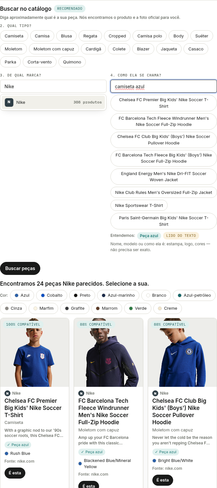
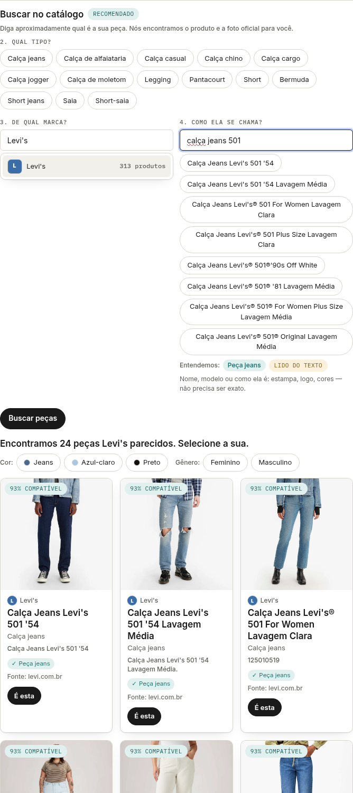
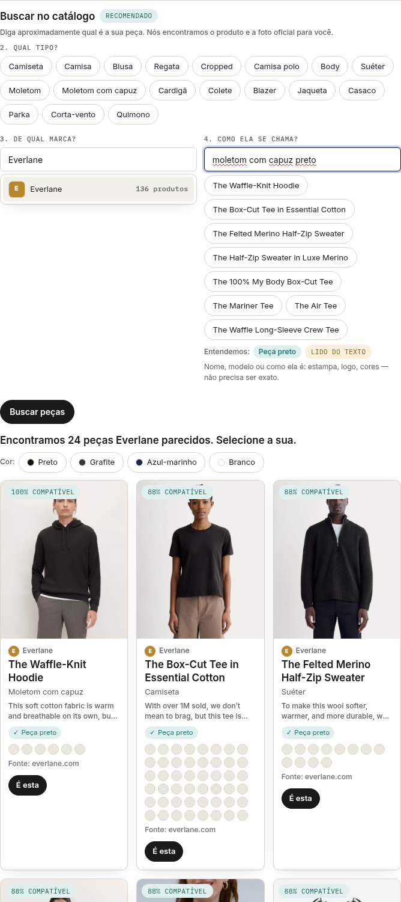

# Testes reais da busca catalogada (RF47) — 05/10/2026

Backend do `main` (Spring Boot 4.1, schema V37) contra MySQL com o acervo coletado dos sites oficiais:
**8.810 produtos de 52 marcas, 26.457 variantes de cor, 8.357 com foto oficial (95%)**. Chamadas reais a
`GET /api/catalog/search` com um usuário de teste, exatamente como o criador de peças faz: tipo da peça
(`category`) + "De qual marca?" (`brand`) + "Como ela se chama?" (`q`).

Script: `search_tests.py <arquivo-com-o-token> [relatorio.json]` (bateria abaixo; outra API com `FAI_API=https://...`). Verifica por busca: tem resultado · todos os 5 primeiros são da marca
pedida · subtipo certo no 1º · cor pedida no 1º · 1º com foto.

| | Tipo | Marca | Como ela se chama? | Resultados | Com foto | 1º resultado | Subtipo | Cor | % |
|---|---|---|---|---|---|---|---|---|---|
| ✅ | Parte superior | Nike | camiseta azul | 24 | 24/24 | Chelsea FC Premier Big Kids' Nike Soccer T-Shirt | t_shirt | blue | 100% |
| ✅ | Parte superior | Nike | camiseta preta | 24 | 24/24 | Memphis Grizzlies Men's Basketball T-Shirt | t_shirt | black | 100% |
| ✅ | Parte inferior | Nike | shorts preto | 24 | 24/24 | Los Angeles Lakers Standard Issue Nike Men's Fle | shorts | black | 100% |
| ✅ | Parte inferior | Levi's | calça jeans 501 | 24 | 21/24 | Calça Jeans Levi's 501 '54 | jeans | — | 93% |
| ✅ | Calçados | Vans | tênis slip-on preto | 24 | 23/24 | Tênis Slip-On Plataforma Black | casual_sneakers | black | 100% |
| ✅ | Peça inteira | Farm Rio | vestido estampado | 24 | 24/24 | Vestido Cropped Estampado Papillon Multicolorido | dress | — | 100% |
| ✅ | Parte superior | Burberry | trench coat | 24 | 24/24 | Mid-length Gabardine Kensington Trench Coat in H | coat | beige | 100% |
| ✅ | Parte superior | Everlane | moletom com capuz preto | 24 | 24/24 | The Waffle-Knit Hoodie | hoodie | black | 100% |
| ✅ | Parte inferior | Dickies | calça cargo | 24 | 24/24 | Loose Fit Cargo Pants | cargo_pants | charcoal | 100% |
| ✅ | Calçados | Havaianas | chinelo | 24 | 24/24 | Chinelo Havaianas Brasil Light Branco - Havaiana | flip_flops | — | 100% |
| ✅ | Parte superior | Lacoste | polo branca | 8 | 0/8 | Polo Feminina Slim Fit em Piquet Stretch | polo_shirt | white | 100% |
| ✅ | Parte superior | — | camiseta listrada | 24 | 22/24 | Long-sleeve Icon Stripe Cotton T-shirt | t_shirt | beige | 100% |

**Lacoste:** lacoste.com recusa robôs (403 no robots.txt), então a marca só tem os 8 produtos do seed, sem foto
oficial. A busca acerta (polo branca, subtipo e cor), mas não há foto para mostrar; o teste registra isso como
limitação de dados.

## No navegador (criador de peças, `/pieces/new`)

Login com o usuário de teste → tipo da peça → marca → nome → resultados com a foto oficial:

| Busca | Captura |
|---|---|
| Parte superior · Nike · "camiseta azul" |  |
| Parte inferior · Levi's · "calça jeans 501" |  |
| Parte superior · Everlane · "moletom com capuz preto" |  |

## O que os testes encontraram e foi corrigido

| Problema | Causa | Correção |
|---|---|---|
| 46% do acervo sem foto (Nike, Levi's, Farm…) | Nike/Shopify põem a foto só nas variantes de cor; lojas VTEX/Kering servem as fotos de CDNs da plataforma | coletor lê a foto das variantes e o `og:image`; aceita os servidores de imagem da plataforma da loja (só referência); `enrich_images.py` revisitou 4.371 páginas e achou foto para 4.059 |
| Fotos `http://` descartadas na importação | o acervo só aceita https | coletor e `recheck_collected.py` passam para https |
| "moletom com capuz preto" sem moletom com capuz no topo | o texto era lido palavra por palavra ("moletom" = sweatshirt) | subtipo pela frase mais longa ("moletom com capuz" = hoodie) |
| "camiseta listrada" trazia moletom no topo | pool de 200 candidatos em ordem arbitrária: com 8.810 produtos as camisetas listradas ficavam fora | pool começa pelo subtipo + cor (no produto ou numa variante), depois o subtipo, depois as palavras da estampa (pt/en/es) |
| "501 '90s" do seed, sem foto, à frente do 501 com foto | nota 100% × 93% | na ordem, produto sem foto cede até 10 pontos (o % mostrado não muda) |

Testes automatizados: `CatalogSearchResolveTest` (Java, 5) e `test_official_sitemap.py` (Python, 36).
