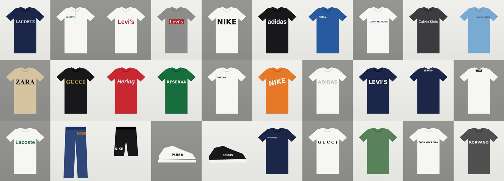
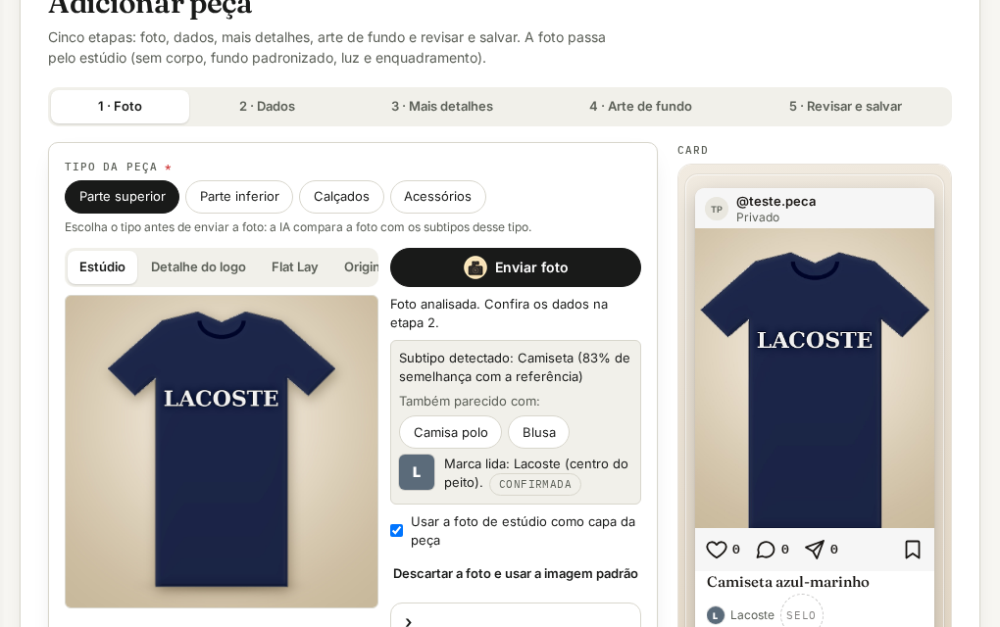
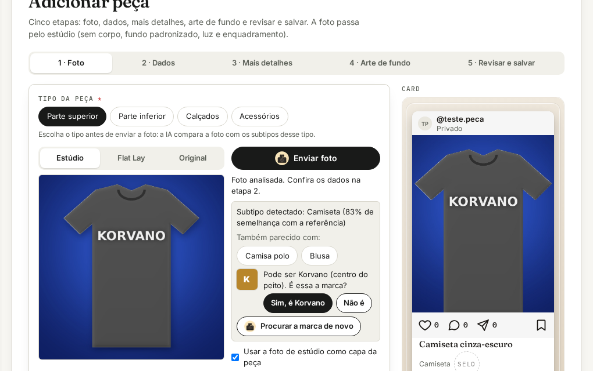

# Detecção de marca (RF4 · 1-Foto) — prova com 30 casos

**Resultado: 30/30.** As 27 marcas do catálogo foram lidas e confirmadas já na primeira análise; os 2 controles
(camiseta lisa e frase de estampa "GOOD VIBES ONLY") não geraram marca; a marca fora do catálogo ("KORVANO") saiu como
**possível**, e a tela pergunta "É essa a marca?".

- Planilha: [`deteccao-de-marca.xlsx`](deteccao-de-marca.xlsx) — aba **Resumo** e aba **Casos** (foto de cada caso,
  marca esperada, onde está, variação, marca lida, estado, região, texto lido, quem leu, nova busca, tempos, OK/FALHOU).
- Dados brutos: [`resultados.json`](resultados.json).
- Casos: 

## Como foi testado

1. `scripts/marcas/gerar-casos.py` desenha 30 peças (camiseta, polo, calça, shorts, tênis) com o nome da marca em
   posições, tamanhos, cores e fontes diferentes — centro/peito esquerdo/direito, etiqueta da gola, patch do jeans, perna,
   lateral do tênis — e em condições difíceis: girado 12°, baixo contraste, ruído e desfoque, letras espaçadas, caixa
   mista com apóstrofo (Levi's), logo "batwing" (texto branco sobre forma vermelha).
2. `scripts/marcas/testar-deteccao.py` envia cada foto para a **análise real** do backend (`POST /api/pieces/analysis`),
   com a IA remota desligada — a marca vem do **leitor de texto do próprio servidor** (OCR PP-OCRv4 em ONNX) casado com
   o catálogo de marcas. Sem marca confirmada, chama a **nova busca** em sub-retângulos (grade 3×3 → 4×4 → 5×5).
3. Em produção, a IA de visão (Gemini/Claude) lê antes; o OCR é a rede de segurança quando ela não responde.

## O que o teste corrigiu

- **Logo maior que o peito** (o "L" de LACOSTE fora da peça) → o casamento aceita a marca sem a primeira ou a última
  letra em nomes longos ("ACOSTE" → Lacoste): logo parcialmente escondido por dobra ou borda.
- **Letra grande separada** em bloco próprio → caixas da mesma linha são juntadas antes da leitura.
- **Frase de estampa** ("GOOD VIBES ONLY", cortada pelo recorte como "DVIBES") → palavras comuns de estampa dentro da
  palavra lida não viram sugestão de marca.

## Tela

| Marca lida (com o logo da marca) | Marca fora do catálogo (pede confirmação) |
|---|---|
|  |  |

Reproduzir: `python3 scripts/marcas/gerar-casos.py <pasta> && python3 scripts/marcas/testar-deteccao.py <pasta> <token>`
(backend local; token de um usuário de teste).
