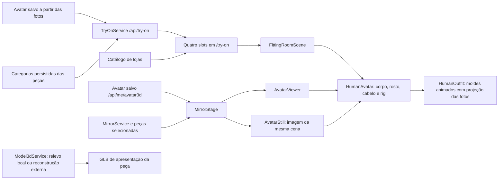

# Provador e Espelho — diagnóstico e validação

## Fluxo encontrado

O avatar humano possui malha, esqueleto, proporções e ajustes do rosto/cabelo. As roupas do `HumanOutfit` também são malhas animadas pelo esqueleto, mas sua forma vem de moldes paramétricos; a foto frontal é projetada nesses moldes. Isso não é reconstrução fiel da peça nem simulação física de caimento. `AvatarStill` fotografa essa mesma cena. O compositor Java `TryOnCompositor` é outro caminho: composição de imagens 2D por âncoras. Provedores remotos de imagem não foram exercitados.

Na revisão encontrada, `/try-on` já utilizava `upper_piece`, `lower_piece`, `shoes_piece` e `accessory_piece`, além de seleção imediata, giro/zoom e remoção individual. Já não havia campo de título nem publicação como look. “Salvar prova” registra escolhas apenas no armazenamento local do navegador; o fluxo `/schemes/new` continua separado.

## Causas e correções

1. **Braços abertos e cabelo deslocado:** `SkinnedMesh.bind(skeleton)` era chamado ao anexar o cabelo depois da pose de repouso. Sem a matriz original, Three.js recalcula as inversas do esqueleto compartilhado a partir da pose atual. A correção `attachHair` passa `human.body.bindMatrix`, preservando a referência do corpo, roupas e cabelo, inclusive nas mudanças de detalhe e exportação.
2. **Fundo branco sobre jeans e tecido com cor incorreta:** o motor tratava pixels opacos do fundo da fotografia como roupa. `garment-photo.ts` preserva recortes transparentes, remove fundos uniformes conectados às bordas e rejeita imagens sem separação confiável. O mesmo recorte alimenta as medidas da foto, a cor do tecido e a textura. Laterais e costas permanecem na cor do tecido; não se inventam detalhes ausentes da foto. Imagens de estúdio com fundo deixam de ter preferência sobre a imagem da peça.
3. **Imagem anterior ao trocar peça/variante:** imagens carregadas só são usadas quando sua chave corresponde à seleção atual. O carregamento de outra foto deixa de pintar temporariamente a roupa com a anterior.
4. **Camisa em “Intermediária”:** `MannequinGeometry.layerOf(TOP)` retorna `INTERMEDIATE`, uma camada interna do compositor 2D. Essa camada não é a categoria persistida nem um dos quatro slots atuais. Não foi confirmado um erro no registro da camisa real no banco do usuário. A recuperação das sessões antigas agora recalcula o slot pela categoria canônica; categorias desconhecidas exigem revisão, em vez de virar acessório. O backend já fornece `needsReview`, agora exibido com links para as peças.
5. **Avatar provisório silencioso:** Provador e Espelho mostram a ação de criar/revisar o avatar quando ele está ausente. A cena espera o asset humano e mostra carregamento ou falha explícitos. O cache do asset pronto evita um quadro intermediário com o manequim de reserva.
6. **Iluminação:** a cena abre em luz diurna, e a luz de preenchimento do personagem usa cor neutra, independente da marca escolhida.

## Componentes e contratos alterados

- `components/three/human-avatar.tsx` e `lib/avatar3d/human/attach-hair.ts`: ligação do cabelo ao rig e cache do asset humano.
- `components/three/human-outfit.tsx` e `lib/avatar3d/human/garment-photo.ts`: preparação conservadora da fotografia e isolamento das imagens da seleção atual.
- `components/three/fitting-room-scene.tsx` e `components/three/avatar-viewer.tsx`: estado de carregamento/falha do asset; iluminação neutra no provador.
- `components/mirror/mirror-stage.tsx`: avatar ausente/falha explícitos e indicação da limitação da roupa projetada.
- `app/(site)/(app)/try-on/page.tsx`: revisão de categorias, estados do avatar e do modelo da peça.
- `FittingItem`: conserva `model3dUrl` e `model3dStatus` recebidos do guarda-roupa; uma URL de GLB não estabelece compatibilidade vestível. `slotOf` retorna `null` para categorias inválidas. Nenhuma migração de banco foi necessária.
- Mensagens equivalentes em português, inglês e espanhol.

## Evidências executadas

- `npm ci` com o lockfile existente; manifests e lockfile preservados.
- `npm run typecheck`: passou.
- Suíte completa `npm test`: **957 testes passaram em 104 arquivos**. Após os últimos ajustes de carregamento, os testes dos componentes afetados e da ligação do cabelo foram executados novamente.
- Build de produção `npm run build`, incluindo verificações de internacionalização: passou. Os avisos de depreciação do middleware e algumas traduções preexistentes permanecem.
- Maven `verify`: **1.177 testes executados, 0 falhas, 0 erros, 2 ignorados**; build dos 13 módulos passou. JDK 21 completo e Maven 3.9.11 foram instalados fora do checkout. Maven utiliza o proxy configurado e o truststore de certificados do ambiente, sem desativar TLS.
- MySQL 8.4 iniciou; Flyway aplicou as migrações. A API respondeu com saúde `UP`.
- Conta descartável no banco local: cadastro, `/api/me`, `/api/try-on` com os quatro slots e `/api/me/avatar3d` foram exercitados com autenticação.
- Chromium com WebGL: camisa, jeans e calçado de teste selecionados; captura das vistas frontal, lateral e traseira; auditoria confirmou personagem visível e vestido, sem erros JavaScript.
- Testes de regressão verificam as inversas do esqueleto, o ponto de fixação do cabelo durante o movimento, braços relaxados, recorte do jeans sem descolorir as pernas, preservação de estampas e troca de camisa sem perder calça/calçado.

Capturas com **avatar e peças sintéticos de teste**, sem usar a identidade nem os arquivos originais do usuário:

- [Frente e quatro slots](try-on-evidence/try-on-front.png)
- [Perfil](try-on-evidence/try-on-profile.png)
- [Costas](try-on-evidence/try-on-back.png)
- [Auditoria do navegador](try-on-evidence/browser.json)

## Limitações reais

O pipeline existente gera relevo local ou reconstrução GLB por provedor; não comprova rig, UV completos, tamanho real, folga, colisões nem compatibilidade com o avatar. `HumanOutfit` continua usando moldes e projeção, mesmo quando há GLB de apresentação. A interface informa a falta do modelo ou a ausência de ajuste validado e encaminha à revisão da peça. Não foi implementado um novo pipeline de roupa vestível, reconstrução de costas ou simulação de tecido.

Fotos complexas, roupas sobre pessoas, fundos parecidos com o tecido, peças brancas sobre fundo branco e acessórios podem exigir segmentação/revisão apropriada. O recorte conservador não substitui segmentação semântica. Quando a imagem não é confiável, o molde usa a cor cadastrada. Os moldes ainda apresentam aproximações geométricas, especialmente em barras, golas e acessórios. As peças reais da captura não foram validadas individualmente porque seus arquivos e dados não estão disponíveis neste banco local.

Portanto, esta entrega corrige defeitos de pose, ligação do cabelo e projeção, mas **não declara um provador vestível 3D fiel ou qualidade AAA concluídos**.

## Ambiente reutilizável

Instalação e inicialização ficam em `/workspace/.cloud-setup`, fora do checkout. Foram testadas instalação repetida e inicialização de API/web com banco local. Credenciais locais e a chave de cifragem geradas para desenvolvimento ficam em arquivo com permissão restrita; não são incluídas no Git ou nas instruções salvas como valores.

Serviços opcionais de IA remota, clima, Redis, Cassandra, OpenSearch e S3 não são necessários para esse fluxo local e não foram ativados. Processos precisam reiniciar em novas tarefas. Publicação e restauração em uma nova tarefa pertencem ao produto e não foram verificadas nesta sessão; não se deve presumir restauração de processos ou de volumes Docker.
